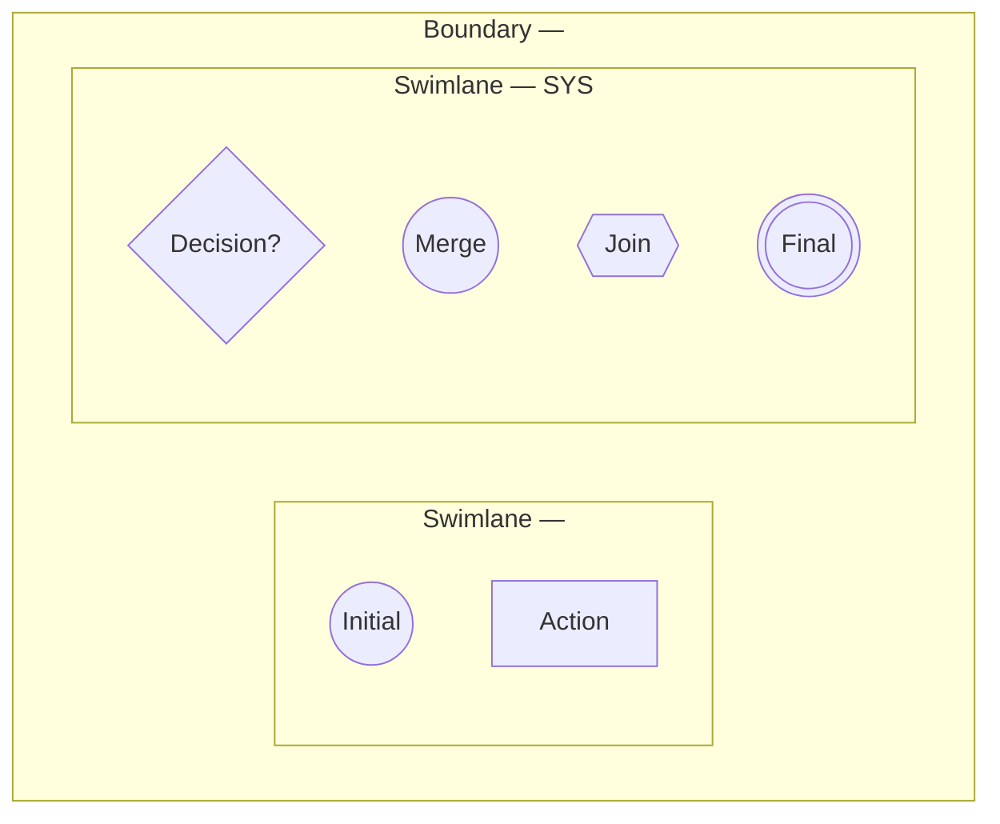

# Activity Diagram Skill

Use this skill whenever creating or updating an Activity Diagram for a Product
Spec, Epic, User Story, Acceptance Criteria, or UI Flow in Paradise Gym.

## Required workflow

1. Read and apply `.agents/rules/docs-sync.md` first.
2. Identify the trigger, preconditions, postconditions, primary actor, other
   actors, system responsibilities, platform, Epic/Menu, and related UI.
3. Keep the written `Main Flow`, `Alternate Flows`, and `Exception Flows` in
   the User Story. The diagram supplements those sections; it must not replace
   them.
4. Convert each meaningful business step into an action node and preserve the
   business order and conditions.
5. Validate that every branch has a clear outcome and that the diagram can be
   followed from initial to final node.

## Mermaid/UML notation

Use a Mermaid `flowchart`, preferably `flowchart TB` for vertical process flows:



Use these node types consistently:

| UML concept | Mermaid form | Use |
| --- | --- | --- |
| Initial node | `(("Initial"))` | Exactly one start of the flow. |
| Action node | `["..."]` | One concrete user/system action. |
| Decision node | `{"..."}` | A condition with labeled outgoing branches. |
| Merge node | `(("Merge — ..."))` | Recombine alternative branches. |
| Join node | `{{"Join — ..."}}` | Synchronize parallel flows; all required inputs must arrive. |
| Final node | `((("Final")))` | End of a successful, rejected, or exception path. |
| Control flow | `-->` | Direction of execution; label decision edges. |
| Swimlane | `subgraph Lx["Swimlane — ..."]` | Role, external actor, device, or SYS boundary. |
| Boundary | Outer `subgraph B["Boundary — ..."]` | Platform, app, modal, or feature boundary. |

---

## Node Arity & Edge Topology Rules (Quy Tắc Bất Biến Về Số Mũi Tên Vào / Ra Của Từng Node)

> [!CAUTION]
> **QUY TẮC CỐT LÕI BẮT BUỘC (MANDATORY UML TOPOLOGY RULES):**
> Trong sơ đồ Activity Diagram, mỗi loại node có ngữ nghĩa và số lượng mũi tên vào (`IN`) / ra (`OUT`) cố định. Tuyệt đối không được vi phạm các quy tắc sau:

| Node Type | Ký hiệu Mermaid | Số mũi tên vào (`IN`) | Số mũi tên ra (`OUT`) | Mục đích & Ràng buộc hành vi |
| :--- | :--- | :---: | :---: | :--- |
| **Initial Node** | `(("Initial"))` | **0 IN** | **1 OUT** | Điểm bắt đầu duy nhất của toàn bộ luồng quy trình. |
| **Action Node** | `["..."]` *(hình chữ nhật)* | **ĐÚNG 1 IN** | **ĐÚNG 1 OUT** | **1 VÀO + 1 RA (KHÔNG HƠN KHÔNG KÉM)**.<br>• **CẤM TUYỆT ĐỐI** dùng Action node để rẽ nhánh (nhiều mũi tên ra). Muốn rẽ nhánh BẮT BUỘC dùng Decision node `{"..."}`.<br>• **CẤM TUYỆT ĐỐI** nhiều mũi tên cùng trỏ vào một Action node. Muốn gom nhiều luồng về một BẮT BUỘC dùng Merge node hoặc Join node.<br>• **CẤM TUYỆT ĐỐI** kết thúc quy trình tại Action node hoặc để Action node bị đứt đoạn không có mũi tên đi ra (0 OUT). Điểm kết thúc của mọi path BẮT BUỘC phải là Final node. |
| **Decision Node** | `{"..."}` *(hình thoi)* | **1 IN** | **N OUT** ($N \ge 2$) | Rẽ nhánh điều kiện logic.<br>• Bắt buộc gán nhãn điều kiện rõ ràng trên **100% các mũi tên đi ra** (ví dụ: `-->|Hợp lệ|`, `-->|Không hợp lệ|`, `-->|Có|`, `-->|Không|`).<br>• Cấm để Decision node chỉ có 1 mũi tên ra. |
| **Merge Node** | `{"Merge — ..."}` hoặc `(("Merge — ..."))` | **N IN** ($N \ge 2$) | **1 OUT** | Gom các nhánh rẽ điều kiện (mutually exclusive) hội tụ lại một luồng chung.<br>• **Ngữ nghĩa OR**: Chỉ cần 1 trong các nhánh tới là kích hoạt bước tiếp theo.<br>• Cấm nối thẳng nhiều mũi tên vào một Action node tiếp theo mà không qua Merge node. |
| **Join Node** | `{{"Join — ..."}}` *(hình lục giác)* | **N IN** ($N \ge 2$) | **1 OUT** | Đồng bộ hóa các luồng chạy song song (parallel branches).<br>• **Ngữ nghĩa AND**: Bắt buộc phải chờ **TẤT CẢ** các nhánh song song cùng hoàn thành mới được đi tiếp. |
| **Final Node** | `((("Final — ...")))` *(hình tròn viền kép)* | **1 IN** | **0 OUT** | **ĐIỂM KẾT THÚC DUY NHẤT HỢP LỆ CỦA MỘT PATH**.<br>• Mọi nhánh rẽ, luồng chính, luồng thay thế và luồng ngoại lệ đều phải dẫn đến một Final node (hoặc vòng lặp trở lại điểm hợp lệ đã xác định).<br>• Phân biệt rõ: Final Thành công, Final Hủy bỏ, Final Báo lỗi ngoại lệ. |

### Cảnh báo lỗi đứt đoạn thường gặp (Anti-Patterns to Avoid):
1. **Lỗi đứt đoạn / Treo lơ lửng (Dangling Action Node):** Khai báo một Action node (ví dụ: `SYS["Mở modal..."]`) nhưng không vẽ mũi tên đi ra từ node này $\rightarrow$ Luồng bị đứt đoạn, người đọc không biết bước tiếp theo là gì.
2. **Lỗi nối tắt nội bộ sai lệch (False Sequence Chain):** Khai báo tuần tự người dùng trong Swimlane của Role (ví dụ: `A01 --> A02 --> A03`) rồi lại nối chéo `A01 --> S01` trong Swimlane của SYS $\rightarrow$ Khiến cho `A01` có 2 mũi tên ra (vi phạm quy tắc Action = 1 IN + 1 OUT) và `S01` bị bỏ rơi không có mũi tên ra!
3. **Cách khắc phục chuẩn:** Luồng tương tác giữa Người dùng và Hệ thống phải được kết nối tuần tự thực tế qua lại giữa các Swimlane:
   ```text
   Initial --> A01 (User click) --> S01 (SYS mở modal) --> A02 (User nhập) --> S02 (SYS validate) --> Decision
   ```

---

## Swimlane rules

- Give the primary role its own lane.
- Give every external actor that changes or supplies data its own lane.
- Put authorization, validation, calculation, persistence, notification, and
  audit actions in the `SYS` lane.
- Do not connect unrelated actors in a fake sequential chain. Actors should
  feed the system or receive a result according to the actual flow.
- For a cross-role workflow, show the interaction explicitly, for example:
  Member submits → SYS validates → PT accepts/rejects → SYS updates → Member
  receives result.
- Do not add a platform or role that is outside the documented boundary.

## Flow construction rules

- Start with `Initial` and end every reachable path at `Final`.
- Use one action node per meaningful business step; do not hide multiple
  decisions inside a vague label such as `Xử lý thông tin`.
- Use a decision node for eligibility, validation, permission, status, user
  choice, or error handling. Label every outgoing edge, including `Có/Không`
  or the actual alternatives.
- Use a merge node after mutually exclusive alternatives converge.
- Use a join node only when branches run in parallel and all branches are
  required before continuing. Do not use a join for ordinary sequential steps.
- Model alternate flows and exception flows as visible branches from the point
  where they occur. Do not draw them as unrelated side notes.
- Preserve audit, status transition, record retention, and idempotency actions
  when they are part of the documented business rule.
- For read-only flows, use actions such as `Truy vấn theo scope` and
  `Hiển thị dữ liệu`; do not label them as saving or updating data.
- For navigation-only flows, end at the destination action or explicitly show
  the selected destination before `Final`.

## Forms, modals, and input flows

The diagram does not replace field-level documentation. For every form/modal,
list each field in the related User Story or UI Flow with:

- exact field name and purpose;
- `USER-INPUT`, `AUTO-FILL`, `PREFILL`, or `READONLY`;
- required/optional status;
- conditional/dynamic condition;
- source of value or options;
- validation and outcome when invalid.

Use action labels that identify the form action, for example `Nhập số tiền
thực thu` or `Xác nhận modal Ghi nhận thu tiền`, not generic labels such as
`Người dùng nhập thông tin`.

## Review checklist

Before completing a diagram, verify:

- written Main/Alternate/Exception flows are still present;
- initial, action, decision, merge, join, final, swimlane, and boundary nodes
  are used where the flow requires them;
- **Action Node Arity:** Every Action node `["..."]` has EXACTLY 1 incoming and 1 outgoing edge (`1 IN + 1 OUT`), no branching, no converging, and never acts as a final path termination;
- **Decision Node Arity:** Every Decision node `{"..."}` has 1 incoming and N outgoing edges ($N \ge 2$), and every decision edge is clearly labeled;
- **Merge/Join Node Arity:** Multiple incoming branches converge at a Merge node (`N IN + 1 OUT`, OR logic) or a Join node (`N IN + 1 OUT`, AND logic), never directly into an Action node;
- **Final Node Termination:** Every alternate/exception/success path reaches a Final node `((("Final — ...")))` (or a documented return loop); no path is left dangling or truncated;
- primary role, supporting actors, platform, and data scope match the User Story;
- form/modal fields satisfy the field-level rule in `docs-sync.md`;
- the Mermaid block has valid balanced fences and unique node IDs.
