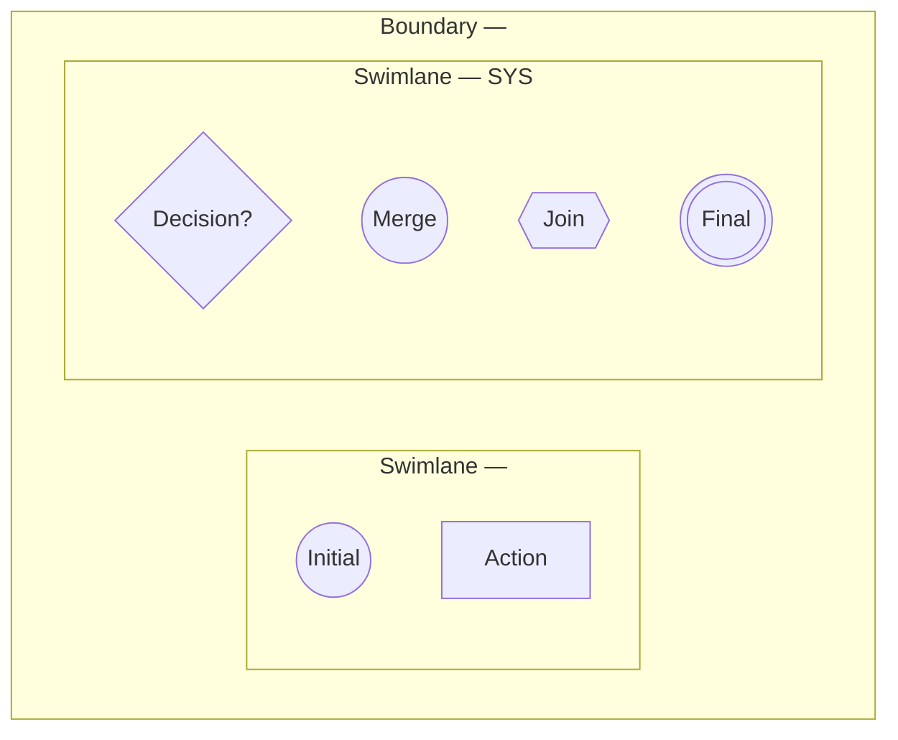

# Activity Diagram Skill

Use this skill whenever creating or updating an Activity Diagram for a Product
Spec, Epic, User Story, Acceptance Criteria, or UI Flow in Paradise Gym.

## Required workflow

1. Read and apply `.agents/rules/docs-sync.md` first.
2. Identify the trigger, preconditions, postconditions, primary actor, other
   actors, system responsibilities, platform, Epic/Menu, and related UI.
3. Keep the written `Main Flow`, `Alternate Flows`, and `Exception Flows` in
   the User Story. The diagram supplements those sections; it must not replace
   them.
4. Convert each meaningful business step into an action node and preserve the
   business order and conditions.
5. Validate that every branch has a clear outcome and that the diagram can be
   followed from initial to final node.

## Mermaid/UML notation

Use a Mermaid `flowchart`, preferably `flowchart TB` for vertical process flows:

Use these node types consistently:

| UML concept | Mermaid form | Use |
| --- | --- | --- |
| Initial node | `(("Initial"))` | Exactly one start of the flow. |
| Action node | `["..."]` | One concrete user/system action. |
| Decision node | `{"..."}` | A condition with labeled outgoing branches. |
| Merge node | `(("Merge — ..."))` | Recombine alternative branches. |
| Join node | `{{"Join — ..."}}` | Synchronize parallel flows; all required inputs must arrive. |
| Final node | `((("Final")))` | End of a successful, rejected, or exception path. |
| Control flow | `-->` | Direction of execution; label decision edges. |
| Swimlane | `subgraph Lx["Swimlane — ..."]` | Role, external actor, device, or SYS boundary. |
| Boundary | Outer `subgraph B["Boundary — ..."]` | Platform, app, modal, or feature boundary. |

## Swimlane rules

- Give the primary role its own lane.
- Give every external actor that changes or supplies data its own lane.
- Put authorization, validation, calculation, persistence, notification, and
  audit actions in the `SYS` lane.
- Do not connect unrelated actors in a fake sequential chain. Actors should
  feed the system or receive a result according to the actual flow.
- For a cross-role workflow, show the interaction explicitly, for example:
  Member submits → SYS validates → PT accepts/rejects → SYS updates → Member
  receives result.
- Do not add a platform or role that is outside the documented boundary.

## Flow construction rules

- Start with `Initial` and end every reachable path at `Final`.
- Use one action node per meaningful business step; do not hide multiple
  decisions inside a vague label such as `Xử lý thông tin`.
- Use a decision node for eligibility, validation, permission, status, user
  choice, or error handling. Label every outgoing edge, including `Có/Không`
  or the actual alternatives.
- Use a merge node after mutually exclusive alternatives converge.
- Use a join node only when branches run in parallel and all branches are
  required before continuing. Do not use a join for ordinary sequential steps.
- Model alternate flows and exception flows as visible branches from the point
  where they occur. Do not draw them as unrelated side notes.
- Preserve audit, status transition, record retention, and idempotency actions
  when they are part of the documented business rule.
- For read-only flows, use actions such as `Truy vấn theo scope` and
  `Hiển thị dữ liệu`; do not label them as saving or updating data.
- For navigation-only flows, end at the destination action or explicitly show
  the selected destination before `Final`.

## Forms, modals, and input flows

The diagram does not replace field-level documentation. For every form/modal,
list each field in the related User Story or UI Flow with:

- exact field name and purpose;
- `USER-INPUT`, `AUTO-FILL`, `PREFILL`, or `READONLY`;
- required/optional status;
- conditional/dynamic condition;
- source of value or options;
- validation and outcome when invalid.

Use action labels that identify the form action, for example `Nhập số tiền
thực thu` or `Xác nhận modal Ghi nhận thu tiền`, not generic labels such as
`Người dùng nhập thông tin`.

## Review checklist

Before completing a diagram, verify:

- written Main/Alternate/Exception flows are still present;
- initial, action, decision, merge, join, final, swimlane, and boundary nodes
  are used where the flow requires them;
- every decision edge is labeled;
- every parallel branch has a matching join when synchronization is required;
- every alternate/exception path reaches a final or a documented return point;
- primary role, supporting actors, platform, and data scope match the User Story;
- form/modal fields satisfy the field-level rule in `docs-sync.md`;
- the Mermaid block has valid balanced fences and unique node IDs.
