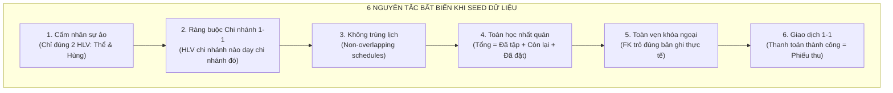

# Database Seed Integrity Skill (db-seed-integrity)

Bộ nguyên tắc và hướng dẫn tối thượng nhằm đảm bảo **tính toàn vẹn, tính chân thực và tính logic 100% của dữ liệu mẫu (seed data)** trong toàn bộ hệ thống Paradise Gym.

> [!CAUTION]
> **QUY TẮC BẤT BIẾN (STRICT INVARIANT):**
> Tuyệt đối **CẤM BỊA ĐẶT NHÂN SỰ ẢO, CẤM SEED TÙY TIỆN, CẤM SAI LỆCH SỐ LƯỢNG THỰC THỂ CỐ ĐỊNH**.
> Mọi hành vi gõ cứng tên giáo viên/HLV tự nghĩ ra ("HLV Quỳnh Trâm", "HLV Lyn Lyn", "HLV Raymond", "HLV Joy", "HLV Đặng Minh Tuấn", "HLV Trần Thị Mai",...) hoặc tạo vượt quá số lượng nhân sự đã quy định đều bị coi là **lỗi nghiêm trọng làm phá hỏng tính logic của hệ thống**.

---

## 1. Bản Đồ Thực Thể Cố Định Hệ Thống (Fixed Entity Registry)

Mọi dữ liệu mẫu liên quan đến nhân sự và chi nhánh **BẮT BUỘC PHẢI DÙNG CHÍNH XÁC DANH MỤC SAU ĐÂY**, tuyệt đối không tự ý thêm bớt:

### 1.1. Danh Sách Chi Nhánh (Chỉ Có 2 Chi Nhánh):
| Chi Nhánh | Branch ID | Địa chỉ |
| :--- | :--- | :--- |
| **Paradise Gym Quận 1** | `11111111-1111-1111-1111-111111111111` | 123 Lê Lợi, P. Bến Thành, Quận 1, TP.HCM |
| **Paradise Gym Bình Thạnh** | `22222222-2222-2222-2222-222222222222` | 456 Ung Văn Khiêm, P. 25, Q. Bình Thạnh, TP.HCM |

---

### 1.2. Danh Sách Huấn Luyện Viên (CHỈ CÓ DUY NHẤT 2 HLV TRÊN TOÀN HỆ THỐNG):
| Mã HLV | Họ Và Tên | Số Điện Thoại | PT Profile ID | Chi Nhánh Cố Định | Chuyên môn chính |
| :--- | :--- | :--- | :--- | :--- | :--- |
| **PT001** | **Nguyễn Văn Thể** | `0900000003` | `50000000-0000-0000-0000-000000000001` | **Paradise Gym Quận 1** (`11111111-...`) | BodyPump, Cardio HIIT, Boxing, Tăng cơ |
| **PT002** | **Lê Văn Hùng** | `0900000004` | `50000000-0000-0000-0000-000000000002` | **Paradise Gym Bình Thạnh** (`22222222-...`) | Thể hình thể lực, Yoga, Pilates, Giảm mỡ |

> [!IMPORTANT]
> - Hệ thống Paradise Gym hiện tại **CHỈ CÓ ĐÚNG 2 HUẤN LUYỆN VIÊN**.
> - Không có PT003, PT004, PT005 nào khác.
> - Bất kỳ lớp tập cộng đồng (Community Class) hay hợp đồng PT 1:1 nào cũng **BẮT BUỘC do 1 trong 2 HLV này phụ trách**.

---

## 2. Các Nguyên Tắc Bất Biến Khi Seed Dữ Liệu (Seed Invariants)



### Nguyên tắc 1: Cấm Tuyệt Đối Tên Nhân Sự Ảo (No Ghost / Phantom Instructors)
- Trong bảng `community_classes`:
  * Cột `instructor_id` **BẮT BUỘC** phải là UUID của PT001 hoặc PT002.
  * Cột `instructor_name` **BẮT BUỘC** phải là `'Nguyễn Văn Thể'` hoặc `'Lê Văn Hùng'`, khớp 100% với `pt_profiles.full_name`.
  * **CẤM TUYỆT ĐỐI** gõ các chuỗi tự chế như `'HLV Quỳnh Trâm'`, `'HLV Raymond'`, `'Cô Mai'`, `'Thầy Tuấn'`,...

### Nguyên tắc 2: Ràng Buộc Chi Nhánh Tuyệt Đối (Branch Scope Integrity)
- HLV làm việc tại chi nhánh nào thì **CHỈ ĐƯỢC PHÂN CÔNG** dạy học viên hoặc đứng lớp cộng đồng tại chi nhánh đó:
  * Lớp tại **Paradise Gym Quận 1**: 100% giáo viên đứng lớp là **Nguyễn Văn Thể** (`50000000-0000-0000-0000-000000000001`).
  * Lớp tại **Paradise Gym Bình Thạnh**: 100% giáo viên đứng lớp là **Lê Văn Hùng** (`50000000-0000-0000-0000-000000000002`).
- Tuyệt đối không tạo lịch mà HLV Quận 1 lại dạy lớp ở Bình Thạnh trong cùng buổi.

### Nguyên tắc 3: Ràng Buộc Xung Đột Thời Gian (Schedule Non-Overlap)
- Mỗi HLV là một con người vật lý, không thể hiện diện ở 2 nơi trong cùng một khung giờ:
  * Nếu PT A có buổi PT 1:1 từ `08:00 - 09:00` ngày `2026-09-22`, thì trong khung giờ đó PT A **KHÔNG THỂ** đứng lớp cộng đồng hoặc có buổi PT 1:1 khác.
  * Các ca dạy lớp cộng đồng của cùng một HLV trong một ngày phải cách nhau tối thiểu 30 phút để nghỉ ngơi (ví dụ: Ca sáng 1: `06:30 - 07:30`, Ca sáng 2: `08:00 - 09:00`, Ca sáng 3: `09:30 - 10:30`).

### Nguyên tắc 4: Nhất Quán Số Liệu & Toán Học (Mathematical Consistency)
- Với hợp đồng dịch vụ (`registrations`):
  $$\text{total\_pt\_sessions} = \text{used\_pt\_sessions} + \text{remaining\_pt\_sessions} + \text{booked\_pt\_sessions}$$
- Số `used_pt_sessions` phải khớp chính xác với số dòng `status = 'COMPLETED'` trong `pt_bookings` của hợp đồng đó.
- Không bao giờ được seed `remaining_pt_sessions < 0` hoặc số buổi vượt quá tổng số buổi của gói.

### Nguyên tắc 5: Toàn Vẹn Khóa Ngoại & Snapshot Giá
- Mọi trường khóa ngoại (`member_id`, `pt_id`, `branch_id`, `package_id`, `discipline_id`,...) phải tham chiếu đến bản ghi cha đang thực sự tồn tại trong DB.
- Cột `base_price` và `bonus_amount` khi seed vào `community_classes` phải khớp với cấu hình từ `class_disciplines` (ví dụ: `base_price` của bộ môn, bonus thù lao lớp từ 30.000đ - 60.000đ).

### Nguyên tắc 6: Khớp Nối Thanh Toán & Kế Toán (Financial Ledger)
- Mỗi giao dịch trong `payments` có `status = 'COMPLETED'` bắt buộc phải có đúng 1 bản ghi `receipts` tương ứng.
- Số tiền `amount` trong `receipts` phải bằng đúng số tiền khách thực trả sau khi trừ khuyến mãi.

---

## 3. Bộ Lệnh SQL Audit Kiểm Tra Tự Động (Bắt Buộc Chạy Trước Khi Bàn Giao)

Mỗi khi chạy script seed dữ liệu hoặc cập nhật database, Agent **BẮT BUỘC PHẢI CHẠY BỘ KIỂM TRA SQL SAU ĐÂY** để đảm bảo không vi phạm:

```sql
-- 1. KIỂM TRA TỔNG SỐ HLV (KẾT QUẢ BẮT BUỘC BẰNG ĐÚNG 2)
SELECT count(*) AS total_pts FROM pt_profiles;
-- Kỳ vọng: total_pts = 2

-- 2. KIỂM TRA XEM CÓ TÊN HLV LẠ / ẢO TRONG LỚP CỘNG ĐỒNG KHÔNG
SELECT DISTINCT instructor_name, instructor_id
FROM community_classes
WHERE instructor_id NOT IN (
    '50000000-0000-0000-0000-000000000001',
    '50000000-0000-0000-0000-000000000002'
) OR instructor_name NOT IN ('Nguyễn Văn Thể', 'Lê Văn Hùng');
-- Kỳ vọng: 0 rows (Không có bất kỳ HLV lạ nào)

-- 3. KIỂM TRA HLV CÓ BỊ PHÂN CÔNG SAI CHI NHÁNH KHÔNG
SELECT cc.title, cc.class_date, cc.start_time, b.branch_name, cc.instructor_name
FROM community_classes cc
JOIN pt_profiles pt ON cc.instructor_id = pt.id
JOIN branches b ON cc.branch_id = b.id
WHERE cc.branch_id != pt.branch_id;
-- Kỳ vọng: 0 rows (Không ai dạy chéo chi nhánh)

-- 4. KIỂM TRA XUNG ĐỘT TRÙNG GIỜ CỦA HLV GIỮA LỚP CỘNG ĐỒNG VÀ PT 1:1
SELECT cc.title AS class_title, cc.class_date, cc.start_time, cc.end_time,
       pb.session_number, pb.start_time AS pt_start, pb.end_time AS pt_end,
       pt.full_name AS pt_name
FROM community_classes cc
JOIN pt_bookings pb ON cc.instructor_id = pb.pt_id AND cc.class_date = pb.booking_date
JOIN pt_profiles pt ON cc.instructor_id = pt.id
WHERE (cc.start_time, cc.end_time) OVERLAPS (pb.start_time, pb.end_time);
-- Kỳ vọng: 0 rows (Không trùng giờ dạy)

-- 5. KIỂM TRA TÍNH TOÀN VẸN BUỔI TẬP TRONG HỢP ĐỒNG
SELECT id, contract_code, total_pt_sessions, used_pt_sessions, remaining_pt_sessions
FROM registrations
WHERE package_type IN ('PT_SESSION', 'COMBO')
  AND (total_pt_sessions != used_pt_sessions + remaining_pt_sessions);
-- Kỳ vọng: 0 rows
```

---

## 4. Checklist 6 Điểm Bắt Buộc Trước Khi Hoàn Thành Tác Vụ Seed

Trước khi thông báo hoàn tất bất kỳ tác vụ nào liên quan đến database seed, hãy kiểm tra lần lượt:

- [ ] **1. Số lượng HLV:** Bảng `pt_profiles` có đúng 2 bản ghi: PT001 (Nguyễn Văn Thể) và PT002 (Lê Văn Hùng).
- [ ] **2. Không có tên ảo:** Tìm kiếm chuỗi `"Quỳnh Trâm"`, `"Lyn Lyn"`, `"Raymond"`, `"Joy"`, `"Đặng Minh Tuấn"`, `"Trần Thị Mai"` trong DB & codebase đều trả về 0 kết quả.
- [ ] **3. Chi nhánh đồng nhất:** Tất cả lớp ở Bình Thạnh do Lê Văn Hùng dạy; tất cả lớp ở Quận 1 do Nguyễn Văn Thể dạy.
- [ ] **4. Giờ học cách biệt:** Các lớp của cùng một HLV không chồng lấn giờ lên nhau.
- [ ] **5. File seed gốc đồng bộ:** File `backend/src/db/seeds/001_seed_data.sql` và `002_boss_feedback_seed.sql` đã được làm sạch, không chứa tài khoản hoặc profile của PT thừa.
- [ ] **6. UI kiểm chứng thật:** Kiểm tra trên màn hình web hoặc app di động thấy hiển thị chuẩn xác đúng 2 HLV và đúng chi nhánh.
