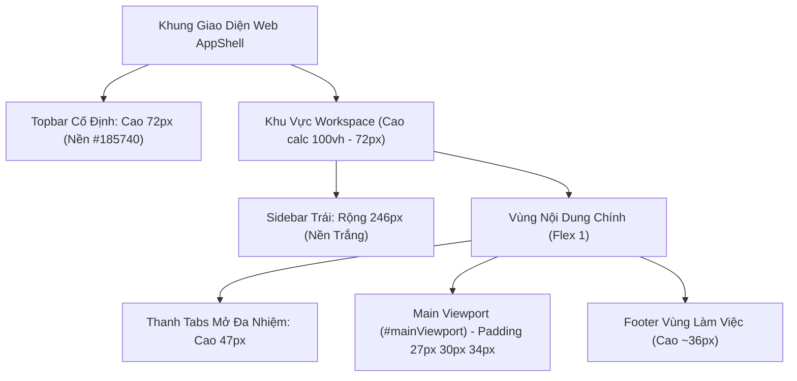
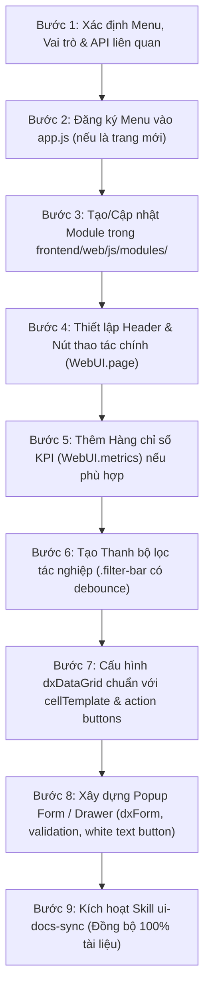

# QTV UI Design System — Paradise Gym

Bộ quy chuẩn thiết kế và cẩm nang kỹ thuật xây dựng giao diện người dùng chuyên trách cho phân hệ **Web Quản Trị Viên (QTV) & Lễ Tân (LT)** trên hệ thống **Paradise Gym**.

Mọi màn hình, form nhập liệu, bảng dữ liệu, hộp thoại (modal/popup), ngăn kéo (drawer) hay chỉ số (metric card) được thêm mới hoặc điều chỉnh trên Web QTV **bắt buộc phải tuân thủ nghiêm ngặt 100% các nguyên tắc và mẫu mã được đặc tả trong tài liệu này**.

---

## 1. Triết Lý Thiết Kế & Hệ Thống Nhận Diện Trực Quan (Visual Tokens)

Giao diện Web QTV của Paradise Gym được thiết kế theo phong cách **Administrative Forest Clean**: Đơn giản, hiện đại, tối ưu cho năng suất vận hành hàng ngày, lấy gam màu xanh lá rừng đậm (Forest Green) làm linh hồn nhận diện thương hiệu thể thao, kết hợp với phong cách viền tối giản (border-first design) thanh lịch.

### 1.1. Bảng Màu Thiết Kế (Design Tokens & Color Palette)

Toàn bộ biến CSS được khai báo tập trung tại `:root` trong `frontend/web/css/web.css`:

| Nhóm Token | Biến CSS | Giá trị Hex | Ứng dụng thực tế trên giao diện |
| :--- | :--- | :--- | :--- |
| **Thương hiệu chính** | `--primary` | `#237b58` | Nút bấm chính (CTA), tab đang kích hoạt, liên kết, điểm nhấn giao diện |
| **Thương hiệu đậm** | `--primary-dark` / `--primary-hover` | `#185740` | Nền Topbar điều hướng, trạng thái hover của nút chính, logo chính |
| **Thương hiệu nhạt** | `--primary-light` | `#eaf4ee` | Nền menu Sidebar active, nền hàng phân trang active, nền badge success |
| **Điểm nhấn thể thao** | *(Accent Lime)* | `#b2d988` | Chữ "Gym" trên logo thương hiệu tại Topbar |
| **Màu nền khung** | `--bg-main` | `#f4f6f5` | Nền toàn bộ vùng làm việc (`#mainViewport`), trung tính và êm mắt |
| **Màu nền bề mặt** | `--bg-surface` / `--bg-card` | `#ffffff` | Nền Sidebar, thẻ Card, Panel dữ liệu, Modal popup, Bảng DataGrid |
| **Đường viền ngăn cách** | `--border-color` | `#dfe6e2` | Viền ngăn Sidebar, viền Data section, viền ô nhập liệu, viền Card panel |
| **Đường kẻ phụ** | *(Subtle border)* | `#edf1ee` / `#edf0ee` | Đường kẻ ngang giữa các hàng bảng dữ liệu, chia tách tab phụ |
| **Chữ tiêu đề chính** | *(Heading text)* | `#253e30` / `#253d30` | Tiêu đề trang H1, H2, giá trị số liệu lớn trên Metric card |
| **Chữ nội dung** | `--text-main` | `#26332e` | Nội dung văn bản, dữ liệu ô bảng, nhãn trường nhập liệu |
| **Chữ phụ / Mờ** | `--text-muted` | `#748078` | Mô tả phụ, ghi chú ngày giờ, placeholder, tiêu đề cột bảng |
| **Chữ cực mờ** | `--text-light` | `#8b9690` | Chú thích nhỏ, footer, nhãn caption dưới chỉ số |

### 1.2. Bảng Màu Ngữ Nghĩa & Huy Hiệu Trạng Thái (Semantic Status Tokens)

Hệ thống quy định 4 nhóm màu ngữ nghĩa cố định. **Tuyệt đối không dùng màu tùy tiện**:

```css
/* Trạng thái Thành công / Đang hoạt động / Hợp lệ */
--success: #237b58;       --success-bg: #eaf5ed;  /* Text: #23764b */

/* Trạng thái Cảnh báo / Chờ duyệt / Sắp hết hạn / Tạm dừng */
--warning: #b87514;       --warning-bg: #fff4dd;  /* Text: #aa6e14 */

/* Trạng thái Nguy hiểm / Lỗi / Quá hạn / Hủy / Không hợp lệ */
--danger: #d84848;        --danger-bg: #ffeded;   /* Text: #c94c4c, Nút: #ef4444 */

/* Trạng thái Thông tin / Đã lưu trữ / Lịch sử */
--info: #3378b7;          --info-bg: #edf3fb;     /* Text: #437caf */
```

### 1.3. Hệ Thống Typography Chuẩn Hóa

Hệ thống sử dụng đồng bộ 2 font chữ chuẩn:
1. **Font nội dung & thành phần (`--font-body`):** `'Be Vietnam Pro', 'Segoe UI', Arial, sans-serif`.
2. **Font thương hiệu, tiêu đề & số liệu:** `'Manrope', var(--font-body)`.

**Phân cấp kích thước font (Hierarchy):**
- **Tiêu đề trang (Page Title H1):** `23px` / Trọng số: `700` (Bold) / Màu: `#253e30` / Line-height: `1.4`.
- **Tiêu đề nhóm/Khối (Section Title H2):** `17px` / Trọng số: `600` (Semi-bold).
- **Tiêu đề bảng trong Data Section:** `14px` / Trọng số: `600` / Màu: `#253e30`.
- **Giá trị chỉ số KPI (Metric Value):** `27px` / Trọng số: `600` / Font: `Manrope` / `font-variant-numeric: tabular-nums`.
- **Văn bản nội dung & Ô dữ liệu bảng:** `12px` - `13px` / Line-height: `1.55` / Màu: `#26332e`.
- **Nhãn trường nhập liệu (`.dx-field-item-label-text`):** `11px` / Trọng số: `500` / Màu: `#586b5e`.
- **Tiêu đề cột DataGrid (`.dx-datagrid-headers`):** `10px` / Trọng số: `500` / Màu: `#748178`.
- **Huy hiệu trạng thái (`.status-badge`):** `10px` / Trọng số: `500` / Padding: `3px 8px`.
- **Chú thích nhỏ (Caption / Subtitle):** `10px` - `11px` / Màu: `#8b978f`.

### 1.4. Bo Góc (Border Radius) & Đổ Bóng (Shadows)

- **Bo góc nhỏ (`--radius-sm: 4px`):** Áp dụng cho nút bấm (`.dx-button`), ô nhập liệu (`.dx-texteditor`), ô chọn (`.dx-selectbox`), huy hiệu trạng thái (`.status-badge`), tab workspace.
- **Bo góc vừa (`--radius-md: 6px`):** Áp dụng cho thẻ chỉ số (`.metric-card`), hộp công cụ (`.tool-panel`), hộp avatar chữ cái viết tắt (`.member-initials`), hộp thông báo lỗi/thành công.
- **Bo góc lớn (`--radius-lg: 8px`):** Áp dụng cho hộp thoại Modal/Popup (`.dx-popup-content`), form đăng nhập (`.auth-form`).
- **Đổ bóng (Shadows):** Ưu tiên dùng đường viền mảnh `1px solid var(--border-color)` thay cho bóng đổ đậm. Modal dùng bóng lan rộng tạo chiều sâu: `box-shadow: 0 20px 80px rgba(24, 45, 34, 0.2)`.

---

## 2. Cấu Trúc Khung Bố Cục Trang Web Chuẩn (Page Layout Architecture)

Mọi chức năng trên Web QTV được nạp vào vùng hiển thị trung tâm `#mainViewport` bên trong khung kiến trúc chuẩn:



### 2.1. Cấu Trúc Khung Một Trang Chức Năng (Canonical Page Canvas)

Một trang chức năng hoàn chỉnh luôn tuân theo thứ tự phân tầng cấu trúc như sau:

```html
<section class="page-content">
  <!-- 1. HEADER TRANG (Tiêu đề, mô tả ngữ cảnh & Nút CTA chính) -->
  <div class="view-header">
    <div class="view-header-title">
      <h1>Quản lý hội viên</h1>
      <p>Danh sách và hồ sơ tập luyện của tất cả hội viên trong hệ thống</p>
    </div>
    <div class="view-actions">
      <!-- Nút thao tác chính (Màu xanh lá #237b58, chữ trắng) -->
      <div id="btnPrimaryAction"></div>
    </div>
  </div>

  <!-- 2. HÀNG CHỈ SỐ KPI / METRIC ROW (Nếu có) -->
  <div class="metrics-row">
    <!-- Các thẻ .metric-card -->
  </div>

  <!-- 3. THANH BỘ LỌC TÁC NGHIỆP (Filter Bar) -->
  <div class="filter-bar">
    <!-- Search Box, SelectBox trạng thái, SelectBox chi nhánh, Nút reset, Nút refresh -->
  </div>

  <!-- 4. KHU VỰC DỮ LIỆU CHÍNH (Data Section hoặc Card Panel) -->
  <section class="data-section">
    <div class="section-heading">
      <h2>Danh sách chi tiết</h2>
      <div class="section-heading-actions"></div>
    </div>
    <div class="section-body">
      <!-- Lưới DevExtreme dxDataGrid -->
    </div>
  </section>
</section>
```

### 2.2. Quy Chuẩn Đa Cột (Multi-Column Layouts)

Đối với các màn hình đặc thù cần bố trí đa cột, sử dụng trực tiếp các class CSS có sẵn trong `web.css`:
- **Dashboard / Tổng quan:** `.dashboard-columns` $\rightarrow$ `grid-template-columns: 1.08fr 1fr; gap: 22px;`.
- **Cổng Check-in / Kiểm soát cửa:** `.checkin-layout` $\rightarrow$ `grid-template-columns: minmax(255px, 29%) minmax(0, 1fr); gap: 22px;`.
- **Báo cáo thống kê:** `.report-charts` $\rightarrow$ `grid-template-columns: 1.4fr 1fr; gap: 22px;`.

---

## 3. Thư Viện Thành Phần UI Mẫu Chuẩn Web QTV (UI Component Patterns)

### 3.1. Thẻ Chỉ Số KPI (.metric-card)

Thẻ chỉ số dùng để hiển thị các số liệu vận hành cốt lõi ở đầu trang:

```html
<div class="metrics-row">
  <!-- 1. Thẻ màu Xanh lá (Mặc định) -->
  <article class="metric-card metric-green">
    <div class="metric-label">
      <span>Hội viên đang hoạt động</span>
      <i class="fa-solid fa-users" aria-hidden="true"></i>
    </div>
    <strong class="metric-value">1,248</strong>
    <span class="metric-caption">Hồ sơ có gói tập còn hạn</span>
  </article>

  <!-- 2. Thẻ màu Xanh dương (Tài chính / Giao dịch) -->
  <article class="metric-card metric-blue">
    <div class="metric-label">
      <span>Thực thu trong ngày</span>
      <i class="fa-solid fa-wallet" aria-hidden="true"></i>
    </div>
    <strong class="metric-value">45,600,000 ₫</strong>
    <span class="metric-caption">18 giao dịch thành công</span>
  </article>

  <!-- 3. Thẻ màu Vàng hổ phách (Cảnh báo / Sắp hết hạn) -->
  <article class="metric-card metric-amber">
    <div class="metric-label">
      <span>Gói sắp hết hạn</span>
      <i class="fa-solid fa-hourglass-half" aria-hidden="true"></i>
    </div>
    <strong class="metric-value">32</strong>
    <span class="metric-caption">Trong vòng 14 ngày tới</span>
  </article>

  <!-- 4. Thẻ màu Đỏ san hô (Lịch PT / Cần xử lý) -->
  <article class="metric-card metric-coral">
    <div class="metric-label">
      <span>Buổi PT hôm nay</span>
      <i class="fa-solid fa-dumbbell" aria-hidden="true"></i>
    </div>
    <strong class="metric-value">24</strong>
    <span class="metric-caption">8 buổi đã hoàn thành</span>
  </article>

  <!-- 5. Thẻ màu Đỏ nguy hiểm / Lỗi / Quá hạn (Danger) -->
  <article class="metric-card metric-danger">
    <div class="metric-label">
      <span>Đăng ký quá hạn thanh toán</span>
      <i class="fa-solid fa-circle-exclamation" aria-hidden="true"></i>
    </div>
    <strong class="metric-value">7</strong>
    <span class="metric-caption">Cần xử lý hủy/thu hồi</span>
  </article>

  <!-- 6. Thẻ màu Xanh mòng két (Teal) / Tím (Purple) -->
  <article class="metric-card metric-teal">
    <div class="metric-label">
      <span>Lớp cộng đồng mở hôm nay</span>
      <i class="fa-solid fa-person-chalkboard" aria-hidden="true"></i>
    </div>
    <strong class="metric-value">5</strong>
    <span class="metric-caption">Tổng 120 suất đặt</span>
  </article>
</div>
```

**Bảng đầy đủ các Tone màu Metric Card hỗ trợ:**
| Tone class | Màu biểu tượng | Ứng dụng nghiệp vụ chuẩn |
| :--- | :--- | :--- |
| `metric-green` *(mặc định)* | Xanh lá rừng (`#237b58`) | Tổng hội viên hoạt động, hợp đồng hợp lệ, tỷ lệ hoàn thành |
| `metric-blue` | Xanh dương (`#3378b7`) | Doanh thu, giao dịch thành công, dòng tiền thực thu |
| `metric-amber` | Vàng hổ phách (`#b67a23`) | Cảnh báo sắp hết hạn (trong 7-14 ngày), ca tập chờ xác nhận |
| `metric-coral` | Đỏ san hô (`#c16a57`) | Lịch tập PT trong ngày, số buổi đã thực hiện |
| `metric-danger` | Đỏ nguy hiểm (`#c94c4c`) | Đơn hủy, vi phạm thanh toán, thiết bị hỏng |
| `metric-teal` | Xanh mòng két (`#1e8379`) | Lớp cộng đồng, hội viên check-in tại quầy |
| `metric-purple` | Tím phong trào (`#7f56d9`) | Khuyến mãi / voucher áp dụng, phân bổ hạng hội viên |

**Quy chuẩn tạo qua JS (`WebUI.metrics`) & Thẻ tương tác bấm (`onClick`):**
```javascript
WebUI.metrics(container, [
  { label: 'Tổng số hội viên', value: 1248, caption: 'Đang hoạt động', icon: 'users', tone: 'green' },
  { label: 'Doanh thu', value: WebUI.money(45600000), caption: 'Hôm nay', icon: 'wallet', tone: 'blue' },
  { 
    label: 'Gói sắp hết hạn', 
    value: 32, 
    caption: 'Bấm để lọc nhanh (14 ngày)', 
    icon: 'hourglass-half', 
    tone: 'amber',
    // Bổ sung onClick sẽ tự động kích hoạt class .metric-clickable (hover nâng thẻ, focus-visible)
    onClick: () => filterExpiringRegistrations() 
  },
  { label: 'Booking PT', value: 24, caption: 'Hôm nay', icon: 'dumbbell', tone: 'coral' },
  { label: 'Quá hạn hủy', value: 7, caption: 'Chờ hủy đăng ký', icon: 'circle-exclamation', tone: 'danger' }
]);
```

---

### 3.2. Huy Hiệu Trạng Thái (.status-badge)

Hiển thị trạng thái trong bảng dữ liệu hoặc thẻ chi tiết. Luôn có kích thước nhỏ gọn `10px`, kèm chấm tròn màu `6px`:

```html
<!-- Thành công / Đang hoạt động -->
<span class="status-badge badge-success">
  <span class="status-dot"></span>Đang hoạt động
</span>

<!-- Cảnh báo / Chờ duyệt / Chờ thanh toán -->
<span class="status-badge badge-warning">
  <span class="status-dot"></span>Chờ xác nhận
</span>

<!-- Nguy hiểm / Đã hủy / Hết hạn -->
<span class="status-badge badge-danger">
  <span class="status-dot"></span>Ngừng hoạt động
</span>

<!-- Thông tin / Đã lưu trữ / Ghi nhận -->
<span class="status-badge badge-info">
  <span class="status-dot"></span>Đã lưu trữ
</span>
```

**Quy chuẩn tạo qua JS (`WebUI.badge`):**
```javascript
// tone nhận các giá trị: 'success', 'warning', 'danger', 'info', 'neutral'
const badgeHtml = WebUI.badge('Đang hoạt động', 'success');
```

---

### 3.3. Thanh Lọc Nhanh (Filter Bar)

Bố trí ngay phía trên bảng dữ liệu hoặc panel chính, hỗ trợ lọc real-time với debounce tìm kiếm:

```javascript
function renderFilterBar(container, { onSearch, onStatusChange, onBranchChange, onReset, onRefresh }) {
  const bar = $('<div class="filter-bar">').appendTo(container);
  let searchTimer;

  // 1. Ô tìm kiếm tự động debounce 300ms
  const searchBox = $('<div>').css({ flex: '1 1 250px', minWidth: 180 }).appendTo(bar).dxTextBox({
    label: 'Tìm kiếm',
    labelMode: 'static',
    placeholder: 'Mã, họ tên, số điện thoại...',
    showClearButton: true,
    valueChangeEvent: 'input',
    onValueChanged: e => {
      clearTimeout(searchTimer);
      searchTimer = setTimeout(() => onSearch(e.value?.trim() || ''), 300);
    }
  }).dxTextBox('instance');

  // 2. Lọc trạng thái
  const statusSelect = $('<div>').css('minWidth', 190).appendTo(bar).dxSelectBox({
    label: 'Trạng thái hồ sơ',
    labelMode: 'static',
    dataSource: [
      { id: '', text: 'Tất cả trạng thái' },
      { id: 'ACTIVE', text: 'Đang hoạt động' },
      { id: 'INACTIVE', text: 'Ngừng hoạt động' }
    ],
    valueExpr: 'id',
    displayExpr: 'text',
    value: '',
    onValueChanged: e => onStatusChange(e.value)
  }).dxSelectBox('instance');

  // 3. Nút đặt lại bộ lọc (icon 'revert')
  $('<div>').appendTo(bar).dxButton({
    icon: 'revert',
    hint: 'Đặt lại bộ lọc',
    stylingMode: 'outlined',
    onClick: () => {
      searchBox.option('value', '');
      statusSelect.option('value', '');
      onReset?.();
    }
  });

  // 4. Nút làm mới dữ liệu (icon 'refresh')
  $('<div>').appendTo(bar).dxButton({
    icon: 'refresh',
    hint: 'Tải lại danh sách',
    stylingMode: 'outlined',
    onClick: onRefresh
  });

  return { bar, searchBox, statusSelect };
}
```

---

### 3.4. Các Trạng Thái Phản Hồi (Empty, Error, Loading)

Tuyệt đối không để màn hình trắng khi đang tải hoặc không có dữ liệu:

1. **Trạng thái Trống (Empty State):**
   ```javascript
   WebUI.empty(container, 'Chưa có dữ liệu nào phù hợp với bộ lọc hiện tại', 'inbox');
   ```
   *Markup tạo ra:*
   ```html
   <div class="empty-state">
     <i class="fa-solid fa-inbox" aria-hidden="true"></i>
     <p>Chưa có dữ liệu nào phù hợp với bộ lọc hiện tại</p>
   </div>
   ```

2. **Trạng thái Đang Tải (Loading State):**
   ```javascript
   WebUI.loading(container);
   ```
   *Markup tạo ra:*
   ```html
   <div class="loading-state" role="status">
     <span class="loading-spinner"></span>Đang tải dữ liệu...
   </div>
   ```

3. **Trạng thái Lỗi & Thử Lại (Error State):**
   ```javascript
   WebUI.error(container, err, () => reloadData());
   ```
   *Markup tạo ra:*
   ```html
   <div class="error-state" role="alert">
     <i class="fa-solid fa-circle-exclamation"></i>
     <div>
       <strong>Không thể tải dữ liệu</strong>
       <p>Lỗi kết nối máy chủ...</p>
     </div>
     <!-- Nút Thử lại -->
   </div>
   ```

---

## 4. Tiêu Chuẩn Cấu Hình DevExtreme jQuery (DevExtreme Component Specs)

### 4.1. Quy Chuẩn Cấu Hình Bảng Dữ Liệu (`dxDataGrid`)

Mọi bảng dữ liệu trên Web QTV phải cấu hình theo chuẩn UX/UI sau:

```javascript
function renderDataGrid(container, dataSource, customColumns = []) {
  return $('<div>').appendTo(container).dxDataGrid({
    dataSource: dataSource,
    keyExpr: 'id',
    showBorders: false,             // KHÔNG viền ngoài bao quanh grid
    showRowLines: true,             // HIỂN THỊ đường kẻ phân cách giữa các hàng
    showColumnLines: false,         // KHÔNG hiển thị đường kẻ dọc phân cách cột
    hoverStateEnabled: true,        // BẬT hiệu ứng hover chuột màu xanh nhạt (#f5f9f6)
    rowAlternationEnabled: false,   // Tắt xen kẽ màu dòng (chỉ bật khi bảng > 8 cột phức tạp)
    columnAutoWidth: true,          // Tự động căn chỉnh độ rộng cột theo nội dung
    columnMinWidth: 90,             // Độ rộng tối thiểu của mỗi cột
    wordWrapEnabled: true,          // Cho phép xuống dòng văn bản dài
    noDataText: 'Không tìm thấy dữ liệu phù hợp',
    sorting: { mode: 'multiple' },
    loadPanel: { enabled: true, text: 'Đang tải dữ liệu...' },
    paging: { pageSize: 15 },
    pager: {
      visible: true,
      allowedPageSizes: [15, 30, 50],
      showPageSizeSelector: true,
      showInfo: true,
      showNavigationButtons: true
    },
    columns: [
      // 1. Cột Mã (Click vào mở xem chi tiết)
      {
        dataField: 'code',
        caption: 'Mã số',
        minWidth: 100,
        cellTemplate: (el, info) => {
          $('<a href="#">')
            .text(info.value)
            .css({ color: 'var(--primary)', fontWeight: 600 })
            .on('click', e => { e.preventDefault(); openDetail(info.data.id); })
            .appendTo(el);
        }
      },

      // 2. Cột Người dùng / Hội viên (Kèm avatar initials)
      {
        dataField: 'full_name',
        caption: 'Họ và tên',
        minWidth: 200,
        cellTemplate: (el, info) => {
          const initials = (info.value || '').trim().split(/\s+/).slice(-2).map(s => s[0]).join('').toUpperCase();
          const row = $('<div>').css({ display: 'flex', gap: 10, alignItems: 'center' }).appendTo(el);
          $('<span class="member-initials">')
            .css({ width: 32, height: 32, flexShrink: 0, display: 'grid', placeItems: 'center', background: '#e4f3ef', color: '#185740', borderRadius: 6, fontWeight: 600, fontSize: 11 })
            .text(initials || '?')
            .appendTo(row);
          $('<div>').append(
            $('<strong>').css({ fontSize: 12, display: 'block' }).text(info.value || '-'),
            $('<small>').css({ fontSize: 10, color: '#748078' }).text(info.data.phone || '')
          ).appendTo(row);
        }
      },

      // 3. Cột Tiền tệ (Căn phải, định dạng VND)
      {
        dataField: 'price',
        caption: 'Giá niêm yết',
        alignment: 'right',
        minWidth: 120,
        customizeText: e => WebUI.money(e.value)
      },

      // 4. Cột Ngày tháng (Căn giữa, dd/MM/yyyy)
      {
        dataField: 'created_at',
        caption: 'Ngày tạo',
        alignment: 'center',
        minWidth: 110,
        customizeText: e => WebUI.date(e.value)
      },

      // 5. Cột Trạng thái (Huy hiệu status-badge)
      {
        dataField: 'status',
        caption: 'Trạng thái',
        minWidth: 130,
        alignment: 'center',
        cellTemplate: (el, info) => {
          const tone = info.value === 'ACTIVE' ? 'success' : info.value === 'PENDING' ? 'warning' : 'danger';
          const text = info.value === 'ACTIVE' ? 'Hoạt động' : info.value === 'PENDING' ? 'Chờ duyệt' : 'Đã khóa';
          $(WebUI.badge(text, tone)).appendTo(el);
        }
      },

      // 6. Cột Thao tác hành động (Action Buttons)
      {
        caption: 'Thao tác',
        width: 120,
        alignment: 'center',
        cellTemplate: (el, info) => {
          const box = $('<div>').css({ display: 'flex', gap: 4, justifyContent: 'center' }).appendTo(el);
          
          // Nút sửa (icon edit)
          $('<div>').appendTo(box).dxButton({
            icon: 'edit',
            hint: 'Chỉnh sửa',
            stylingMode: 'text',
            onClick: () => openEditModal(info.data)
          });

          // Nút đổi trạng thái (icon repeat)
          $('<div>').appendTo(box).dxButton({
            icon: 'repeat',
            hint: 'Đổi trạng thái',
            stylingMode: 'text',
            onClick: () => toggleStatus(info.data)
          });
        }
      },
      ...customColumns
    ]
  }).dxDataGrid('instance');
}
```

---

### 4.2. Quy Chuẩn Cấu Hình Form Nhập Liệu (`dxForm`) & Ô Nhập Liệu

Khi thiết kế form trên Web QTV:
1. **Luôn đặt nhãn phía trên trường nhập liệu:** `labelLocation: 'top'`, `showColonAfterLabel: false`.
2. **Khai báo validation rõ ràng:** Không dùng validation chung chung; hiển thị thông báo ngay dưới trường lỗi.
3. **Quy tắc bắt buộc chọn đối với Ngày tháng:** **CẤM TUYỆT ĐỐI** dùng `dxTextBox` cho ngày tháng; bắt buộc dùng `dxDateBox` với `type: 'date'` và `displayFormat: 'dd/MM/yyyy'`.
4. **Quy tắc đối với Dropdown có nhiều bản ghi (> 6 options):** Bắt buộc bật `searchEnabled: true`.
5. **CẤM TUYỆT ĐỐI GỢI Ý, CHÚ THÍCH, HỘP GIẢI THÍCH (INFO CALLOUTS / HINTS / TIPS / PHỤ ĐỀ MÔ TẢ) TRÊN GIAO DIỆN:** Tuyệt đối không bao giờ được đặt các hộp thông tin gợi ý (`info-card`, callout banner, `💡 Gợi ý:...`, `[i] Tỷ lệ hoa hồng mới sẽ chính thức áp dụng...`) hay các đoạn văn bản chú thích, mô tả phụ đề dài dòng bên trong form/modal hay màn hình. Giao diện Web Admin dành cho nhân sự quản lý chuyên nghiệp, cần sự tinh gọn, sạch sẽ và tối giản 100%, chỉ hiển thị đúng các trường dữ liệu và nút thao tác cần thiết.


```javascript
function buildFormConfig(formData, branches = []) {
  return {
    formData: formData,
    labelLocation: 'top',
    showColonAfterLabel: false,
    colCount: 2, // Chia 2 cột cân đối
    items: [
      // Trường Họ tên (Bắt buộc)
      {
        dataField: 'full_name',
        label: { text: 'Họ và tên hội viên' },
        editorType: 'dxTextBox',
        editorOptions: { placeholder: 'Nhập đầy đủ họ và tên' },
        validationRules: [{ type: 'required', message: 'Họ và tên là bắt buộc' }]
      },

      // Trường Số điện thoại (Bắt buộc, regex VN)
      {
        dataField: 'phone',
        label: { text: 'Số điện thoại' },
        editorType: 'dxTextBox',
        editorOptions: { placeholder: '09xx xxx xxx' },
        validationRules: [
          { type: 'required', message: 'Số điện thoại là bắt buộc' },
          { type: 'pattern', pattern: /^0[35789]\d{8}$/, message: 'Số điện thoại không đúng định dạng (10 số)' }
        ]
      },

      // Trường Ngày sinh (Dùng dxDateBox)
      {
        dataField: 'date_of_birth',
        label: { text: 'Ngày sinh' },
        editorType: 'dxDateBox',
        editorOptions: {
          displayFormat: 'dd/MM/yyyy',
          type: 'date',
          max: new Date(),
          useMaskBehavior: true
        }
      },

      // Trường Chi nhánh cơ sở (Searchable SelectBox)
      {
        dataField: 'home_branch_id',
        label: { text: 'Chi nhánh đăng ký' },
        editorType: 'dxSelectBox',
        editorOptions: {
          dataSource: branches,
          valueExpr: 'id',
          displayExpr: 'branch_name',
          searchEnabled: true,
          placeholder: 'Chọn chi nhánh...'
        },
        validationRules: [{ type: 'required', message: 'Chi nhánh là bắt buộc' }]
      },

      // Trường Ghi chú (Chiếm trọn 2 cột: colSpan = 2)
      {
        dataField: 'notes',
        label: { text: 'Ghi chú nghiệp vụ' },
        editorType: 'dxTextArea',
        colSpan: 2,
        editorOptions: { height: 75, placeholder: 'Nhập ghi chú (nếu có)...' }
      }
    ]
  };
}
```

#### 4.2.1. Quy Chuẩn Searchable Combobox / Dropdown (Tìm Kiếm & Chọn Đối Tượng)

Theo quy tắc cốt lõi trong `.agents/rules/ui-design-system.md`:
> **Searchable Combobox / Searchable Dropdown:**
> Khi chọn một thực thể có nhiều bản ghi (Hội viên, PT, Gói tập, Chi nhánh, Voucher, Nhân viên), **BẮT BUỘC gộp ô tìm kiếm và danh sách chọn vào đúng 1 control duy nhất**.
> **CẤM TUYỆT ĐỐI** tách rời thành 1 ô text tìm kiếm riêng và 1 dropdown thuần riêng biệt khi thao tác chọn đối tượng.

**Cấu hình mẫu chuẩn DevExtreme cho Searchable Combobox:**

```javascript
// 1. Cho Hội viên (Tìm theo Họ tên, Mã HV, Số điện thoại)
{
  dataField: 'member_id',
  label: { text: 'Chọn hội viên' },
  editorType: 'dxSelectBox',
  editorOptions: {
    dataSource: WebUI.memberStore(), // Hoặc mảng members đã nạp từ API
    valueExpr: 'id',
    displayExpr: m => m ? [m.full_name, m.member_code, m.phone].filter(Boolean).join(' · ') : '',
    searchEnabled: true,
    searchExpr: ['full_name', 'phone', 'member_code'],
    searchTimeout: 250,
    showClearButton: true,
    placeholder: 'Nhập tên, mã HV hoặc số điện thoại...',
    noDataText: 'Không tìm thấy hội viên phù hợp'
  },
  validationRules: [{ type: 'required', message: 'Vui lòng chọn hội viên' }]
}

// 2. Cho Gói tập (Tìm theo Tên gói, Mã gói)
{
  dataField: 'package_id',
  label: { text: 'Gói tập đăng ký' },
  editorType: 'dxSelectBox',
  editorOptions: {
    dataSource: activePackages,
    valueExpr: 'id',
    displayExpr: p => p ? `${p.package_name} (${WebUI.money(p.price)})` : '',
    searchEnabled: true,
    searchExpr: ['package_name', 'package_code'],
    showClearButton: true,
    placeholder: 'Chọn gói tập đang mở bán...',
    noDataText: 'Không có gói tập phù hợp'
  },
  validationRules: [{ type: 'required', message: 'Vui lòng chọn gói tập' }]
}
```

---

### 4.3. Quy Chuẩn Hộp Thoại Popup/Modal (`dxPopup`)

Hộp thoại thao tác được tạo động và tự động dọn dẹp (dispose) khi đóng lại để tránh rò rỉ bộ nhớ:

```javascript
function openStandardModal({ title, width = 640, contentBuilder, onSave }) {
  const host = $('<div>').appendTo(document.body);
  let formInstance, busy = false;
  const errorAlert = $('<div role="alert">').css({ margin: '0 0 14px 0' });

  const popupInstance = host.dxPopup({
    title: title,
    width: () => Math.min(width, window.innerWidth - 24),
    height: 'auto',
    maxHeight: '92vh',
    shadingColor: 'rgba(24, 45, 34, 0.3)', // Màu che phủ đồng bộ
    showCloseButton: true,
    dragEnabled: false,
    hideOnOutsideClick: false,
    wrapperAttr: { class: 'qtv-form-popup' },
    contentTemplate: container => {
      const wrapper = $('<div>').css({ padding: '4px 2px', overflowY: 'auto', maxHeight: '70vh' }).appendTo(container);
      errorAlert.appendTo(wrapper);
      formInstance = contentBuilder(wrapper);
    },
    toolbarItems: [
      // 1. Nút Hủy bỏ (Outlined / Normal)
      {
        toolbar: 'bottom',
        location: 'after',
        widget: 'dxButton',
        options: {
          text: 'Hủy bỏ',
          stylingMode: 'outlined',
          onClick: () => popupInstance.hide()
        }
      },
      // 2. Nút Lưu thay đổi (Contained / Default / Nền xanh #237b58 / Chữ trắng)
      {
        toolbar: 'bottom',
        location: 'after',
        widget: 'dxButton',
        options: {
          text: 'Lưu dữ liệu',
          icon: 'save',
          type: 'default',
          stylingMode: 'contained',
          onClick: async e => {
            if (busy) return;
            errorAlert.empty();
            const validation = formInstance.validate();
            if (!validation.isValid) return;

            busy = true;
            e.component.option('disabled', true);
            formInstance.option('disabled', true);

            try {
              const formData = formInstance.option('formData');
              await onSave(formData);
              popupInstance.hide();
              DevExpress.ui.notify('Lưu dữ liệu thành công!', 'success', 3000);
            } catch (err) {
              $('<div class="form-error">').text(err.message || 'Có lỗi xảy ra khi lưu dữ liệu.').appendTo(errorAlert);
            } finally {
              busy = false;
              if (host.closest('body').length) {
                e.component.option('disabled', false);
                formInstance.option('disabled', false);
              }
            }
          }
        }
      }
    ],
    onHiding: e => {
      if (busy) e.cancel = true; // Ngăn đóng modal khi đang gọi API
    },
    onHidden: () => {
      popupInstance.dispose();
      host.remove();
    }
  }).dxPopup('instance');

  popupInstance.show();
  return popupInstance;
}
```

---

### 4.4. Quy Chuẩn Ngăn Kéo Xem Chi Tiết (Detail Drawer)

Đối với các luồng xem thông tin chi tiết hội viên, hợp đồng hay lịch tập, sử dụng Drawer trượt từ cạnh phải màn hình thay vì mở trang mới:

```javascript
function openDetailDrawer({ title, width = 600, renderBody }) {
  const host = $('<div>').appendTo(document.body);
  const popup = host.dxPopup({
    title: title,
    width: () => Math.min(width, window.innerWidth - 20),
    height: '100%',
    maxHeight: '100%',
    position: { my: 'right top', at: 'right top', of: window },
    showCloseButton: true,
    dragEnabled: false,
    shadingColor: 'rgba(24, 45, 34, 0.25)',
    wrapperAttr: { class: 'qtv-detail-drawer' },
    contentTemplate: container => {
      const body = $('<div>').css({ overflowY: 'auto', maxHeight: 'calc(100vh - 120px)', padding: '16px 20px' }).appendTo(container);
      renderBody(body);
    },
    toolbarItems: [
      {
        toolbar: 'bottom',
        location: 'after',
        widget: 'dxButton',
        options: { text: 'Đóng lại', stylingMode: 'outlined', onClick: () => popup.hide() }
      }
    ],
    onHidden: () => { popup.dispose(); host.remove(); }
  }).dxPopup('instance');

  popup.show();
  return popup;
}
```

---

### 4.5. Quy Chuẩn Lịch Biểu (`dxScheduler`) & Thẻ Lịch Hẹn Chống Chồng Đè (Anti-Collision Appointment Cards)

> [!CAUTION]
> **QUY TẮC BẤT BIẾN VỀ BỐ CỤC THẺ LỊCH BIỂU (SCHEDULER CARD ANTI-COLLISION RULES):**
> 1. **Cấm dùng `justify-content: space-between` với 3+ hàng dọc bên trong thẻ:** Khi thẻ có chiều cao nhỏ (ví dụ 45px - 50px cho slot 60 phút), `justify-content: space-between` sẽ đẩy dòng đầu lên trên cùng và dòng cuối xuống đáy, ép các dòng ở giữa đè trực tiếp lên nhau gây vỡ giao diện (Text Overlapping). Phải dùng `display: flex; flex-direction: column; justify-content: center; gap: 4px - 6px;` để các phần tử luôn giữ khoảng cách ổn định.
> 2. **Bắt buộc phân nhánh layout theo View (Day View vs Week View):**
>    - **Ở chế độ Ngày (Day View / Wide Width $\ge 450px$):** Chiều ngang rất rộng (800px - 1100px) nhưng chiều cao bị giới hạn. BẮT BUỘC dùng **bố cục 2 hàng ngang (Horizontal Flex Rows)**:
>      * **Hàng 1:** Khung giờ (`🕒 07:30 - 08:30 (60p)`) + Huy hiệu trạng thái (`Đã đặt`, `Hoàn thành`...) ở bên trái; Cụm nút thao tác (`[Xác nhận hoàn thành]`, `[Hủy lịch]`) ở bên phải.
>      * **Hàng 2:** Tên hội viên (`👤 Lê Hoàng Nam`) (chữ trắng đậm) $\cdot$ Gói tập (`HV001 - Gói PT Cao Cấp 20 buổi`) (chữ trắng sáng).
>      *Tuyệt đối cấm xếp chồng 4 dòng dọc trong Day View khi chiều ngang đang dư thừa cả ngàn pixel!*
>    - **Ở chế độ Tuần (Week / WorkWeek View / Narrow Width $< 450px$):** Chiều ngang hẹp (~160px - 220px). Bố trí 4 dòng dọc gọn gàng với nút thao tác dạng icon mini (`[✕]`, `[✓]`).
> 3. **Cố định chiều cao ô lưới tối thiểu:**
>    Bắt buộc khai báo trong CSS:
>    ```css
>    .dx-scheduler-date-table-cell,
>    .dx-scheduler-time-panel-cell {
>      height: 52px !important; /* Đảm bảo slot 30 phút có chiều cao 52px, slot 60 phút = 104px */
>    }
>    ```
> 4. **Màu sắc trạng thái thẻ lịch & tương phản chữ trắng:**
>    - `BOOKED`: Nền xanh dương `#1e40af`, viền trái `5px solid #60a5fa`.
>    - `AWAITING_CONFIRMATION` / `PENDING_COMPLETION`: Nền vàng cam `#b45309`, viền trái `5px solid #fbbf24`.
>    - `COMPLETED`: Nền xanh lá `#047857`, viền trái `5px solid #34d399`.
>    - `CANCELLED`: Nền xám `#475569`, viền trái `5px solid #94a3b8`, opacity 75%.
>    - `NO_SHOW`: Nền đỏ đậm `#991b1b`, viền trái `5px solid #f87171`.
>    - Toàn bộ chữ trên thẻ bắt buộc là chữ trắng `#ffffff` hoặc trắng sáng `rgba(255, 255, 255, 0.92)` có đổ bóng nhẹ `text-shadow: 0 1px 2px rgba(0,0,0,0.45)`.

---

### 4.6. Quy Chuẩn Phân Bổ Độ Rộng Cột Bảng (`dxDataGrid Column Sizing`) & Chống Đẩy Xa Cột Thao Tác (Anti-Drift Action Column)

> [!CAUTION]
> **HAI LỖI THIẾT KẾ CỘT BẢNG NGHIÊM TRỌNG BẮT BUỘC PHẢI TRÁNH:**
> 1. **Cột Thao tác / Chi tiết bị đẩy dạt xa tít ra mép phải màn hình:** Xảy ra khi bảng hiển thị trên màn hình rộng (Desktop 1920x1080), nhưng các cột ngắn ở giữa (như `Nhân viên tạo`, `Mã ĐK`, `Trạng thái`, `Ngày`) lại chỉ đặt `minWidth` lỏng lẻo thay vì `width` cố định. DevExtreme tự động kéo giãn cột ngắn này hàng trăm pixel, tạo ra một khoảng trống trắng mênh mông (White Space Void) vô nghĩa và đẩy cột Thao tác ra xa tít mắt người dùng.
> 2. **Chữ trên nút bấm trong ô bảng bị co cắt thành dấu ba chấm (`X...`, `Danh s...`, `Đăn...`):** Xảy ra khi độ rộng cột Thao tác quá nhỏ (`width: 100`) mà không tính đến cell padding và button content padding (`padding: 9px 13px`).

#### Quy Tắc Vàng Phân Bổ Độ Rộng Cột (Column Width Architecture):

1. **Nhóm Cột Cố Định (Fixed / Compact Columns) — BẮT BUỘC dùng `width` cố định:**
   - Các cột chứa thông tin ngắn, định danh, số liệu, ngày giờ, trạng thái phải được ấn định chiều rộng cụ thể bằng `width` (tuyệt đối KHÔNG dùng `minWidth` đơn độc):
     * Cột Mã (`reg_code`, `member_code`, `pt_code`): `width: 110` - `120px` (căn giữa `alignment: 'center'`).
     * Cột Ngày tháng (`date`, `created_at`, `end_date`): `width: 110` - `120px` (căn giữa `alignment: 'center'`).
     * Cột Tiền tệ (`price`, `amount`): `width: 120` - `140px` (căn phải `alignment: 'right'`).
     * Cột Trạng thái / Huy hiệu (`status`, `is_paid`): `width: 120` - `130px` (căn giữa `alignment: 'center'`).
     * Cột Nhân sự tạo / Chi nhánh (`created_by_name`, `branch_name`): `width: 140` - `160px` (căn giữa `alignment: 'center'`).

2. **Nhóm Cột Co Giãn Chính (Primary Fluid Columns) — Dùng `minWidth` để hấp thụ không gian:**
   - Chỉ có **1 đến 2 cột chứa văn bản nội dung dài** (như `Hội viên` / `Họ và tên`, `Gói đăng ký` / `Tên dịch vụ`, `Mô tả` / `Ghi chú`) mới được thiết lập `minWidth: 200` - `250px` (không đặt `width` cố định).
   - Các cột này sẽ đóng vai trò là "bộ đệm co giãn linh hoạt", tự nhiên hấp thụ toàn bộ khoảng trống màn hình rộng (widescreen), giúp bố cục bảng liền mạch, dễ đọc và không bao giờ xuất hiện khoảng trắng vô nghĩa.

3. **Quy Chuẩn Cột Thao Tác / Chi Tiết (Action Column Standards):**
   - **Độ rộng chuẩn tối thiểu:**
     * 1 nút (ví dụ `[Xem]` hoặc `[Sửa]`): `width: 110` - `120px`.
     * 2 nút (ví dụ `[Chúc mừng]` + `[Gọi]`): `width: 200` - `220px`.
     * 3 nút (ví dụ `[Danh sách]` + `[Đăng ký]` + `[Xóa]`): `width: 330` - `350px`, `minWidth: 340px`.
   - **Căn lề & Ghim cột:** Luôn đặt `alignment: 'center'`, và với bảng có $\ge 6$ cột nên ghim cố định `fixed: true, fixedPosition: 'right'`.
   - **Quy chuẩn CSS nút bấm trong ô bảng:** Toàn hệ thống áp dụng `.dx-datagrid-rowsview .dx-button` với `height: 30px`, `padding: 4px 10px`, `font-size: 12px`, `white-space: nowrap` để đảm bảo 100% các nút bấm (Xem, Sửa, Xóa, Chi tiết) luôn hiển thị trọn vẹn chữ, tuyệt đối cấm hiện `X...`.

---

### 4.7. Quy Chuẩn Bộ Lọc Khoảng Thời Gian (Date Range Filter: Từ ngày - Đến ngày) & Hỗ Trợ "Bỏ Giới Hạn" (Từ trước tới nay)

> [!IMPORTANT]
> **QUY TẮC BẤT BIẾN CHO BỘ LỌC KHOẢNG NGÀY (Từ ngày ... Đến ngày):**
> 1. **CẤM ÉP BUỘC CỨNG NHẮC KHOẢNG NGÀY:** Tuyệt đối không được bắt buộc người dùng luôn luôn phải chọn cả 2 mốc `Từ ngày` và `Đến ngày`. Người dùng quản trị và kế toán thường xuyên có nhu cầu xem toàn bộ lịch sử giao dịch/hồ sơ ("từ trước tới nay" / "toàn thời gian").
> 2. **Bắt buộc bật nút xóa (`showClearButton: true`):**
>    - Cả 2 ô `Từ ngày` và `Đến ngày` (`dxDateBox`) đều phải có `showClearButton: true`.
>    - Placeholder gợi ý rõ ràng: `placeholder: 'Từ trước...'` cho Từ ngày, và `placeholder: '...đến nay'` cho Đến ngày.
> 3. **Cung cấp nút chuyển nhanh "Toàn thời gian" (Bỏ giới hạn) & "Hôm nay":**
>    - Bố trí các nút preset nhanh ngay cạnh cụm lọc ngày:
>      * Nút `[ Toàn thời gian ]` (icon `clock`, hint `Bỏ giới hạn ngày (xem tất cả từ trước tới nay)`): reset cả 2 ô ngày về `null`.
>      * Nút `[ Hôm nay ]` (icon `event`, hint `Xem giao dịch hôm nay`): set cả 2 ô ngày về ngày hiện tại.
> 4. **Validation linh hoạt:**
>    - Chỉ báo lỗi khoảng ngày khi và chỉ khi **CẢ HAI MỐC ĐỀU ĐƯỢC CHỌN** và `Từ ngày > Đến ngày`.
>    - Khi một trong hai mốc (hoặc cả hai) để trống:
>      * `filters.from = null` & `filters.to = date`: Lọc từ đầu lịch sử đến mốc `to`.
>      * `filters.from = date` & `filters.to = null`: Lọc từ mốc `from` đến hiện tại/về sau.
>      * Cả hai đều `null`: Bỏ hoàn toàn giới hạn ngày (lấy tất cả dữ liệu từ trước tới nay).

---

### 4.8. Quy Chuẩn Icon Nút Bấm & Chống Lệch Chữ Trong Nút (Anti-Ghost-Icon Button Standards)

> [!CAUTION]
> **LỖI LỆCH CHỮ NÚT BẤM DO ICON MA / VÔ HÌNH (GHOST ICON TEXT ASYMMETRY):**
> 1. **Hiện tượng lỗi:** Dòng chữ trên nút bấm (ví dụ chữ "Chi tiết", "Xem", "Duyệt") không nằm chính giữa nút bấm mà bị đẩy dạt sang bên phải, để lại một khoảng trống bất thường ở phía bên trái.
> 2. **Nguyên nhân cốt lõi:**
>    - Khi tạo nút bấm bằng DevExtreme (`dxButton` hoặc qua `WebUI.button`), nếu truyền tham số `icon` là một tên icon **không tồn tại trong font DevExtreme** (ví dụ: `'eye'`, `'calculator'`, `'cake-candles'`), DevExtreme vẫn tạo thẻ `<i class="dx-icon dx-icon-eye"></i>` trong DOM.
>    - Do font DevExtreme không có glyph tương ứng (`content: ""` rỗng), icon hoàn toàn vô hình nhưng vẫn chiếm kích thước `width: 18px` + `margin-right: 4px` = **22px khoảng trắng vô hình** ở bên trái chữ!
>    - Khoảng trắng ma này đẩy chữ trên nút lệch sang bên phải, tạo cảm giác nút bị lỗi giao diện.

#### Quy Tắc Bất Biến Khi Sử Dụng Icon Trên Nút Bấm:

1. **Nút dạng văn bản thuần (Text-only Button — ví dụ `[ Chi tiết ]`, `[ Xem ]`, `[ Hủy ]`):**
   - **BẮT BUỘC** truyền `icon: null` hoặc `icon: ''` (hoặc không truyền tham số icon).
   - Khi đó, DevExtreme hoàn toàn **KHÔNG sinh thẻ `<i>` trong DOM**, và chữ trên nút (`.dx-button-text`) sẽ được căn chính giữa 100% cân đối hoàn hảo.
   - *Ví dụ chuẩn:* `W().button(box, 'Chi tiết', null, () => openDetail(id));` (KHÔNG ĐƯỢC truyền `'eye'`).

2. **Nút có kèm biểu tượng (Button with Icon — ví dụ `[ ✓ Duyệt ]`, `[ + Thêm ]`, `[ 🗑 Xóa ]`):**
   - **Chỉ sử dụng các icon chuẩn tích hợp sẵn trong DevExtreme (DX Built-in Icons):**
     * `check` (Duyệt/Xác nhận), `add` / `plus` (Thêm mới), `trash` / `remove` (Xóa), `edit` (Chỉnh sửa), `refresh` (Làm mới), `revert` (Đặt lại), `money` (Thanh toán/Chi trả), `find` / `search` (Tìm kiếm), `doc` / `file` (Chứng từ/Hợp đồng), `event` (Lịch tập), `tel` (Gọi điện), `folder` (Hồ sơ), `runner` (Check-in), `card` (Thẻ/Quét QR), `preferences` (Cấu hình), `download` / `export` (Xuất file), `save` (Lưu).
   - **Nếu sử dụng biểu tượng FontAwesome ngoài:**
     * BẮT BUỘC truyền đầy đủ class tiền tố FontAwesome: ví dụ `'fa-solid fa-eye'`, `'fa-solid fa-calculator'`, `'fa-solid fa-cake-candles'`.
     * Tuyệt đối không tự ý viết tắt tên icon không có trong DevExtreme (như viết `'eye'` thay vì `'fa-solid fa-eye'`).

3. **Cơ Chế Khử Lỗi Tự Động Trong `WebUI.button`:**
   - Hàm `WebUI.button` trong `frontend/web/js/ui.js` đã được tích hợp bộ lọc an toàn `sanitizeButtonIcon(icon)`:
     * Tự động bỏ qua `icon` nếu là `null`, `undefined`, `''` hoặc `'none'`.
     * Chỉ chấp nhận icon nếu thuộc danh sách chuẩn `DX_BUILTIN_ICONS` hoặc có tiền tố `fa-`.
     * Tự động chuyển đổi các alias phổ biến (như `calculator`, `cake-candles`) sang FontAwesome class hợp lệ.
     * Mọi icon không hợp lệ sẽ tự động bị loại bỏ để bảo vệ nút luôn căn giữa chữ 100%.

4. **Quy Chuẩn CSS Bắt Buộc Trong `web.css`:**
   ```css
   .dx-datagrid-rowsview .dx-button .dx-button-content {
     display: flex !important;
     align-items: center !important;
     justify-content: center !important; /* Luôn căn giữa nội dung nút */
     padding: 4px 10px !important;
     font-size: 12px !important;
     white-space: nowrap !important;
   }
   .dx-datagrid-rowsview .dx-button.dx-button-has-text .dx-icon {
     font-size: 13px !important;
     margin-right: 4px !important; /* Chỉ tạo khoảng cách khi có text đi kèm */
   }
   .dx-datagrid-rowsview .dx-button:not(.dx-button-has-text) .dx-icon {
     margin-right: 0 !important; /* Nút icon-only không bị lệch viền */
   }
   ```

---

## 5. Tái Sử Dụng Thư Viện Tiện Ích Sẵn Có (`WebUI`)

Hệ thống đã tích hợp sẵn thư viện `window.WebUI` tại `frontend/web/js/ui.js`. **Ưu tiên gọi trực tiếp các hàm của WebUI thay vì viết lại từ đầu**:

| Hàm trong `WebUI` | Công dụng & Cú pháp | Ví dụ sử dụng |
| :--- | :--- | :--- |
| `WebUI.page(containerId, title, subtitle)` | Tạo khung chuẩn của 1 trang (`root`, `header`, `actions`, `body`) | `const view = WebUI.page('mainViewport', 'Báo cáo', 'Thống kê vận hành');` |
| `WebUI.button(container, text, icon, action, primary)` | Tạo nhanh nút DevExtreme đúng chuẩn UI | `WebUI.button(view.actions, 'Tạo gói mới', 'add', openCreateModal, true);` |
| `WebUI.metrics(container, items)` | Tạo nhanh lưới thẻ chỉ số KPI (kèm tự động gán `.metric-clickable` khi có `onClick`) | `WebUI.metrics(view.body, cards);` |
| `WebUI.section(container, title, action)` | Tạo một data-section có heading H2 và body | `const sec = WebUI.section(view.body, 'Danh sách thiết bị');` |
| `WebUI.grid(container, ds, cols, opts)` | Khởi tạo DevExtreme DataGrid đã cấu hình chuẩn UX/UI | `WebUI.grid(sec.body, dataSource, columns);` |
| `WebUI.rows(response)` | Trích xuất mảng dữ liệu an toàn từ response API (`response.data` hoặc `response.data.items`) | `const list = WebUI.rows(response);` |
| `WebUI.popup(title, content, toolbarItems, width)` | Mở nhanh hộp thoại popup chuẩn hóa, tự động dọn dẹp bộ nhớ (`dispose`) | `WebUI.popup('Tiêu đề', container => { ... });` |
| `WebUI.badge(text, tone)` | Trả về chuỗi HTML huy hiệu màu chuẩn (`success`, `warning`, `danger`, `info`, `neutral`) | `$(WebUI.badge('Hợp lệ', 'success')).appendTo(el);` |
| `WebUI.money(value)` | Format tiền tệ VNĐ chuẩn (`100.000 ₫`) | `WebUI.money(item.price)` |
| `WebUI.date(value)` | Format ngày chuẩn Việt Nam (`dd/MM/yyyy`) | `WebUI.date(item.created_at)` |
| `WebUI.time(value)` | Format giờ chuẩn Việt Nam (`HH:mm`) | `WebUI.time(item.check_in_time)` |
| `WebUI.dateKey(value)` | Format ngày thành chuỗi chuẩn ISO key `YYYY-MM-DD` | `const key = WebUI.dateKey(new Date());` |
| `WebUI.memberStore()` | Khởi tạo DevExtreme CustomStore nạp danh sách hội viên tối ưu cho Searchable Combobox | `dataSource: WebUI.memberStore()` |
| `WebUI.escape(value)` | Làm sạch chuỗi HTML an toàn tránh tấn công XSS | `WebUI.escape(text)` |
| `WebUI.loading(container)` | Hiển thị spinner tải dữ liệu | `WebUI.loading(view.body);` |
| `WebUI.empty(container, msg, icon)` | Hiển thị khối không có dữ liệu | `WebUI.empty(container, 'Không có ca tập nào', 'calendar');` |
| `WebUI.error(container, err, retry)` | Hiển thị thông báo lỗi kèm nút Thử lại | `WebUI.error(view.body, err, () => loadData());` |
| `WebUI.dispose(container)` | Hủy an toàn toàn bộ widget DevExtreme để giải phóng DOM & bộ nhớ | `WebUI.dispose('#mainViewport');` |

---

## 6. Quy Tắc Kiểm Soát Dữ Liệu & Phân Quyền Vận Hành (Data & RBAC Rules)

### 6.1. Cấm Tuyệt Đối Hardcoded Mock Data (Tuân thủ Quy tắc 5 của AGENTS.md)
- Không khai báo mảng dữ liệu giả (`mockMembers`, `dummyData`,...) trong file code.
- Mọi dữ liệu phải lấy động 100% từ PostgreSQL Database qua REST API (`window.apiClient`).
- Khi API chưa có dữ liệu hoặc thất bại, phải hiển thị đúng trạng thái rỗng (`WebUI.empty`) hoặc lỗi (`WebUI.error`), không hiển thị data bịa đặt.

### 6.2. Phân Quyền Vai Trò (QTV vs Lễ Tân)
- **Quản Trị Viên (QTV):**
  + Có quyền xem toàn hệ thống hoặc xem từng chi nhánh (chế độ `ALL` hoặc cụ thể).
  + Có quyền truy cập các menu quản trị hệ thống: Báo cáo tài chính (`W10`), Chi nhánh (`W11`), Thiết bị (`W12`), Phân quyền (`W13`).
  + Nút chọn chi nhánh trên Topbar có thể chuyển đổi tự do.
- **Lễ Tân (LT / RECEPTIONIST):**
  + Chỉ hoạt động trong phạm vi chi nhánh trực quầy được phân công.
  + Bộ chọn chi nhánh trên Topbar và bộ lọc chi nhánh trong các bảng **bắt buộc phải `readOnly: true`** hoặc tự động gán cứng `activeBranchId`.
  + Ẩn các thông tin tài chính nhạy cảm nếu không có quyền `view_financial`.

---

## 7. Quy Trình 8 Bước Thực Thi Khi Tạo Mới / Chỉnh Sửa UI Web QTV

Khi có yêu cầu thêm một màn hình mới, thêm form, hoặc sửa đổi UI trên Web QTV, Agent **bắt buộc phải thực hiện theo 8 bước tuần tự**:



### Chi tiết từng bước:
1. **Bước 1: Khảo sát:** Xác định rõ mã chức năng (ví dụ `W14`), vai trò được phép (`QTV` hay cả `LT`), và các API endpoint backend cần gọi.
2. **Bước 2: Đăng ký Menu (`app.js`):** Thêm định nghĩa vào mảng `menus` trong `frontend/web/js/app.js` (gồm `id`, `code`, `text`, `icon`, `module`, `method`, `admin: true/false`).
3. **Bước 3: Khung Module:** Khai báo module chuẩn dạng IIFE `window.NewModule = (function () { ... return { render }; })();`.
4. **Bước 4: Header:** Gọi `WebUI.page(containerId, 'Tiêu đề', 'Phụ đề')` và thêm nút tạo mới vào `view.actions`.
5. **Bước 5: Metrics (KPIs):** Tính toán hoặc lấy từ API các con số trọng yếu và gọi `WebUI.metrics()`.
6. **Bước 6: Bộ lọc:** Thêm `.filter-bar` với ô tìm kiếm (debounce 300ms) và các dropdown lọc trạng thái/chi nhánh.
7. **Bước 7: Bảng dữ liệu:** Cấu hình `dxDataGrid` với các cột chuẩn: Cột Mã (link xanh lá), Cột Người (initials badge), Cột Tiền (`WebUI.money`), Cột Trạng thái (`WebUI.badge`), Cột Thao tác (icon edit, repeat, delete).
8. **Bước 8: Form Popup:** Dùng `dxForm` trong `dxPopup`, nhãn ở trên (`labelLocation: 'top'`), validation đầy đủ, nút Lưu màu xanh lá chữ trắng.
9. **Bước 9: Đồng bộ tài liệu (`ui-docs-sync`):** (BẮT BUỘC theo Quy tắc 3 AGENTS.md) Kích hoạt ngay kỹ năng `.agents/skills/ui-docs-sync/SKILL.md` để đồng bộ 100% các trường mới/sửa vào bảng Field-level spec (chuẩn hóa `TRIGGER`, `DYNAMIC`, `CONDITIONAL`, `Required: conditional`), cập nhật các Flows và sơ đồ Activity Diagram Swimlane chuẩn UML.

---

## 8. Mẫu Mã Nguồn Module Chuẩn Hoàn Chỉnh (Production Ready Template)

Dưới đây là mẫu mã nguồn chuẩn 100% của một Module chức năng Web QTV hoàn chỉnh để sao chép và phát triển:

```javascript
/**
 * Module Mẫu Quản Lý Chuẩn Giao Diện Web QTV - Paradise Gym
 */
window.SampleModule = (function () {
  'use strict';

  let currentView = null;
  let renderVersion = 0;
  let dataGrid = null;
  let filterState = { search: '', status: '', branch_id: '' };

  const api = () => window.apiClient;
  const ui = () => window.WebUI;

  /**
   * Điểm khởi chạy của màn hình
   */
  async function render(containerId, context = {}) {
    const version = ++renderVersion;
    const W = ui();

    // 1. Tạo khung trang chuẩn
    currentView = W.page(containerId, 'Quản lý tài nguyên mẫu', 'Màn hình theo dõi và cấu hình danh mục chuẩn QTV');

    // 2. Nút thao tác chính trên Header (Xanh lá, chữ trắng)
    W.button(currentView.actions, 'Thêm mới', 'add', () => openFormModal(null), true);

    // 3. Nút làm mới
    W.button(currentView.actions, '', 'refresh', () => refreshData()).option('hint', 'Làm mới trang');

    // 4. Bắt đầu tải dữ liệu
    await loadPage(version);
  }

  /**
   * Tải dữ liệu trang & hiển thị
   */
  async function loadPage(version) {
    const W = ui();
    const target = currentView.body;
    W.loading(target);

    try {
      // Gọi API lấy dữ liệu thực từ Backend
      const response = await api().request('/sample-resources');
      const items = W.rows(response);

      // Kiểm tra race condition nếu người dùng đã chuyển trang
      if (version !== renderVersion || !document.contains(target[0])) return;
      target.empty();

      // A. Hàng chỉ số KPI
      W.metrics(target, [
        { label: 'Tổng số mục', value: items.length, caption: 'Trong hệ thống', icon: 'layer-group', tone: 'green' },
        { label: 'Đang hoạt động', value: items.filter(x => x.status === 'ACTIVE').length, caption: 'Sẵn sàng phục vụ', icon: 'circle-check', tone: 'blue' },
        { label: 'Cần bảo trì', value: items.filter(x => x.status === 'MAINTENANCE').length, caption: 'Cần xử lý', icon: 'triangle-exclamation', tone: 'amber' }
      ]);

      // B. Thanh bộ lọc
      renderFilters(target);

      // C. Khối dữ liệu DataGrid
      const section = W.section(target, 'Danh sách chi tiết');
      renderGrid(section.body, items);

    } catch (err) {
      if (version === renderVersion) W.error(target, err, () => loadPage(version));
    }
  }

  /**
   * Thanh bộ lọc
   */
  function renderFilters(container) {
    const bar = $('<div class="filter-bar">').appendTo(container);
    let timer;

    $('<div>').css({ flex: '1 1 240px', minWidth: 180 }).appendTo(bar).dxTextBox({
      label: 'Tìm kiếm',
      labelMode: 'static',
      placeholder: 'Nhập tên, mã số...',
      showClearButton: true,
      valueChangeEvent: 'input',
      onValueChanged: e => {
        clearTimeout(timer);
        timer = setTimeout(() => {
          filterState.search = e.value?.trim().toLowerCase() || '';
          applyFilter();
        }, 300);
      }
    });

    $('<div>').css('minWidth', 190).appendTo(bar).dxSelectBox({
      label: 'Trạng thái',
      labelMode: 'static',
      dataSource: [
        { id: '', text: 'Tất cả trạng thái' },
        { id: 'ACTIVE', text: 'Đang hoạt động' },
        { id: 'MAINTENANCE', text: 'Bảo trì' }
      ],
      valueExpr: 'id',
      displayExpr: 'text',
      value: '',
      onValueChanged: e => {
        filterState.status = e.value;
        applyFilter();
      }
    });

    $('<div>').appendTo(bar).dxButton({
      icon: 'refresh',
      hint: 'Tải lại',
      stylingMode: 'outlined',
      onClick: refreshData
    });
  }

  /**
   * Lưới dữ liệu DevExtreme
   */
  function renderGrid(container, items) {
    const W = ui();
    dataGrid = W.grid(container, items, [
      { dataField: 'code', caption: 'Mã số', minWidth: 100 },
      { dataField: 'name', caption: 'Tên tài nguyên', minWidth: 200 },
      {
        dataField: 'status',
        caption: 'Trạng thái',
        minWidth: 130,
        alignment: 'center',
        cellTemplate: (el, info) => {
          const tone = info.value === 'ACTIVE' ? 'success' : 'warning';
          const text = info.value === 'ACTIVE' ? 'Hoạt động' : 'Bảo trì';
          $(W.badge(text, tone)).appendTo(el);
        }
      },
      {
        caption: 'Thao tác',
        width: 110,
        alignment: 'center',
        cellTemplate: (el, info) => {
          const box = $('<div>').css({ display: 'flex', gap: 4, justifyContent: 'center' }).appendTo(el);
          $('<div>').appendTo(box).dxButton({
            icon: 'edit',
            hint: 'Sửa',
            stylingMode: 'text',
            onClick: () => openFormModal(info.data)
          });
        }
      }
    ]);
  }

  function applyFilter() {
    if (!dataGrid) return;
    const filters = [];
    if (filterState.search) filters.push(['name', 'contains', filterState.search]);
    if (filterState.status) {
      if (filters.length) filters.push('and');
      filters.push(['status', '=', filterState.status]);
    }
    dataGrid.filter(filters.length ? filters : null);
  }

  function refreshData() {
    if (dataGrid) dataGrid.refresh();
  }

  /**
   * Popup Form Thêm / Sửa chuẩn
   */
  function openFormModal(data = null) {
    const isEdit = Boolean(data);
    const host = $('<div>').appendTo(document.body);
    let formInstance, isBusy = false;
    const errorBox = $('<div role="alert">');

    const popup = host.dxPopup({
      title: isEdit ? 'Cập nhật tài nguyên' : 'Thêm mới tài nguyên',
      width: 580,
      height: 'auto',
      showCloseButton: true,
      contentTemplate: container => {
        const wrap = $('<div>').css({ padding: 4 }).appendTo(container);
        errorBox.appendTo(wrap);

        formInstance = $('<div>').appendTo(wrap).dxForm({
          formData: data || { name: '', code: '', status: 'ACTIVE' },
          labelLocation: 'top',
          showColonAfterLabel: false,
          colCount: 1,
          items: [
            {
              dataField: 'code',
              label: { text: 'Mã số' },
              editorType: 'dxTextBox',
              editorOptions: { readOnly: isEdit, placeholder: 'VD: RES-001' },
              validationRules: [{ type: 'required', message: 'Mã số là bắt buộc' }]
            },
            {
              dataField: 'name',
              label: { text: 'Tên gọi' },
              editorType: 'dxTextBox',
              editorOptions: { placeholder: 'Nhập tên tài nguyên...' },
              validationRules: [{ type: 'required', message: 'Tên là bắt buộc' }]
            },
            {
              dataField: 'status',
              label: { text: 'Trạng thái' },
              editorType: 'dxSelectBox',
              editorOptions: {
                dataSource: [
                  { id: 'ACTIVE', text: 'Hoạt động' },
                  { id: 'MAINTENANCE', text: 'Bảo trì' }
                ],
                valueExpr: 'id',
                displayExpr: 'text'
              }
            }
          ]
        }).dxForm('instance');
      },
      toolbarItems: [
        {
          toolbar: 'bottom',
          location: 'after',
          widget: 'dxButton',
          options: { text: 'Hủy', stylingMode: 'outlined', onClick: () => popup.hide() }
        },
        {
          toolbar: 'bottom',
          location: 'after',
          widget: 'dxButton',
          options: {
            text: isEdit ? 'Lưu thay đổi' : 'Thêm mới',
            type: 'default',
            stylingMode: 'contained',
            icon: 'save',
            onClick: async e => {
              if (isBusy) return;
              errorBox.empty();
              const valid = formInstance.validate();
              if (!valid.isValid) return;

              isBusy = true;
              e.component.option('disabled', true);
              formInstance.option('disabled', true);

              try {
                const values = formInstance.option('formData');
                if (isEdit) {
                  await api().request(`/sample-resources/${data.id}`, { method: 'PUT', body: JSON.stringify(values) });
                } else {
                  await api().request('/sample-resources', { method: 'POST', body: JSON.stringify(values) });
                }
                popup.hide();
                DevExpress.ui.notify('Thao tác thành công!', 'success', 3000);
                refreshData();
              } catch (err) {
                errorBox.html(`<div class="form-error">${err.message || 'Lỗi lưu dữ liệu'}</div>`);
              } finally {
                isBusy = false;
                if (host.closest('body').length) {
                  e.component.option('disabled', false);
                  formInstance.option('disabled', false);
                }
              }
            }
          }
        }
      ],
      onHidden: () => { popup.dispose(); host.remove(); }
    }).dxPopup('instance');

    popup.show();
  }

  return {
    render,
    refresh: refreshData,
    destroy: () => { renderVersion++; currentView = null; }
  };
})();
```

---

## 9. Bảng Kiểm Tra Nhanh Tính Tương Thích Giao Diện (QTV UI Checklist)

Trước khi hoàn tất bất kỳ prompt nào liên quan đến giao diện Web QTV, Agent **bắt buộc phải rà soát qua 9 điểm kiểm định sau**:

- [ ] **1. Nút bấm (Button Contrast):** Mọi nút bấm nền đầy (Contained / Default / Danger) đều có chữ màu trắng (`color: #fff`), độ tương phản cao, không bị chữ đen trên nền xanh/đỏ.
- [ ] **2. Nhãn form (Label Position):** Form nhập liệu dùng `labelLocation: 'top'`, không có dấu hai chấm thừa thãi (`showColonAfterLabel: false`).
- [ ] **3. Ô ngày tháng (Date Pickers):** Trường ngày tháng 100% sử dụng `dxDateBox` với format `dd/MM/yyyy`, không dùng ô text thuần. Các gói theo buổi vô thời hạn hiển thị `--`.
- [ ] **4. Searchable Combobox:** Chọn thực thể (Hội viên, PT, Gói tập, Chi nhánh, Voucher) được gộp chung vào một control `dxSelectBox` có `searchEnabled: true`, không tách rời ô search riêng và dropdown riêng.
- [ ] **5. Lưới dữ liệu (DataGrid Sizing):** Có `columnAutoWidth: true`, `columnMinWidth: 90`, `showBorders: false`, `showRowLines: true`, có thông báo rỗng bằng tiếng Việt.
- [ ] **6. Thẻ trạng thái (Status Badges):** Trạng thái được bọc trong class `.status-badge` kèm các biến thể ngữ nghĩa (`.badge-success`, `.badge-warning`, `.badge-danger`, `.badge-info`).
- [ ] **7. Dữ liệu động (No Mock Data):** 100% dữ liệu gọi qua `apiClient` từ PostgreSQL, có xử lý lỗi `WebUI.error` và nút "Thử lại".
- [ ] **8. Phân quyền (RBAC Check):** Lễ tân chỉ thấy chi nhánh của mình; QTV có thể xem `ALL` và các menu tài chính/quản trị.
- [ ] **9. Đồng bộ tài liệu (`ui-docs-sync`):** Đã kích hoạt kỹ năng `ui-docs-sync` để đồng bộ 100% trường thay đổi vào User Story (bảng Field-level, flows, Activity Diagram UML).
- [ ] **10. Chống đẩy dạt & co cắt nút bấm (Anti-Drift & Button Truncation):** Các cột ngắn (Mã, Ngày, Tiền, Trạng thái, Người tạo) BẮT BUỘC dùng `width` cố định; chỉ 1-2 cột văn bản dài (Hội viên, Gói tập) dùng `minWidth` co giãn. Cột Thao tác/Chi tiết có đủ độ rộng ($\ge 110px$, căn giữa), không để nút bị co chữ thành `X...` hay bị khoảng trống vô nghĩa đẩy dạt ra mép phải màn hình.
- [ ] **11. Bộ lọc ngày tháng linh hoạt (Flexible Date Filters):** Các bộ lọc khoảng thời gian (`Từ ngày` - `Đến ngày`) BẮT BUỘC hỗ trợ xóa/bỏ giới hạn (`showClearButton: true`, cho phép để trống để xem dữ liệu toàn thời gian / từ trước tới nay), không được ép buộc cứng nhắc hay ném lỗi khi người dùng muốn xem lịch sử không giới hạn ngày. Cung cấp nút chuyển nhanh `[Toàn thời gian]` và `[Hôm nay]` khi phù hợp.
