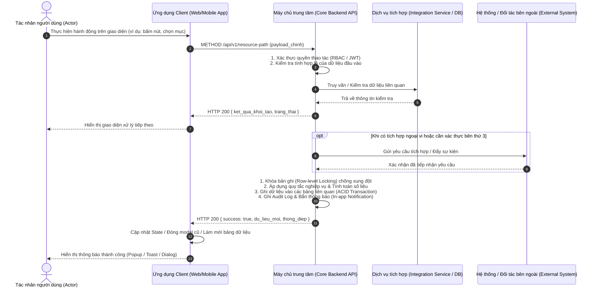
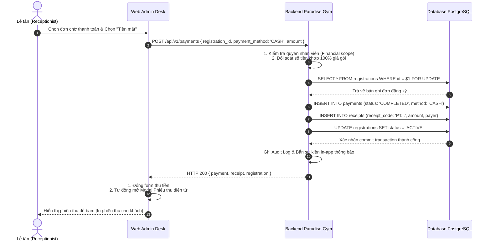
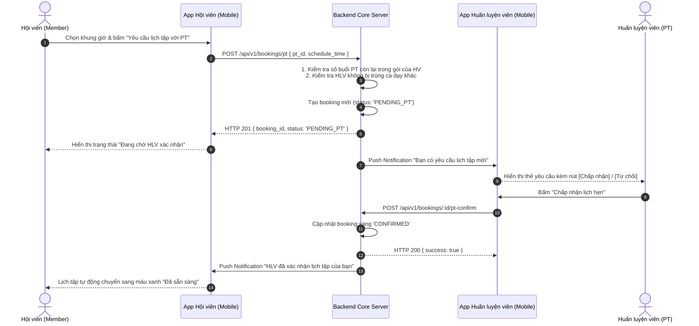
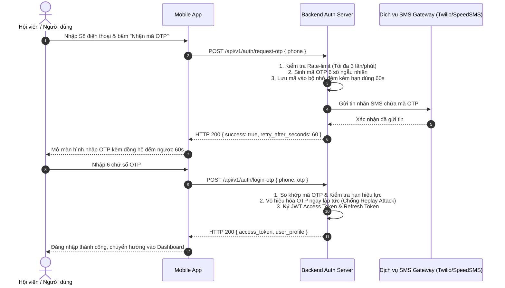
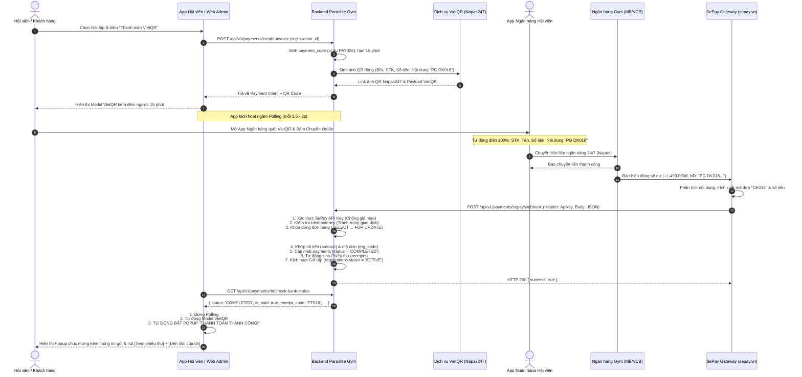
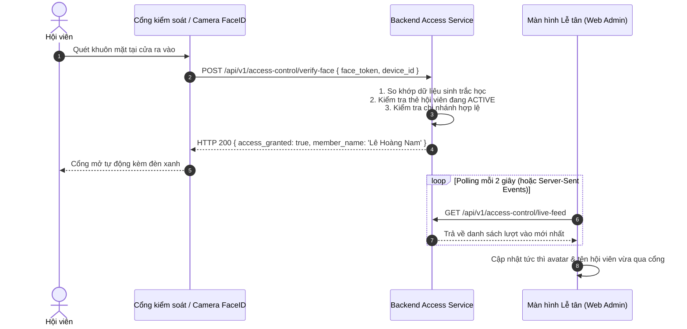

# Sequence Diagram Skill — Bộ Quy Chuẩn Thiết Kế Sơ Đồ Trình Tự UML Cho Mọi Tính Năng (Universal Sequence Modeling)

> [!IMPORTANT]
> **QUY CHUẨN DÙNG CHUNG CHO MỌI TÍNH NĂNG (UNIVERSAL APPLICABILITY):**
> Kỹ năng này là **bộ quy chuẩn chung áp dụng cho BẤT KỲ TÍNH NĂNG HOẶC MODULE NÀO** trong dự án Paradise Gym (từ Quản trị viên QTV, Lễ tân LT, Hội viên HV, Huấn luyện viên PT, đến Core Backend, Database, Background Jobs và Tích hợp bên thứ ba).
> Mọi đoạn code mẫu hoặc kịch bản cụ thể (như Thanh toán VietQR, Đăng nhập SMS OTP, Đặt lịch PT) xuất hiện trong tài liệu này **ĐỀU LÀ VÍ DỤ MINH HỌA (ILLUSTRATIVE EXAMPLES)** nhằm giải thích quy tắc, **TUYỆT ĐỐI KHÔNG PHẢI DANH MỤC TÍNH NĂNG DUY NHẤT**. Khi áp dụng cho feature của bạn, hãy linh hoạt thay đổi các Actor, Participant, Endpoint và Payload tương ứng.

---

## 1. Mục Đích & Khi Nào Sử Dụng Sequence Diagram

Trong kiến trúc phần mềm và đặc tả kỹ thuật, hai sơ đồ hành vi chủ đạo là **Activity Diagram** và **Sequence Diagram**:

| Tiêu chí | Activity Diagram (Skill `activity-diagram`) | Sequence Diagram (Skill `sequence-diagram`) |
| :--- | :--- | :--- |
| **Trọng tâm biểu diễn** | Luồng nghiệp vụ (Workflow), các bước quyết định (Decisions), điểm hội tụ (Merge/Join), và các nhánh rẽ điều kiện (Alternate/Exception Flows) của một User Story. | **Trình tự tương tác theo thời gian thực (Time-ordered interactions)** giữa các đối tượng phân tán, ranh giới mạng, giao thức truyền tin, dữ liệu trao đổi và xử lý nội tại. |
| **Trả lời câu hỏi** | *Quy trình nghiệp vụ gồm những bước nào? Điều kiện rẽ nhánh là gì? Đích đến ở đâu?* | *Ai gọi ai? Gọi qua giao thức nào (HTTP REST, WebSocket, Webhook, Polling, Message Queue)? Truyền payload gì? Phản hồi ra sao? Xử lý nội bộ thế nào?* |
| **Khi nào bắt buộc dùng** | Đặc tả luồng người dùng của User Story, Screen Flow, Form validation logic. | **Áp dụng cho BẤT KỲ FEATURE NÀO có tính chất:**<br>• Tương tác giữa Client (Web Admin, Mobile App) và Backend Core API.<br>• Quy trình phê duyệt / xác nhận kép giữa 2 hoặc nhiều vai trò (HV $\leftrightarrow$ PT, Lễ tân $\leftrightarrow$ QTV).<br>• Tích hợp dịch vụ bên thứ ba (Cổng thanh toán, Ngân hàng, SMS OTP, Email, Cloud Storage).<br>• Cơ chế đồng bộ dữ liệu thời gian thực (Polling, Server-Sent Events, WebSocket).<br>• Giao dịch tài chính nguyên tử (Atomic Database Transactions, Idempotency, Concurrency Lock). |

---

## 2. Tư Duy Thiết Kế 5 Bước Cho Mọi Tính Năng (The 5-Step Thinking Process)

Dù bạn đang thiết kế tính năng Check-in FaceID/RFID, Đặt lịch tập, Chuyển nhượng gói, Tính hoa hồng, Bàn giao doanh thu hay Thanh toán chuyển khoản, hãy luôn tuân thủ 5 bước tư duy sau:

```
[Bước 1: Liệt kê Lifelines] ──> [Bước 2: Xếp đặt Left-to-Right] ──> [Bước 3: Phân kỳ 3-6 Giai đoạn]
                                                                                   │
[Bước 5: Viết Thuyết minh] <── [Bước 4: Chuẩn hóa Message & Self-Call] <───────────┘
```

### Bước 1: Liệt kê đầy đủ các thực thể tham gia (Lifeline Identification)
Phân loại rõ các thực thể tham gia vào luồng của tính năng:
- **Tác nhân con người (`actor`):** Ai là người khởi tạo hoặc nhận kết quả trực tiếp? (Hội viên, Khách hàng, Lễ tân, Quản trị viên, Huấn luyện viên PT).
- **Ứng dụng giao diện người dùng (`participant`):** App/Web nào đang được sử dụng? (Frontend Web Admin, App Hội viên Mobile, App PT Mobile).
- **Hệ thống xử lý trung tâm (`participant`):** Máy chủ Core API, Database PostgreSQL, Background Scheduler.
- **Dịch vụ tích hợp bên thứ ba (`participant`):** Dịch vụ ngoại vi tùy theo bài toán (Ngân hàng, VietQR, SePay, Twilio/SpeedSMS, Firebase Cloud Messaging, AWS S3, Thiết bị kiểm soát cổng IoT/Turnstile).
- **Đối tác / Tác nhân bên ngoài (`actor` hoặc `participant`):** Ngân hàng đối tác, App ngân hàng của khách, Hệ thống ERP bên ngoài.

### Bước 2: Sắp xếp thực thể từ Trái sang Phải (Left-to-Right Topology)
Sắp xếp các Lifelines theo **chiều tương tác tự nhiên**:
1. **Cực trái:** Tác nhân con người khởi xướng thao tác (`actor PrimaryUser`).
2. **Kế tiếp:** Ứng dụng Client phía người dùng (`participant ClientApp`).
3. **Ở giữa:** Máy chủ xử lý trung tâm (`participant CoreAPI` hoặc `participant Backend`).
4. **Bên phải trung tâm:** Dịch vụ tích hợp nội bộ hoặc bên thứ ba (`participant ThirdPartyService`).
5. **Kế bên phải:** Ứng dụng/thiết bị phụ bên ngoài (`actor/participant ExternalDeviceOrApp`).
6. **Cực phải:** Điểm tiếp nhận/Xác thực cuối cùng hoặc Webhook Provider (`participant ExternalPartner/Webhook`).

> [!TIP]
> **Nguyên tắc dòng chảy (Flow Principle):** Luồng tin nhắn đi tuần tự từ trái qua phải, sau đó các phản hồi và dữ liệu trả về mượt mà từ phải sang trái. Cách xếp đặt này giúp sơ đồ cực kỳ thoáng, dễ theo dõi, triệt tiêu 100% tình trạng các đường mũi tên đan chéo gây rối mắt.

### Bước 3: Phân kỳ luồng nghiệp vụ thành 3 - 6 Giai đoạn rõ ràng (Phase Milestones)
Không bao giờ ném hàng chục mũi tên liên tục mà không có phân đoạn. Bắt buộc chia luồng thành các **cột mốc nghiệp vụ lớn (Milestones)** bằng chú thích `%% Giai đoạn X: <Tên Giai Đoạn - Động từ hành động>`:
- *Giai đoạn 1: Khởi tạo & Kiểm tra điều kiện tiên quyết (Initialization & Validation)*
- *Giai đoạn 2: Tương tác người dùng hoặc Gửi dữ liệu ngoại vi (User Action / Outbound Call)*
- *Giai đoạn 3: Tiếp nhận phản hồi sự kiện hoặc Bắt Webhook/Notification (Event Trigger / Inbound Webhook)*
- *Giai đoạn 4: Xử lý nội bộ Backend nguyên tử (Atomic Settlement / DB Transaction / Business Rules)*
- *Giai đoạn 5: Cập nhật giao diện & Phản hồi thời gian thực (Real-time UI Feedback / Auto-popup)*

### Bước 4: Chuẩn hóa thông điệp kỹ thuật & nghiệp vụ (Concrete Messages)
- Ghi rõ Endpoint và HTTP Method: `POST /api/v1/... (params)` thay vì `Gửi request`.
- Ghi rõ Payload dữ liệu mấu chốt: `Dữ liệu truyền đi cụ thể`.
- Ghi rõ Phản hồi thực tế: `HTTP 200 { success: true, ... }` thay vì `Thành công`.
- Sử dụng `Core->>Core: ...` kết hợp thẻ `<br/>` để minh bạch hóa chuỗi xử lý logic nội bộ (Database transaction, Lock, Idempotency, Business calculation).
- Sử dụng `Note over ...` để mô tả tiến trình chạy ngầm (Background polling, Timer, Event listener) hoặc điểm sáng trải nghiệm người dùng (UX Highlights).

### Bước 5: Viết bản thuyết minh chi tiết đi kèm (Detailed Companion Narrative)
Ngay dưới sơ đồ, bắt buộc phải có mục thuyết minh văn bản giải thích chi tiết từng giai đoạn để người đọc nắm bắt tường tận mọi quy tắc nghiệp vụ.

---

## 3. Khung Mẫu Kiến Trúc Trừu Tượng (Generic Abstract Template)

Dưới đây là khung mẫu Mermaid Sequence Diagram chuẩn mực mang tính trừu tượng, có thể áp dụng cho bất kỳ tính năng nào:



---

## 4. Bảng Quy Chuẩn Ký Hiệu & Cú Pháp Mermaid

| Thành phần | Cú pháp Mermaid | Mục đích & Ngữ nghĩa chuẩn |
| :--- | :--- | :--- |
| **Đánh số tự động** | `autonumber` | **Bắt buộc ở dòng đầu tiên** sau `sequenceDiagram`. Giúp trích dẫn bước chính xác khi review code, viết test case hoặc đối soát tài liệu. |
| **Con người (Human)** | `actor <Alias> as <Tên vai trò>` | Dành cho người dùng thực tế (Hội viên, Lễ tân, QTV, HLV, Khách hàng). Hiển thị hình người que. |
| **Hệ thống (System)** | `participant <Alias> as <Tên hệ thống>` | Dành cho ứng dụng, backend server, database, worker, bên thứ ba. Hiển thị hình hộp chữ nhật. |
| **Yêu cầu (Request / Call)** | `A->>B: <Thông điệp>` | Mũi tên nét liền đầu đặc: Gửi yêu cầu, gọi API, phát sinh sự kiện người dùng thao tác. |
| **Phản hồi (Response / Ack)** | `B-->>A: <Thông điệp>` | Mũi tên nét đứt đầu đặc: Trả về kết quả, dữ liệu JSON, xác nhận đã tiếp nhận. |
| **Xử lý nội tại (Self-call)** | `A->>A: 1. ...<br/>2. ...` | Thành phần tự thực thi logic nội bộ (Transaction, Validate, Tính toán, Regex). Dùng thẻ `<br/>` để xuống dòng trong một hộp duy nhất. |
| **Ghi chú ngữ cảnh / UX** | `Note over A,B: <Nội dung>` | Ghi chú bao trùm 1 hoặc nhiều Lifelines: Thể hiện cơ chế chạy ngầm (polling, websocket, timer) hoặc điểm sáng UX (tự động điền dữ liệu, zero-click). |
| **Phân nhánh điều kiện** | `alt <Điều kiện hợp lệ>`<br/>...<br/>`else <Điều kiện lỗi / ngoại lệ>`<br/>...<br/>`end` | Rẽ nhánh loại trừ lẫn nhau (Mutual Exclusion: Thành công vs Thất bại). |
| **Bước tùy chọn** | `opt <Khi thỏa mãn điều kiện>`<br/>...<br/>`end` | Bước chỉ kích hoạt khi có điều kiện đi kèm (ví dụ: có mã giảm giá, có bật 2FA). |
| **Vòng lặp** | `loop <Chu kỳ lặp (ví dụ: mỗi 2 giây)>`<br/>...<br/>`end` | Vòng lặp kiểm tra (Polling, Retry, Exponential Backoff). |
| **Xử lý song song** | `par <Tác vụ 1>`<br/>...<br/>`and <Tác vụ 2>`<br/>...<br/>`end` | Các tác vụ thực thi độc lập đồng thời (Parallel execution). |

---

## 5. Quy Chuẩn Đặt Tên Thông Điệp (Message Naming Conventions)

> [!CAUTION]
> **CẤM TUYỆT ĐỐI GHI CHUNG CHUNG / MƠ HỒ:**
> - ❌ `User->>Client: Nhập liệu`
> - ❌ `Client->>Core: Gửi request`
> - ❌ `Core-->>Client: Trả kết quả`
> - ❌ `Core->>Core: Xử lý dữ liệu`
> - ❌ `Core->>Partner: Báo hoàn tất`

**BẮT BUỘC ÁP DỤNG CÔNG THỨC CHUẨN:**

1. **Từ User $\rightarrow$ Client (Hành động người dùng trên giao diện):**
   - Công thức: `[Động từ hành động] [Tên nút / Thành phần UI] kèm (dữ liệu chọn/nhập)`
   - *Ví dụ:* `User->>Client: Bấm "Lưu hợp đồng" kèm (thời hạn 3 tháng, gói Diamond)`

2. **Từ Client $\rightarrow$ Core (Gọi REST API / WebSocket):**
   - Công thức: `[HTTP METHOD] [/api/v1/endpoint] (tham số hoặc body chính)`
   - *Ví dụ:* `Client->>Core: POST /api/v1/registrations (member_id, package_id, start_date)`

3. **Từ Core $\rightarrow$ Dịch vụ ngoài (External Integration):**
   - Công thức: `[Hành động giao tiếp] (các trường dữ liệu truyền đi)`
   - *Ví dụ:* `Core->>SMSGateway: POST /send-sms (to_phone, otp_code, template_id)`

4. **Từ Core $\rightarrow$ Core (Xử lý nội tại & Database Transaction):**
   - Công thức: Đánh số thứ tự các bước nội bộ then chốt, dùng `<br/>` để phân tách rõ ràng:
   - *Ví dụ:*
     ```text
     Core->>Core: 1. Kiểm tra tồn tại & Quyền hạn theo chi nhánh<br/>2. SELECT ... FOR UPDATE khóa bản ghi<br/>3. INSERT dữ liệu & UPDATE trạng thái sang 'ACTIVE'<br/>4. Tự động sinh mã chứng từ & Ghi Audit Log
     ```

5. **Từ Core $\rightarrow$ Client / Caller (Kết quả phản hồi):**
   - Công thức: `HTTP [Status Code] { dữ liệu đại diện }` hoặc `Mô tả cụ thể trạng thái trả về`
   - *Ví dụ:* `Core-->>Client: HTTP 201 { registration_id, status: 'ACTIVE', code: 'DK019' }`

---

## 6. Các Pattern Kiến Trúc Phổ Biến (Architecture Archetypes — Kèm Ví Dụ Minh Họa Cụ Thể)

> [!NOTE]
> **HƯỚNG DẪN THAM KHẢO VÍ DỤ:**
> Các mục dưới đây phân loại **5 Pattern Kiến Trúc Mẫu** bao quát hầu hết các bài toán phần mềm. Các kịch bản đi kèm (như Rút hoa hồng, Đặt lịch PT, Webhook thanh toán) là **VÍ DỤ MINH HỌA CỤ THỂ (ILLUSTRATIVE EXAMPLES)** giúp bạn hình dung cách áp dụng. Khi áp dụng cho feature của bạn, hãy chọn Pattern phù hợp và điền các thực thể thực tế của bạn vào.

---

### Pattern 1: Tương Tác Đồng Bộ Trực Tiếp (Direct Client-Server Sync & State Mutation)

*Ý nghĩa:* Người dùng thực hiện thao tác trên Client $\rightarrow$ Gọi API Backend $\rightarrow$ Backend kiểm tra quyền, validate, cập nhật Database $\rightarrow$ Trả về kết quả hiển thị ngay.

> [!NOTE]
> **VÍ DỤ MINH HỌA (Áp dụng cho chức năng: Lễ tân thu tiền mặt tại quầy):**



---

### Pattern 2: Phê Duyệt / Xác Nhận Kép 2 Bên (Multi-Party Double-Confirmation Workflow)

*Ý nghĩa:* Tính năng yêu cầu sự tham gia và đồng thuận của 2 vai trò khác nhau (bên yêu cầu $\rightarrow$ bên phê duyệt $\rightarrow$ hoàn tất).

> [!NOTE]
> **VÍ DỤ MINH HỌA (Áp dụng cho chức năng: Hội viên đặt lịch tập 1:1 và HLV chấp nhận):**



---

### Pattern 3: Xác Thực Hai Lớp & Thử Thách Bảo Mật (Challenge-Response & Multi-Factor Auth)

*Ý nghĩa:* Người dùng thực hiện thao tác nhạy cảm (đăng nhập, đổi mật khẩu, rút tiền) $\rightarrow$ Hệ thống phát mã thử thách (OTP qua SMS/Email) $\rightarrow$ Người dùng nhập mã $\rightarrow$ Xác thực hoàn tất.

> [!NOTE]
> **VÍ DỤ MINH HỌA (Áp dụng cho chức năng: Đăng nhập OTP Hội viên qua SMS):**



---

### Pattern 4: Tích Hợp Bất Đồng Bộ Với Đối Tác Qua Webhook (Third-Party Asynchronous Webhook Integration)

*Ý nghĩa:* Hệ thống tương tác với đối tác bên ngoài (Cổng thanh toán, Ngân hàng, Thiết bị IoT kiểm soát cửa). Khi đối tác có kết quả, đối tác chủ động bắn HTTP Webhook về server để hệ thống tự động xử lý.

> [!NOTE]
> **VÍ DỤ MINH HỌA (Áp dụng cho chức năng: Thanh toán chuyển khoản tự động VietQR & SePay):**



---

### Pattern 5: Đồng Bộ Dữ Liệu Thời Gian Thực Bằng Polling / SSE (Real-Time State Sync)

*Ý nghĩa:* Khi client đang ở màn hình chờ kết quả của một tiến trình xử lý bất đồng bộ (ví dụ: chờ xử lý import dữ liệu lớn, chờ mở cổng vào phòng gym FaceID, chờ xác nhận giao dịch).

> [!NOTE]
> **VÍ DỤ MINH HỌA (Áp dụng cho chức năng: Màn hình chờ mở cổng kiểm soát FaceID tại quầy):**



---

## 7. Cấu Trúc Bản Thuyết Minh Đi Kèm Bắt Buộc (Companion Narrative)

Mỗi sơ đồ Sequence Diagram khi được đưa vào tài liệu kỹ thuật (Product Spec, Tech Design, Implementation Plan, Walkthrough) **BẮT BUỘC** phải có phần thuyết minh chi tiết các giai đoạn ngay phía dưới theo cấu trúc sau:

```markdown
### Chi tiết các giai đoạn vận hành:

1. **Giai đoạn 1 — <Tên Giai Đoạn 1>:**
   - **Tác nhân kích hoạt:** Ai làm gì, tương tác với nút bấm/màn hình nào.
   - **Giao thức & Dữ liệu:** Gọi API method nào, truyền tham số gì.
   - **Xử lý ban đầu:** Server kiểm tra điều kiện gì, sinh dữ liệu tiền đề gì.

2. **Giai đoạn 2 — <Tên Giai Đoạn 2>:**
   - **Tương tác mở rộng:** Dữ liệu được gửi đi đâu (đối tác ngoài, thiết bị ngoại vi, hoặc vai trò thứ 2).
   - **Trải nghiệm người dùng:** Thông điệp chờ, đồng hồ đếm ngược, hiệu ứng giao diện.

3. **Giai đoạn 3 — <Tên Giai Đoạn 3>:**
   - **Sự kiện phản hồi:** Khi có tín hiệu trả về (Webhook, Callback, Xác nhận từ vai trò khác).
   - **Bóc tách dữ liệu:** Kiểm tra tính toàn vẹn và hợp lệ của payload.

4. **Giai đoạn 4 — <Tên Giai Đoạn 4> (Quy Tắc Nghiệp Vụ & Database Transaction):**
   - **Kiểm soát an toàn:** Kiểm tra bảo mật, phân quyền, chống trùng lặp (Idempotency Guard).
   - **ACID Transaction:** Bản ghi nào bị khóa (`FOR UPDATE`), những bảng nào được ghi dữ liệu (`INSERT/UPDATE`).
   - **Audit & Notification:** Log kiểm toán và phát thông báo liên quan.

5. **Giai đoạn 5 — <Tên Giai Đoạn 5> (Phản Hồi Giao Diện Thời Gian Thực):**
   - **Cơ chế cập nhật:** Polling, WebSocket, hoặc phản hồi trực tiếp.
   - **Trải nghiệm kết thúc:** Trạng thái màn hình, popup thông báo, các nút điều hướng tiếp theo.
```

---

## 8. Bảng Kiểm Tra Chất Lượng (Review Checklist)

Trước khi nghiệm thu một sơ đồ Sequence Diagram, Agent phải tự rà soát 8 câu hỏi kiểm tra:

- [ ] Sơ đồ có dòng `autonumber` ngay sau `sequenceDiagram` không?
- [ ] Các Lifeline có được phân định đúng bản chất: `actor` (con người) vs `participant` (hệ thống/dịch vụ) không?
- [ ] Thứ tự Lifeline có tuân thủ đúng nguyên tắc **Left-to-Right Topology** (Người khởi xướng $\rightarrow$ Client App $\rightarrow$ Core Backend $\rightarrow$ Dịch vụ ngoài $\rightarrow$ Đối tác nhận) không?
- [ ] Luồng có được chia thành **3 - 6 Giai đoạn rõ ràng** với chú thích `%% Giai đoạn X: <Tên>` không?
- [ ] Tên các thông điệp có tuân thủ công thức chuẩn (Method, Endpoint, Payload, Phản hồi cụ thể), tuyệt đối không dùng từ ngữ mơ hồ/chung chung không?
- [ ] Các chuỗi xử lý logic nội bộ quan trọng có được gom bằng `Core->>Core:` kết hợp thẻ `<br/>` để thể hiện tính nguyên tử không?
- [ ] Có sử dụng `Note over ...` cho các cơ chế chạy ngầm (Polling, Timer, Push Notification) hoặc điểm nhấn UX không?
- [ ] Đã có bản thuyết minh chi tiết từng giai đoạn bằng văn bản nằm ngay dưới sơ đồ chưa?
