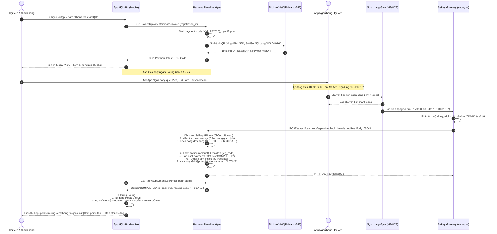

# Ví Dụ Mẫu Tham Chiếu: Sơ Đồ Trình Tự Thanh Toán Chuyển Khoản Tự Động (VietQR & SePay Webhook)

> [!NOTE]
> **ĐÂY LÀ VÍ DỤ MINH HỌA (ILLUSTRATIVE EXAMPLE ONLY):**
> Tài liệu này là một ví dụ tham chiếu cụ thể trích xuất từ kế hoạch triển khai thanh toán VietQR & SePay để minh họa cách áp dụng các quy chuẩn của kỹ năng `sequence-diagram`.
> Kỹ năng `sequence-diagram` là kỹ năng dùng chung cho **MỌI TÍNH NĂNG** trong hệ thống (Check-in, Đặt lịch PT, Chuyển nhượng gói, Hoa hồng, Báo cáo,...). Khi làm các tính năng khác, hãy tham khảo cách tổ chức của ví dụ này và thay thế bằng các Actor, Participant, Endpoint và Payload tương ứng.

---

## 1. Sơ Đồ Trình Tự (Mermaid Sequence Diagram)

---

## 2. Chi Tiết Thuyết Minh 5 Giai Đoạn Vận Hành

1. **Giai đoạn 1 — Khởi tạo thanh toán & sinh mã VietQR động:**
   - Hội viên chọn gói tập trên Mobile App hoặc Lễ tân tạo đơn đăng ký trên Web Admin.
   - Client gọi API `POST /api/v1/payments/create-invoice`.
   - Backend tính toán số tiền chính xác sau khi trừ giảm giá/voucher, khóa hạn mức thanh toán trong 15 phút.
   - Thư viện VietQR tạo ra link mã QR Napas247 chuẩn:
     `https://img.vietqr.io/image/<BANK_BIN>-<STK>-compact2.png?amount=<SỐ_TIỀN>&addInfo=PG%20<MÃ_ĐĂNG_KÝ>&accountName=<TÊN_CHỦ_THẺ>`
   - Modal hiển thị mã QR, đồng hồ đếm ngược 15 phút và tự động kích hoạt vòng lặp polling mỗi 1.5 - 2 giây.

2. **Giai đoạn 2 — Hội viên thanh toán qua Mobile Banking:**
   - Hội viên mở app ngân hàng bất kỳ (Vietcombank, MB, Techcombank, VPBank, ACB, BIDV, MoMo...).
   - Bấm quét mã QR. Ứng dụng ngân hàng tự động điền toàn bộ: Tên ngân hàng nhận, Số tài khoản nhận, Tên công ty, Số tiền và Nội dung chuyển khoản `PG DK016`.
   - Hội viên chỉ cần xác thực vân tay/FaceID/OTP để chuyển tiền. Không bao giờ xảy ra lỗi chuyển sai số tiền hoặc sai số tài khoản.

3. **Giai đoạn 3 — SePay phát hiện giao dịch và bắn Webhook:**
   - Trong vòng 1 - 3 giây sau khi ngân hàng báo có tiền vào, SePay phát hiện biến động số dư.
   - SePay lọc giao dịch tiền vào (`transferType = 'in'`), bóc tách nội dung chuyển khoản để lấy mã đơn hàng `DK016` và số tiền thực nhận `transferAmount`.
   - SePay gửi request HTTP `POST` đến `https://<domain>/api/v1/payments/sepay/webhook`.

4. **Giai đoạn 4 — Backend đối soát an toàn tài chính (Transaction nguyên tử):**
   - **Xác thực danh tính:** Kiểm tra header `Authorization: Apikey <SEPAY_API_KEY>`. Nếu sai hoặc thiếu, từ chối ngay lập tức với HTTP 401.
   - **Cơ chế chống thanh toán trùng (Idempotency Guard):** Kiểm tra mã tham chiếu ngân hàng `referenceCode` (hoặc SePay transaction ID) trong database. Nếu giao dịch này đã được ghi nhận trước đó, bỏ qua để chống cộng tiền 2 lần.
   - **Khóa bản ghi (Row-level Locking):** Thực hiện `SELECT ... FOR UPDATE` trên bản ghi `registrations`.
   - **Khớp số tiền:** Đảm bảo số tiền khách chuyển $\ge$ số tiền cần thanh toán của gói tập.
   - **Quyết toán đồng thời (Atomic Settlement):**
     * Thêm bản ghi thanh toán thành công vào bảng `payments` (`status = 'COMPLETED'`, `confirmed_at = NOW()`, `payment_method = 'BANK_TRANSFER'`).
     * Sinh bản ghi Phiếu thu tương ứng vào bảng `receipts` (`receipt_code = 'PT...'`).
     * Cập nhật trạng thái gói tập trong bảng `registrations` sang `ACTIVE`.
     * Tự động phát thông báo in-app `REGISTRATION_ACTIVATED` cho tài khoản hội viên.
   - Trả về HTTP 200 `{ "success": true }` cho SePay để xác nhận đã nhận webhook thành công.

5. **Giai đoạn 5 — Tự động bung Popup "THANH TOÁN THÀNH CÔNG" (Zero-Click):**
   - Vòng lặp polling trên màn hình App/Web gọi `GET /api/v1/payments/:id/check-bank-status` nhận kết quả `{ is_paid: true, status: 'COMPLETED', receipt_code: 'PT...' }`.
   - Dừng ngay polling.
   - Tự động đóng Modal VietQR.
   - Tự động mở Modal Popup chúc mừng:
     * Icon Checkmark xanh to animated
     * Tiêu đề: **THANH TOÁN THÀNH CÔNG!**
     * Thông tin chi tiết: Tên gói, số tiền đã trả, mã phiếu thu, mã đơn, thời gian
     * Nút: `[Xem phiếu thu]` và `[Đến Gói của tôi]`
