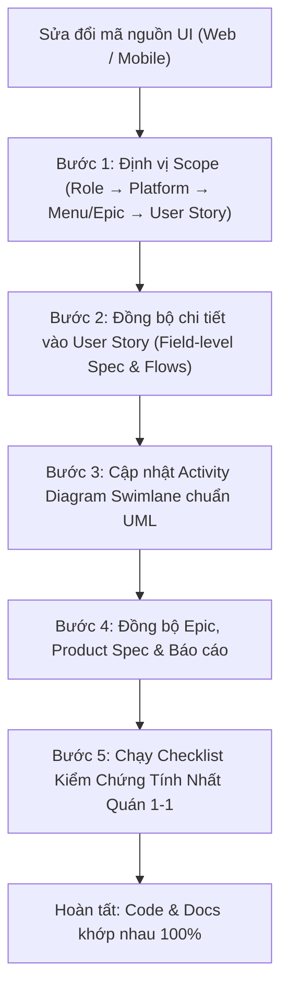

# UI to Documentation Synchronization Skill (ui-docs-sync)

Kỹ năng tự động hóa và chuẩn hóa quy trình **đồng bộ hai chiều giữa Giao diện người dùng (UI) và Hệ thống Tài liệu đặc tả (Docs)** trong dự án Paradise Gym.

> [!CAUTION]
> **QUY TẮC BẮT BUỘC:** Bất kỳ khi nào có thao tác chỉnh sửa, thêm mới hoặc xóa bỏ bất kỳ thành phần nào trên giao diện (Web Admin, Web Lễ tân, Mobile Hội viên, Mobile PT), Agent **BẮT BUỘC PHẢI THỰC THI SKILL NÀY NGAY LẬP TỨC** trước khi kết thúc câu trả lời.
> Tuyệt đối không được phép sửa code UI mà bỏ quên cập nhật User Story hoặc ngược lại!

---

## 1. Khi Nào Kỹ Năng Này Được Kích Hoạt? (Trigger Events)

Kỹ năng này bắt buộc kích hoạt khi có bất kỳ thay đổi nào sau đây trên Frontend (`frontend/web/`, `frontend/mobile/member/`, `frontend/mobile/pt/`):
1. **Thêm, sửa, xóa trường nhập liệu (Fields):** Thêm hoặc sửa thuộc tính của input, textbox, numberbox, selectbox, datebox, tagbox, textarea, switch, radio, checkbox trên form hoặc modal.
2. **Thay đổi tính chất động của trường:** Thay đổi tính ẩn/hiện (`visible`), tính bắt buộc (`required`/`optional`/`conditional`), hoặc ràng buộc phụ thuộc (`TRIGGER`, `DYNAMIC`, `CONDITIONAL`).
3. **Thêm, sửa, xóa nút thao tác (Action Buttons / Controls):** Thêm nút bấm, icon action, filter dropdown, CTA, tab navigation, thanh tìm kiếm.
4. **Thay đổi luồng tương tác (User Flow):** Đổi bước nhập liệu, thứ tự các bước trong wizard, thêm dialog xác nhận, modal popup, bottom sheet, drawer.
5. **Thay đổi cấu trúc hiển thị dữ liệu:** Đổi cột bảng DataGrid, đổi thẻ hiển thị danh sách Card, đổi chỉ số KPI Dashboard.
6. **Thay đổi quy tắc kiểm tra dữ liệu (Validation Rules):** Thêm regex, min/max, format tiền tệ, thông báo lỗi validation.

---

## 2. Quy Trình 5 Bước Đồng Bộ Tài Liệu Chuẩn Xác (5-Step Execution Flow)

---

### BƯỚC 1: Định Vị Scope (Role &rarr; Platform &rarr; Menu/Epic &rarr; User Story)

Xác định chính xác file mã nguồn UI vừa chỉnh sửa thuộc vai trò nào và ánh xạ tới tài liệu:

| File Code UI | Vai trò (Role) | Platform | Namespace Epic | Namespace User Story |
| :--- | :--- | :--- | :--- | :--- |
| `frontend/web/js/modules/` | **QTV / Quản lý** | Web | `docs/epic/qtv/` | `docs/user-stories/qtv/<Epic-Folder>/` |
| `frontend/web/js/modules/` | **Lễ tân (LT)** | Web | `docs/epic/le-tan/` | `docs/user-stories/le-tan/<Epic-Folder>/` |
| `frontend/mobile/member/` | **Hội viên (HV)** | Mobile | `docs/epic/hoi-vien/` | `docs/user-stories/hoi-vien/<Epic-Folder>/` |
| `frontend/mobile/pt/` | **Huấn luyện viên (PT)** | Mobile | `docs/epic/pt/` | `docs/user-stories/pt/<Epic-Folder>/` |

*Ví dụ:*
- Sửa modal thêm gói trong `packages.js` &rarr; Thuộc menu `W03 Gói tập` &rarr; Cần đồng bộ vào `docs/user-stories/qtv/QTV-W03-Gói tập/QTV-W03-US02-Thêm gói tập.md` và `QTV-W03-US03-Sửa gói tập.md`.
- Sửa check-in trong `checkin.js` &rarr; Cần đồng bộ cả `docs/user-stories/qtv/QTV-W07-...` VÀ `docs/user-stories/le-tan/LT-W07-...`.

---

### BƯỚC 2: Đồng Bộ Chi Tiết Vào User Story (Trọng Tâm Tuyệt Đối)

Đây là bước quan trọng nhất. Phải cập nhật chính xác 3 phần bên trong file User Story (`.md`):

#### 2.1. Cập Nhật Bảng Field-Level Specification (Đặc Tả Chi Tiết Trường)

Mọi trường dữ liệu trên form/modal/page phải có đúng 1 dòng trong bảng với 6 cột chuẩn:

| Cột | Ý nghĩa quy chuẩn | Giá trị bắt buộc tuân thủ |
| :--- | :--- | :--- |
| **Field / control** | Tên trường hiển thị trên UI | Ghi đúng nhãn tiếng Việt trên giao diện (ví dụ: `Thời hạn (ngày)`, `Số lượt Gym`, `Giá thành phần PT`) |
| **Loại UI Control** | Loại component giao diện | `Textbox`, `Number Input`, `Currency Input`, `Select Dropdown`, `Multi-select Dropdown`, `TagBox`, `DateBox`, `Textarea`, `Switch`, `Action Button` |
| **State** | Trạng thái tương tác | `USER-INPUT` (người dùng nhập/chọn), `PREFILL` (điền sẵn có thể sửa), `READONLY` (chỉ đọc/khóa cứng), `AUTO-FILL` (hệ thống tự điền) |
| **Required** | Tính bắt buộc | **Quy tắc vàng:** • Ghi `required`: Nếu trường độc lập luôn bắt buộc. • Ghi `optional`: Nếu trường độc lập không bắt buộc. • **Bắt buộc ghi là `conditional`**: Nếu trường có tính chất ẩn/hiện hoặc thay đổi tính bắt buộc theo trường khác! Tuyệt đối không ghi cứng `required` hay `optional` cho trường conditional. |
| **Conditional / dynamic** | Quan hệ điều khiển & ẩn/hiện | Tuân thủ nghiêm ngặt 4 giá trị: 1. `TRIGGER`: Trường độc lập kích hoạt form động. 2. `DYNAMIC`: Trường luôn luôn hiển thị; chỉ có danh sách options thay đổi theo TRIGGER. 3. `CONDITIONAL`: Trường có điều kiện ẩn/hiện. **Bắt buộc mô tả cụ thể hai chiều**: &nbsp;&nbsp;• **Hiện khi**: TRIGGER nhận giá trị gì? &nbsp;&nbsp;• **Ẩn khi**: TRIGGER nhận giá trị gì? &nbsp;&nbsp;(hoặc **Bắt buộc khi nào / Tùy chọn khi nào** nếu trường luôn hiện nhưng thay đổi tính bắt buộc). 4. `Không`: Trường độc lập cố định. |
| **Source / validation** | Nguồn dữ liệu & kiểm tra | Ràng buộc: `min`, `max`, `step`, `regex`, format tiền tệ, thông báo lỗi hoặc nguồn dữ liệu danh sách |

> [!IMPORTANT]
> **Quy ước phân biệt phạm vi bảng Field-level:**
> - **Đối với Modal / Form nhập liệu:** Chỉ ghi các trường nhập liệu và trường hiển thị dữ liệu (`input/display fields`); **tuyệt đối KHÔNG đưa các nút hành động của form** (như Lưu, Hủy, Đóng, Tạo mới, Xóa) hoặc các trường backend tự sinh ngầm vào bảng.
> - **Đối với Màn hình / Trang chính (Page, Grid, List View):** Là bảng đặc tả toàn diện, bắt buộc ghi cả các nút thao tác (Action buttons, Search, Filter, CTA, nút mở modal).

#### 2.2. Cập Nhật Luồng Thao Tác (Flows)

- **Main Flow (Luồng chính):**
  + Đảm bảo mô tả đầy đủ bước tương tác với trường TRIGGER và phản ứng của hệ thống (SYS):
    * *Ví dụ:* "3. QTV chọn Loại gói (`GYM`, `PT`, `COMBO`)."
    * *Ví dụ:* "4. SYS điều khiển hiển thị động các trường form tương ứng: nếu chọn `GYM` theo buổi ẩn trường thời hạn ngày và hiện số lượt Gym; nếu chọn `COMBO` hiện bóc tách 3 mức giá..."
- **Alternate Flows (Luồng thay thế):** Bổ sung các nhánh phụ khi người dùng chọn option khác của TRIGGER hoặc bấm Hủy.
- **Exception Flows (Luồng lỗi / ngoại lệ):** Bổ sung các thông báo lỗi validation nếu trường mới nhập sai định dạng hoặc vi phạm ràng buộc logic (ví dụ: Giá bán $\le 0$, ngày kết thúc trước ngày bắt đầu).
- **Preconditions:** Tuyệt đối **không ghi metadata** (`Role/Platform/Epic...`), chỉ ghi điều kiện tiên quyết nghiệp vụ thực tế.
- **Result:** Tuyệt đối **không đưa mục `## Result`** vào User Story (sau Exception Flows là đến trực tiếp Activity Diagram).

---

### BƯỚC 3: Cập Nhật Activity Diagram Swimlane Chuẩn UML

Áp dụng kỹ năng `.agents/skills/activity-diagram/SKILL.md`:
- Sử dụng sơ đồ Mermaid `flowchart TB` với 2 Swimlanes tối thiểu:
  + `Swimlane — <Tên Role>` (Người dùng thao tác).
  + `Swimlane — SYS` (Hệ thống xử lý, validation, điều khiển dynamic UI, lưu DB).
- **Tuân thủ nghiêm ngặt Quy tắc Bất Biến về Số Mũi Tên (Node Arity & Topology):**
  + **Action Node `["..."]`:** BẮT BUỘC ĐÚNG `1 IN + 1 OUT` (không hơn không kém). Cấm dùng Action node để rẽ nhánh, cấm nhiều mũi tên vào Action node, và tuyệt đối cấm đứt đoạn / kết thúc tại Action node.
  + **Decision Node `{"..."}`:** `1 IN + N OUT` ($N \ge 2$), bắt buộc có nhãn trên 100% các nhánh rẽ.
  + **Merge Node `{"Merge"}` / `(("Merge"))`:** `N IN + 1 OUT` (OR logic - chỉ cần 1 nhánh tới).
  + **Join Node `{{"Join"}}`:** `N IN + 1 OUT` (AND logic - phải chờ tất cả nhánh song song).
  + **Final Node `((("Final — ...")))`:** `1 IN + 0 OUT` (Điểm kết thúc duy nhất hợp lệ của mọi path).
- Thể hiện rõ các nút quyết định (`Decision` node) tương ứng với các trường TRIGGER/DYNAMIC:
  + *Ví dụ:* `D01{"Loại gói là gì?"}` &rarr; Nhánh `[GYM Ngày]`, Nhánh `[GYM Buổi]`, Nhánh `[PT]`, Nhánh `[COMBO]`.
  + Nút `Decision` kiểm tra dữ liệu: `D02{"Dữ liệu hợp lệ?"}` &rarr; Nhánh `[Hợp lệ]` lưu DB, Nhánh `[Lỗi]` hiển thị thông báo lỗi trường.
- Đảm bảo đầy đủ: Initial node `(("Initial"))`, Final success node `((("Final — Thành công")))`, Final error node `((("Final — Báo lỗi")))`.

---

### BƯỚC 4: Đồng Bộ Epic, Product Spec & Báo Cáo

1. **File Epic (`docs/epic/<role>/<Epic-Name>.md`):**
   - Cập nhật mục mô tả tính năng hoặc danh sách User Stories nếu có US mới hoặc thay đổi lớn trong hành vi nghiệp vụ của màn hình.
2. **Product Spec (`docs/product-spec.md`):**
   - Cập nhật các bảng mô tả gói, ma trận quyền, quy tắc tính hoa hồng hoặc luồng check-in nếu có quy tắc nghiệp vụ mới phát sinh.
3. **Báo cáo bàn giao / Changelog:**
   - Cập nhật file báo cáo tương ứng tại `docs/reports/<tab-name>/...` và file tổng hợp [`docs/menu-and-user-stories-changes.md`](file:///e:/Desktop/para/docs/menu-and-user-stories-changes.md).

---

### BƯỚC 5: Checklist Kiểm Chứng Tính Nhất Quán 1-1 (Self-Verification)

Trước khi hoàn tất prompt, Agent phải tự rà soát bảng kiểm tra sau:

- [ ] **Khớp 1-1 về Tên trường:** Nhãn hiển thị trên code UI giống 100% với cột `Field / control` trong US.
- [ ] **Khớp 1-1 về Tính chất Dynamic/Conditional:**
  - Nếu trong code UI có `form.itemOption('field', 'visible', condition)` &rarr; Trong US cột `Required` phải là `conditional`, cột `Conditional / dynamic` phải là `CONDITIONAL` kèm mô tả chi tiết 2 chiều `Hiện khi... Ẩn khi...`.
  - Không có trường nào trong code ẩn/hiện mà trong tài liệu lại ghi là cố định (`Không`).
- [ ] **Khớp 1-1 về Bắt buộc (Required):** Trường có `isRequired: true` trong code thì tài liệu phải ghi là `required` (hoặc `conditional` nếu tính bắt buộc thay đổi linh hoạt).
- [ ] **Khớp 1-1 về Trạng thái nhập liệu:** Trường bị `readOnly: true` trong code thì trong US cột `State` phải ghi `READONLY` hoặc `READONLY (PREFILL)`.
- [ ] **Cú pháp & Chuẩn Topology Activity Diagram:** 
  - Mermaid render chuẩn, không lỗi syntax, có đầy đủ swimlanes role và SYS.
  - **Action Node = đúng 1 IN + 1 OUT**, không bị đứt đoạn, không rẽ nhánh từ Action node.
  - **Decision Node = 1 IN + N OUT** ($N \ge 2$), có nhãn rõ ràng trên mọi nhánh.
  - **Merge / Join Node = N IN + 1 OUT**.
  - **Final Node = điểm kết thúc duy nhất** của mọi nhánh (Thành công, Hủy, Lỗi).
- [ ] **Không sót Role liên đới:** Nếu sửa màn hình dùng chung giữa QTV và Lễ tân (như Hội viên, Gói, Check-in, Bán hàng), đã cập nhật cả US của QTV VÀ US của Lễ tân.

---

## 3. Ví Dụ Mẫu Áp Dụng Thực Tế (Reference Example)

### Tình huống: Sửa form thêm gói tập trong `packages.js`:
1. **Code UI thay đổi:** Khi chọn `Loại gói = GYM` và `Cách giới hạn = Theo buổi`, ẩn trường `Thời hạn (ngày)` và hiện trường `Số lượt Gym`.
2. **Hành động đồng bộ vào `QTV-W03-US02`:**
   - Cập nhật dòng `Thời hạn (ngày)` trong bảng UI spec:
     * `Required`: `conditional`
     * `Conditional / dynamic`: `CONDITIONAL`:
       - **Hiện khi**: `Loại gói = GYM` + `Theo ngày`; hoặc `Loại gói = PT` / `COMBO`.
       - **Ẩn khi**: `Loại gói = GYM` + `Theo buổi`.
   - Cập nhật dòng `Số lượt Gym`:
     * `Required`: `conditional`
     * `Conditional / dynamic`: `CONDITIONAL`:
       - **Hiện khi**: `Loại gói = GYM` và `Cách giới hạn = Theo buổi`.
       - **Ẩn khi**: Các trường hợp khác.
   - Cập nhật bước 4 và 5 trong `Main Flow`.
   - Cập nhật sơ đồ Swimlane Mermaid bổ sung nhánh rẽ `Theo ngày` vs `Theo buổi`.
