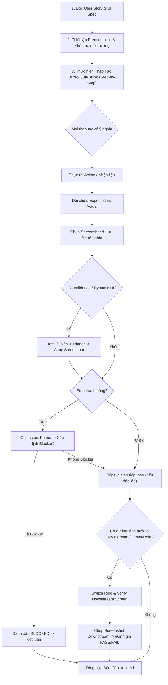

# US E2E Test Recorder Skill

## Kinh nghiệm kiểm thử PT (2026-09-21)

- Với popup quản trị đối chiếu Mobile của một hội viên, kiểm tra cùng member ID trong projection, từng tab và tài khoản Mobile đã xác thực; không gọi API tự phục vụ của QTV rồi coi đó là dữ liệu hội viên. Ghi riêng lỗi legacy ở role đối chiếu, không sao chép lỗi để tạo kết quả khớp giả (ví dụ Mobile lọc payment.status trong khi ledger chỉ có confirmed_at).
- Khi nhiều tác nhân sửa UI đồng thời, chỉ chạy nghiệm thu sau marker chốt phiên bản và SHA256 của JavaScript/CSS khớp thực tế. Nếu source thay trong lúc chạy, giữ ảnh làm bằng chứng sơ bộ và chạy lại bản đã chốt; kiểm tra cả tab con, cột ngoài viewport và trạng thái dài sau thay đổi trình bày.

- Với DevExtreme DataGrid trong popup, DOM có dòng dữ liệu chưa đủ để chụp PASS: chờ các load panel thực sự ẩn, kiểm tra vùng cần đối chiếu không bị che, cuộn ngang/dọc để chụp cột ngoài viewport. Đối chiếu ảnh sau chụp, không chỉ dựa vào innerText.
- Kiểm thử bàn giao tài chính phải giữ cùng payment/receipt ID khi đối chiếu LT sau khi chốt; thử token xem trước cũ sau khi có khoản thu mới và kiểm tra snapshot không đổi khi tên hội viên hiện tại thay đổi. Không sửa tiền thật trên database dùng chung để tạo tình huống thử.
- Fixture phải tách rõ member ID và phiên đăng nhập member. Khi ghi lỗi/báo cáo, loại access_token/refresh_token khỏi nội dung kể cả thông báo lỗi PostgreSQL vô tình chứa object phiên đăng nhập.
- Với kỳ đối chiếu theo chi nhánh, kiểm thử trình duyệt khác timezone chi nhánh: ngày mặc định, DateBox sau thay đổi, ngày lịch trong bảng và timestamp trong snapshot. Không dùng Date parse chuỗi YYYY-MM-DD rồi hiển thị theo timezone trình duyệt vì có thể lùi một ngày.

- Khi chụp native `<dialog>`, đặt overlay khoanh vùng trong dialog đang mở để không bị top layer che mất. Kiểm tra ảnh thực tế, không chỉ kiểm tra overlay tồn tại trong DOM.
- Khi kiểm thử countdown bằng browser clock, cài clock trước khi ứng dụng tạo timer. Thay thời gian không được giả lập phản hồi API; vẫn đối chiếu hạn QR thật với backend và trạng thái đơn.
- Chờ ảnh QR decode thành công trước khi xác nhận hiển thị; phân biệt lỗi tải ảnh với lỗi tạo yêu cầu thanh toán. Intent hết hạn không đồng nghĩa đơn đăng ký bị hủy, và intent không được xuất hiện trong lịch sử payment đã thu.

- Cổng kích hoạt dùng chung phải kiểm thử SĐT kèm role được chọn, không chỉ mã PT tự nhận diện. Sau khi đổi định danh/role, kiểm tra preview và OTP cũ bị xóa; xác minh tên/mã đã che và chi nhánh khớp API, không coi tên chi nhánh mặc định là dữ liệu thật.
- Với lịch nhóm, kiểm tra cùng booking bằng trưởng nhóm và thành viên khác trước/sau xác nhận kép: thành viên không có nút Hủy/Xác nhận trên DOM, trưởng nhóm vẫn thao tác được. Không suy ra mọi loại thẻ lịch đã được kiểm thử từ một màn danh sách.

- Khi chuyển modal thành trang/tab, kiểm thử lại phần tử thực sự cuộn cho pull-to-refresh, khả năng dùng footer, trạng thái active và giữ kỳ lọc khi quay lại từ lối tắt; không tái sử dụng selector backdrop/modal cũ rồi coi lỗi selector là lỗi nghiệp vụ.

- Với luồng ghi dữ liệu, ưu tiên database PostgreSQL cô lập: áp dụng toàn bộ migration hiện có, ghi manifest tên/hash vào báo cáo và dọn đúng database do runner tạo. Không chạy seed/reset trên database đang dùng chung.
- Có thể dùng Playwright `route.continue` chuyển request sang backend thật của database cô lập; không dùng `route.fulfill` tạo dữ liệu nghiệp vụ giả. Chặn mọi request API lọt sang backend dùng chung.
- PASS của phiên bản trước không chứng minh phiên bản sau thay migration/code. Chạy lại luồng nguồn và downstream sau sửa lỗi; giữ mô tả lỗi ban đầu và bằng chứng tái kiểm thử.
- Với xác nhận kép, kiểm tra cả UI hai vai trò và counters trước/sau từng xác nhận, rồi gửi lại yêu cầu để xác minh không trừ hai lần. Phân biệt retry cùng kết quả với yêu cầu sửa ghi chú đã chốt.
- Với dữ liệu snapshot, kiểm tra thay đổi dữ liệu nguồn không làm đổi lịch sử. Phân biệt snapshot rỗng hợp lệ với lịch sử chưa được lưu; không coi thiếu snapshot là số liệu 0.
- API từ chối 403 không đồng nghĩa UI đúng quyền: kiểm tra cả nút đang hiện/enabled của người chỉ có quyền xem, đặc biệt trưởng nhóm và thành viên. Nếu role downstream ngoài phạm vi sửa, giữ FAIL và xin duyệt thay vì lén sửa hoặc bỏ qua.
- Luồng thông báo cần chụp đủ title/body/thời điểm, trạng thái đọc qua API và màn hình quay lại sau đóng; phân biệt reference REGISTRATION của phân công chính thức với yêu cầu legacy.

Kỹ năng kiểm thử End-to-End (E2E) toàn diện theo từng User Story (US) dành cho Paradise Gym. Kỹ năng này bắt buộc kiểm thử trên giao diện người dùng thực tế (UI thật kết nối PostgreSQL Database và Backend REST API thực tế, cấm mock data), ghi nhận chi tiết từng thao tác, chụp ảnh màn hình làm bằng chứng tại từng bước, và thực hiện kiểm chứng đa vai trò (Cross-Role / Downstream Verification).

---

## 1. Nguyên Tắc Cốt Lõi (Core Principles)

1. **Kiểm thử trên UI thật & Dữ liệu thật 100%:**
   - Mọi thao tác kiểm thử phải thực thi trên giao diện thật (Web Admin QTV/LT, Mobile Member, Mobile PT) thông qua trình duyệt hoặc công cụ tự động hóa (Puppeteer / Playwright với Chrome/Chromium).
   - Dữ liệu tương tác là dữ liệu thực tế từ cơ sở dữ liệu PostgreSQL 22 bảng qua Backend REST API; tuyệt đối **không mock data**, không hardcode phản hồi.

2. **Step-by-Step Verification (Cấm chỉ test kết quả cuối cùng):**
   - Phải ghi nhận, xác minh và chụp ảnh màn hình cho **từng thao tác có ý nghĩa** (mở trang, click nút, nhập input, thay đổi select box, chuyển tab, submit form, validation error, mở/đóng modal/drawer, chọn slot calendar,...).
   - Tuyệt đối không nhảy cóc đến kết quả cuối cùng mà bỏ qua các bước trung gian.

3. **Căn cứ xác định Expected Result:**
   - Kết quả kỳ vọng (**Expected Result**) phải được trích xuất trực tiếp và chính xác từ:
     + User Story tương ứng (`docs/user-stories/...`) gồm `Main Flow`, `Alternate Flows`, `Exception Flows`, `Acceptance Criteria`.
     + Bảng đặc tả giao diện (`Field-level specification` / `UI Spec`).
     + Quy tắc nghiệp vụ (`Business Rules`) và Product Spec (`docs/product-spec/...`).
   - Tuyệt đối **không suy đoán** hoặc tự đặt ra kỳ vọng không có căn cứ trong tài liệu.

4. **Xử lý Validation & Giao diện động (Dynamic / Conditional UI):**
   - Khi kiểm thử form có tính năng validation (bắt buộc, định dạng số điện thoại, regex email, độ dài, mật khẩu,...), phải thực hiện test case biên/lỗi và chụp screenshot ngay tại thời điểm hiển thị thông báo lỗi.
   - Với các trường giao diện động (`TRIGGER`, `DYNAMIC`, `CONDITIONAL`): Phải kiểm tra và chụp ảnh trước và sau khi kích hoạt trường TRIGGER (ví dụ: chọn gói Gym ẩn trường PT; chọn gói Combo hiện cả trường Gym và PT; chọn vai trò nhân viên hiện chọn chi nhánh, chọn vai trò hội viên ẩn chọn chi nhánh).

5. **Kiểm Chứng Đa Vai Trò & Đồng Bộ Giao Diện Thực Tế (Cross-Role Downstream UI Synchronization — Bắt buộc 100%):**
   - **CẤM TUYỆT ĐỐI chỉ kiểm tra dữ liệu ngầm trong PostgreSQL Database hoặc gọi API JSON** rồi tự suy đoán là giao diện các role khác đã đồng bộ!
   - Khi một hành động ở vai trò nguồn (ví dụ: QTV tạo gói tập, thêm/sửa hội viên, tạo đăng ký hợp đồng, gán PT phụ trách, đặt/hủy lịch PT, khóa thẻ/tài khoản) có tác động đến vai trò khác trong hệ thống:
     + **BẮT BUỘC PHẢI MỞ GIAO DIỆN THẬT (UI) CỦA ROLE ĐÓ TRÊN TRÌNH DUYỆT:**
       * **Web Lễ tân:** `http://localhost:3000/web/` (với phiên đăng nhập Lễ tân).
       * **Mobile Hội viên:** `http://localhost:3000/mobile/member/` (với phiên đăng nhập Hội viên, viewport di động `390x844`).
       * **Mobile Huấn luyện viên (PT):** `http://localhost:3000/mobile/pt/` (với phiên đăng nhập PT, viewport di động `390x844`).
     + **Điều hướng đến đúng màn hình thụ hưởng của role đó để kiểm chứng tính đồng bộ:**
       * *QTV tạo/sửa gói tập:* Bắt buộc mở màn hình **"Mua gói tập" trên app Mobile Hội viên** (`http://localhost:3000/mobile/member/`) để verify gói mới xuất hiện đúng giá và quyền lợi; đồng thời mở modal Đăng ký của **Web Lễ tân** để kiểm tra combobox gói tập.
       * *QTV thêm/sửa hội viên:* Bắt buộc mở Web Lễ tân kiểm tra DataGrid hội viên tại chi nhánh đó, và kiểm tra tài khoản có thể đăng nhập app Mobile Hội viên.
       * *QTV gán PT / đặt lịch PT:* Bắt buộc mở app **Mobile PT** (màn hình Lịch dạy hoặc Học viên phụ trách) VÀ app **Mobile Hội viên** (màn hình Lịch tập) để kiểm chứng slot hiển thị đồng nhất hai chiều.
       * *QTV khóa thẻ / đổi trạng thái hội viên:* Bắt buộc thử check-in tại màn hình Ra vào của Lễ tân (từ chối cửa) và mở app Mobile Hội viên (báo thẻ bị khóa).
     + **Bắt buộc chụp ảnh screenshot UI của role downstream:** Áp dụng đầy đủ quy chuẩn Visual Annotation (khoanh vùng Bounding box, đánh số thứ tự badge, nhãn callout) và nhúng trực tiếp ảnh vào mục `## 4. Cross-Role / Downstream Verification` của file báo cáo `<US-ID>-test.md`. Không có ảnh chụp UI thật của role liên quan = `FAIL` phần Downstream Verification!

6. **Nguyên tắc không tự ý sửa code (No Auto-Fixing during Test):**
   - Khi phát hiện bug/lỗi trong quá trình kiểm thử, ghi nhận chi tiết vào mục `Issues Found` kèm screenshot lỗi và đánh dấu `FAIL` hoặc `BLOCKED`.
   - **Tuyệt đối không tự ý sửa source code** trong khi đang thực hiện bài test, trừ khi người dùng có yêu cầu rõ ràng: *"test-and-fix"* hoặc *"sửa lỗi vừa tìm thấy"*.

7. **Xác Thực DOM Thực Tế & Cấm Tuyệt Đối Báo Cáo Giả Mạo (DOM Truthfulness):**
   - Trước khi ghi nhận `Actual Result` và đánh dấu `PASS` cho bất kỳ bước nào (mở modal, mở drawer, submit form, hiển thị thông báo,...), bắt buộc phải truy vấn trạng thái thực sự trên DOM (ví dụ: `$('.dx-popup:visible').length > 0`, kiểm tra text của Toast notification, kiểm tra CSS class validation error).
   - Tuyệt đối **cấm ghi kết quả định sẵn kiểu "Modal mở đúng thiết kế" khi thực tế trên ảnh là Toast lỗi màu đỏ hoặc không có modal**.
   - Báo cáo bằng văn bản (Actual Result, Expected Result) phải khớp chính xác 100% với nội dung hiển thị trong ảnh chụp màn hình tại bước đó.

8. **Quy Trình 3 Bước Xử Lý Ngoại Lệ & Điều Chỉnh Giao Diện (Exception Flow -> Adjustment -> Success):**
   - Khi gặp một thao tác bị hệ thống chặn theo nghiệp vụ (ví dụ: QTV ở phạm vi `ALL` bấm Thêm hội viên bị chặn vì thiếu chi nhánh cụ thể):
     * *Bước 1 (Exception Flow):* Ghi nhận trung thực thao tác bị chặn, chụp ảnh Toast thông báo lỗi, đánh dấu `PASS` (nếu hệ thống xử lý chặn đúng Exception Flow theo spec).
     * *Bước 2 (Adjustment Step):* Thực hiện hành động điều chỉnh hợp lệ (ví dụ: chọn chi nhánh cụ thể trên Topbar / sửa lại trường vi phạm), chụp ảnh sau khi điều chỉnh.
     * *Bước 3 (Success Step):* Thao tác lại hành động ban đầu -> Modal/Form thực sự mở ra -> Chụp ảnh modal thực tế và verify nội dung!

9. **Ràng Buộc Phạm Vi Chi Nhánh (Branch Scope Precondition):**
   - Trong kiến trúc đa chi nhánh của Paradise Gym, vai trò Quản Trị Viên (QTV) khi đứng ở phạm vi toàn hệ thống (`ALL_BRANCHES` / Tất cả chi nhánh) chỉ được phép xem dữ liệu tổng hợp. Mọi hành động thêm mới (Hội viên, Hợp đồng, Thiết bị, Lịch tập, Giao dịch) đều bắt buộc phải gắn với một chi nhánh cụ thể (`branch_id`).
   - Kịch bản kiểm thử E2E phải chủ động tính toán điều kiện này: Hoặc đưa vào Exception Flow (thao tác ở `ALL` -> bị chặn -> đổi chi nhánh), hoặc thiết lập Precondition chuyển sang chi nhánh cụ thể trước khi thực hiện luồng chính (`Main Flow`).

10. **Quy Tắc Kiểm Tra Kích Thước & Tính Khác Biệt Của Ảnh (Duplicate Screenshot Audit):**
    - Khi script kiểm thử tự động chụp ảnh các bước liên tiếp, nếu phát hiện 2 hay nhiều ảnh liên tiếp có dung lượng byte giống hệt nhau (`file size byte-for-byte`), đó là tín hiệu cảnh báo đỏ (`Red Flag`) cho thấy giao diện bị đơ, animation không chạy, hoặc thao tác tương tác không có tác dụng lên DOM.
    - Phải có bước audit trực quan bằng công cụ xem ảnh (`view_file`) hoặc so sánh hash ảnh để đảm bảo mỗi bước kiểm thử đều thể hiện sự thay đổi trạng thái giao diện thực tế.

11. **Cơ Chế Tự Hoàn Thiện & Cập Nhật Kỹ Năng Liên Tục (Continuous Skill Improvement):**
    - Sau bất kỳ đợt kiểm thử nào, nếu phát hiện quy luật mới, edge cases, kinh nghiệm thực chiến hoặc giải pháp kỹ thuật giúp các lần test sau chuẩn xác hơn, Agent **bắt buộc cập nhật trực tiếp vào file tài liệu kỹ năng này (`.agents/skills/us-e2e-test-recorder/SKILL.md`)** và đồng bộ vào `AGENTS.md`.
    - Quy trình này đảm bảo toàn bộ hệ sinh thái Agent kế thừa tri thức mà không bao giờ lặp lại sai lầm cũ.

12. **Khoanh Vùng Chú Ý & Đánh Số Thứ Tự Thao Tác (Visual Annotation — Snipping Tool Style Callouts):**
    - Để báo cáo kiểm thử trực quan, dễ hình dung và chuyên nghiệp như được chú thích bằng công cụ **Snipping Tool**, mọi ảnh chụp màn hình tương tác hoặc kiểm chứng **bắt buộc phải có đánh dấu trực quan (Visual Annotation)** tại các vị trí phần tử quan trọng:
      + **Khung viền nổi bật (Bounding Box / Outline):** Bao quanh phần tử UI đang thao tác (nút bấm, ô input, dropdown, thông báo lỗi/toast, dòng dữ liệu trên bảng) bằng viền màu rực rỡ (đỏ `#e11d48`, tím `#8b5cf6`, hoặc vàng `#f59e0b`, độ dày viền 2px-3px kèm đổ bóng `box-shadow`).
      + **Đánh số thứ tự thao tác (Numbered Callout Badges `①`, `②`, `③`...):** Đặt huy hiệu hình tròn đánh số thứ tự thao tác (nền màu, viền trắng, số trắng in đậm `1`, `2`, `3`...) ngay góc trên phần tử được khoanh vùng. Giúp người đọc nhìn vào ảnh nhận biết ngay tức thì trình tự thao tác (ví dụ: `1: Click chọn chi nhánh` -> `2: Click nút Thêm hội viên`).
      + **Nhãn ghi chú ngắn (Callout label tag):** Tùy chọn gắn thêm nhãn chữ nhỏ ngay dưới hoặc bên cạnh khung viền (ví dụ: `Bị chặn ở ALL`, `Lỗi bỏ trống`, `Chọn chi nhánh Quận 1`, `Bấm Thêm mới`) để giải thích tức thì lý do hoặc hành động.
      + **Tự động dọn dẹp sạch sẽ (DOM Auto-cleanup):** Các phần tử overlay đánh dấu được chèn vào DOM chỉ để phục vụ chụp ảnh screenshot, ngay sau khi chụp xong phải được gỡ bỏ 100% khỏi DOM để không làm ảnh hưởng đến giao diện của các thao tác kế tiếp.

13. **Tính Đồng Nhất Đối Tượng Giữa Nguồn & Hạ Nguồn (Subject Consistency & Active Account Rule):**
    - **Tuyệt đối cấm thao tác trên đối tượng A mà downstream lại kiểm tra đối tượng B:** Mọi thao tác nguồn (Sửa hồ sơ, Đổi trạng thái, Khóa tài khoản, Gán gói tập, Đặt lịch, Điểm danh) và bước kiểm chứng hạ nguồn (Web Lễ tân, Mobile Hội viên, Mobile PT) **bắt buộc phải diễn ra trên cùng MỘT THỰC THỂ DUY NHẤT** (cùng ID, cùng SĐT, cùng Mã hội viên/HLV).
    - **Phân biệt rõ ràng giữa US Tạo mới hồ sơ và US Thao tác nghiệp vụ có đối chiếu Mobile:**
      * *Đối với US Tạo mới (Create):* Thao tác tạo hồ sơ mới (ví dụ Hội viên mới). Downstream ở Web Lễ tân sẽ tìm kiếm thấy hồ sơ mới này trên DataGrid. Hồ sơ mới tạo trên Web chỉ mới có thông tin hồ sơ (`members`), chưa có tài khoản (`accounts`) vì chưa qua luồng kích hoạt tài khoản trên Mobile (`MEMBER-US01`). Do đó, không thể dùng hồ sơ mới tạo để đăng nhập ngay vào Mobile khi chưa kích hoạt.
      * *Đối với các US Cập nhật / Đổi trạng thái / Khóa thẻ / Gán gói / Đặt lịch / Điểm danh:* **BẮT BUỘC PHẢI THỰC HIỆN TRÊN ĐỐI TƯỢNG ĐÃ CÓ TÀI KHOẢN HOẠT ĐỘNG SẴN TRÊN MOBILE** (ví dụ: Hội viên Lê Hoàng Nam - `HV001` / SĐT `0987654321` đã kích hoạt sẵn trong DB Seed). Khi QTV sửa thông tin hoặc khóa HV001, bắt buộc mở app Mobile của chính HV001 (`0987654321`) để verify profile hoặc kiểm chứng tài khoản bị chặn đăng nhập. Tuyệt đối không được sửa người này mà đi mở app của người khác!

14. **Quy Tắc Kiểm Chứng Phạm Vi Chi Nhánh Với 2 Chi Nhánh / 2 Người Dùng Khác Nhau (Multi-Branch Verification):**
    - Đối với những User Story có nghiệp vụ liên quan đến phạm vi chi nhánh (`Branch Scope`):
      * **Bắt buộc phải kiểm chứng trên 2 người dùng / 2 tài khoản thuộc 2 chi nhánh khác nhau** (hoặc chuyển đổi qua lại giữa 2 chi nhánh khác nhau, ví dụ: Chi nhánh Quận 1 và Chi nhánh Quận 7 / Tân Bình).
      * *Nhân viên / Lễ tân Chi nhánh A:* Chỉ nhìn thấy và chỉ thao tác được trên các dữ liệu (Hội viên, Đăng ký, Lịch tập, Thiết bị, Doanh thu) thuộc Chi nhánh A.
      * *Nhân viên / Lễ tân Chi nhánh B:* Không nhìn thấy dữ liệu riêng của Chi nhánh A; chỉ thao tác trên dữ liệu thuộc Chi nhánh B.
      * *Quản trị viên (QTV):* Khi chọn Chi nhánh A thì thấy dữ liệu Chi nhánh A; khi chuyển sang Chi nhánh B thì lưới dữ liệu chuyển đổi tức thì sang dữ liệu Chi nhánh B; khi ở `ALL` thì thấy tổng hợp nhưng bị chặn tạo mới các thực thể yêu cầu chi nhánh cụ thể.

15. **Quy Tắc Tách Bạch Thao Tác Nhập Liệu & Submit Form (Input Capture Before Submit Rule):**
    - Khi kiểm thử các thao tác Thêm mới (Create) hoặc Chỉnh sửa (Edit) hồ sơ/dữ liệu:
      * **Tuyệt đối CẤM gộp thao tác điền thông tin và click nút Lưu/Submit vào trong cùng một bước**, vì khi đó form đã đóng và người đọc báo cáo không thể nhìn thấy bằng chứng trường dữ liệu đã thực sự được chỉnh sửa trên UI!
      * **BẮT BUỘC PHẢI TÁCH THÀNH 2 BƯỚC RÕ RÀNG:**
        + *Bước Nhập Liệu:* Điền đầy đủ dữ liệu mới vào các ô input $\rightarrow$ **Chụp ngay screenshot màn hình form khi dữ liệu mới đang hiển thị trên input fields** $\rightarrow$ Gắn Bounding Box và Callout Badge khoanh vùng chính xác vào ô input đang chứa giá trị mới (ví dụ: ô Email hiển thị rõ `nam.lehoang.updated@gmail.com`).
        + *Bước Submit & Xác Nhận:* Click nút "Lưu thay đổi" / "Xác nhận" $\rightarrow$ Chờ Toast thông báo xuất hiện $\rightarrow$ **Chụp screenshot xác nhận kết quả lưu thành công** (Toast xanh, Drawer/DataGrid cập nhật dữ liệu).

16. **Quy Tắc Xác Thực Màn Hình Nghiệp Vụ Hạ Nguồn Thay Vì Màn Hình Đăng Nhập (Authenticated Downstream Screen Rule):**
    - Khi kiểm chứng đa vai trò (Cross-Role / Downstream Verification) trên các ứng dụng Mobile (Mobile Hội viên `http://localhost:3000/mobile/member/`, Mobile PT `http://localhost:3000/mobile/pt/`):
      * **TUYỆT ĐỐI CẤM CHỤP MÀN HÌNH ĐĂNG NHẬP (Login Screen) rồi báo cáo là đã kiểm chứng downstream!** Màn hình đăng nhập chứng tỏ phiên xác thực bị thất bại hoặc bị điều hướng ngược, hoàn toàn không có giá trị kiểm chứng dữ liệu nghiệp vụ.
      * **Kỹ thuật bắt buộc:** Phải nạp trước `paradise_access_token` và `paradise_user` của tài khoản đích vào `localStorage` trên origin của web trước khi load trang Mobile, bảo đảm khi ứng dụng Mobile nạp lên sẽ nhận diện ngay token hợp lệ mà không bị kích hoạt cơ chế tự động chuyển hướng về `/mobile/`.
      * **Bằng chứng hợp lệ:** Screenshot downstream bắt buộc phải là **màn hình nghiệp vụ bên trong** của vai trò đó (ví dụ: màn hình `#account` hiển thị thông tin cá nhân của hội viên kèm email mới được đồng bộ, màn hình `#packages` hiển thị danh sách gói tập mới, màn hình `#schedule` hiển thị lịch tập hai chiều). Bounding box phải chỉ thẳng vào trường thông tin vừa được cập nhật trên giao diện mobile!

---

## 2. Quy Chuẩn Tổ Chức Thư Mục & Tệp Tin Theo Vai Trò (Role-Based File Organization)

Toàn bộ bài test và bằng chứng screenshot E2E bắt buộc phải phân định rõ ràng theo từng Vai trò (Role) trong hệ thống:

```text
tests/e2e/<role>/<US-ID>/
├── <US-ID>-test.md                      # Báo cáo kiểm thử chi tiết của User Story
├── step-01-open-page.png                # Ảnh chụp step 1
├── step-02-click-add-button.png         # Ảnh chụp step 2
├── step-03-validation-error.png         # Ảnh chụp validation error (nếu có)
├── step-04-form-filled.png              # Ảnh chụp form đã điền dữ liệu hợp lệ
├── step-05-success-notification.png     # Ảnh chụp thông báo thành công & dữ liệu cập nhật
├── downstream-01-lt-check-package.png   # Ảnh chụp kiểm chứng vai trò Lễ tân (downstream)
├── downstream-02-mobile-member-view.png # Ảnh chụp kiểm chứng vai trò Hội viên (downstream)
└── ...
```

### Quy ước phân bổ thư mục theo Vai trò:
- **Quản trị viên (QTV):** `tests/e2e/qtv/<US-ID>/` (ví dụ: `tests/e2e/qtv/QTV-W01-US01/`, `tests/e2e/qtv/QTV-W02-US02/`)
- **Lễ tân (LT):** `tests/e2e/lt/<US-ID>/` (ví dụ: `tests/e2e/lt/LT-W01-US01/`, `tests/e2e/lt/LT-W04-US02/`)
- **Hội viên Mobile (HV):** `tests/e2e/hv/<US-ID>/` (ví dụ: `tests/e2e/hv/HV01-US01/`, `tests/e2e/hv/HV06-US01/`)
- **Huấn luyện viên Mobile (PT):** `tests/e2e/pt/<US-ID>/` (ví dụ: `tests/e2e/pt/PT01-US01/`, `tests/e2e/pt/PT05-US01/`)

### Quy ước đặt tên file:
- **File báo cáo Markdown:** `tests/e2e/<role>/<US-ID>/<US-ID>-test.md`.
- **File ảnh chụp màn hình (Screenshot):**
  + Định dạng: `step-<số-thứ-tự-2-chữ-số>-<tên-hành-động-cụ-thể>.png` (ví dụ: `step-01-open-packages.png`, `step-02-open-create-modal.png`, `step-03-validate-empty-name.png`).
  + Ảnh kiểm chứng downstream: `downstream-<số-thứ-tự-2-chữ-số>-<role>-<action>.png` (ví dụ: `downstream-01-lt-search-new-package.png`, `downstream-02-pt-check-calendar-slot.png`).
  + **CẤM TUYỆT ĐỐI:** Đặt tên vô nghĩa như `image1.png`, `screenshot.png`, `temp.png`, `test.png`.

---

## 3. Quy Trình Kiểm Thử Chuẩn (E2E Test Execution Workflow)



### Chi tiết các bước thực hiện:

### Bước 1: Nghiên cứu kỹ lưỡng User Story & Spec
- Đọc file User Story mục tiêu trong `docs/user-stories/`.
- Xác định rõ:
  + Vai trò thực hiện (`Actor / Role`).
  + Màn hình / URL hash (`Route`).
  + Điều kiện tiên quyết (`Preconditions`): Tài khoản, quyền hạn, chi nhánh áp dụng, trạng thái dữ liệu có sẵn.
  + Luồng chính (`Main Flow`), Luồng nhánh (`Alternate Flows`), Luồng lỗi (`Exception Flows`).
  + Bảng đặc tả trường dữ liệu (`Field-level specification`): Trường nào `TRIGGER`, trường nào `CONDITIONAL`, trường nào `DYNAMIC`, validation rule của từng trường.

### Bước 2: Chuẩn bị môi trường & Dữ liệu kiểm thử
- Đảm bảo Backend và Database đang chạy ổn định.
- Sử dụng tài khoản đúng vai trò và phạm vi chi nhánh theo Preconditions.
- Tạo thư mục `tests/e2e/<US-ID>/`.

### Bước 3: Thực thi thao tác nguồn (Source Action Verification)
- Thực hiện từng thao tác tuần tự trên UI:
  + Mở menu / màn hình.
  + Mở modal / drawer.
  + Test validation lỗi (nếu có): Nhập sai định dạng hoặc để trống trường bắt buộc -> Chụp ảnh lỗi.
  + Nhập dữ liệu hợp lệ: Ghi rõ từng giá trị nhập vào.
  + Kiểm tra hành vi dynamic UI: Khi chọn giá trị TRIGGER, kiểm tra các trường CONDITIONAL có ẩn/hiện hoặc DYNAMIC có cập nhật options đúng spec không -> Chụp ảnh.
  + Click nút xác nhận / Lưu / Submit.
- Sau mỗi thao tác:
  + Ghi rõ `Action/Input`, `Expected Result`, `Actual Result`, trạng thái `PASS` / `FAIL`.
  + Chụp screenshot và nhúng trực tiếp ngay dưới bước đó trong file Markdown.

### Bước 4: Kiểm chứng trạng thái nội tại (State Verification)
- Kiểm tra sau khi thực hiện thao tác thành công:
  + Thông báo (toast/notification message) hiển thị đúng nội dung và biến động.
  + Bảng dữ liệu (DataGrid/List) trên màn hình hiện tại hiển thị bản ghi mới hoặc trạng thái mới chính xác.
  + Các chỉ số KPI / Summary badge (nếu có) được cập nhật đồng bộ.
  + Modal/Popup tự động đóng (hoặc chuyển trạng thái theo spec).
  + Chụp screenshot toàn màn hình sau khi cập nhật.

### Bước 5: Kiểm chứng đa vai trò & Đồng bộ UI Thực Tế (Cross-Role Downstream UI Synchronization)
Nếu thao tác nguồn tạo mới, sửa đổi hoặc xóa/hủy dữ liệu, bắt buộc phải mở UI thật của các role liên quan trên trình duyệt để kiểm chứng:
- **Trường hợp 1: QTV thêm mới hoặc cập nhật hồ sơ hội viên (`members`):**
  + *Downstream 1 — Web Lễ tân (`http://localhost:3000/web/`):* Chuyển session Lễ tân chi nhánh tiếp nhận -> Vào menu Hội viên (`#members`) -> Verify DataGrid hiển thị hội viên mới, tìm kiếm theo SĐT ra đúng kết quả. Chụp screenshot có khoanh vùng dòng dữ liệu.
  + *Downstream 2 — Mobile Hội viên (`http://localhost:3000/mobile/member/`):* Mở app Hội viên -> Đăng nhập bằng SĐT vừa tạo -> Verify đăng nhập thành công, màn hình Trang chủ/Hồ sơ hiển thị đúng Họ tên, Mã hội viên và Chi nhánh. Chụp screenshot Mobile.
- **Trường hợp 2: QTV tạo gói tập mới hoặc đổi giá gói (`packages`):**
  + *Downstream 1 — Mobile Hội viên (`http://localhost:3000/mobile/member/`):* Đăng nhập Hội viên -> Điều hướng đến màn hình Mua gói tập -> Verify thẻ gói tập mới xuất hiện với đúng tên gói, quyền lợi (số buổi Gym/PT), thời hạn và đơn giá niêm yết. Chụp screenshot Mobile có khoanh vùng gói tập.
  + *Downstream 2 — Web Lễ tân (`http://localhost:3000/web/`):* Đăng nhập Lễ tân -> Vào menu Đăng ký (`#registrations`) -> Mở modal Đăng ký mới -> Mở dropdown Gói tập -> Verify gói mới có mặt trong danh sách lựa chọn. Chụp screenshot Web Lễ tân.
  + *Downstream 3 — Phân vùng Chi nhánh khác:* Đổi sang Lễ tân chi nhánh không được áp dụng gói -> Verify gói mới **hoàn toàn không hiển thị**.
- **Trường hợp 3: QTV gán PT phụ trách hoặc tạo lịch tập PT (`pt-schedule` / `registrations`):**
  + *Downstream 1 — Mobile PT (`http://localhost:3000/mobile/pt/`):* Đăng nhập Huấn luyện viên được gán -> Mở màn hình Lịch dạy hoặc Danh sách học viên phụ trách -> Verify thông tin học viên/buổi tập xuất hiện đầy đủ. Chụp screenshot Mobile PT.
  + *Downstream 2 — Mobile Hội viên (`http://localhost:3000/mobile/member/`):* Đăng nhập Hội viên -> Mở màn hình Lịch tập / Gói của tôi -> Verify hiển thị HLV phụ trách và lịch tập đã được đồng bộ. Chụp screenshot Mobile Hội viên.
- **Trường hợp 4: Hủy lịch tập PT (`pt-schedule`):**
  + *Downstream 1 — Mobile PT:* Mở Calendar của PT -> Verify slot giờ đã được giải phóng thành trạng thái trống (`Khung giờ trống`).
  + *Downstream 2 — Mobile Hội viên:* Kiểm tra số buổi PT còn lại trong gói -> Verify số buổi đã được hoàn trả chính xác.
- **Trường hợp 5: Khóa thẻ / Tạm dừng hoạt động hội viên (`members`):**
  + *Downstream 1 — Web Lễ tân (Ra vào & Check-in):* Thử nhập mã thẻ check-in -> Verify hệ thống từ chối mở cổng và cảnh báo lý do thẻ bị khóa.
  + *Downstream 2 — Mobile Hội viên:* Mở app Hội viên -> Verify thẻ tập ảo hiển thị trạng thái `BỊ KHÓA` và chặn các thao tác đặt lịch.
- **Trường hợp 6: Thao tác có phát sinh kiểm toán (`users-rbac` / `audit-logs`):**
  + Vào tab Nhật ký kiểm toán -> Verify có bản ghi ghi nhận thao tác vừa thực hiện với đúng `actor`, `action`, `old_values`, `new_values`. Chụp screenshot Audit log.

### Bước 6: Tổng hợp vấn đề phát hiện (Issues Found) & Kết luận
- Nếu có bất kỳ bước nào kết quả thực tế không khớp với Expected Result:
  + Ghi rõ Issue ID, Tiêu đề, Mức độ nghiêm trọng (`CRITICAL`, `MAJOR`, `MINOR`).
  + Mô tả chi tiết sai lệch giữa Expected và Actual.
  + Gắn đường dẫn ảnh chụp bằng chứng lỗi.
- Đưa ra kết luận cuối cùng của User Story:
  + **`PASS`**: 100% các bước nguồn, trạng thái nội tại và downstream verification đều đạt chuẩn.
  + **`FAIL`**: Có ít nhất một bước không đạt hoặc sai lệch nghiệp vụ nhưng không làm tắc nghẽn luồng.
  + **`BLOCKED`**: Lỗi nghiêm trọng khiến luồng kiểm thử bị dừng giữa chừng, không thể thực hiện các bước tiếp theo.

---

## 4. Cấu Trúc Báo Cáo Chuẩn (`<US-ID>-test.md`)

Mọi báo cáo kiểm thử User Story bắt buộc phải tuân theo mẫu sau:

````markdown
# Báo Cáo Kiểm Thử E2E — <US-ID>: <Tên User Story>

- **User Story:** [<US-ID> — <Tên US>](../../docs/user-stories/<path-to-us>.md)
- **Epic / Menu:** <Mã & Tên Epic, ví dụ: W03 - Gói tập>
- **Vai trò thực hiện (Primary Role):** <QTV / Lễ tân / PT / Hội viên>
- **Phạm vi kiểm thử:** <Web Admin / Mobile App>
- **Ngày thực hiện:** <YYYY-MM-DD>
- **Trạng thái tổng thể:** **`PASS`** | **`FAIL`** | **`BLOCKED`**

---

## 1. Overview & Preconditions

### 1.1. Mục tiêu kiểm thử
<Mô tả ngắn gọn phạm vi và mục tiêu kiểm thử của User Story này>

### 1.2. Điều kiện tiên quyết (Preconditions)
- [x] Tài khoản: `<Phone / Role>` đã được cấp quyền hợp lệ.
- [x] Chi nhánh kiểm thử: `<Tên chi nhánh / Toàn hệ thống>`.
- [x] Dữ liệu tiền đề: `<Các bản ghi cần có sẵn trong DB, ví dụ: Hội viên HV001, HLV PT001,...>`.

---

## 2. Source Action Verification (Step-by-Step)

### Step 1: <Tên thao tác, ví dụ: Mở màn hình danh mục gói tập>
- **Action / Input:** <Mô tả hành động của người dùng, ví dụ: Điều hướng đến hash `#packages`>.
- **Expected Result:** <Giao diện tải danh mục gói tập với DataGrid, các nút lọc và nút CTA "Thêm gói tập" hiển thị đầy đủ>.
- **Actual Result:** <Giao diện hiển thị đúng 3 tab loại gói tập, bảng dữ liệu nạp đủ các gói đang hoạt động>.
- **Status:** `PASS`


---

### Step 2: <Tên thao tác, ví dụ: Mở modal thêm gói tập mới>
- **Action / Input:** <Click nút "Thêm gói tập">.
- **Expected Result:** <Popup "Thêm gói tập" xuất hiện, trường "Tên gói" được focus, các trường có giá trị mặc định hợp lệ>.
- **Actual Result:** <Popup xuất hiện đúng thiết kế, form hiển thị đầy đủ các trường>.
- **Status:** `PASS`


---

### Step 3: <Tên thao tác, ví dụ: Kiểm tra Validation khi bỏ trống trường bắt buộc>
- **Action / Input:** <Bỏ trống trường "Tên gói tập" và click nút "Lưu thay đổi">.
- **Expected Result:** <Hệ thống chặn submit, hiển thị thông báo lỗi "Vui lòng nhập tên gói tập" ngay dưới trường Tên gói>.
- **Actual Result:** <Hiển thị thông báo validation lỗi đúng vị trí và nội dung>.
- **Status:** `PASS`


---

### Step 4: <Tên thao tác, ví dụ: Kiểm tra Dynamic UI trường TRIGGER "Loại gói">
- **Action / Input:** <Chọn Loại gói = "COMBO_GYM_PT">.
- **Expected Result:** <Form hiển thị đồng thời cả trường "Số buổi Gym" và "Số buổi PT", trường PT bắt buộc nhập số buổi>.
- **Actual Result:** <Giao diện kích hoạt hiển thị đầy đủ hai trường đúng spec>.
- **Status:** `PASS`


---

### Step 5: <Tên thao tác, ví dụ: Điền dữ liệu hợp lệ và Submit>
- **Action / Input:**
  + Tên gói: `Gói Thử Nghiệm Combo VIP 3 Tháng`
  + Loại gói: `Combo Gym + PT`
  + Giá gốc: `5,000,000` VNĐ
  + Thời hạn: `90` ngày
  + Lượt Gym: `90`
  + Buổi PT: `12`
  + Chi nhánh áp dụng: `Paradise Gym Thảo Điền (Q2)`
  + Click nút "Lưu thay đổi".
- **Expected Result:** <Hệ thống gọi API tạo gói thành công, hiển thị Toast "Thêm gói tập mới thành công", modal tự động đóng>.
- **Actual Result:** <Toast màu xanh hiển thị góc trên, modal đóng, gói tập mới xuất hiện trên DataGrid>.
- **Status:** `PASS`


---

## 3. State Verification (Data & UI Consistency)

- **Trạng thái DataGrid tại màn hình nguồn:** Gói tập vừa tạo xuất hiện ở hàng đầu tiên với đầy đủ mã gói, tên gói, giá niêm yết và trạng thái `Đang hoạt động`.
- **Dữ liệu Database:** Bản ghi trong bảng `packages` có đúng UUID, `price_snapshot = 5000000`, `allowed_branch_ids` chứa ID Thảo Điền.
- **Status:** `PASS`


---

## 4. Cross-Role / Downstream Verification

### Downstream 1: Kiểm tra quyền chọn gói tại quầy Lễ tân (Chi nhánh Thảo Điền - Được phép)
- **Role / Account:** Lễ tân Thảo Điền (`0900000002` / `RECEPTIONIST`).
- **Screen:** Màn hình Đăng ký mới (`#registrations` -> Modal Đăng ký mới).
- **Verification Action:** Mở dropdown chọn gói tập.
- **Expected Result:** Gói `Gói Thử Nghiệm Combo VIP 3 Tháng` xuất hiện trong danh sách để Lễ tân chọn bán cho khách.
- **Actual Result:** Gói tập xuất hiện chính xác với đơn giá 5.000.000 đ.
- **Status:** `PASS`


---

### Downstream 2: Kiểm tra chặn gói tại quầy Lễ tân (Chi nhánh Quận 1 - Không được phép)
- **Role / Account:** Lễ tân Quận 1 (`0900000003` / `RECEPTIONIST`).
- **Screen:** Màn hình Đăng ký mới (`#registrations`).
- **Verification Action:** Mở dropdown chọn gói tập.
- **Expected Result:** Gói `Gói Thử Nghiệm Combo VIP 3 Tháng` **HOÀN TOÀN KHÔNG XUẤT HIỆN** do bị giới hạn chi nhánh Thảo Điền.
- **Actual Result:** Gói tập không có trong danh sách đúng theo business rule.
- **Status:** `PASS`


---

### Downstream 3: Kiểm tra hiển thị gói tập trên app Mobile Hội viên (Màn hình Mua gói tập)
- **Role / Account:** Hội viên (`0987654321` / `MEMBER`).
- **Screen:** Màn hình Mua gói tập trên Mobile (`http://localhost:3000/mobile/member/` -> Tab Mua gói).
- **Verification Action:** Mở danh mục các gói tập đang mở bán trên ứng dụng di động.
- **Expected Result:** Thẻ gói tập `Gói Thử Nghiệm Combo VIP 3 Tháng` xuất hiện trực quan với đầy đủ giá 5.000.000 đ, quyền lợi (90 ngày, 90 lượt Gym, 12 buổi PT) và nút CTA "Mua ngay".
- **Actual Result:** Gói tập mới hiển thị chính xác trên giao diện Mobile Hội viên, sẵn sàng để hội viên đăng ký.
- **Status:** `PASS`


---

## 5. Issues Found

| STT | Mã lỗi | Tiêu đề vấn đề | Mức độ | Bước phát hiện | Ảnh bằng chứng | Trạng thái xử lý |
| :---: | :--- | :--- | :---: | :---: | :--- | :---: |
| 1 | *Không có* | Hệ thống vận hành hoàn toàn khớp với spec | - | - | - | `RESOLVED` |

*(Nếu có lỗi: Ghi rõ tiêu đề, mức độ Blocker/Major/Minor, Expected vs Actual và đính kèm link screenshot lỗi)*

---

## 6. Final Result

- **Tổng số bước kiểm thử (Steps):** 5
- **Số bước đạt (Passed):** 5
- **Số bước không đạt (Failed):** 0
- **Số bước bị tắc nghẽn (Blocked):** 0
- **Downstream Verification:** Đạt 100% (2/2 checks passed)
- **KẾT LUẬN CUỐI CÙNG:** **`PASS`**
````

---

## 5. Kỹ Thuật Tự Động Hóa Chụp Màn Hình & Tương Tác Trình Duyệt

Khi viết script tự động hóa (bằng Puppeteer/Playwright trong `backend/` hoặc thư mục test):

1. **Khởi tạo Browser Chuẩn:**
   ```javascript
   const browser = await puppeteer.launch({
     executablePath: 'C:\\Program Files\\Google\\Chrome\\Application\\chrome.exe',
     headless: true,
     defaultViewport: { width: 1440, height: 900, deviceScaleFactor: 1.5 },
     args: ['--no-sandbox', '--disable-setuid-sandbox']
   });
   ```

2. **Nạp Phiên Đăng Nhập Độc Lập Cho Từng Role:**
   - Lấy token thật qua API `/auth/login-password` (và `/auth/verify-2fa` nếu có 2FA).
   - Thiết lập `paradise_access_token`, `paradise_user`, `paradise_current_branch_id` vào `localStorage` của page.
   - Thực hiện `page.reload({ waitUntil: 'networkidle0' })` và đợi tối thiểu `1500ms` để WebUI nạp hoàn chỉnh.

3. **Chụp Ảnh Ngay Sau Thao Tác:**
   - Mỗi thao tác click, fill, select cần đi kèm hàm `snap(filename)`:
   ```javascript
   async function snap(page, filepath) {
     await new Promise(r => setTimeout(r, 400)); // Đợi animation UI hoàn tất
     await page.screenshot({ path: filepath });
     console.log(`[Screenshot Captured] -> ${path.basename(filepath)}`);
   }
   ```

4. **Đóng Popup / Drawer Sau Khi Hoàn Thành Bước:**
   - Đảm bảo popup đã được đóng hoàn toàn trước khi điều hướng sang trang kế tiếp để tránh che khuất các phần tử giao diện.

5. **Tương Tác Sự Kiện DevExtreme Chuẩn Xác (`dxclick`):**
   - DevExtreme sử dụng hệ thống sự kiện riêng (như `dxclick` thay vì `click` thông thường của DOM).
   - Khi trigger bằng script trên page, ưu tiên trigger sự kiện `dxclick` hoặc tương tác qua DevExtreme instance:
   ```javascript
   await page.evaluate(() => {
     const $btn = $('#btn-add-member');
     if ($btn.length) {
       $btn.trigger('dxclick');
     }
   });
   ```

6. **Quản Lý Vòng Đời Async Validator & Form Submit:**
   - Khi form có các validator bất đồng bộ (ví dụ: async validator kiểm tra số điện thoại đã đăng ký qua API backend), tuyệt đối **không được set `form.option('disabled', true)` khi validator đang ở trạng thái pending**. Việc disable form quá sớm sẽ làm Promise `form.validate().complete` bị đóng băng hoặc reject.
   - Luôn chờ `await validationResult.complete` hoàn tất xác thực rồi mới thực hiện disable form hoặc gửi request submit.

7. **Quản Trị Phiên Đăng Nhập & Chống Chặn Rate Limit 2FA (`.token_cache.json`):**
   - Backend áp dụng cơ chế rate limit OTP (tối thiểu 60 giây giữa các lần gửi mã OTP xác thực 2FA).
   - Test runner tự động hóa bắt buộc phải cài đặt bộ nhớ đệm token (ví dụ: lưu vào `tests/e2e/.token_cache.json` với TTL 24 giờ).
   - Khi chạy test lặp lại cho cùng một vai trò (QTV, Lễ tân, PT, Hội viên), runner sẽ ưu tiên kiểm tra token còn hạn trong cache và nạp thẳng vào `localStorage` của trình duyệt, tránh việc liên tục request OTP mới gây lỗi `OTP_RATE_LIMIT`.

8. **Kiểm Tra Trực Quan Ảnh Chụp (Visual Verification Audit):**
   - Sau khi hoàn thành quá trình chụp ảnh, Agent phải sử dụng công cụ `view_file` để kiểm tra trực quan các file screenshot được tạo ra.
   - Xác nhận bằng mắt: Modal có thực sự mở hay không, toast có hiển thị đúng màu và thông điệp hay không, bảng dữ liệu có nạp đúng bản ghi mới hay không.
   - Tuyệt đối cấm kết luận `PASS` hoặc lập báo cáo khi chưa kiểm tra ảnh chụp thực tế!

9. **Kỹ Thuật Tự Động Khoanh Vùng & Đánh Số Thứ Tự (DOM Overlay Annotation):**
   - Không cần dùng thư viện ngoài phức tạp, script tự động hóa có thể inject trực tiếp một lớp overlay trực quan vào DOM ngay trước khi chụp ảnh và xóa sạch ngay sau khi chụp:
   ```javascript
   // Hàm hỗ trợ khoanh vùng và gắn badge số thứ tự
   async function annotate(page, annotations = []) {
     await page.evaluate((items) => {
       $('.e2e-annotation-overlay').remove();
       items.forEach((item, index) => {
         let el = null;
         try { el = $(item.selector)[0]; } catch (_) { el = document.querySelector(item.selector); }
         if (!el && !item.rect) return;
         
         const rect = item.rect || (() => {
           const r = el.getBoundingClientRect();
           return { top: r.top + window.scrollY, left: r.left + window.scrollX, width: r.width, height: r.height };
         })();
         
         const color = item.color || '#e11d48'; // Đỏ nổi bật / Tím #8b5cf6
         const num = item.number !== undefined ? item.number : (index + 1);
         
         // 1. Viền khoanh vùng Bounding Box
         const box = document.createElement('div');
         box.className = 'e2e-annotation-overlay';
         box.style.cssText = `position:absolute; top:${rect.top - 4}px; left:${rect.left - 4}px; width:${rect.width + 8}px; height:${rect.height + 8}px; border:3px solid ${color}; border-radius:${item.shape === 'circle' ? '50%' : '6px'}; box-shadow:0 0 10px ${color}99, inset 0 0 6px ${color}33; pointer-events:none; z-index:999999; box-sizing:border-box;`;
         
         // 2. Badge tròn đánh số thứ tự thao tác (1, 2, 3...)
         if (num !== null && num !== undefined) {
           const badge = document.createElement('div');
           badge.className = 'e2e-annotation-overlay';
           badge.innerText = `${num}`;
           badge.style.cssText = `position:absolute; top:${rect.top - 14}px; left:${rect.left - 14}px; width:28px; height:28px; background:${color}; color:#fff; border-radius:50%; display:flex; align-items:center; justify-content:center; font-weight:bold; font-size:14px; font-family:Arial, sans-serif; border:2px solid #fff; box-shadow:0 2px 6px rgba(0,0,0,0.4); pointer-events:none; z-index:1000000;`;
           document.body.appendChild(badge);
         }
         
         // 3. Nhãn chữ chú thích (Callout label) nếu có
         if (item.label) {
           const tag = document.createElement('div');
           tag.className = 'e2e-annotation-overlay';
           tag.innerText = item.label;
           tag.style.cssText = `position:absolute; top:${rect.top + rect.height + 6}px; left:${rect.left}px; background:${color}; color:#fff; padding:2px 8px; border-radius:4px; font-size:12px; font-weight:600; font-family:Arial, sans-serif; box-shadow:0 2px 5px rgba(0,0,0,0.3); pointer-events:none; z-index:1000000; white-space:nowrap;`;
           document.body.appendChild(tag);
         }
         
         document.body.appendChild(box);
       });
     }, annotations);
   }

   // Hàm xóa sạch overlay sau khi chụp ảnh
   async function clearAnnotations(page) {
     await page.evaluate(() => {
       $('.e2e-annotation-overlay').remove();
     });
   }
   ```
   - **Cách sử dụng trong kịch bản test:**
   ```javascript
   // Khoanh vùng nút "Thêm hội viên" với badge số 1 và nhãn "Click mở modal"
   await annotate(page, [
     { selector: '#btn-add-member', number: 1, label: 'Click Thêm hội viên', color: '#e11d48' }
   ]);
   await page.screenshot({ path: 'tests/e2e/US-01/step-02-click-add.png' });
   await clearAnnotations(page);
   ```


