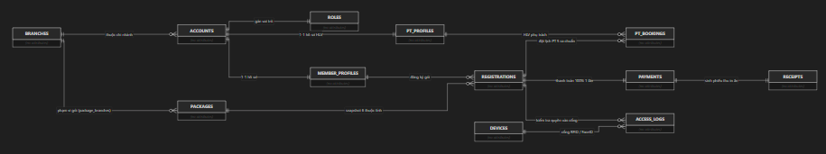
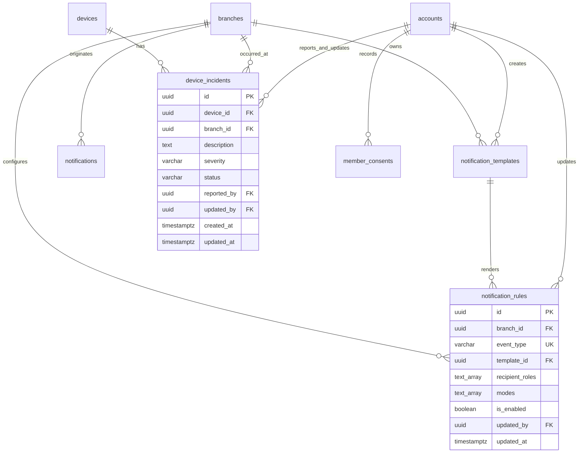

# Thiết Kế Mô Hình Thực Thể Cơ Sở Dữ Liệu (ERD) — Paradise Gym

Hệ thống quản lý và vận hành chuỗi phòng gym **Paradise Gym** phục vụ 4 nhóm tác nhân chính: **Quản trị viên (QTV)** trên Web, **Lễ tân (LT)** trên Web, **Huấn luyện viên (PT)** trên Mobile, **Hội viên (HV)** trên Mobile, cùng thiết bị nhận diện và màn hình công cộng **Kiosk K01**.

Tài liệu này đặc tả toàn diện mô hình dữ liệu quan hệ (Relational Database Design), ánh xạ 100% các trường dữ liệu và ràng buộc nghiệp vụ từ Product Spec, Epics và User Stories của toàn bộ hệ thống.

---

## 1. Nguyên Tắc Thiết Kế Cốt Lõi

1. **Chuẩn hóa dữ liệu (3NF) kết hợp Snapshot bất biến:**
   - Các thực thể vận hành tuân thủ dạng chuẩn 3NF để loại bỏ trùng lặp và bất nhất dữ liệu.
   - Đối với các nghiệp vụ tài chính và đăng ký gói tập, áp dụng cơ chế **Snapshot đóng băng thông số bán**: Khi phát sinh giao dịch mua gói (`registrations`), toàn bộ thông số tại thời điểm bán (tên gói, đơn giá, thời hạn ngày, số buổi Gym/PT, danh sách chi nhánh được phép sử dụng) được snapshot nguyên vẹn vào bản ghi hợp đồng. Việc thay đổi giá niêm yết hay cấu hình danh mục gói (`packages`) sau đó tuyệt đối không làm ảnh hưởng đến các gói đã bán.
2. **Tách bạch 4 thực thể định danh:**
   - `accounts`: Tài khoản truy cập và xác thực (Credentials, Role, Trạng thái truy cập).
   - `member_profiles`: Hồ sơ khách hàng / hội viên (Thông tin nhân thân, SĐT định danh).
   - `registrations`: Hợp đồng quyền lợi gói tập của hội viên (Thời hạn, số buổi, trạng thái thanh toán).
   - `access_logs`: Nhật ký kiểm soát cửa ra vào vật lý tại chi nhánh.
3. **Thanh toán 100% 1 lần duy nhất:**
   - Không thiết kế các bảng công nợ, nợ tồn, trả góp hay lịch sử đóng tiền nhiều đợt.
   - Giá trị thanh toán (`payments.amount`) luôn khớp đúng 100% giá trị gói đăng ký. Bản ghi `payments` khi đã thành công (`COMPLETED`) và `receipts` sinh ra là chứng từ tài chính bất biến.
4. **Chuẩn hóa 3 trạng thái tài khoản:**
   - Hệ thống chỉ duy trì đúng 3 trạng thái tài khoản: `ACTIVE` (Đang hoạt động), `PENDING_ACTIVATION` (Chờ kích hoạt lần đầu qua OTP), `LOCKED` (Đã khóa / Ngừng sử dụng).
5. **Cơ chế xác nhận kép (2-way confirmation) cho buổi tập PT:**
   - Buổi tập `pt_bookings` chỉ chuyển sang `COMPLETED` và khấu trừ 1 buổi khi cả PT (`pt_confirmed_at`) và Hội viên (`member_confirmed_at`) cùng xác nhận.
6. **Tuân thủ bảo vệ dữ liệu cá nhân & Consent sinh trắc học:**
   - Dữ liệu nhận diện khuôn mặt được quản lý riêng biệt tại `biometric_face_data` và `member_consents`. Lưu trữ dạng vector hash mã hóa, không lưu trữ ảnh thô nhạy cảm; hỗ trợ thu hồi và xóa dữ liệu an toàn.

---

## 2. Sơ Đồ Thực Thể Quan Hệ (ERD)

### 2.1. Sơ Đồ Luồng Quan Hệ Dữ Liệu Cốt Lõi (Visual Core Flow)



#### Thuyết minh các trục liên kết dữ liệu nghiệp vụ chính:

1. **Trục Tổ chức & Chi nhánh (`BRANCHES`):**
   - Là thực thể phạm vi nền tảng (Branch Scoping) của toàn bộ hệ thống.
   - `BRANCHES` quản lý và gán phạm vi cho `ACCOUNTS` nhân sự/hội viên, cấu hình danh mục `PACKAGES` được phép kinh doanh tại từng chi nhánh, quản lý các thiết bị kiểm soát `DEVICES` (cổng Kiosk/Turnstile) và ghi nhận toàn bộ nhật ký ra vào `ACCESS_LOGS`.

2. **Trục Định danh & Phân quyền (`ACCOUNTS` ➔ `ROLES`):**
   - `ACCOUNTS` là thực thể xác thực duy nhất (qua SĐT định danh và mật khẩu / mã OTP).
   - Một tài khoản được gán vai trò (`ROLES`) cụ thể (Admin, QTV Chi nhánh, Lễ tân, Huấn luyện viên, Hội viên) kèm phạm vi hoạt động (`account_branch_scopes`).
   - `ACCOUNTS` liên kết quan hệ 1-1 chặt chẽ với `MEMBER_PROFILES` (hồ sơ hội viên) hoặc `PT_PROFILES` (hồ sơ huấn luyện viên cá nhân).

3. **Trục Gói tập & Hợp đồng Hội viên (`PACKAGES` ➔ `REGISTRATIONS`):**
   - `PACKAGES` đóng vai trò là danh mục sản phẩm dịch vụ niêm yết.
   - Khi hội viên mua gói, hệ thống sinh ra bản ghi hợp đồng `REGISTRATIONS`. Toàn bộ 6 thuộc tính quan trọng tại thời điểm mua (Tên gói, Đơn giá, Thời hạn ngày, Số buổi Gym, Số buổi PT, Danh sách chi nhánh áp dụng) được **snapshot đóng băng bất biến** vào `REGISTRATIONS`.

4. **Trục Tài chính & Thu tiền 100% (`REGISTRATIONS` ➔ `PAYMENTS` ➔ `RECEIPTS`):**
   - Quy tắc tài chính cốt lõi: Thanh toán 100% 1 lần duy nhất để kích hoạt gói (`PENDING_PAYMENT` ➔ `ACTIVE`).
   - Mỗi giao dịch thanh toán thành công trong `PAYMENTS` (tiền mặt hoặc chuyển khoản VietQR) tự động sinh ra chứng từ `RECEIPTS` (phiếu thu in ấn chuẩn A5/A4) không thể sửa xóa.

5. **Trục Huấn luyện viên & Đặt lịch PT (`REGISTRATIONS` + `PT_PROFILES` ➔ `PT_BOOKINGS`):**
   - Gói tập có quyền lợi PT cho phép hội viên đặt lịch tập với huấn luyện viên theo 5 ca chuẩn trong ngày (08:00–18:00).
   - Buổi tập chỉ được chuyển trạng thái `COMPLETED` và khấu trừ 1 buổi tập khả dụng trong `REGISTRATIONS` khi đạt cơ chế **xác nhận kép (2-way confirmation)** từ cả PT và Hội viên.

6. **Trục Kiểm soát ra vào tự động (`DEVICES` + `REGISTRATIONS` ➔ `ACCESS_LOGS`):**
   - Thiết bị nhận diện tại cổng (`DEVICES` - Kiosk K01 RFID/FaceID) đối soát quyền ra vào thông qua thời hạn và trạng thái hiệu lực của `REGISTRATIONS`.
   - Kết quả kiểm tra (Hợp lệ, Hết hạn, Trái chi nhánh, Chưa kích hoạt) được ghi nhận thời gian thực vào bảng `ACCESS_LOGS`.

---

### 2.2. Sơ Đồ Chi Tiết Thực Thể Quan Hệ (Mermaid ERD)

```mermaid
erDiagram
    branches ||--o{ accounts : "manages_or_belongs"
    branches ||--o{ account_branch_scopes : "scoped_in"
    branches ||--o{ member_profiles : "receives"
    branches ||--o{ pt_profiles : "works_at"
    branches ||--o{ package_branches : "offers"
    branches ||--o{ registrations : "sold_at"
    branches ||--o{ registration_allowed_branches : "allowed_in"
    branches ||--o{ pt_bookings : "takes_place_at"
    branches ||--o{ payments : "collected_at"
    branches ||--o{ devices : "installed_at"
    branches ||--o{ access_logs : "occurs_at"
    branches ||--o{ audit_logs : "scoped_to"

    accounts ||--o{ account_roles : "has"
    accounts ||--o{ account_sessions : "has_session"
    roles ||--o{ account_roles : "assigned_to"
    accounts ||--o{ account_branch_scopes : "assigned_scope"
    accounts ||--o| member_profiles : "links_to_member"
    accounts ||--o| pt_profiles : "links_to_pt"
    accounts ||--o{ notifications : "receives"
    accounts ||--o{ audit_logs : "performs_action"

    member_profiles ||--o{ registrations : "owns"
    packages ||--o{ package_branches : "available_at"
    packages ||--o{ registrations : "instantiates"

    registrations ||--o{ registration_allowed_branches : "snapshots_allowed_branches"
    registrations ||--o| registrations : "renews_previous"
    registrations ||--o{ pt_assignment_requests : "requests_assignment"
    registrations ||--o{ pt_bookings : "deducts_sessions_from"
    registrations ||--o{ payments : "paid_by"
    registrations ||--o{ access_logs : "grants_access_for"

    pt_profiles ||--o{ pt_assignment_requests : "receives_request"
    pt_profiles ||--o{ pt_bookings : "conducts_session"
    member_profiles ||--o{ pt_assignment_requests : "sends_request"
    member_profiles ||--o{ pt_bookings : "books_session"

    payments ||--|| receipts : "generates_receipt"
    member_profiles ||--o{ payments : "makes_payment"

    devices ||--o{ access_logs : "records_entry"
    member_profiles ||--o{ access_logs : "checks_in"

    member_profiles ||--o{ member_consents : "grants_consents"
    member_profiles ||--o| biometric_face_data : "has_biometric"

    notification_templates ||--o{ notifications : "templated_by"

    branches {
        uuid id PK
        varchar branch_code UK
        varchar branch_name
        varchar phone
        varchar address
        varchar status
        time open_time
        time close_time
        varchar timezone
        timestamptz created_at
        timestamptz updated_at
    }

    accounts {
        uuid id PK
        varchar login_phone UK
        varchar password_hash
        varchar status
        varchar avatar_url
        boolean notify_in_app
        boolean notify_pt_reminders
        boolean notify_new_bookings
        boolean notify_result_reminders
        boolean is_two_factor_enabled
        int failed_login_attempts
        timestamptz locked_until
        timestamptz last_login_at
        timestamptz created_at
        timestamptz updated_at
    }

    roles {
        uuid id PK
        varchar role_code UK
        varchar role_name
        varchar description
    }

    account_roles {
        uuid account_id PK,FK
        uuid role_id PK,FK
        timestamptz created_at
    }

    account_branch_scopes {
        uuid account_id PK,FK
        uuid branch_id PK,FK
        boolean is_all_branches
        timestamptz created_at
    }

    account_sessions {
        uuid id PK
        uuid account_id FK
        varchar device_name
        varchar user_agent
        varchar ip_address
        timestamptz last_active_at
        boolean is_revoked
        timestamptz expires_at
        timestamptz created_at
    }

    member_profiles {
        uuid id PK
        uuid account_id FK
        uuid home_branch_id FK
        varchar member_code UK
        varchar full_name
        varchar phone UK
        varchar email
        date date_of_birth
        varchar gender
        varchar avatar_url
        varchar status
        uuid created_by FK
        timestamptz created_at
        timestamptz updated_at
    }

    pt_profiles {
        uuid id PK
        uuid account_id FK
        uuid branch_id FK
        varchar pt_code UK
        varchar full_name
        varchar phone UK
        varchar email
        varchar gender
        text bio
        text specialties
        boolean show_phone_to_members
        varchar status
        time work_start_time
        time work_end_time
        varchar work_days
        timestamptz created_at
        timestamptz updated_at
    }

    packages {
        uuid id PK
        varchar package_code UK
        varchar package_name
        varchar package_type
        decimal price
        int duration_days
        int total_gym_sessions
        int total_pt_sessions
        varchar status
        text description
        timestamptz created_at
        timestamptz updated_at
    }

    package_branches {
        uuid package_id PK,FK
        uuid branch_id PK,FK
    }

    registrations {
        uuid id PK
        varchar reg_code UK
        uuid member_id FK
        uuid package_id FK
        uuid assigned_pt_id FK
        uuid sold_branch_id FK
        uuid previous_registration_id FK
        varchar package_name_snapshot
        varchar package_type_snapshot
        decimal price_snapshot
        int duration_days_snapshot
        int total_gym_sessions_snapshot
        int total_pt_sessions_snapshot
        date start_date
        date end_date
        int remaining_gym_sessions
        int remaining_pt_sessions
        int booked_pt_sessions
        int used_pt_sessions
        varchar status
        uuid created_by FK
        timestamptz created_at
        timestamptz updated_at
    }

    registration_allowed_branches {
        uuid registration_id PK,FK
        uuid branch_id PK,FK
    }

    pt_assignment_requests {
        uuid id PK
        uuid registration_id FK
        uuid member_id FK
        uuid pt_id FK
        varchar status
        text request_note
        text response_note
        timestamptz requested_at
        timestamptz responded_at
    }

    pt_bookings {
        uuid id PK
        uuid registration_id FK
        uuid member_id FK
        uuid pt_id FK
        uuid branch_id FK
        int session_number
        date booking_date
        time start_time
        time end_time
        varchar status
        text workout_notes
        text fitness_assessment
        varchar cancelled_by
        text cancel_reason
        timestamptz cancelled_at
        timestamptz pt_confirmed_at
        timestamptz member_confirmed_at
        boolean is_deducted
        uuid created_by FK
        timestamptz created_at
        timestamptz updated_at
    }

    payments {
        uuid id PK
        uuid registration_id FK
        uuid member_id FK
        uuid branch_id FK
        varchar payment_code UK
        varchar payment_method
        decimal amount
        varchar status
        varchar transaction_ref
        uuid collected_by FK
        timestamptz confirmed_at
        timestamptz created_at
        timestamptz updated_at
    }

    receipts {
        uuid id PK
        uuid payment_id UK,FK
        varchar receipt_code UK
        decimal amount
        varchar payer_name
        varchar payer_phone
        uuid issued_by FK
        timestamptz issued_at
        text note
    }

    devices {
        uuid id PK
        uuid branch_id FK
        varchar device_code UK
        varchar device_name
        varchar device_type
        varchar direction
        varchar status
        varchar ip_address
        varchar location_description
        timestamptz last_synced_at
        timestamptz created_at
        timestamptz updated_at
    }

    access_logs {
        uuid id PK
        uuid member_id FK
        uuid registration_id FK
        uuid device_id FK
        uuid branch_id FK
        varchar direction
        varchar access_method
        varchar status
        varchar denial_reason
        boolean is_duplicate_warning
        boolean is_gym_session_deducted
        uuid manual_recorded_by FK
        text manual_reason
        timestamptz check_in_time
    }

    member_consents {
        uuid id PK
        uuid member_id FK
        varchar consent_type
        boolean is_granted
        timestamptz granted_at
        timestamptz revoked_at
        timestamptz created_at
        timestamptz updated_at
    }

    biometric_face_data {
        uuid id PK
        uuid member_id UK,FK
        varchar face_template_hash
        varchar status
        uuid enrolled_by FK
        timestamptz enrolled_at
        timestamptz delete_scheduled_at
    }

    notification_templates {
        uuid id PK
        varchar template_code UK
        varchar event_type
        varchar target_role
        varchar title_template
        text body_template
        boolean is_active
        timestamptz created_at
        timestamptz updated_at
    }

    notifications {
        uuid id PK
        uuid account_id FK
        uuid template_id FK
        varchar title
        text body
        varchar reference_type
        uuid reference_id
        boolean is_read
        timestamptz read_at
        timestamptz created_at
    }

    audit_logs {
        uuid id PK
        uuid actor_account_id FK
        uuid branch_id FK
        varchar action_name
        varchar target_table
        uuid target_id
        jsonb old_values
        jsonb new_values
        text reason
        varchar ip_address
        timestamptz created_at
    }
```



---

## 3. Từ Điển Dữ Liệu Chi Tiết (Data Dictionary)

---

### Phân Hệ 1: Tổ Chức & Chi Nhánh

#### Bảng: `branches`
- **Mục đích:** Quản lý danh mục các chi nhánh phòng tập trong toàn hệ thống.
- **Ràng buộc nghiệp vụ:** `branch_code` là mã định danh duy nhất (ví dụ: `CN-Q01`), khóa chỉ đọc (`READONLY`) khi chỉnh sửa tại W11. Khi chi nhánh có trạng thái `INACTIVE`, hệ thống dừng bán gói mới và dừng nhận lịch PT mới tại chi nhánh này.

| Tên trường | Kiểu dữ liệu | Ràng buộc | Giá trị mặc định | Mô tả & Nguồn nghiệp vụ |
| :--- | :--- | :--- | :--- | :--- |
| `id` | `UUID` | `PK, NOT NULL` | `gen_random_uuid()` | Định danh duy nhất của chi nhánh |
| `branch_code` | `VARCHAR(30)` | `UNIQUE, NOT NULL` | | Mã chi nhánh (ví dụ: `CN-Q01`, `CN-BT01`), không được sửa |
| `branch_name` | `VARCHAR(150)` | `NOT NULL` | | Tên chi nhánh (ví dụ: `Paradise Gym Quận 1`) |
| `phone` | `VARCHAR(20)` | `NOT NULL` | | Số điện thoại hotline của chi nhánh |
| `address` | `VARCHAR(255)` | `NOT NULL` | | Địa chỉ thực tế của chi nhánh |
| `status` | `VARCHAR(20)` | `NOT NULL` | `'ACTIVE'` | Trạng thái chi nhánh: `ACTIVE`, `INACTIVE` |
| `open_time` | `TIME` | `NOT NULL` | `'06:00:00'` | Giờ mở cửa phòng gym hàng ngày |
| `close_time` | `TIME` | `NOT NULL` | `'22:00:00'` | Giờ đóng cửa phòng gym hàng ngày |
| `timezone` | `VARCHAR(50)` | `NOT NULL` | `'Asia/Ho_Chi_Minh'` | Múi giờ chuẩn của chi nhánh |
| `created_at` | `TIMESTAMPTZ` | `NOT NULL` | `NOW()` | Thời điểm tạo bản ghi |
| `updated_at` | `TIMESTAMPTZ` | `NOT NULL` | `NOW()` | Thời điểm cập nhật cuối cùng |

---

### Phân Hệ 2: Tài Khoản & Phân Quyền Truy Cập

#### Bảng: `accounts`
- **Mục đích:** Lưu trữ thông tin định danh xác thực đăng nhập của người dùng toàn hệ thống (Web và Mobile).
- **Ràng buộc nghiệp vụ:** `login_phone` là duy nhất trên toàn hệ thống. Chuẩn hóa đúng 3 trạng thái tài khoản: `ACTIVE`, `PENDING_ACTIVATION`, `LOCKED`. Khi tạo hồ sơ tại quầy (HV/PT), hệ thống tự tạo bản ghi `accounts` liên kết theo SĐT ở trạng thái `PENDING_ACTIVATION`; người dùng tải app Mobile kích hoạt OTP và đặt mật khẩu lần đầu mới chuyển sang `ACTIVE`.

| Tên trường | Kiểu dữ liệu | Ràng buộc | Giá trị mặc định | Mô tả & Nguồn nghiệp vụ |
| :--- | :--- | :--- | :--- | :--- |
| `id` | `UUID` | `PK, NOT NULL` | `gen_random_uuid()` | Khóa chính tài khoản đăng nhập |
| `login_phone` | `VARCHAR(20)` | `UNIQUE, NOT NULL` | | Số điện thoại đăng nhập (đã chuẩn hóa E.164 hoặc số nội địa) |
| `password_hash` | `VARCHAR(255)` | `NULL` | | Mật khẩu băm (NULL khi còn ở trạng thái `PENDING_ACTIVATION`) |
| `status` | `VARCHAR(20)` | `NOT NULL` | `'PENDING_ACTIVATION'` | Trạng thái: `ACTIVE`, `PENDING_ACTIVATION`, `LOCKED` |
| `avatar_url` | `VARCHAR(500)` | `NULL` | | Đường dẫn ảnh đại diện tài khoản |
| `notify_in_app` | `BOOLEAN` | `NOT NULL` | `TRUE` | Hội viên nhận thông báo in-app; chỉ lọc bớt sự kiện đã được QTV bật, không tự tạo quyền gửi |
| `notify_pt_reminders` | `BOOLEAN` | `NOT NULL` | `TRUE` | Hội viên nhận nhắc lịch PT (`BOOKING_REMINDER`); còn phụ thuộc `notify_in_app` và quy tắc W09 |
| `notify_new_bookings` | `BOOLEAN` | `NOT NULL` | `TRUE` | PT nhận thông báo đặt/hủy lịch (`BOOKING_CREATED`, `BOOKING_CANCELLED`) |
| `notify_result_reminders` | `BOOLEAN` | `NOT NULL` | `TRUE` | PT nhận yêu cầu nhắc ghi/xác nhận kết quả (`PT_SESSION_AWAITING_CONFIRMATION`) |
| `is_two_factor_enabled` | `BOOLEAN` | `NOT NULL` | `FALSE` | Trường đã có từ migration001, không thêm bản sao; server yêu cầu OTP bổ sung cho đăng nhập mật khẩu khi bật |
| `failed_login_attempts` | `INT` | `NOT NULL` | `0` | Trường đã có từ migration001; bộ đếm sai credential do server quản lý |
| `locked_until` | `TIMESTAMPTZ` | `NULL` | | Trường đã có từ migration001; khóa thử credential 15 phút sau 5 lần sai |
| `last_login_at` | `TIMESTAMPTZ` | `NULL` | | Thời điểm đăng nhập thành công lần cuối |
| `created_at` | `TIMESTAMPTZ` | `NOT NULL` | `NOW()` | Thời điểm tạo tài khoản |
| `updated_at` | `TIMESTAMPTZ` | `NOT NULL` | `NOW()` | Thời điểm cập nhật cuối cùng |

#### Bảng: `roles`
- **Mục đích:** Danh mục các vai trò chuẩn hóa trong hệ thống.

| Tên trường | Kiểu dữ liệu | Ràng buộc | Giá trị mặc định | Mô tả & Nguồn nghiệp vụ |
| :--- | :--- | :--- | :--- | :--- |
| `id` | `UUID` | `PK, NOT NULL` | `gen_random_uuid()` | Khóa chính vai trò |
| `role_code` | `VARCHAR(30)` | `UNIQUE, NOT NULL` | | Mã vai trò: `QTV`, `RECEPTIONIST`, `PT`, `MEMBER` |
| `role_name` | `VARCHAR(100)` | `NOT NULL` | | Tên hiển thị: Quản trị viên, Lễ tân, Huấn luyện viên, Hội viên |
| `description` | `VARCHAR(255)` | `NULL` | | Mô tả phạm vi trách nhiệm vai trò |

#### Bảng: `account_roles`
- **Mục đích:** Bảng nối đa-đa (M-N) gán một hoặc nhiều vai trò cho một tài khoản.
- **Khóa chính:** Composite PK `(account_id, role_id)`.

| Tên trường | Kiểu dữ liệu | Ràng buộc | Giá trị mặc định | Mô tả & Nguồn nghiệp vụ |
| :--- | :--- | :--- | :--- | :--- |
| `account_id` | `UUID` | `PK, FK, NOT NULL` | | Tham chiếu `accounts(id)` (`ON DELETE CASCADE`) |
| `role_id` | `UUID` | `PK, FK, NOT NULL` | | Tham chiếu `roles(id)` (`ON DELETE RESTRICT`) |
| `created_at` | `TIMESTAMPTZ` | `NOT NULL` | `NOW()` | Thời điểm gán vai trò |

#### Bảng: `account_branch_scopes`
- **Mục đích:** Phân quyền phạm vi chi nhánh thao tác cho các vai trò nhân sự (QTV, Lễ tân, PT).
- **Khóa chính:** Composite PK `(account_id, branch_id)`.

| Tên trường | Kiểu dữ liệu | Ràng buộc | Giá trị mặc định | Mô tả & Nguồn nghiệp vụ |
| :--- | :--- | :--- | :--- | :--- |
| `account_id` | `UUID` | `PK, FK, NOT NULL` | | Tham chiếu `accounts(id)` (`ON DELETE CASCADE`) |
| `branch_id` | `UUID` | `PK, FK, NOT NULL` | | Tham chiếu `branches(id)` (`ON DELETE CASCADE`) |
| `is_all_branches` | `BOOLEAN` | `NOT NULL` | `FALSE` | Cờ quyền toàn chuỗi (chỉ dành cho QTV cấp cao) |
| `created_at` | `TIMESTAMPTZ` | `NOT NULL` | `NOW()` | Thời điểm cấp quyền chi nhánh |

#### Bảng: `account_sessions`
- **Mục đích:** Quản lý danh sách các phiên đăng nhập và thiết bị của tài khoản (Device Registry & Session Tracking), hỗ trợ người dùng theo dõi thiết bị đang hoạt động, đăng xuất phiên hiện tại hoặc đăng xuất toàn bộ thiết bị từ xa.
- **Ràng buộc nghiệp vụ:** Mỗi lần đăng nhập thành công sinh ra một bản ghi phiên với `session_id`. Khi đăng xuất thiết bị hoặc đổi mật khẩu, `is_revoked` được chuyển thành `TRUE` hoặc tăng `session_version` để thu hồi phiên ngay lập tức.

| Tên trường | Kiểu dữ liệu | Ràng buộc | Giá trị mặc định | Mô tả & Nguồn nghiệp vụ |
| :--- | :--- | :--- | :--- | :--- |
| `id` | `UUID` | `PK, NOT NULL` | `gen_random_uuid()` | Khóa chính phiên thiết bị (`session_id`) |
| `account_id` | `UUID` | `FK, NOT NULL` | | Tham chiếu `accounts(id)` (`ON DELETE CASCADE`) |
| `device_name` | `VARCHAR(150)` | `NULL` | | Tên thiết bị đăng nhập (ví dụ: Apple iPhone, Máy tính Windows) |
| `user_agent` | `VARCHAR(500)` | `NULL` | | Chuỗi User-Agent của trình duyệt/ứng dụng |
| `ip_address` | `VARCHAR(50)` | `NULL` | | Địa chỉ IP đăng nhập của người dùng |
| `last_active_at` | `TIMESTAMPTZ` | `NOT NULL` | `NOW()` | Thời điểm hoạt động gần nhất của phiên |
| `is_revoked` | `BOOLEAN` | `NOT NULL` | `FALSE` | Trạng thái thu hồi phiên (TRUE = phiên đã bị đăng xuất/hủy) |
| `expires_at` | `TIMESTAMPTZ` | `NOT NULL` | `NOW() + interval '30 days'` | Thời điểm hết hạn phiên |
| `created_at` | `TIMESTAMPTZ` | `NOT NULL` | `NOW()` | Thời điểm khởi tạo phiên đăng nhập |

---

### Phân Hệ 3: Hồ Sơ Khách Hàng & Nhân Sự

#### Bảng: `member_profiles`
- **Mục đích:** Lưu trữ hồ sơ hội viên và khách hàng. Tách biệt hoàn toàn với tài khoản đăng nhập `accounts`.
- **Ràng buộc nghiệp vụ:** `phone` là khóa nghiệp vụ chính, bắt buộc UNIQUE trên toàn hệ thống và kiểm tra trùng lặp thời gian thực (real-time). Nếu trùng lập tức chặn lưu. Trạng thái hồ sơ gồm: `ACTIVE`, `INACTIVE`, `ARCHIVED`.

| Tên trường | Kiểu dữ liệu | Ràng buộc | Giá trị mặc định | Mô tả & Nguồn nghiệp vụ |
| :--- | :--- | :--- | :--- | :--- |
| `id` | `UUID` | `PK, NOT NULL` | `gen_random_uuid()` | Khóa chính hồ sơ hội viên |
| `account_id` | `UUID` | `FK, NULL` | | Liên kết 1-1 với `accounts(id)` khi đã kích hoạt (`ON DELETE SET NULL`) |
| `home_branch_id` | `UUID` | `FK, NOT NULL` | | Chi nhánh tiếp nhận hồ sơ ban đầu (`branches(id)`) |
| `member_code` | `VARCHAR(30)` | `UNIQUE, NOT NULL` | | Mã hội viên tự sinh (ví dụ: `HV001`, `HV002`) |
| `full_name` | `VARCHAR(150)` | `NOT NULL` | | Họ và tên hội viên |
| `phone` | `VARCHAR(20)` | `UNIQUE, NOT NULL` | | Số điện thoại duy nhất, chuẩn hóa (Khóa nghiệp vụ) |
| `email` | `VARCHAR(150)` | `NULL` | | Thư điện tử (tùy chọn) |
| `date_of_birth` | `DATE` | `NULL` | | Ngày tháng năm sinh (tùy chọn) |
| `gender` | `VARCHAR(10)` | `NULL` | | Giới tính: `NAM`, `NU`, `KHAC` |
| `avatar_url` | `VARCHAR(500)` | `NULL` | | Ảnh đại diện hồ sơ (khác với ảnh sinh trắc nhận diện) |
| `status` | `VARCHAR(20)` | `NOT NULL` | `'ACTIVE'` | Trạng thái: `ACTIVE`, `INACTIVE`, `ARCHIVED` |
| `created_by` | `UUID` | `FK, NULL` | | Tài khoản nhân viên tạo hồ sơ (`accounts(id)`) |
| `created_at` | `TIMESTAMPTZ` | `NOT NULL` | `NOW()` | Thời điểm tiếp nhận hồ sơ |
| `updated_at` | `TIMESTAMPTZ` | `NOT NULL` | `NOW()` | Thời điểm cập nhật hồ sơ |

#### Bảng: `pt_profiles`
- **Mục đích:** Lưu trữ hồ sơ của huấn luyện viên cá nhân (Personal Trainer).
- **Ràng buộc nghiệp vụ:** PT làm việc theo khung giờ cố định (`08:00 - 18:00`, Thứ 2 đến Thứ 6), không tự cấu hình availability. `phone` và `pt_code` là duy nhất.

| Tên trường | Kiểu dữ liệu | Ràng buộc | Giá trị mặc định | Mô tả & Nguồn nghiệp vụ |
| :--- | :--- | :--- | :--- | :--- |
| `id` | `UUID` | `PK, NOT NULL` | `gen_random_uuid()` | Khóa chính hồ sơ PT |
| `account_id` | `UUID` | `FK, NULL` | | Liên kết 1-1 với `accounts(id)` (`ON DELETE SET NULL`) |
| `branch_id` | `UUID` | `FK, NOT NULL` | | Chi nhánh làm việc chính (`branches(id)`) |
| `pt_code` | `VARCHAR(30)` | `UNIQUE, NOT NULL` | | Mã định danh HLV (ví dụ: `PT001`, `PT002`) |
| `full_name` | `VARCHAR(150)` | `NOT NULL` | | Họ tên huấn luyện viên |
| `phone` | `VARCHAR(20)` | `UNIQUE, NOT NULL` | | Số điện thoại duy nhất |
| `email` | `VARCHAR(150)` | `NULL` | | Email liên hệ của PT |
| `gender` | `VARCHAR(10)` | `NULL` | | Giới tính PT |
| `bio` | `TEXT` | `NULL` | | Giới thiệu kinh nghiệm, thế mạnh huấn luyện |
| `specialties` | `TEXT` | `NULL` | | Chuyên môn (ví dụ: Giảm cân, Tăng cơ, Boxing, Phục hồi) |
| `show_phone_to_members` | `BOOLEAN` | `NOT NULL` | `FALSE` | Cho phép hội viên thực sự được phân công PT này xem SĐT liên hệ; PT tự chỉnh cài đặt. Không ảnh hưởng QTV/LT có quyền xem hồ sơ hoặc chính PT |
| `status` | `VARCHAR(20)` | `NOT NULL` | `'ACTIVE'` | Trạng thái: `ACTIVE`, `INACTIVE` |
| `work_start_time` | `TIME` | `NOT NULL` | `'08:00:00'` | Giờ bắt đầu ca làm việc chuẩn cố định |
| `work_end_time` | `TIME` | `NOT NULL` | `'18:00:00'` | Giờ kết thúc ca làm việc chuẩn cố định |
| `work_days` | `VARCHAR(50)` | `NOT NULL` | `'MON_TO_FRI'` | Ngày làm việc cố định trong tuần (Thứ 2 - Thứ 6) |
| `created_at` | `TIMESTAMPTZ` | `NOT NULL` | `NOW()` | Thời điểm tạo hồ sơ PT |
| `updated_at` | `TIMESTAMPTZ` | `NOT NULL` | `NOW()` | Thời điểm cập nhật hồ sơ PT |

---

### Phân Hệ 4: Danh Mục Gói Tập & Hợp Đồng Đăng Ký

#### Bảng: `packages`
- **Mục đích:** Danh mục các gói tập do phòng gym ban hành (W03).
- **Ràng buộc nghiệp vụ:** Gồm đúng 4 loại gói chuẩn: `GYM_TIME` (Gym theo thời gian), `GYM_SESSION` (Gym theo buổi), `PT_SESSION` (PT kèm theo buổi), `COMBO` (Combo Gym + PT). Khi đổi giá hoặc ngừng bán (`INACTIVE`), chỉ ảnh hưởng các lần đăng ký mới.

| Tên trường | Kiểu dữ liệu | Ràng buộc | Giá trị mặc định | Mô tả & Nguồn nghiệp vụ |
| :--- | :--- | :--- | :--- | :--- |
| `id` | `UUID` | `PK, NOT NULL` | `gen_random_uuid()` | Khóa chính gói tập |
| `package_code` | `VARCHAR(30)` | `UNIQUE, NOT NULL` | | Mã gói tập (ví dụ: `GYM-1M`, `PT-10S`, `COMBO-VIP`) |
| `package_name` | `VARCHAR(150)` | `NOT NULL` | | Tên gói tập niêm yết |
| `package_type` | `VARCHAR(30)` | `NOT NULL` | | Phân loại: `GYM_TIME`, `GYM_SESSION`, `PT_SESSION`, `COMBO` |
| `price` | `DECIMAL(12,2)` | `NOT NULL` | | Giá niêm yết của gói tập (VND) |
| `duration_days` | `INT` | `NOT NULL` | | Số ngày hiệu lực sử dụng tối đa của gói |
| `total_gym_sessions` | `INT` | `NULL` | | Số buổi tập Gym (dành cho `GYM_SESSION` hoặc `COMBO`) |
| `total_pt_sessions` | `INT` | `NULL` | | Số buổi tập PT (dành cho `PT_SESSION` hoặc `COMBO`) |
| `status` | `VARCHAR(20)` | `NOT NULL` | `'ACTIVE'` | Trạng thái: `ACTIVE` (đang bán), `INACTIVE` (ngừng bán) |
| `description` | `TEXT` | `NULL` | | Mô tả chi tiết quyền lợi và quy định gói |
| `created_at` | `TIMESTAMPTZ` | `NOT NULL` | `NOW()` | Thời điểm tạo gói |
| `updated_at` | `TIMESTAMPTZ` | `NOT NULL` | `NOW()` | Thời điểm cập nhật gói |

#### Bảng: `package_branches`
- **Mục đích:** Bảng nối đa-đa quy định gói tập trong danh mục được phép bán/tập tại những chi nhánh nào.
- **Khóa chính:** Composite PK `(package_id, branch_id)`.

| Tên trường | Kiểu dữ liệu | Ràng buộc | Giá trị mặc định | Mô tả & Nguồn nghiệp vụ |
| :--- | :--- | :--- | :--- | :--- |
| `package_id` | `UUID` | `PK, FK, NOT NULL` | | Tham chiếu `packages(id)` (`ON DELETE CASCADE`) |
| `branch_id` | `UUID` | `PK, FK, NOT NULL` | | Tham chiếu `branches(id)` (`ON DELETE CASCADE`) |

#### Bảng: `registrations`
- **Mục đích:** Bản ghi hợp đồng đăng ký gói tập cụ thể của hội viên.
- **Ràng buộc nghiệp vụ:**
  - Áp dụng **Snapshot đóng băng thông số bán**: `package_name_snapshot`, `package_type_snapshot`, `price_snapshot`, `duration_days_snapshot`, `total_gym_sessions_snapshot`, `total_pt_sessions_snapshot`.
  - Khi tạo gói PT/Combo, `assigned_pt_id` ban đầu **để trống (NULL)**; PT chỉ được gán sau khi Hội viên gửi request và PT `ACCEPT`.
  - Gia hạn gói: `previous_registration_id` liên kết với đăng ký trước để nối tiếp ngày kết thúc.
  - Trạng thái đăng ký: `PENDING_PAYMENT` (Chờ thanh toán 100%), `SCHEDULED` (Đã thanh toán, chờ đến ngày bắt đầu), `ACTIVE` (Đang có hiệu lực tập), `EXPIRED` (Đã hết hạn), `CANCELLED` (Đã hủy).

| Tên trường | Kiểu dữ liệu | Ràng buộc | Giá trị mặc định | Mô tả & Nguồn nghiệp vụ |
| :--- | :--- | :--- | :--- | :--- |
| `id` | `UUID` | `PK, NOT NULL` | `gen_random_uuid()` | Khóa chính lượt đăng ký gói |
| `reg_code` | `VARCHAR(30)` | `UNIQUE, NULL` | | Mã đăng ký tự sinh (ví dụ: `DK001`, `DK002`, `DK003`) |
| `member_id` | `UUID` | `FK, NOT NULL` | | Tham chiếu `member_profiles(id)` (`ON DELETE RESTRICT`) |
| `package_id` | `UUID` | `FK, NOT NULL` | | Tham chiếu danh mục `packages(id)` (`ON DELETE RESTRICT`) |
| `assigned_pt_id` | `UUID` | `FK, NULL` | | PT phụ trách chính thức (`pt_profiles(id)`), ban đầu NULL |
| `sold_branch_id` | `UUID` | `FK, NOT NULL` | | Chi nhánh thực hiện tạo và bán gói (`branches(id)`) |
| `previous_registration_id` | `UUID` | `FK, NULL` | | Tham chiếu gói cũ khi gia hạn nối tiếp (`registrations(id)`) |
| `package_name_snapshot` | `VARCHAR(150)` | `NOT NULL` | | Snapshot tên gói tại thời điểm mua |
| `package_type_snapshot` | `VARCHAR(30)` | `NOT NULL` | | Snapshot loại gói (`GYM_TIME`, `GYM_SESSION`, `PT_SESSION`, `COMBO`) |
| `price_snapshot` | `DECIMAL(12,2)` | `NOT NULL` | | Snapshot giá gói phải thanh toán 100% |
| `duration_days_snapshot` | `INT` | `NOT NULL` | | Snapshot số ngày hiệu lực |
| `total_gym_sessions_snapshot` | `INT` | `NULL` | | Snapshot tổng số buổi Gym ban đầu |
| `total_pt_sessions_snapshot` | `INT` | `NULL` | | Snapshot tổng số buổi PT ban đầu |
| `start_date` | `DATE` | `NOT NULL` | | Ngày bắt đầu hiệu lực gói |
| `end_date` | `DATE` | `NOT NULL` | | Ngày hết hạn gói tập |
| `remaining_gym_sessions` | `INT` | `NULL` | | Số buổi Gym còn lại khả dụng |
| `remaining_pt_sessions` | `INT` | `NULL` | | Số buổi PT còn lại có thể đặt hẹn |
| `booked_pt_sessions` | `INT` | `NOT NULL` | `0` | Số buổi PT đang giữ chỗ (chưa diễn ra) |
| `used_pt_sessions` | `INT` | `NOT NULL` | `0` | Số buổi PT đã hoàn thành (đã khấu trừ) |
| `status` | `VARCHAR(30)` | `NOT NULL` | `'PENDING_PAYMENT'` | Trạng thái: `PENDING_PAYMENT`, `SCHEDULED`, `ACTIVE`, `EXPIRED`, `CANCELLED` |
| `created_by` | `UUID` | `FK, NULL` | | Tài khoản nhân viên/hội viên tạo đăng ký (`accounts(id)`) |
| `created_at` | `TIMESTAMPTZ` | `NOT NULL` | `NOW()` | Thời điểm lập đăng ký |
| `updated_at` | `TIMESTAMPTZ` | `NOT NULL` | `NOW()` | Thời điểm cập nhật cuối cùng |

#### Bảng: `registration_allowed_branches`
- **Mục đích:** Snapshot các chi nhánh mà đăng ký cụ thể này được phép vào tập.
- **Khóa chính:** Composite PK `(registration_id, branch_id)`.

| Tên trường | Kiểu dữ liệu | Ràng buộc | Giá trị mặc định | Mô tả & Nguồn nghiệp vụ |
| :--- | :--- | :--- | :--- | :--- |
| `registration_id` | `UUID` | `PK, FK, NOT NULL` | | Tham chiếu `registrations(id)` (`ON DELETE CASCADE`) |
| `branch_id` | `UUID` | `PK, FK, NOT NULL` | | Tham chiếu `branches(id)` (`ON DELETE RESTRICT`) |

---

### Phân Hệ 5: Phân Công Huấn Luyện Viên & Lịch Tập PT

#### Bảng: `pt_assignment_requests`
- **Mục đích:** Lưu trữ yêu cầu phân công huấn luyện viên do Hội viên gửi từ Mobile (HV03).
- **Ràng buộc nghiệp vụ:** Sau khi đăng ký thanh toán 100%, Hội viên chọn 1 PT tại chi nhánh $\rightarrow$ gửi request với status `PENDING`. PT xem trên Mobile (PT03): nếu `ACCEPT`, PT trở thành `assigned_pt_id` của gói; nếu `REJECT`, Hội viên chọn PT khác.

| Tên trường | Kiểu dữ liệu | Ràng buộc | Giá trị mặc định | Mô tả & Nguồn nghiệp vụ |
| :--- | :--- | :--- | :--- | :--- |
| `id` | `UUID` | `PK, NOT NULL` | `gen_random_uuid()` | Khóa chính yêu cầu phân công PT |
| `registration_id` | `UUID` | `FK, NOT NULL` | | Tham chiếu gói PT/Combo (`registrations(id)`) |
| `member_id` | `UUID` | `FK, NOT NULL` | | Tham chiếu hội viên yêu cầu (`member_profiles(id)`) |
| `pt_id` | `UUID` | `FK, NOT NULL` | | Tham chiếu PT được chọn (`pt_profiles(id)`) |
| `status` | `VARCHAR(20)` | `NOT NULL` | `'PENDING'` | Trạng thái: `PENDING`, `ACCEPTED`, `REJECTED`, `CANCELLED` |
| `request_note` | `TEXT` | `NULL` | | Lời nhắn mục tiêu tập luyện từ hội viên |
| `response_note` | `TEXT` | `NULL` | | Lý do từ chối hoặc phản hồi từ PT |
| `requested_at` | `TIMESTAMPTZ` | `NOT NULL` | `NOW()` | Thời điểm gửi yêu cầu |
| `responded_at` | `TIMESTAMPTZ` | `NULL` | | Thời điểm PT phản hồi (Đồng ý/Từ chối) |

#### Bảng: `pt_bookings`
- **Mục đích:** Quản lý lịch hẹn tập cá nhân 1-1 giữa Hội viên và Huấn luyện viên (W06, HV02, PT01).
- **Ràng buộc nghiệp vụ:**
  - Slot khả dụng = Khung giờ cố định của PT (08:00 - 18:00, Thứ 2 - Thứ 6) trừ đi các booking đang giữ chỗ (`BOOKED`, `PENDING_COMPLETION`).
  - Hủy trước 12h: Giải phóng slot, không trừ buổi (`is_deducted = FALSE`). Hủy muộn dưới 12h hoặc vắng mặt: Khấu trừ 1 buổi (`is_deducted = TRUE`).
  - **Xác nhận kép 2 chiều:** Buổi tập kết thúc chỉ chuyển sang `COMPLETED` khi cả `pt_confirmed_at` và `member_confirmed_at` đều khác NULL.

| Tên trường | Kiểu dữ liệu | Ràng buộc | Giá trị mặc định | Mô tả & Nguồn nghiệp vụ |
| :--- | :--- | :--- | :--- | :--- |
| `id` | `UUID` | `PK, NOT NULL` | `gen_random_uuid()` | Khóa chính lịch hẹn PT |
| `registration_id` | `UUID` | `FK, NOT NULL` | | Gói tập khấu trừ (`registrations(id)`) |
| `member_id` | `UUID` | `FK, NOT NULL` | | Học viên (`member_profiles(id)`) |
| `pt_id` | `UUID` | `FK, NOT NULL` | | Huấn luyện viên phụ trách (`pt_profiles(id)`) |
| `branch_id` | `UUID` | `FK, NOT NULL` | | Chi nhánh diễn ra buổi tập (`branches(id)`) |
| `session_number` | `INT` | `NULL` | | Số thứ tự buổi tập trong lộ trình gói tập (ví dụ: Buổi 17 / 20) |
| `booking_date` | `DATE` | `NOT NULL` | | Ngày tập (YYYY-MM-DD) |
| `start_time` | `TIME` | `NOT NULL` | | Giờ bắt đầu ca tập theo 5 slot chuẩn (ví dụ: `08:00:00`) |
| `end_time` | `TIME` | `NOT NULL` | | Giờ kết thúc ca tập theo 5 slot chuẩn (ví dụ: `10:00:00`) |
| `status` | `VARCHAR(30)` | `NOT NULL` | `'BOOKED'` | Trạng thái: `BOOKED`, `PENDING_COMPLETION`, `COMPLETED`, `CANCELLED` |
| `workout_notes` | `TEXT` | `NULL` | | Nội dung bài tập, nhóm cơ rèn luyện và mức tạ chi tiết |
| `fitness_assessment` | `TEXT` | `NULL` | | Đánh giá thể lực PT, nhận xét phong độ, thể trạng và dặn dò dinh dưỡng |
| `cancelled_by` | `VARCHAR(20)` | `NULL` | | Đối tượng hủy: `MEMBER`, `PT`, `RECEPTIONIST`, `SYS` |
| `cancel_reason` | `TEXT` | `NULL` | | Lý do hủy lịch |
| `cancelled_at` | `TIMESTAMPTZ` | `NULL` | | Thời điểm hủy lịch |
| `pt_confirmed_at` | `TIMESTAMPTZ` | `NULL` | | Thời điểm PT bấm xác nhận hoàn thành buổi tập |
| `member_confirmed_at` | `TIMESTAMPTZ` | `NULL` | | Thời điểm Hội viên bấm xác nhận đối ứng |
| `is_deducted` | `BOOLEAN` | `NOT NULL` | `FALSE` | Cờ ghi nhận đã khấu trừ 1 buổi vào gói tập |
| `created_by` | `UUID` | `FK, NULL` | | Người đặt lịch (`accounts(id)`) |
| `created_at` | `TIMESTAMPTZ` | `NOT NULL` | `NOW()` | Thời điểm tạo lịch hẹn |
| `updated_at` | `TIMESTAMPTZ` | `NOT NULL` | `NOW()` | Thời điểm cập nhật lịch hẹn |

---

### Phân Hệ 6: Tài Chính & Thanh Toán 100%

#### Bảng: `payments`
- **Mục đích:** Giao dịch thanh toán tiền gói tập (W08).
- **Ràng buộc nghiệp vụ:** Thanh toán 100% 1 lần duy nhất để kích hoạt gói (status `PENDING_PAYMENT` $\rightarrow$ `ACTIVE` hoặc `SCHEDULED`). Không công nợ, không trả góp. Là chứng từ tài chính bất biến khi đã `COMPLETED`.

| Tên trường | Kiểu dữ liệu | Ràng buộc | Giá trị mặc định | Mô tả & Nguồn nghiệp vụ |
| :--- | :--- | :--- | :--- | :--- |
| `id` | `UUID` | `PK, NOT NULL` | `gen_random_uuid()` | Khóa chính giao dịch thanh toán |
| `registration_id` | `UUID` | `FK, NOT NULL` | | Gói đăng ký cần thanh toán (`registrations(id)`) |
| `member_id` | `UUID` | `FK, NOT NULL` | | Hội viên thanh toán (`member_profiles(id)`) |
| `branch_id` | `UUID` | `FK, NOT NULL` | | Chi nhánh tiếp nhận thanh toán (`branches(id)`) |
| `payment_code` | `VARCHAR(40)` | `UNIQUE, NOT NULL` | | Mã thanh toán (ví dụ: `PAY-202609-0001`) |
| `payment_method` | `VARCHAR(30)` | `NOT NULL` | | Phương thức: `CASH` (tiền mặt), `BANK_TRANSFER_VIETQR` (chuyển khoản) |
| `amount` | `DECIMAL(12,2)` | `NOT NULL` | | Số tiền thực thu 100% khớp đúng giá gói (VND) |
| `status` | `VARCHAR(20)` | `NOT NULL` | `'PENDING'` | Trạng thái: `PENDING`, `COMPLETED`, `FAILED`, `CANCELLED` |
| `transaction_ref` | `VARCHAR(100)` | `NULL` | | Mã đối soát ngân hàng / IPN Webhook Reference |
| `collected_by` | `UUID` | `FK, NULL` | | Thu ngân/Lễ tân tiếp nhận tại quầy (`accounts(id)`) |
| `confirmed_at` | `TIMESTAMPTZ` | `NULL` | | Thời điểm tiền vào tài khoản hoặc xác nhận tiền mặt |
| `created_at` | `TIMESTAMPTZ` | `NOT NULL` | `NOW()` | Thời điểm khởi tạo giao dịch |
| `updated_at` | `TIMESTAMPTZ` | `NOT NULL` | `NOW()` | Thời điểm cập nhật trạng thái giao dịch |

#### Bảng: `receipts`
- **Mục đích:** Lưu trữ Phiếu thu nội bộ được sinh tự động sau khi giao dịch thanh toán hoàn tất.
- **Ràng buộc nghiệp vụ:** Liên kết 1-1 duy nhất với `payments(id)`. Chứng từ kế toán nội bộ bất biến, không sửa đè hoặc xóa.

| Tên trường | Kiểu dữ liệu | Ràng buộc | Giá trị mặc định | Mô tả & Nguồn nghiệp vụ |
| :--- | :--- | :--- | :--- | :--- |
| `id` | `UUID` | `PK, NOT NULL` | `gen_random_uuid()` | Khóa chính phiếu thu nội bộ |
| `payment_id` | `UUID` | `UNIQUE, FK, NOT NULL` | | Tham chiếu giao dịch thanh toán (`payments(id)`) |
| `receipt_code` | `VARCHAR(40)` | `UNIQUE, NOT NULL` | | Mã số phiếu thu (ví dụ: `PT-202609-001`) |
| `amount` | `DECIMAL(12,2)` | `NOT NULL` | | Số tiền ghi trên phiếu thu |
| `payer_name` | `VARCHAR(150)` | `NOT NULL` | | Tên người nộp tiền |
| `payer_phone` | `VARCHAR(20)` | `NOT NULL` | | SĐT người nộp tiền |
| `issued_by` | `UUID` | `FK, NOT NULL` | | Nhân viên ký/lập phiếu thu (`accounts(id)`) |
| `issued_at` | `TIMESTAMPTZ` | `NOT NULL` | `NOW()` | Thời điểm phát hành phiếu thu |
| `note` | `TEXT` | `NULL` | | Ghi chú nội bộ phiếu thu |

---

### Phân Hệ 7: Kiểm Soát Ra Vào, Thiết Bị & Dữ Liệu Nhận Diện

#### Bảng: `devices`
- **Mục đích:** Quản lý danh mục các thiết bị phần cứng tại chi nhánh: đầu đọc thẻ RFID, camera nhận diện khuôn mặt, màn hình Kiosk K01 (W12).

| Tên trường | Kiểu dữ liệu | Ràng buộc | Giá trị mặc định | Mô tả & Nguồn nghiệp vụ |
| :--- | :--- | :--- | :--- | :--- |
| `id` | `UUID` | `PK, NOT NULL` | `gen_random_uuid()` | Khóa chính thiết bị |
| `branch_id` | `UUID` | `FK, NOT NULL` | | Chi nhánh lắp đặt thiết bị (`branches(id)`) |
| `device_code` | `VARCHAR(50)` | `UNIQUE, NOT NULL` | | Mã thiết bị (ví dụ: `GATE-Q1-01`, `KIOSK-Q1-K01`) |
| `device_name` | `VARCHAR(150)` | `NOT NULL` | | Tên gọi thiết bị tại cơ sở |
| `device_type` | `VARCHAR(30)` | `NOT NULL` | | Phân loại: `CARD_READER`, `FACIAL_CAMERA`, `KIOSK_K01` |
| `direction` | `VARCHAR(10)` | `NOT NULL` | `'IN'` | Chiều kiểm soát: `IN` (cửa vào), `OUT` (cửa ra), `BOTH` |
| `status` | `VARCHAR(20)` | `NOT NULL` | `'PENDING_SYNC'` (migration002) | Trạng thái cấu hình do QTV chọn và lưu: `ONLINE`, `OFFLINE`, `ERROR`, `PENDING_SYNC`, `INACTIVE`. API trả nguyên giá trị qua `configured_status`; không phải bằng chứng kết nối. `status` và `connection_status` trên DTO được suy ra riêng từ enablement, heartbeat và lỗi thực tế, không lưu thêm cột. |
| `ip_address` | `VARCHAR(45)` | `NULL` | | Địa chỉ IP mạng nội bộ của thiết bị |
| `location_description` | `VARCHAR(255)` | `NULL` | | Vị trí lắp đặt cụ thể (ví dụ: Cửa chính tầng trệt) |
| `last_synced_at` | `TIMESTAMPTZ` | `NULL` | | Lần đồng bộ tín hiệu thành công cuối cùng |
| `created_at` | `TIMESTAMPTZ` | `NOT NULL` | `NOW()` | Thời điểm đăng ký thiết bị |
| `updated_at` | `TIMESTAMPTZ` | `NOT NULL` | `NOW()` | Thời điểm cập nhật thiết bị |

#### Bảng: `access_logs`
- **Mục đích:** Nhật ký chi tiết từng lượt quẹt thẻ/nhận diện ra vào cửa phòng gym (W07, K01).
- **Ràng buộc nghiệp vụ:**
  - Thuật toán chống quét lặp: Nếu cùng 1 hội viên quét cùng chiều trong vòng **60 giây**, hệ thống đánh dấu `is_duplicate_warning = TRUE` và không trừ thêm lượt.
  - Gói Gym theo buổi: Trừ tối đa 1 buổi/ngày (`is_gym_session_deducted = TRUE`), ra vào nhiều lần trong ngày không trừ thêm.
  - Ghi nhận thủ công: Nếu nhân viên hỗ trợ tại quầy khi thiết bị lỗi, lưu `manual_recorded_by` và `manual_reason`.

| Tên trường | Kiểu dữ liệu | Ràng buộc | Giá trị mặc định | Mô tả & Nguồn nghiệp vụ |
| :--- | :--- | :--- | :--- | :--- |
| `id` | `UUID` | `PK, NOT NULL` | `gen_random_uuid()` | Khóa chính nhật ký ra vào |
| `member_id` | `UUID` | `FK, NOT NULL` | | Hội viên check-in (`member_profiles(id)`) |
| `registration_id` | `UUID` | `FK, NULL` | | Gói tập hợp lệ cấp quyền vào cửa (`registrations(id)`) |
| `device_id` | `UUID` | `FK, NULL` | | Thiết bị ghi nhận sự kiện (`devices(id)`) |
| `branch_id` | `UUID` | `FK, NOT NULL` | | Chi nhánh diễn ra lượt vào ra (`branches(id)`) |
| `direction` | `VARCHAR(10)` | `NOT NULL` | `'IN'` | Chiều quẹt: `IN` (Vào), `OUT` (Ra) |
| `access_method` | `VARCHAR(30)` | `NOT NULL` | `'FACE_ID'` | Phương thức: `FACE_ID`, `RFID_CARD`, `QR_CODE`, `MANUAL` |
| `status` | `VARCHAR(20)` | `NOT NULL` | `'ALLOWED'` | Kết quả: `ALLOWED` (Hợp lệ), `DENIED` (Từ chối) |
| `denial_reason` | `VARCHAR(255)` | `NULL` | | Lý do từ chối (ví dụ: Hết hạn gói, Chưa thanh toán, Sai chi nhánh) |
| `is_duplicate_warning` | `BOOLEAN` | `NOT NULL` | `FALSE` | Cờ cảnh báo quét lặp trong 60 giây |
| `is_gym_session_deducted` | `BOOLEAN` | `NOT NULL` | `FALSE` | Đánh dấu lượt vào này đã khấu trừ 1 buổi Gym |
| `manual_recorded_by` | `UUID` | `FK, NULL` | | Nhân viên ghi nhận thủ công nếu có (`accounts(id)`) |
| `manual_reason` | `TEXT` | `NULL` | | Lý do ghi nhận ra vào thủ công |
| `check_in_time` | `TIMESTAMPTZ` | `NOT NULL` | `NOW()` | Thời điểm quẹt thẻ/nhận diện chính xác |

#### Bảng: `member_consents`
- **Mục đích:** Quản lý sự đồng thuận (Consent) của hội viên đối với dữ liệu cá nhân nhạy cảm theo quy định pháp luật.
- **Ràng buộc nghiệp vụ:** Tách biệt rõ ràng giữa các loại consent: Nhận diện khuôn mặt tại cửa (`FACIAL_RECOGNITION`), Hiển thị chúc mừng sinh nhật trên màn hình Kiosk K01 (`KIOSK_BIRTHDAY_PUBLIC`), Thông báo tiếp thị (`MARKETING_NOTIFICATION`).

| Tên trường | Kiểu dữ liệu | Ràng buộc | Giá trị mặc định | Mô tả & Nguồn nghiệp vụ |
| :--- | :--- | :--- | :--- | :--- |
| `id` | `UUID` | `PK, NOT NULL` | `gen_random_uuid()` | Khóa chính bản ghi consent |
| `member_id` | `UUID` | `FK, NOT NULL` | | Hội viên cấp quyền (`member_profiles(id)`) |
| `consent_type` | `VARCHAR(50)` | `NOT NULL` | | Loại: `FACIAL_RECOGNITION`, `KIOSK_BIRTHDAY_PUBLIC`, `MARKETING_NOTIFICATION` |
| `is_granted` | `BOOLEAN` | `NOT NULL` | `FALSE` | Trạng thái đồng ý: `TRUE` (Đồng ý), `FALSE` (Từ chối/Rút) |
| `granted_at` | `TIMESTAMPTZ` | `NOT NULL` | `NOW()` | Thời điểm hội viên cấp consent |
| `revoked_at` | `TIMESTAMPTZ` | `NULL` | | Thời điểm hội viên rút consent |
| `created_at` | `TIMESTAMPTZ` | `NOT NULL` | `NOW()` | Thời điểm tạo bản ghi |
| `updated_at` | `TIMESTAMPTZ` | `NOT NULL` | `NOW()` | Thời điểm cập nhật trạng thái |

#### Bảng: `biometric_face_data`
- **Mục đích:** Quản lý dữ liệu mẫu phục vụ nhận diện khuôn mặt tại cửa.
- **Ràng buộc nghiệp vụ:** Chỉ lưu trữ chuỗi hash/vector template đã mã hóa (`face_template_hash`). Khi hội viên rút consent, `status` lập tức chuyển thành `REVOKED` và đặt lịch xóa an toàn (`delete_scheduled_at`).

| Tên trường | Kiểu dữ liệu | Ràng buộc | Giá trị mặc định | Mô tả & Nguồn nghiệp vụ |
| :--- | :--- | :--- | :--- | :--- |
| `id` | `UUID` | `PK, NOT NULL` | `gen_random_uuid()` | Khóa chính dữ liệu sinh trắc |
| `member_id` | `UUID` | `UNIQUE, FK, NOT NULL` | | Liên kết 1-1 với `member_profiles(id)` |
| `face_template_hash` | `VARCHAR(255)` | `NOT NULL` | | Chuỗi hash template nhận diện (đã mã hóa bảo mật) |
| `status` | `VARCHAR(20)` | `NOT NULL` | `'ACTIVE'` | Trạng thái: `ACTIVE`, `PENDING_DELETE`, `REVOKED` |
| `enrolled_by` | `UUID` | `FK, NOT NULL` | | Nhân viên lấy dữ liệu nhận diện (`accounts(id)`) |
| `enrolled_at` | `TIMESTAMPTZ` | `NOT NULL` | `NOW()` | Thời điểm đăng ký mẫu khuôn mặt |
| `delete_scheduled_at` | `TIMESTAMPTZ` | `NULL` | | Thời điểm hẹn xóa vĩnh viễn dữ liệu khi rút consent |

---

### Phân Hệ 8: Thông Báo In-App & Nhật Ký Kiểm Toán (Audit Trail)

#### Bảng: `notification_templates`
- **Mục đích:** Quản lý mẫu nội dung thông báo in-app tự động theo sự kiện nghiệp vụ (W09).
- **Ràng buộc nghiệp vụ:** Sử dụng các biến động tiếng Việt chuẩn hóa: `{{ten_hoi_vien}}`, `{{ten_goi}}`, `{{ngay_het_han}}`, `{{ten_pt}}`, `{{thoi_gian_tap}}`.

| Tên trường | Kiểu dữ liệu | Ràng buộc | Giá trị mặc định | Mô tả & Nguồn nghiệp vụ |
| :--- | :--- | :--- | :--- | :--- |
| `id` | `UUID` | `PK, NOT NULL` | `gen_random_uuid()` | Khóa chính mẫu thông báo |
| `template_code` | `VARCHAR(50)` | `UNIQUE, NOT NULL` | | Mã mẫu (ví dụ: `REG_SUCCESS`, `PAY_CONFIRM`, `PT_REMIND_24H`) |
| `event_type` | `VARCHAR(50)` | `NOT NULL` | | Loại sự kiện phát tin (System Event Schema) |
| `target_role` | `VARCHAR(20)` | `NOT NULL` | | Đối tượng nhận tin: `MEMBER`, `PT`, `RECEPTIONIST`, `QTV` |
| `title_template` | `VARCHAR(200)` | `NOT NULL` | | Tiêu đề thông báo mẫu |
| `body_template` | `TEXT` | `NOT NULL` | | Nội dung thông báo chứa biến `{{variable_key}}` |
| `is_active` | `BOOLEAN` | `NOT NULL` | `TRUE` | Bật/tắt phát thông báo theo mẫu này |
| `created_at` | `TIMESTAMPTZ` | `NOT NULL` | `NOW()` | Thời điểm tạo mẫu |
| `updated_at` | `TIMESTAMPTZ` | `NOT NULL` | `NOW()` | Thời điểm cập nhật mẫu |

#### Bảng: `notifications`
- **Mục đích:** Hộp thư thông báo in-app gửi tới tài khoản người dùng trên ứng dụng Web và Mobile.

| Tên trường | Kiểu dữ liệu | Ràng buộc | Giá trị mặc định | Mô tả & Nguồn nghiệp vụ |
| :--- | :--- | :--- | :--- | :--- |
| `id` | `UUID` | `PK, NOT NULL` | `gen_random_uuid()` | Khóa chính thông báo |
| `account_id` | `UUID` | `FK, NOT NULL` | | Tài khoản người nhận (`accounts(id)`) (`ON DELETE CASCADE`) |
| `template_id` | `UUID` | `FK, NULL` | | Tham chiếu mẫu thông báo (`notification_templates(id)`) |
| `title` | `VARCHAR(200)` | `NOT NULL` | | Tiêu đề thực tế sau khi điền biến động |
| `body` | `TEXT` | `NOT NULL` | | Nội dung chi tiết sau khi điền biến động |
| `reference_type` | `VARCHAR(30)` | `NULL` | | Loại đối tượng liên quan: `REGISTRATION`, `PAYMENT`, `BOOKING` |
| `reference_id` | `UUID` | `NULL` | | Khóa ngoại mềm trỏ tới ID của đối tượng liên quan |
| `is_read` | `BOOLEAN` | `NOT NULL` | `FALSE` | Trạng thái đã đọc hay chưa |
| `read_at` | `TIMESTAMPTZ` | `NULL` | | Thời điểm người dùng bấm xem thông báo |
| `created_at` | `TIMESTAMPTZ` | `NOT NULL` | `NOW()` | Thời điểm hệ thống phát thông báo |

#### Bảng: `audit_logs`
- **Mục đích:** Ghi nhận nhật ký kiểm toán bất biến cho toàn bộ các thao tác nhạy cảm trong hệ thống (W13).
- **Ràng buộc nghiệp vụ:** Không cho phép sửa (`UPDATE`) hoặc xóa (`DELETE`) dữ liệu trong bảng này.

| Tên trường | Kiểu dữ liệu | Ràng buộc | Giá trị mặc định | Mô tả & Nguồn nghiệp vụ |
| :--- | :--- | :--- | :--- | :--- |
| `id` | `UUID` | `PK, NOT NULL` | `gen_random_uuid()` | Khóa chính nhật ký audit |
| `actor_account_id` | `UUID` | `FK, NOT NULL` | | Tài khoản thực hiện thao tác (`accounts(id)`) |
| `branch_id` | `UUID` | `FK, NULL` | | Chi nhánh ngữ cảnh khi thực hiện thao tác |
| `action_name` | `VARCHAR(100)` | `NOT NULL` | | Tên hành vi nhạy cảm (ví dụ: `CHANGE_ROLE`, `LOCK_ACCOUNT`, `ADJUST_PAYMENT`) |
| `target_table` | `VARCHAR(50)` | `NOT NULL` | | Tên bảng dữ liệu bị tác động |
| `target_id` | `UUID` | `NOT NULL` | | ID bản ghi bị tác động |
| `old_values` | `JSONB` | `NULL` | | Giá trị trước khi thay đổi (định dạng JSON) |
| `new_values` | `JSONB` | `NULL` | | Giá trị sau khi thay đổi (định dạng JSON) |
| `reason` | `TEXT` | `NULL` | | Lý do can thiệp nghiệp vụ (bắt buộc khi sửa quyền/khóa tài khoản) |
| `ip_address` | `VARCHAR(45)` | `NULL` | | Địa chỉ IP của người thao tác |
| `created_at` | `TIMESTAMPTZ` | `NOT NULL` | `NOW()` | Thời điểm ghi nhận thao tác |

---

## 4. Ma Trận Quan Hệ & Khóa Ngoại (Cardinality & Foreign Key Matrix)

| Bảng nguồn (From) | Quan hệ | Bảng đích (To) | Khóa ngoại (Foreign Key) | Khóa chính tham chiếu (References) | Chính sách xóa (On Delete) | Ý nghĩa nghiệp vụ |
| :--- | :---: | :--- | :--- | :--- | :--- | :--- |
| `account_roles` | **N - 1** | `accounts` | `account_id` | `accounts(id)` | `CASCADE` | Xóa tài khoản thì xóa các vai trò được cấp |
| `account_roles` | **N - 1** | `roles` | `role_id` | `roles(id)` | `RESTRICT` | Không xóa role đang có tài khoản sử dụng |
| `account_branch_scopes` | **N - 1** | `accounts` | `account_id` | `accounts(id)` | `CASCADE` | Xóa tài khoản thì xóa phân quyền chi nhánh |
| `account_branch_scopes` | **N - 1** | `branches` | `branch_id` | `branches(id)` | `CASCADE` | Xóa chi nhánh thì thu hồi quyền chi nhánh |
| `member_profiles` | **0..1 - 1** | `accounts` | `account_id` | `accounts(id)` | `SET NULL` | Hồ sơ hội viên liên kết tài khoản App khi kích hoạt |
| `member_profiles` | **N - 1** | `branches` | `home_branch_id` | `branches(id)` | `RESTRICT` | Hồ sơ hội viên thuộc chi nhánh tiếp nhận ban đầu |
| `pt_profiles` | **0..1 - 1** | `accounts` | `account_id` | `accounts(id)` | `SET NULL` | Hồ sơ PT liên kết tài khoản App PT khi kích hoạt |
| `pt_profiles` | **N - 1** | `branches` | `branch_id` | `branches(id)` | `RESTRICT` | Huấn luyện viên làm việc tại chi nhánh cố định |
| `package_branches` | **N - 1** | `packages` | `package_id` | `packages(id)` | `CASCADE` | Chi nhánh áp dụng của gói tập danh mục |
| `package_branches` | **N - 1** | `branches` | `branch_id` | `branches(id)` | `CASCADE` | Chi nhánh áp dụng của gói tập danh mục |
| `registrations` | **N - 1** | `member_profiles` | `member_id` | `member_profiles(id)` | `RESTRICT` | Đăng ký gói phải gắn với hồ sơ hội viên hợp lệ |
| `registrations` | **N - 1** | `packages` | `package_id` | `packages(id)` | `RESTRICT` | Gói đăng ký kế thừa từ danh mục gói gốc |
| `registrations` | **0..N - 1** | `pt_profiles` | `assigned_pt_id` | `pt_profiles(id)` | `RESTRICT` | PT được gán phụ trách chính thức của gói PT/Combo |
| `registrations` | **N - 1** | `branches` | `sold_branch_id` | `branches(id)` | `RESTRICT` | Chi nhánh thực hiện bán hợp đồng gói |
| `registrations` | **0..1 - 1** | `registrations` | `previous_registration_id` | `registrations(id)` | `SET NULL` | Gia hạn nối tiếp đăng ký của kỳ trước đó |
| `registration_allowed_branches` | **N - 1** | `registrations` | `registration_id` | `registrations(id)` | `CASCADE` | Snapshot các chi nhánh được phép vào tập của gói |
| `registration_allowed_branches` | **N - 1** | `branches` | `branch_id` | `branches(id)` | `RESTRICT` | Snapshot các chi nhánh được phép vào tập của gói |
| `pt_assignment_requests` | **N - 1** | `registrations` | `registration_id` | `registrations(id)` | `CASCADE` | Yêu cầu phân công xuất phát từ gói PT/Combo |
| `pt_assignment_requests` | **N - 1** | `member_profiles` | `member_id` | `member_profiles(id)` | `RESTRICT` | Hội viên gửi yêu cầu phân công |
| `pt_assignment_requests` | **N - 1** | `pt_profiles` | `pt_id` | `pt_profiles(id)` | `RESTRICT` | Huấn luyện viên được chỉ định nhận yêu cầu |
| `pt_bookings` | **N - 1** | `registrations` | `registration_id` | `registrations(id)` | `RESTRICT` | Lịch tập PT giữ chỗ và khấu trừ vào gói này |
| `pt_bookings` | **N - 1** | `member_profiles` | `member_id` | `member_profiles(id)` | `RESTRICT` | Học viên tham gia ca tập |
| `pt_bookings` | **N - 1** | `pt_profiles` | `pt_id` | `pt_profiles(id)` | `RESTRICT` | Huấn luyện viên phụ trách ca tập |
| `pt_bookings` | **N - 1** | `branches` | `branch_id` | `branches(id)` | `RESTRICT` | Chi nhánh nơi diễn ra ca tập PT |
| `payments` | **N - 1** | `registrations` | `registration_id` | `registrations(id)` | `RESTRICT` | Thanh toán 100% để kích hoạt đăng ký gói này |
| `payments` | **N - 1** | `member_profiles` | `member_id` | `member_profiles(id)` | `RESTRICT` | Hội viên thanh toán hợp đồng |
| `payments` | **N - 1** | `branches` | `branch_id` | `branches(id)` | `RESTRICT` | Chi nhánh ghi nhận khoản tiền thu |
| `receipts` | **1 - 1** | `payments` | `payment_id` | `payments(id)` | `RESTRICT` | Phiếu thu nội bộ gắn duy nhất 1-1 với giao dịch thành công |
| `devices` | **N - 1** | `branches` | `branch_id` | `branches(id)` | `RESTRICT` | Thiết bị phần cứng lắp đặt tại chi nhánh |
| `access_logs` | **N - 1** | `member_profiles` | `member_id` | `member_profiles(id)` | `RESTRICT` | Hội viên quẹt thẻ hoặc nhận diện khuôn mặt |
| `access_logs` | **0..N - 1** | `registrations` | `registration_id` | `registrations(id)` | `SET NULL` | Gói tập Gym được sử dụng để mở cửa |
| `access_logs` | **0..N - 1** | `devices` | `device_id` | `devices(id)` | `SET NULL` | Thiết bị phần cứng ghi nhận lượt quét |
| `access_logs` | **N - 1** | `branches` | `branch_id` | `branches(id)` | `RESTRICT` | Chi nhánh nơi hội viên thực hiện check-in |
| `member_consents` | **N - 1** | `member_profiles` | `member_id` | `member_profiles(id)` | `CASCADE` | Consent pháp lý của hội viên |
| `biometric_face_data` | **1 - 1** | `member_profiles` | `member_id` | `member_profiles(id)` | `CASCADE` | Mẫu dữ liệu nhận diện khuôn mặt của hội viên |
| `notifications` | **N - 1** | `accounts` | `account_id` | `accounts(id)` | `CASCADE` | Thông báo in-app gửi tới tài khoản người nhận |
| `notifications` | **0..N - 1** | `notification_templates` | `template_id` | `notification_templates(id)` | `SET NULL` | Mẫu thông báo sự kiện được dùng |
| `audit_logs` | **N - 1** | `accounts` | `actor_account_id` | `accounts(id)` | `RESTRICT` | Người thực hiện hành vi nhạy cảm |
| `audit_logs` | **0..N - 1** | `branches` | `branch_id` | `branches(id)` | `SET NULL` | Chi nhánh ngữ cảnh khi phát sinh thao tác |

---

## 5. Thiết Kế Chỉ Mục Đề Xuất (Indexes & Performance)

Nhằm tối ưu hóa hiệu năng truy vấn cho các nghiệp vụ cao tần (Check-in thời gian thực, Tìm kiếm SĐT realtime, Kiểm tra slot trống của PT, Báo cáo gom dòng), các chỉ mục (Indexes) sau được khuyến nghị:

1. **Chỉ mục tìm kiếm SĐT thời gian thực (Tránh quét bảng khi tạo hồ sơ):**
   ```sql
   CREATE UNIQUE INDEX idx_member_profiles_phone ON member_profiles(phone);
   CREATE UNIQUE INDEX idx_accounts_login_phone ON accounts(login_phone);
   CREATE UNIQUE INDEX idx_pt_profiles_phone ON pt_profiles(phone);
   ```

2. **Chỉ mục kiểm tra chống quét lặp Check-in (Anti-duplicate < 60s):**
   ```sql
   CREATE INDEX idx_access_logs_checkin_perf 
   ON access_logs(member_id, direction, check_in_time DESC);
   ```

3. **Chỉ mục tính toán Slot khả dụng của PT (Tránh xung đột booking):**
   ```sql
   CREATE INDEX idx_pt_bookings_slot_lookup 
   ON pt_bookings(pt_id, booking_date, status) 
   WHERE status IN ('BOOKED', 'PENDING_COMPLETION');
   ```

4. **Chỉ mục kiểm tra điều kiện vào tập (Active Gym Package):**
   ```sql
   CREATE INDEX idx_registrations_active_lookup 
   ON registrations(member_id, status, start_date, end_date);
   ```

5. **Chỉ mục gom dòng Báo cáo tài chính theo kỳ (W10):**
   ```sql
   CREATE INDEX idx_payments_report_lookup 
   ON payments(branch_id, confirmed_at, status) 
   WHERE status = 'COMPLETED';
   ```

## Web Rebuild Additive Migration (002, 2026-09-17)

Migration `backend/src/db/migrations/002_web_rebuild.sql` preserves the existing 22 business tables and records, adds two business tables (24 total), and changes the following schema. Apply with `node src/db/migrate.js`; do not run the reset/seed script on an existing database.

| Table | Added/changed columns and constraints | Purpose |
| --- | --- | --- |
| accounts | `full_name VARCHAR(150) NULL`; `permissions JSONB NOT NULL DEFAULT '{}'`; `session_version INTEGER NOT NULL DEFAULT 0`; `otp_hash VARCHAR(64) NULL`, `otp_expires_at TIMESTAMPTZ NULL`, `otp_purpose VARCHAR(20) NULL` | Staff display name, explicit permission overrides, immediate session revocation, expiring hashed OTP challenge. Never return hashes in API or audit. |
| packages | `duration_days INT NULL` (NOT NULL removed) | W03 gym-session packages may have no duration; other types still require a positive duration in business validation. |
| registrations | `duration_days_snapshot INT NULL`, `end_date DATE NULL` (NOT NULL removed) | Snapshot unlimited duration accurately instead of inventing an expiry date. |
| payments | `note VARCHAR(255) NULL`, `expires_at TIMESTAMPTZ NULL` | Transaction note and 15-minute transfer intent expiry. |
| devices | `enabled BOOLEAN NOT NULL DEFAULT TRUE`, `last_heartbeat_at TIMESTAMPTZ NULL`, `last_error TEXT NULL`; status default changed to `PENDING_SYNC` | Existing status persists validated QTV configuration (DTO configured_status). Administrative writes never update heartbeat/sync/error. DTO connection_status derives disabled/INACTIVE, absent heartbeat PENDING_SYNC, stale (age >=120 seconds) or future heartbeat OFFLINE, fresh heartbeat plus unresolved last_error ERROR, otherwise ONLINE. Effective DTO status equals connection_status unless connectivity is ONLINE, then the configured restriction applies. No new column or DDL for these DTO semantics. |
| access_logs | `recorded_at TIMESTAMPTZ NOT NULL DEFAULT NOW()`, `device_code_snapshot VARCHAR(50) NULL` | Preserve actual write time separately from event time and preserve historical scanning point after device relocation. |
| branches | `gate_config JSONB NOT NULL DEFAULT '{"duplicate_seconds":60,"daily_gym_deduction_limit":1}'` | Persist gate settings; mandatory 60-second duplicate protection and maximum one deduction/day cannot be weakened. |
| member_consents | `policy_version VARCHAR(50) NULL`, `recorded_by UUID NULL FK accounts(id)`, `evidence TEXT NULL` | Versioned consent evidence and operator attribution; no raw biometric data. |
| notification_templates | `template_name VARCHAR(100) NULL`, `created_by UUID NULL FK accounts(id)`, `branch_id UUID NULL FK branches(id)` | Management name, creator, optional branch ownership (NULL denotes global template). |
| notifications | `branch_id UUID NULL FK branches(id)`, `event_type VARCHAR(50) NULL`, `event_key VARCHAR(150) NULL` | Immutable event branch context and deduplication; unique partial index `notifications_event_recipient(account_id,event_key) WHERE event_key IS NOT NULL`. |

### Additional Tables

| Table | Columns |
| --- | --- |
| notification_rules | `id UUID PK DEFAULT gen_random_uuid()`; `branch_id UUID NOT NULL FK branches(id)`; `event_type VARCHAR(50) NOT NULL`; `template_id UUID NOT NULL FK notification_templates(id)`; `recipient_roles TEXT[] NOT NULL CHECK cardinality>0`; `modes TEXT[] NOT NULL CHECK cardinality>0`; `is_enabled BOOLEAN NOT NULL DEFAULT TRUE`; `updated_by UUID NOT NULL FK accounts(id)`; `updated_at TIMESTAMPTZ NOT NULL DEFAULT NOW()`; `UNIQUE(branch_id,event_type)` |
| device_incidents | `id UUID PK DEFAULT gen_random_uuid()`; `device_id UUID NOT NULL FK devices(id)`; `branch_id UUID NOT NULL FK branches(id)` (incident branch snapshot); `description TEXT NOT NULL`; `severity VARCHAR(20) NOT NULL CHECK IN LOW/MEDIUM/HIGH/CRITICAL`; `status VARCHAR(20) NOT NULL DEFAULT OPEN CHECK IN OPEN/IN_PROGRESS/RESOLVED`; `reported_by UUID NOT NULL FK accounts(id)`; `updated_by UUID NOT NULL FK accounts(id)`; `created_at`, `updated_at TIMESTAMPTZ NOT NULL DEFAULT NOW()`; index `device_incidents_branch_status(branch_id,status)` |



### Database Guards

- `protect_completed_payment()` / trigger `completed_payment_immutable`, BEFORE UPDATE OR DELETE on payments: completed financial evidence cannot be overwritten or deleted.
- `validate_full_payment()` / trigger `payment_snapshot_guard`, BEFORE INSERT OR UPDATE on payments: lock the registration, require exact snapshot amount/member/sold branch and reject a second completed payment. The registration row lock serializes competing confirmations without modifying existing financial records.
- API transactions lock the registration and relevant trainer/member rows before reserving sessions, assigning trainers, collecting payment or deducting gym sessions; all related audit/receipt writes commit together.

### Mobile Refactor: Approved Additions (2026-09-17) & Certificates Removal (2026-09-18)

Migration `003_mobile_preferences.sql` initially introduced notification preferences and `show_phone_to_members`. Theo quyết định chính thức từ Người Dùng ngày 18/09/2026, toàn bộ khái niệm Chứng chỉ (Certificate) của Huấn Luyện Viên đã được loại bỏ hoàn toàn khỏi hệ thống (migration `005_remove_pt_certificates.sql` drop constraint `pt_certificates_structure`, drop function `valid_pt_certificates` và drop column `certificates` khỏi `pt_profiles`). HLV chỉ duy trì thông tin chuyên môn (`specialties`) và phần giới thiệu (`bio`).

Notification preferences are account-owned, independent of active-role UI: MEMBER may update only its in-app/reminder flags; PT may update only its new-booking/result flags and its own profile privacy setting. A multi-role account retains both sets. All automatic notifications still require an enabled branch W09 rule with its assigned active template. The new flags can suppress an otherwise permitted recipient, never bypass W09. `show_phone_to_members` does not expose PT phone to arbitrary members: an assigned registration relationship is also required.

Phone-change challenges reuse existing `accounts.otp_hash`, `otp_expires_at`, `otp_purpose` and a signed client-carried challenge bound to account/new phone/current session. The change atomically updates existing account/member phone fields and revokes old sessions. No additional OTP, trusted-device or session schema was approved or introduced.
