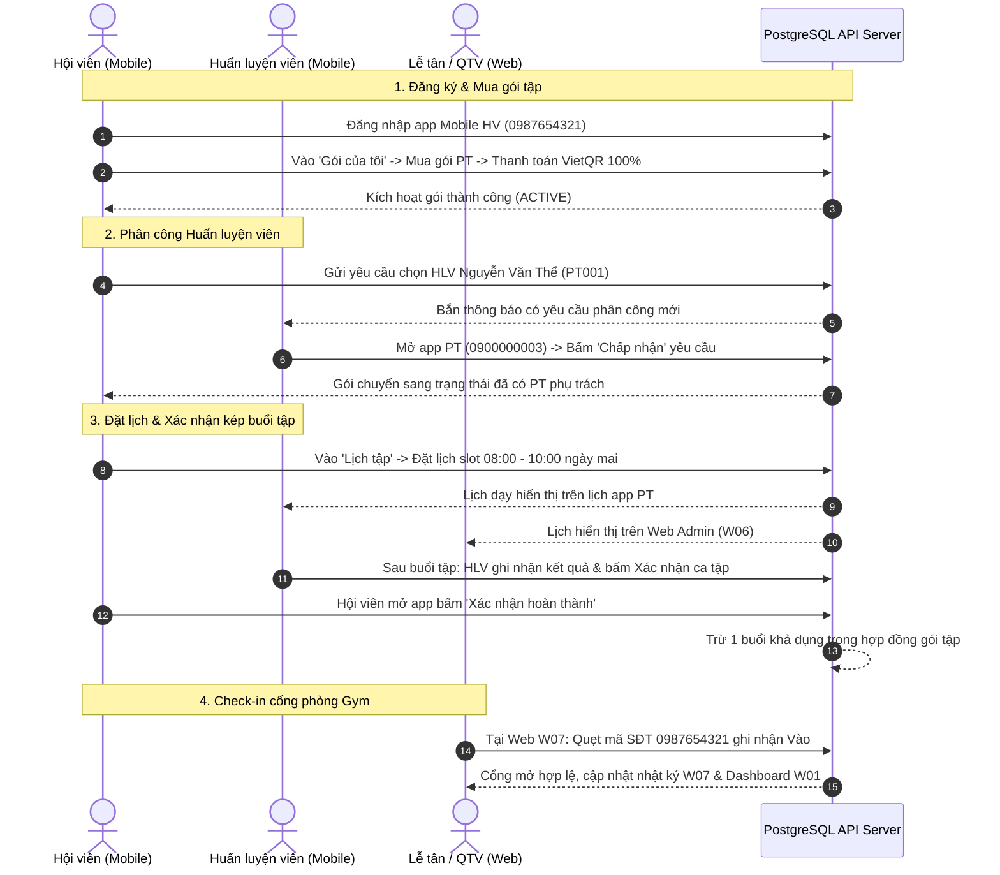

# HƯỚNG DẪN KHỞI CHẠY & TRẢI NGHIỆM WEB (QTV, LT) & MOBILE (HV, PT) ĐÃ REFACTOR

> **Phiên bản:** v3.0 (Sau đợt Refactor toàn diện Web Admin & Decoupling Mobile API)  
> **Áp dụng cho:** Web Quản trị viên (QTV), Web Lễ tân (LT), Mobile Hội viên (HV), Mobile Huấn luyện viên (PT) và Backend PostgreSQL REST API.

---

## 1. TỔNG QUAN KIẾN TRÚC & CỔNG TRUY CẬP (PORT MAPPING)

Hệ thống Paradise Gym vận hành theo mô hình Client-Server đồng bộ 100% dữ liệu từ PostgreSQL Database qua REST API (không mock data, không dữ liệu cứng ở Frontend):

| Phân hệ / Dịch vụ | Nền tảng | Cổng / URL truy cập | Mô tả & Tài khoản mặc định |
| :--- | :--- | :--- | :--- |
| **PostgreSQL Database** | Docker container `paradise-postgres` | `localhost:5435` | CSDL 22 bảng chứa dữ liệu hạt nhân |
| **pgAdmin 4 GUI** | Docker container `paradise-pgadmin` | `http://localhost:5050` | Giao diện quản trị CSDL trực quan |
| **Backend REST API** | Node.js / Express | `http://localhost:5000/api/v1`<br>Health: `http://localhost:5000/health` | API Core, RBAC, Auth, JWT, Jobs |
| **Frontend Web Server** | Node.js static server (`dev-server.cjs`) | `http://localhost:3000` | Máy chủ phục vụ toàn bộ Web và Mobile |
| 🔹 **Web Quản trị (QTV)** | Trình duyệt Desktop (DevExtreme) | `http://localhost:3000/web/` | `0900000001` / `Paradise@123` |
| 🔹 **Web Lễ tân (LT)** | Trình duyệt Desktop (DevExtreme) | `http://localhost:3000/web/` | `0900000002` / `Paradise@123` |
| 🔹 **Mobile Hội viên (HV)** | Trình duyệt di động (390 x 844 px) | `http://localhost:3000/mobile/member/` | `0987654321` / `Paradise@123` |
| 🔹 **Mobile Huấn luyện viên (PT)**| Trình duyệt di động (390 x 844 px) | `http://localhost:3000/mobile/pt/` | `0900000003` / `Paradise@123` |

---

## 2. QUY TRÌNH KHỞI ĐỘNG HỆ THỐNG TỪNG BƯỚC

### Bước 1: Khởi động Cơ sở dữ liệu PostgreSQL (Docker)
Mở terminal tại thư mục gốc của dự án `Paradise Gym-v2/` và chạy lệnh:
```powershell
docker compose up -d
```
- Đảm bảo 2 container `paradise-postgres` (port 5435) và `paradise-pgadmin` (port 5050) đang ở trạng thái `running`.
- Kiểm tra bằng lệnh: `docker ps`.

### Bước 2: Chạy Migration và Khởi động Backend REST API
Di chuyển vào thư mục `backend/`, cài đặt thư viện (nếu chưa có), chạy migration và khởi động server:
```powershell
# Di chuyển vào backend
cd backend

# Cài đặt dependencies (nếu chạy lần đầu)
npm install

# Áp dụng migration mới nhất (bao gồm migration 003: mobile preferences, certificates, avatar)
npm run db:migrate

# Khởi động Backend ở chế độ tự động reload (watch mode)
npm run dev
```
> Khi khởi động thành công, terminal sẽ thông báo:
> ```
> 🏋️‍♂️ PARADISE GYM REST API SERVER RUNNING ON PORT 5000
> 📡 Base URL: http://localhost:5000/api/v1
> ✅ Health Check: http://localhost:5000/health
> ```
> Bạn có thể kiểm tra nhanh bằng trình duyệt: `http://localhost:5000/health` (trả về trạng thái `UP`).

### Bước 3: Khởi động Máy chủ Frontend (Web & Mobile)
Mở một cửa sổ Terminal mới (giữ Terminal Backend chạy nền) tại thư mục gốc dự án:
```powershell
# Chạy máy chủ frontend tích hợp chuẩn
node frontend/web/dev-server.cjs
```
> Terminal sẽ hiển thị: `Paradise Gym: http://localhost:3000/web/`.  
> Máy chủ này tự động phục vụ đồng thời cả **Web Admin (`/web/`)**, **Mobile Hội viên (`/mobile/member/`)**, và **Mobile PT (`/mobile/pt/`)** trên cùng một cổng `3000`.

---

## 3. HƯỚNG DẪN TRẢI NGHIỆM WEB ADMIN (QTV & LỄ TÂN) — ĐÃ REFACTOR

Mở trình duyệt Google Chrome hoặc Edge và truy cập: **`http://localhost:3000/web/`**

### 3.1. Phong cách Giao diện Mới (Theo chuẩn phanmemtinhluong.com)
- **Topbar:** Tông màu xanh lá đậm Gym chuyên nghiệp, cố định trên cùng, tích hợp bộ chọn chi nhánh toàn cục, nút đổi tài khoản và đăng xuất.
- **Sidebar:** Tông màu trắng thanh lịch, hiển thị danh mục menu điều hướng động theo vai trò đăng nhập.
- **Dữ liệu thực 100%:** Toàn bộ bảng `dxDataGrid`, biểu đồ `dxChart`, lịch `dxScheduler` đều nạp từ PostgreSQL qua `apiClient`, có hiệu ứng loading, phân trang, tìm kiếm và thông báo lỗi/thành công rõ ràng.

### 3.2. Tài khoản Đăng nhập Web
- **Quản trị viên (QTV - Toàn quyền 13 Menu W01–W13):**
  - **SĐT:** `0900000001`
  - **Mật khẩu:** `Paradise@123`
  - **Xác thực 2 bước (2FA):** Tài khoản QTV có bật 2FA. Ở chế độ phát triển (`AUTH_OTP_MODE=development`), hệ thống sẽ hiển thị gợi ý mã OTP trực tiếp trên giao diện để nhập nhanh.
- **Lễ tân (Receptionist - 8 Menu tác nghiệp LT-W01–W09):**
  - **SĐT:** `0900000002`
  - **Mật khẩu:** `Paradise@123`
  - **Phạm vi chi nhánh:** Chi nhánh Quận 1.

### 3.3. Các Phân Hệ Trọng Yếu Đã Được Refactor Chuẩn Hóa
1. **W01 · Tổng quan vận hành (Dashboard):**
   - Đúng **1 ô `dxDateBox`** chọn ngày tác nghiệp linh hoạt (mặc định hôm nay).
   - **4 Thẻ KPI động:** Hội viên hoạt động, Tiền thực thu 100% trong ngày, Số ca PT trong ngày, Lượt check-in hôm nay.
   - **Bảng Nhật ký Ra/Vào thời gian thực:** Tự động nạp các lượt check-in hôm nay từ API.
2. **W02 · Hội viên & Khách hàng:**
   - Tìm kiếm nhanh số điện thoại realtime.
   - Thêm/sửa hồ sơ, khóa/kích hoạt tài khoản với lý do cụ thể.
   - Drawer xem chi tiết hồ sơ 3 tab: Gói tập sở hữu, Lịch sử ra vào cổng, Lịch sử chỉ số InBody.
3. **W03 & W11 · Gói tập & Chi nhánh:**
   - Quản lý danh mục gói (Gym thường, VIP, PT 1:1), giá niêm yết, thời hạn.
   - Quản lý danh sách chi nhánh, giờ mở cửa cố định (05:30 - 22:00), hotline.
4. **W04 & W08 · Đăng ký gói & Thu tiền 100%:**
   - Đăng ký gói mới, snapshot giá tại thời điểm đăng ký.
   - **Quy tắc bắt buộc:** Thanh toán 100% 1 lần duy nhất (không công nợ, không trả góp).
   - Hỗ trợ thanh toán Tiền mặt (tính tiền thừa) hoặc Chuyển khoản VietQR động NAPAS.
   - Xuất và in Phiếu thu (`receipts`) chuẩn A5/A4 in ấn sau khi thanh toán thành công.
5. **W05 & W06 · Huấn luyện viên & Lịch PT:**
   - Quản lý hồ sơ PT, chuyên môn, chi nhánh công tác.
   - Lưới lịch `dxScheduler` khung giờ làm việc cố định 08:00 - 18:00 (Thứ 2 đến Thứ 6).
   - Đặt lịch PT, đổi/hủy lịch có lý do, quy trình xác nhận hoàn thành ca dạy.
6. **W07 · Cổng ra vào & Check-in (Chuẩn 3 Khối UI):**
   - *Khối 1:* Card thao tác nhanh bên trái (nhập SĐT/thẻ/CCCD, tự nhận diện trạng thái và đổi nhãn nút `[·] Ghi nhận vào` hoặc `[Ghi nhận ra]`).
   - *Khối 2:* Card trạng thái thiết bị nhận diện cổng Kiosk (Badge xanh lá `K01 sẵn sàng` hoặc đỏ `K01 ngắt kết nối`).
   - *Khối 3:* Bảng `dxDataGrid` nhật ký quẹt thẻ thời gian thực hôm nay.
7. **W09, W10, W12, W13 · Báo cáo, Thiết bị & Hệ thống:**
   - W09: Quản lý thông báo in-app (chỉ kích hoạt tự động gửi khi QTV cấu hình Bật quy tắc).
   - W10: Báo cáo doanh thu thực thu 100% qua biểu đồ `dxChart` và bảng tổng hợp.
   - W12: Theo dõi danh sách thiết bị nhận diện camera/flap gate, trạng thái kết nối heartbeat.
   - W13: Phân quyền tài khoản, gán branch scope và tra cứu Audit Log chi tiết.

---

## 4. HƯỚNG DẪN TRẢI NGHIỆM MOBILE HỘI VIÊN (MEMBER) — ĐÃ REFACTOR

Mở trình duyệt và truy cập: **`http://localhost:3000/mobile/member/`**

### 4.1. Thiết lập Giả lập Màn hình Di động Chuẩn (390 x 844 px)
Để có trải nghiệm chuẩn xác như màn hình điện thoại thực tế:
1. Trên trình duyệt Chrome / Edge, nhấn **`F12`** (hoặc `Ctrl + Shift + I`) mở Developer Tools.
2. Nhấn **`Ctrl + Shift + M`** để bật chế độ Device Toolbar.
3. Tại thanh menu kích thước thiết bị trên cùng, chọn **iPhone 12 / 13 / 14 / 15 Pro** (kích thước `390 x 844 px`) với tỉ lệ zoom `100%`.

### 4.2. Tài khoản Đăng nhập Hội viên
- **Hội viên 1 (Chi nhánh Quận 1):** `0987654321` / `Paradise@123` (Trần Thị Mai)
- **Hội viên 2 (Chi nhánh Bình Thạnh):** `0912345678` / `Paradise@123` (Lê Hoàng Nam)
- **Đăng nhập bằng OTP SMS:** Bấm "Đăng nhập với mã OTP" $\rightarrow$ Nhập SĐT $\rightarrow$ Nhận mã OTP (mã dev: `123456`) $\rightarrow$ Đăng nhập không cần mật khẩu.
- **Kích hoạt tài khoản tại quầy (`HV06-US02`):** Chọn "Kích hoạt tài khoản tại đây" $\rightarrow$ Nhập SĐT đã đăng ký tại quầy $\rightarrow$ Xác thực OTP $\rightarrow$ Tạo mật khẩu mới.

### 4.3. Các Chức Năng Hội Viên Đã Được Refactor & Decouple API
- **Trang chủ (`#home` - HV01):**
  - Lời chào cá nhân hóa, thẻ trạng thái gói tập hiện tại.
  - Danh sách việc cần làm (nhắc buổi tập sắp tới, ca tập chờ xác nhận kép).
  - Khối thao tác nhanh: Đặt lịch PT, Mua gói mới, Lịch sử ra vào.
  - Không có mã QR check-in giả lập (tuân thủ đặc tả nghiệp vụ).
- **Lịch tập (`#schedule` - HV02):**
  - Dải cuộn ngang chọn ngày (Horizontal Date Strip).
  - Lưới các slot giờ 2 tiếng (08-10, 10-12, 12-14, 14-16, 16-18).
  - Đặt lịch buổi PT từ slot trống của HLV phụ trách (`HV02-US02`).
  - Hủy lịch tập có kiểm soát: Hủy trước 4 giờ được hoàn 1 buổi; Hủy muộn trong vòng 4 giờ bị tính phí trừ 1 buổi tập theo đúng quy định (`HV02-US03`).
  - Nút **[ Xác nhận hoàn thành ]** sau ca tập để phối hợp cơ chế xác nhận kép với HLV (`HV02-US04`).
- **Gói của tôi (`#packages` - HV03):**
  - *Tab Gói sở hữu:* Xem hạn dùng, tổng số buổi PT, số buổi đã dùng, số buổi còn lại.
  - *Tab Mua gói mới:* Danh mục các gói mở bán lấy từ API `GET /packages`, tạo giao dịch mua gói với mã VietQR 100%.
  - *Chọn PT & Yêu cầu phân công:* Xem danh sách PT lấy từ database, gửi yêu cầu phân công (`PENDING`) và theo dõi trạng thái (`ACCEPTED` / `REJECTED`).
  - *Lịch sử thanh toán:* Xem danh sách phiếu thu 100% đã thanh toán.
- **Thông báo (`#notifications` - HV05):**
  - Hộp thư 6 nhóm sự kiện (Lịch tập, Gói tập, Thanh toán, Chăm sóc, Hệ thống).
  - Lọc tin chưa đọc, mở xem chi tiết và tự động đánh dấu đã đọc trên database.
- **Tài khoản cá nhân (`#account` - HV04):**
  - Cập nhật thông tin cá nhân, ngày sinh, địa chỉ, liên hệ khẩn cấp.
  - Upload ảnh đại diện Avatar thật (lưu trữ file binary qua API `/avatar`).
  - Đổi SĐT an toàn thông qua xác thực mã OTP gửi đến số mới.
  - Cài đặt tùy chọn nhận thông báo in-app và bảo mật 2FA.
  - *Đã loại bỏ dữ liệu ảo:* Không còn hiển thị hạng hội viên hardcoded.

---

## 5. HƯỚNG DẪN TRẢI NGHIỆM MOBILE HUẤN LUYỆN VIÊN (PT) — ĐÃ REFACTOR

Mở trình duyệt và truy cập: **`http://localhost:3000/mobile/pt/`**

### 5.1. Thiết lập Giả lập Màn hình Di động Chuẩn (390 x 844 px)
Tương tự App Hội viên, nhấn **`F12`** $\rightarrow$ **`Ctrl + Shift + M`** $\rightarrow$ Chọn thiết bị chuẩn **iPhone 12/13/14 Pro (390 x 844 px)**.

### 5.2. Tài khoản Đăng nhập Huấn Luyện Viên
- **HLV 1 (Chi nhánh Quận 1):** `0900000003` / `Paradise@123` (HLV Nguyễn Văn Thể - Mã: `PT001`)
- **HLV 2 (Chi nhánh Bình Thạnh):** `0900000004` / `Paradise@123` (HLV Lê Văn Hùng - Mã: `PT002`)

### 5.3. Các Chức Năng HLV Đã Được Refactor & Decouple API
- **Tổng quan hiệu suất (`PT06`):**
  - Bộ lọc thời gian: Tuần này / Tháng này / Tháng trước.
  - 5 thẻ chỉ số KPI hiệu suất tính toán trực tiếp từ database:
    1. Số học viên đang phụ trách.
    2. Số buổi PT đã hoàn thành (xác nhận kép).
    3. Số buổi đã được book (sắp dạy).
    4. Số buổi đang chờ xác nhận kết quả.
    5. Số yêu cầu phân công mới đang chờ duyệt.
  - *Đã loại bỏ dữ liệu ảo:* Bỏ hiển thị "5+ năm kinh nghiệm" và "4.9 sao / 128 đánh giá".
- **Lịch dạy & Ghi nhận ca tập (`PT01`):**
  - Hiển thị lịch dạy theo ngày trong khung giờ làm việc 08:00 - 18:00 (Thứ 2 đến Thứ 6).
  - Trạng thái rõ ràng từng slot: Trống, Đã đặt, Chờ xác nhận, Hoàn thành.
  - Bottom Sheet **Ghi nhận kết quả buổi PT**: Chọn trạng thái ca tập, nhập ghi chú bài tập và đánh giá thể lực học viên, bấm xác nhận gọi API `POST /api/v1/pt-bookings/:id/pt-confirm`.
- **Quản lý học viên (`PT02`):**
  - Danh sách học viên phụ trách lọc theo trạng thái: Đang hoạt động, Sắp hết hạn, Chờ xếp lịch.
  - Xem chi tiết học viên: Số buổi còn lại, lịch sử các buổi đã tập, ghi chú thể lực.
  - Xử lý yêu cầu nhận lớp mới: Chấp thuận (`ACCEPTED`) hoặc từ chối kèm lý do.
- **Thông báo (`PT03`):**
  - Nhận thông báo nhắc ca dạy trước 15–30 phút, thông báo học viên đặt lịch mới hoặc hủy lịch.
- **Tài khoản & Hồ sơ PT (`PT04` & `PT05`):**
  - Xem hồ sơ cá nhân, chuyên môn thể hình.
  - Tùy chọn quyền riêng tư: Bật/Tắt cho phép học viên xem số điện thoại cá nhân (`show_phone_to_members`).
  - Cài đặt bảo mật mật khẩu và nhận thông báo.

---

## 6. KỊCH BẢN KIỂM THỬ LUỒNG NGHIỆP VỤ LIÊN THÔNG (END-TO-END)

Để kiểm chứng tính đồng bộ 100% giữa Web Admin, Mobile Hội viên và Mobile PT, bạn có thể thực hiện kịch bản mẫu sau:



---

## 7. CHẠY BỘ TEST TỰ ĐỘNG (AUTOMATED TEST SUITE)

Để kiểm tra toàn diện tính toàn vẹn của Backend, các hợp đồng API và logic nghiệp vụ, bạn có thể chạy bộ kiểm thử tự động của dự án:
```powershell
cd backend
npm test
```
- **Quy trình kiểm thử an toàn:** Script tự động khởi tạo cơ sở dữ liệu PostgreSQL tạm riêng biệt, áp dụng đầy đủ migrations, chạy kiểm tra và tự động dọn sạch; **hoàn toàn không làm thay đổi hoặc mất mát dữ liệu đang có trong cơ sở dữ liệu chính**.
- **Kết quả nghiệm thu:** **353 HTTP checks PASS 100%** (bao gồm xác thực, phân quyền RBAC, thanh toán 100%, phiếu thu, logic đặt/hủy/xác nhận kép PT, bảo mật OTP và upload avatar).
