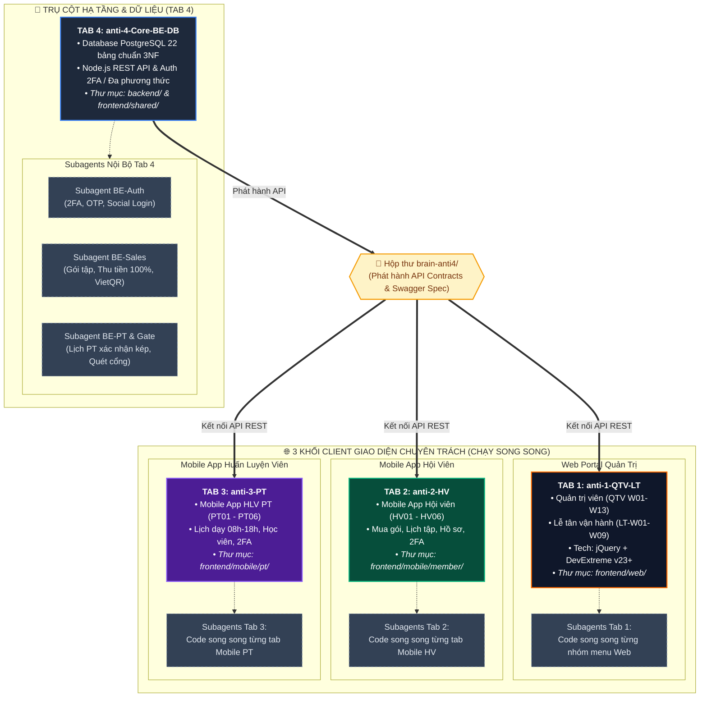

# Kế Hoạch Triển Khai Kiến Trúc & Phân Chia Công Việc Cho Subagents — Paradise Gym

- **Dự án:** Paradise Gym — Hệ thống quản lý & vận hành chuỗi phòng tập thể hình
- **Ngày lập:** 16/09/2026
- **Trạng thái:** Bản Kế hoạch chi tiết (Chờ phê duyệt trước khi triển khai code)
- **Tài liệu căn cứ:** 
  - Product Spec: [`docs/product-spec.md`](../product-spec.md)
  - Danh mục Epic & Menu: [`docs/epics.md`](../epics.md)
  - Chi tiết User Stories 4 Role: [`docs/user-stories/`](../user-stories/) (QTV, Lễ tân, Hội viên, PT)
  - Thiết kế CSDL 22 bảng: [`docs/database/erd.md`](../database/erd.md)

---

## 1. Công Nghệ Áp Dụng (Tech Stack)

Theo đúng định hướng kỹ thuật của dự án:
- **Frontend (FE):** **jQuery** kết hợp bộ thư viện **DevExtreme jQuery UI** (`https://js.devexpress.com/jQuery`).
  - Giao diện Web Quản trị (QTV & Lễ tân): `dxDrawer` (sidebar), `dxDataGrid` (danh sách, phân trang, bộ lọc), `dxForm` (nhập liệu), `dxPopup` (modal), `dxScheduler` (lịch PT), `dxDateBox` (chọn ngày), `dxChart` (biểu đồ báo cáo).
  - Giao diện Mobile Web View (Hội viên & PT): Responsive container mô phỏng smartphone, điều hướng bằng Bottom Navigation Bar.
- **Backend (BE):** **Node.js** (RESTful API theo mô hình phân tầng: Routes $\rightarrow$ Controllers $\rightarrow$ Services $\rightarrow$ Database Pool).
- **Database (DB):** **PostgreSQL** 15+ (Mô hình 22 bảng chuẩn hóa 3NF theo `docs/database/erd.md`).

---

## 2. Thiết Kế Xác Thực: Đăng Nhập Đa Phương Thức & Xác Thực 2 Lớp (2FA)

Dựa trên yêu cầu trực tiếp từ ban lãnh đạo và tài liệu đặc tả chuẩn (`HV06-US01`, `PT05-US01`):

### 2.1. Chi Tiết Nghiệp Vụ Xác Thực

1. **Đăng nhập đa phương thức (Multi-method Authentication):**
   - **Phương thức 1 (Bằng Mật khẩu):** Người dùng nhập Số điện thoại + Mật khẩu cá nhân.
   - **Phương thức 2 (Bằng mã OTP - Passwordless):** Người dùng chỉ cần nhập Số điện thoại $\rightarrow$ Bấm `[ Nhận mã OTP ]` $\rightarrow$ Hệ thống sinh mã OTP 6 chữ số gửi qua SMS (hiệu lực 60 giây) $\rightarrow$ Nhập mã để đăng nhập trực tiếp không cần nhớ mật khẩu.
   - **Phương thức 3 (Đăng nhập doanh nghiệp qua Google / Microsoft):** Hỗ trợ đăng nhập 1-click bằng Google Workspace hoặc Microsoft 365 (Entra ID) cho đội ngũ Quản trị viên (QTV) và Lễ tân trên Web.
2. **Quy trình Xác thực 2 lớp (Two-Factor Authentication - 2FA):**
   - **Bước 1 (Lớp 1 - Knowledge):** Người dùng nhập đúng SĐT và Mật khẩu.
   - **Bước 2 (Lớp 2 - Possession):** Hệ thống kiểm tra nếu tài khoản có bật 2FA hoặc đăng nhập từ thiết bị mới/trình duyệt lạ $\rightarrow$ Tự động kích hoạt màn hình **Xác thực 2 bước (2FA)** và gửi mã OTP 6 số qua SMS.
   - Giao diện 2FA gồm 6 ô nhập số tự động nhảy con trỏ, bộ đếm ngược thời gian (Countdown 60s), nút gửi lại mã tối đa 3 lần.
   - Nhập đúng OTP mới hoàn tất phiên đăng nhập và cấp phát cặp Token JWT (Access Token + Refresh Token).
3. **Cơ chế Chống dò quét & Khóa bảo vệ (Account Lockout):**
   - Nếu nhập sai Mật khẩu hoặc OTP quá **5 lần liên tiếp**, hệ thống tự động khóa tạm thời tính năng đăng nhập của tài khoản trong **15 phút** để ngăn chặn tấn công Brute-force.
   - Thời hạn hiệu lực của mã OTP: đúng **60 giây**.

---

### 2.2. Đề Xuất Giải Pháp Thư Viện Mã Nguồn Mở (Open-Source) Tối Ưu

Để triển khai chuẩn xác mô hình **Đa phương thức + 2FA SMS/OTP + Social Login** trên nền tảng **Node.js + PostgreSQL**:

| Tiêu chí | Phương án A: Better-Auth *(Khuyên dùng nhất)* | Phương án B: Passport.js + otplib + JWT | Phương án C: Keycloak (Red Hat) |
| :--- | :--- | :--- | :--- |
| **Bản chất** | Framework Auth Node.js hiện đại, mã nguồn mở 100% | Hệ middleware Node.js kinh điển + thư viện sinh mã OTP (`otplib`) | Máy chủ IAM độc lập (chạy Java/Docker) |
| **Hỗ trợ Đa phương thức** | Sẵn plugin `phoneNumber` (OTP không mật khẩu), `credentials` (mật khẩu) và Social Google/Microsoft | Tự viết router xử lý tab Mật khẩu và tab OTP SMS kết hợp `passport-google` | Có sẵn các flow Authentication tùy biến qua giao diện Admin |
| **Hỗ trợ Xác thực 2 lớp (2FA)** | Sẵn plugin `twoFactor` hỗ trợ OTP SMS hoặc TOTP Authenticator app | Dùng thư viện `otplib` sinh mã TOTP/HOTP 6 số, đếm ngược 60s và lưu redis/db | Có sẵn flow 2FA trong trình xác thực Keycloak |
| **Account Lockout (Khóa 15p)** | Cấu hình sẵn `rateLimit` và `accountLockout` | Dễ dàng quản lý số lần thử sai `failed_login_attempts` trong bảng `accounts` | Cấu hình brute-force detection trong Admin Console |
| **Tích hợp CSDL PostgreSQL** | **Khớp 100%**: Gắn thẳng vào bảng `accounts` và `audit_logs` của Paradise Gym | **Kiểm soát 100%**: Trực tiếp query vào 22 bảng CSDL theo ERD | Quản lý schema riêng, đồng bộ phức tạp |
| **Đánh giá** | **ĐỀ XUẤT SỐ 1**: Gọn nhẹ, code sạch, đầy đủ plugin 2FA và Phone OTP | **ĐỀ XUẤT DỰ PHÒNG**: Cực kỳ quen thuộc với lập trình viên Node.js | **DOANH NGHIỆP**: Nặng máy (1-2GB RAM), tốn công vận hành |

---

## 3. Rà Soát Chi Tiết Từng User Story & Chuẩn Hóa Nghiệp Vụ

Dựa trên việc đọc chi tiết từng file trong thư mục `docs/user-stories/`:

1. **Màn hình HV01 (`HV01-US01 - Xem tổng quan và thao tác nhanh`):**
   - Đây là **Trang chủ Dashboard của Hội viên** trên Mobile, chỉ gồm 4 khối trực quan:
     - *Khối 1 (Lời chào):* Hiển thị `"Xin chào, [Họ và tên]"`.
     - *Khối 2 (Việc cần xử lý):* Thẻ màu vàng amber nếu có yêu cầu chọn PT đang chờ duyệt kèm nút `[ Xem yêu cầu PT ]`; thẻ xanh green nếu rảnh rỗi.
     - *Khối 3 (Lịch sắp tới):* Thẻ hiển thị ngày giờ, tên HLV và gói tập kèm nút `[ Xem lịch của tôi ]`.
     - *Khối 4 (Thao tác nhanh):* Hai nút điều hướng `[ Mua gói ]` và `[ Gói của tôi ]`.
   - **Tuyệt đối KHÔNG có check-in, KHÔNG có mã QR hay dữ liệu sinh trắc nào tại HV01.**
2. **Kiosk K01 (`QTV-W07-US03` & `LT-W07-US03`):**
   - Kiosk K01 **chỉ là một Status Badge** hiển thị trên Card Thiết bị của màn hình W07 (`K01 sẵn sàng` màu xanh hoặc `K01 ngắt kết nối` màu xám) để Lễ tân/QTV theo dõi tình trạng kết nối của màn hình chào mừng tại cửa. **Không phải là một phần mềm hay phân hệ riêng**.
3. **Phân hệ Ra vào & Check-in (`W07`):**
   - Xử lý check-in tự động qua thiết bị: Kiểm tra 6 điều kiện hợp lệ (Profile ACTIVE, Gói còn hạn, Thanh toán 100%, Đúng chi nhánh, Còn số buổi, Trong giờ hoạt động) $\rightarrow$ Mở cửa & ghi log.
   - Ghi nhận Vào/Ra thủ công: Thao tác khi thiết bị lỗi hoặc không nhận diện được; Lễ tân tra cứu SĐT/Mã HV tại Card Kiểm soát ra vào bên trái và bấm nút CTA tự động đổi nhãn `[·] Ghi nhận vào` hoặc `[Ghi nhận ra]`.
   - Nhật ký ra vào hôm nay: Danh sách sự kiện Vào/Ra có lọc theo chiều, trạng thái, chi nhánh.
4. **Phân hệ Hệ thống & Thiết bị (`W12`):**
   - Quản lý danh mục thiết bị phần cứng Camera/Cổng kiểm soát (mã thiết bị, chi nhánh, trạng thái Online/Offline).
   - Quy trình đăng ký nhận diện khi có sự đồng ý (consent) của Hội viên.
   - Quy trình rút consent nhận diện khi hội viên yêu cầu.

---

## 4. Kế Hoạch Phân Bổ Công Việc: Kết Hợp 4 Tabs & Subagents Chuyên Biệt

Để đạt hiệu suất tối đa, dự án áp dụng mô hình phân bổ 2 cấp độ: **Cấp độ 4 Tabs độc lập (Macro)** kết hợp **Cấp độ Subagents chuyên biệt bên trong mỗi Tab (Micro)**.



---

### 4.1. Chi Tiết Phân Vai & Phân Bổ Công Việc Của Từng Tab

#### 🔴 TAB 4: `anti-4-Core-BE-DB` — Trưởng Nhóm Hạ Tầng & Backend REST API
- **Vị trí & Thư mục code:** `backend/` và `frontend/shared/apiClient.js`.
- **Nhiệm vụ chính:**
  1. Khởi tạo Database PostgreSQL 22 bảng theo chuẩn 3NF và snapshot giá bất biến theo đúng [`docs/database/erd.md`](../database/erd.md).
  2. Viết toàn bộ RESTful API cho toàn hệ thống:
     - Auth API: Đăng nhập đa phương thức (Mật khẩu / OTP SMS), Xác thực 2 bước (2FA), Social Login Google/Microsoft, cấp JWT.
     - Members API: CRUD hồ sơ, tìm kiếm SĐT realtime.
     - Packages & Branches API: CRUD chi nhánh, danh mục 4 loại gói tập.
     - Sales & Payments API: Tạo đăng ký gói, gia hạn, thu tiền 100%, sinh mã VietQR động, xuất phiếu thu `receipts`.
     - PT Bookings API: Đặt lịch buổi PT, kiểm tra slot trống (08:00 - 18:00 T2-T6), cơ chế xác nhận kép 2 chiều (`pt_confirmed_at` + `member_confirmed_at`) để trừ buổi (`is_deducted`).
     - Access Control API: Kiểm tra 6 điều kiện mở cổng, ghi nhận Vào/Ra thủ công.
  3. Xuất bản tài liệu kết nối API (`api_contracts.md`) vào `brain-anti4/` để 3 tab Frontend kết nối.
- **Sử dụng Subagents bên trong Tab 4:** Tab 4 có thể gọi các Subagents chạy nền để viết song song các controllers/services của các module mà không bị nghẽn.

---

#### 🔵 TAB 1: `anti-1-QTV-LT` — Trưởng Nhóm Web Quản Trị (QTV & Lễ Tân)
- **Vị trí & Thư mục code:** `frontend/web/`.
- **Nền tảng kỹ thuật:** jQuery + DevExtreme jQuery UI components (`https://js.devexpress.com/jQuery`).
- **Nhiệm vụ chính:**
  1. Dựng Layout khung Web Quản trị: DevExtreme `dxDrawer` (sidebar), Topbar (bộ chọn chi nhánh toàn cục, user profile badge, nút đăng xuất).
  2. Xây dựng toàn diện 13 Menu Web Quản trị cho QTV và 7 Menu cho Lễ tân:
     - `W01`: Dashboard vận hành tinh gọn (chỉ 1 DatePicker chọn ngày, 4 KPI hôm nay).
     - `W02`: Quản lý danh sách hội viên (`dxDataGrid` tìm SĐT realtime, Popup form, Drawer chi tiết hồ sơ).
     - `W03` & `W11`: Cấu hình danh mục gói tập và chi nhánh hoạt động.
     - `W04` & `W08`: Wizard đăng ký/gia hạn gói, Modal thu tiền 100% (tiền mặt / VietQR), xem và in phiếu thu.
     - `W05` & `W06`: DevExtreme `dxScheduler` hiển thị lịch dạy PT tập trung, đặt lịch, hủy lịch.
     - `W07`: Màn hình kiểm soát ra vào 3 khối (Card thao tác nhanh bên trái tự đổi nút `[·] Ghi nhận vào` / `[Ghi nhận ra]`, Card thiết bị với badge `K01 sẵn sàng` / `K01 ngắt kết nối`, Bảng nhật ký hôm nay).
     - `W09`: Cấu hình mẫu thông báo in-app.
     - `W10`: Báo cáo doanh thu và vận hành (`dxChart` và `dxPivotGrid`).
     - `W12`: Quản lý danh sách thiết bị và quy trình đăng ký nhận diện.
     - `W13`: Quản lý tài khoản, gán role/branch scope và tra cứu audit log.
- **Sử dụng Subagents bên trong Tab 1:** Triệu hồi các Subagents code song song các nhóm menu Web (ví dụ: 1 subagent làm W01/W10, 1 subagent làm W02/W04/W08, 1 subagent làm W05/W06/W07).

---

#### 🟢 TAB 2: `anti-2-HV` — Trưởng Nhóm Ứng Dụng Mobile Hội Viên
- **Vị trí & Thư mục code:** `frontend/mobile/member/`.
- **Nền tảng kỹ thuật:** Responsive Mobile Web View (mô phỏng smartphone 390x844), Bottom Navigation Bar.
- **Nhiệm vụ chính:** Xây dựng trọn vẹn 6 Epic của Hội viên:
  1. `HV01 · Trang chủ`: Dashboard tổng quan (Lời chào cá nhân, Thẻ việc cần xử lý yêu cầu PT, Thẻ Lịch sắp tới, nút nhanh `[ Mua gói ]` và `[ Gói của tôi ]`).
  2. `HV02 · Lịch tập`: Xem lịch tập, chọn slot trống đặt lịch PT, hủy lịch, và **nút Hội viên xác nhận hoàn thành buổi tập** để trừ buổi.
  3. `HV03 · Gói của tôi`: Xem gói đang sở hữu, xem chi tiết gói đang bán, **Mua gói & khởi tạo thanh toán trên Mobile**, chọn PT gửi yêu cầu phân công, xem lịch sử thanh toán.
  4. `HV04 · Tài khoản`: Xem & cập nhật thông tin cá nhân, cài đặt bảo mật.
  5. `HV05 · Thông báo`: Hộp thư thông báo in-app theo sự kiện.
  6. `HV06 · Đăng nhập`: Màn hình Đăng nhập đa phương thức (Tab Mật khẩu / Tab OTP SMS) và màn hình **Xác thực 2 bước (2FA)** 6 số countdown 60s.
- **Sử dụng Subagents bên trong Tab 2:** Triệu hồi Subagents code song song các tab Mobile Hội viên.

---

#### 🟡 TAB 3: `anti-3-PT` — Trưởng Nhóm Ứng Dụng Mobile Huấn Luyện Viên (PT)
- **Vị trí & Thư mục code:** `frontend/mobile/pt/`.
- **Nền tảng kỹ thuật:** Responsive Mobile Web View, Bottom Navigation Bar.
- **Nhiệm vụ chính:** Xây dựng trọn vẹn 5 Epic của Huấn luyện viên:
  1. `PT06 · Tổng quan`: Xem tổng quan và thống kê hiệu suất dạy của PT trong tháng.
  2. `PT01 · Lịch`: Xem lịch dạy theo ngày (khung giờ cố định 08:00 - 18:00 T2-T6), **nút HLV xác nhận hoàn thành & ghi kết quả buổi học**.
  3. `PT02 · Học viên`: Xem danh sách học viên được phân công, xem lộ trình & lịch sử tập của học viên, tiếp nhận/từ chối yêu cầu phân công PT.
  4. `PT03 · Thông báo`: Hộp thư thông báo in-app của PT.
  5. `PT04 · Tài khoản`: Xem hồ sơ và tùy chọn tài khoản PT.
  6. `PT05 · Đăng nhập`: Đăng nhập đa phương thức và **Xác thực 2 bước (2FA)** dành riêng cho HLV.
- **Sử dụng Subagents bên trong Tab 3:** Triệu hồi Subagents code song song các màn hình PT.

---

### 4.2. Danh Sách Subagents Cụ Thể Bên Trong Từng Tab

#### 🔴 TAB 4: `anti-4-Core-BE-DB` — Gồm 4 Subagents:
1. **Subagent BE-1 (Database & Base Skeleton):**
   - Viết migration DDL PostgreSQL khởi tạo 22 bảng CSDL theo [`docs/database/erd.md`](../database/erd.md).
   - Viết seed script chèn dữ liệu ban đầu (4 Role, 2 chi nhánh, tài khoản QTV gốc, 4 gói tập mẫu).
   - Cấu hình server Node.js (Express.js), kết nối PostgreSQL Pool, xử lý lỗi tập trung, CORS, Helmet.
2. **Subagent BE-2 (Auth & 2FA Engine):**
   - Xây dựng API Đăng nhập đa phương thức (Tab Mật khẩu / Tab OTP SMS không mật khẩu theo `HV06-US01`/`PT05-US01`).
   - Xây dựng luồng Xác thực 2 bước (2FA SMS OTP 6 số, countdown 60 giây).
   - Tích hợp Social Login Google / Microsoft OAuth2.
   - Cơ chế Account Lockout: Khóa tạm thời 15 phút nếu nhập sai quá 5 lần.
   - Cấp phát cặp token JWT (Access/Refresh Token), Middlewares RBAC và Branch Scope.
3. **Subagent BE-3 (Business API: Members, Packages & Sales):**
   - Members API: Tìm kiếm hội viên realtime bằng SĐT, CRUD hồ sơ, đổi trạng thái.
   - Packages & Branches API: CRUD chi nhánh, CRUD 4 loại gói tập.
   - Sales & Payments API: Cơ chế Snapshot đóng băng 6 thông số gói; API tạo đăng ký mới, gia hạn; API thu tiền mặt 100%; Sinh mã VietQR chuyển khoản ngân hàng; API xuất phiếu thu `receipts`.
4. **Subagent BE-4 (Operations API: PT Bookings & Access Gate):**
   - PT Bookings API: Kiểm tra slot trống (08:00 - 18:00 T2-T6, không trùng lịch); API đặt lịch; **Cơ chế xác nhận kép 2 bên** (`pt_confirmed_at` + `member_confirmed_at`) để hoàn thành buổi và trừ 1 buổi (`is_deducted`).
   - Access Control API: Kiểm tra 6 điều kiện mở cổng tự động; API ghi nhận Vào/Ra thủ công.
   - Xuất bản tài liệu `api_contracts.md` và lưu vào `brain-anti4/notes.md`.

---

#### 🔵 TAB 1: `anti-1-QTV-LT` — Gồm 3 Subagents:
1. **Subagent Web-1 (Base Layout & Dashboard W01/W10):**
   - Khung giao diện Web DevExtreme `dxDrawer` (sidebar collapsible), Topbar chọn chi nhánh toàn cục.
   - Màn hình `W01` Dashboard vận hành tinh gọn (chỉ 1 DatePicker chọn ngày, 4 KPI hôm nay).
   - Màn hình `W10` Báo cáo doanh thu thực thu 100% và vận hành (`dxChart` và `dxPivotGrid`).
2. **Subagent Web-2 (Members, Packages & Sales UI: W02, W03, W04, W08, W11):**
   - `W02`: Quản lý danh sách hội viên (`dxDataGrid` tìm SĐT realtime, Popup form, Drawer xem hồ sơ & lịch sử tập).
   - `W03` & `W11`: Cấu hình danh mục gói tập và chi nhánh hoạt động.
   - `W04` & `W08`: Wizard đăng ký/gia hạn gói, Modal thu tiền mặt 100% / hiển thị mã VietQR động, in phiếu thu.
3. **Subagent Web-3 (Operations & System UI: W05, W06, W07, W09, W12, W13):**
   - `W05` & `W06`: DevExtreme `dxScheduler` hiển thị lịch dạy PT tập trung, đặt lịch.
   - `W07`: Màn hình kiểm soát ra vào 3 khối (Card thao tác nhanh bên trái tự đổi nút `[·] Ghi nhận vào` / `[Ghi nhận ra]`, Card thiết bị với badge `K01 sẵn sàng` / `K01 ngắt kết nối`, Bảng nhật ký hôm nay).
   - `W09`, `W12`, `W13`: Cấu hình mẫu thông báo in-app, quản lý thiết bị Camera/Cổng, quản lý tài khoản & audit log.

---

#### 🟢 TAB 2: `anti-2-HV` — Gồm 3 Subagents:
1. **Subagent HV-1 (Auth & Account: HV06, HV04):**
   - `HV06`: Màn hình Đăng nhập đa phương thức (Tab Mật khẩu / Tab OTP SMS) và màn hình **Xác thực 2 bước (2FA)** 6 số countdown 60s.
   - `HV04`: Màn hình Tài khoản (xem và cập nhật thông tin cá nhân, cài đặt bảo mật).
2. **Subagent HV-2 (Home Dashboard & Schedule: HV01, HV02):**
   - `HV01`: Dashboard trang chủ (Lời chào cá nhân, Thẻ việc cần xử lý yêu cầu PT, Thẻ Lịch sắp tới, 2 nút Mua gói / Gói của tôi).
   - `HV02`: Lịch tập cá nhân, chọn slot trống đặt lịch PT, hủy lịch, và **nút Hội viên xác nhận hoàn thành buổi tập**.
3. **Subagent HV-3 (Packages & Notifications: HV03, HV05):**
   - `HV03`: Gói của tôi (xem gói đang sở hữu, xem gói đang bán, Mua gói khởi tạo thanh toán Mobile, chọn PT gửi yêu cầu, xem lịch sử thanh toán).
   - `HV05`: Hộp thư thông báo in-app của hội viên.

---

#### 🟡 TAB 3: `anti-3-PT` — Gồm 3 Subagents:
1. **Subagent PT-1 (Auth & Profile: PT05, PT04):**
   - `PT05`: Đăng nhập đa phương thức và **Xác thực 2 bước (2FA)** dành riêng cho HLV.
   - `PT04`: Xem hồ sơ năng lực và tùy chọn tài khoản PT.
2. **Subagent PT-2 (Schedule & Overview: PT06, PT01):**
   - `PT06`: Dashboard tổng quan hiệu suất dạy của PT trong tháng.
   - `PT01`: Lịch dạy theo ngày (khung giờ làm việc cố định 08:00 - 18:00 T2-T6), **nút HLV xác nhận hoàn thành & ghi kết quả buổi học**.
3. **Subagent PT-3 (Clients & Notifications: PT02, PT03):**
   - `PT02`: Danh sách học viên phụ trách, xem lộ trình & lịch sử tập, tiếp nhận/từ chối yêu cầu phân công PT.
   - `PT03`: Hộp thư thông báo in-app của PT.

---

## 5. Hướng Dẫn Prompt Chi Tiết Để Triển Khai Cho Từng Tab

Dưới đây là nội dung prompt cụ thể được chuẩn bị sẵn, bạn chỉ cần copy và paste vào đúng từng Tab:

## 5. Hướng Dẫn Prompt Chi Tiết Cho Từng Tab (Đã Chỉ Định Rõ Việc Từng Subagent)

Dưới đây là bộ prompt chuẩn hóa chi tiết từng câu từng chữ. Trong mỗi prompt đều **chỉ định rõ danh sách các Subagents, tên gọi, phân chia từng file và chức năng cụ thể** để agent ở Tab đó gọi lệnh `invoke_subagent` thực thi:

### 1️⃣ Prompt Cho TAB 4 (`anti-4-Core-BE-DB`):
```text
Chào bạn, bạn là Lead Backend & Database (Tab 4) của dự án Paradise Gym theo AGENTS.md. Nhiệm vụ chuyên trách của bạn nằm trong thư mục backend/ và frontend/shared/apiClient.js.

Hãy đọc kỹ docs/database/erd.md và docs/implementation-plan.md. Bạn hãy sử dụng công cụ invoke_subagent để triệu hồi và phân chia công việc song song cho 4 Subagents nội bộ sau:

1. Subagent "BE-1-DB-Base":
   - Viết PostgreSQL migration DDL tạo trọn vẹn 22 bảng CSDL chuẩn 3NF theo docs/database/erd.md.
   - Viết seed script chèn dữ liệu ban đầu (4 Role, 2 chi nhánh CN01/CN02, tài khoản QTV gốc, 4 gói tập mẫu).
   - Cấu hình server Node.js (Express.js), kết nối PostgreSQL Pool, error handler tập trung, CORS, Helmet.

2. Subagent "BE-2-Auth-2FA":
   - Xây dựng Auth Service & Controllers: Đăng nhập đa phương thức (Tab Mật khẩu / Tab OTP SMS không mật khẩu theo HV06-US01 và PT05-US01).
   - Xây dựng luồng Xác thực 2 bước (2FA SMS OTP 6 số, countdown 60s, gửi lại tối đa 3 lần).
   - Tích hợp Social Login Google / Microsoft OAuth2.
   - Cơ chế Account Lockout: Tự động khóa tạm thời 15 phút nếu nhập sai quá 5 lần liên tiếp.
   - Cấp phát JWT (Access Token + Refresh Token), Middlewares RBAC (QTV, RECEPTIONIST, PT, MEMBER) và Branch Scope.

3. Subagent "BE-3-Business-Sales":
   - Members API: Tìm kiếm hội viên realtime bằng SĐT, CRUD hồ sơ, đổi trạng thái ACTIVE/LOCKED.
   - Packages & Branches API: CRUD chi nhánh, CRUD 4 loại gói tập (Gym ngày, Gym buổi, PT, Combo).
   - Sales & Payments API: Cơ chế Snapshot đóng băng 6 thông số khi mua gói; API tạo đăng ký mới, gia hạn; API thu tiền mặt 100%; Sinh mã VietQR chuyển khoản ngân hàng; API xuất phiếu thu receipts bất biến; Xử lý hoàn/hủy thanh toán.

4. Subagent "BE-4-Operations-Gate":
   - PT Bookings API: Đặt lịch buổi PT, kiểm tra slot trống (08:00 - 18:00 T2-T6, không trùng lịch); Cơ chế xác nhận kép 2 bên (pt_confirmed_at + member_confirmed_at) để hoàn thành buổi và khấu trừ 1 buổi (is_deducted).
   - Access Control API: Kiểm tra 6 điều kiện mở cổng tự động (Profile ACTIVE, Gói còn hạn, Thanh toán 100%, Đúng chi nhánh, Còn buổi, Trong giờ hoạt động); API ghi nhận Vào/Ra thủ công.
   - Viết tài liệu api_contracts.md và lưu vào brain-anti4/notes.md để 3 tab Frontend kết nối.

Hãy kích hoạt 4 Subagents trên và bắt đầu triển khai ngay!
```

---

### 2️⃣ Prompt Cho TAB 1 (`anti-1-QTV-LT` - Tab hiện tại):
```text
Chào bạn, bạn là Lead Web Admin Portal (Tab 1) của dự án Paradise Gym theo AGENTS.md. Nhiệm vụ chuyên trách của bạn nằm trong thư mục frontend/web/.

Hãy đọc docs/implementation-plan.md và tài liệu User Stories trong docs/user-stories/qtv/ và docs/user-stories/le-tan/. Bạn hãy sử dụng công cụ invoke_subagent để triệu hồi và phân chia công việc song song cho 3 Subagents nội bộ sau:

1. Subagent "Web-1-Layout-Dashboard":
   - Dựng khung Layout Web Admin bằng jQuery + DevExtreme v23+: dxDrawer (sidebar menu collapsible), Topbar (bộ chọn chi nhánh toàn cục, user profile badge, nút đăng xuất).
   - Triển khai màn hình W01 Dashboard vận hành tinh gọn: Đúng 1 ô DatePicker chọn ngày (mặc định hôm nay), 4 thẻ KPI cốt lõi (Lượt check-in, Doanh thu thực thu 100%, Buổi PT đã xác nhận kép, Hội viên hoạt động), bảng check-in hôm nay.
   - Triển khai màn hình W10 Báo cáo: dxChart biểu đồ cột doanh thu thực thu 100% và dxPivotGrid phân tích vận hành theo chi nhánh.

2. Subagent "Web-2-Members-Sales":
   - W02 (Hội viên): dxDataGrid danh sách hội viên kèm search panel tìm SĐT realtime, lọc chi nhánh, phân trang; Drawer/Popup xem & chỉnh sửa hồ sơ nhân thân; Nút đổi trạng thái ACTIVE/LOCKED.
   - W03 & W11 (Gói tập & Chi nhánh): dxDataGrid danh mục gói tập và chi nhánh; Popup Form thêm/sửa, cấu hình chi nhánh áp dụng và giờ mở cửa (05:30 - 22:00).
   - W04 & W08 (Đăng ký & Thu tiền): Wizard tạo đăng ký/gia hạn gói có snapshot giá; Modal thu tiền mặt 100% và hiển thị mã VietQR động; dxDataGrid lịch sử thanh toán & in phiếu thu PDF/HTML.

3. Subagent "Web-3-Operations-System":
   - W05 & W06 (Huấn luyện viên & Lịch PT): dxScheduler hiển thị lịch dạy tập trung của các PT theo ngày/tuần; Form đặt lịch buổi PT từ slot trống; Phân công PT.
   - W07 (Ra vào & Check-in): Màn hình 3 khối chuẩn mực: Card Kiểm soát ra vào bên trái với nút CTA tự đổi nhãn "[·] Ghi nhận vào" / "[Ghi nhận ra]"; Card Thiết bị ở giữa với badge Kiosk K01 (K01 sẵn sàng / K01 ngắt kết nối); Bảng Nhật ký ra vào hôm nay bên phải.
   - W09, W12, W13: Màn hình quản lý mẫu thông báo in-app (W09), quản lý danh mục thiết bị Camera/Cổng (W12), quản lý tài khoản, gán role/branch scope và tra cứu audit log (W13).

Hãy kích hoạt 3 Subagents trên và bắt đầu triển khai ngay!
```

---

### 3️⃣ Prompt Cho TAB 2 (`anti-2-HV`):
```text
Chào bạn, bạn là Lead Mobile Hội viên (Tab 2) của dự án Paradise Gym theo AGENTS.md. Nhiệm vụ chuyên trách của bạn nằm trong thư mục frontend/mobile/member/.

Hãy đọc docs/implementation-plan.md và tài liệu User Stories trong docs/user-stories/hoi-vien/. Bạn hãy sử dụng công cụ invoke_subagent để triệu hồi và phân chia công việc song song cho 3 Subagents nội bộ sau:

1. Subagent "HV-1-Auth-Account":
   - Dựng khung Mobile Web View responsive (smartphone 390x844) với Bottom Navigation Bar 4 tab.
   - HV06 (Đăng nhập): Màn hình Đăng nhập đa phương thức (Tab Mật khẩu / Tab OTP SMS không mật khẩu); Màn hình Xác thực 2 bước (2FA) gồm 6 ô nhập OTP, countdown 60s, nút gửi lại mã; Màn hình kích hoạt tài khoản OTP (HV06-US02); Khóa tạm thời 15 phút nếu sai quá 5 lần.
   - HV04 (Tài khoản): Màn hình xem & cập nhật hồ sơ cá nhân, đổi mật khẩu, cài đặt thông báo & bảo mật tài khoản.

2. Subagent "HV-2-Home-Schedule":
   - HV01 (Trang chủ Dashboard): Chuẩn 4 khối theo HV01-US01: Lời chào thân thiện kèm họ tên; Thẻ việc cần xử lý (thẻ vàng hiển thị yêu cầu chọn PT đang chờ duyệt kèm nút [ Xem yêu cầu PT ], thẻ xanh nếu không có việc); Thẻ Lịch sắp tới (ngày giờ, HLV, gói tập kèm nút [ Xem lịch của tôi ]); 2 nút thao tác nhanh [ Mua gói ] và [ Gói của tôi ]. Tuyệt đối không có check-in hay QR code tại HV01.
   - HV02 (Lịch tập): Xem lịch tập và lọc trạng thái; Đặt lịch PT từ slot trống; Hủy lịch; Nút Hội viên bấm "Xác nhận hoàn thành buổi tập" để phối hợp xác nhận kép trừ buổi.

3. Subagent "HV-3-Packages-Notifications":
   - HV03 (Gói của tôi): Xem danh sách gói đang sở hữu, hạn dùng, số buổi còn lại; Xem chi tiết quyền lợi gói đang mở bán; Giao diện Mua gói và khởi tạo thanh toán Mobile; Chọn PT và gửi yêu cầu phân công; Xem lịch sử thanh toán cá nhân.
   - HV05 (Thông báo): Hộp thư thông báo in-app, xem chi tiết và đánh dấu đã đọc.

Hãy kích hoạt 3 Subagents trên và bắt đầu triển khai ngay!
```

---

### 4️⃣ Prompt Cho TAB 3 (`anti-3-PT`):
```text
Chào bạn, bạn là Lead Mobile PT (Tab 3) của dự án Paradise Gym theo AGENTS.md. Nhiệm vụ chuyên trách của bạn nằm trong thư mục frontend/mobile/pt/.

Hãy đọc docs/implementation-plan.md và tài liệu User Stories trong docs/user-stories/pt/. Bạn hãy sử dụng công cụ invoke_subagent để triệu hồi và phân chia công việc song song cho 3 Subagents nội bộ sau:

1. Subagent "PT-1-Auth-Profile":
   - Dựng khung Mobile Web View responsive cho Huấn luyện viên với Bottom Navigation Bar 4 tab.
   - PT05 (Đăng nhập HLV): Màn hình Đăng nhập đa phương thức (Tab Mật khẩu / Tab OTP SMS); Màn hình Xác thực 2 bước (2FA) 6 số countdown 60s; Kích hoạt tài khoản PT bằng OTP (PT05-US02); Khóa tạm thời 15 phút nếu sai quá 5 lần.
   - PT04 (Tài khoản): Màn hình xem hồ sơ năng lực, chuyên môn và tùy chọn tài khoản PT.

2. Subagent "PT-2-Schedule-Overview":
   - PT06 (Tổng quan hiệu suất): Dashboard tổng quan thống kê số buổi dạy hoàn thành trong tháng, tỷ lệ đánh giá và lịch sắp tới.
   - PT01 (Lịch dạy): Xem lịch dạy theo ngày trong khung giờ cố định 08:00 - 18:00 Thứ 2 - Thứ 6; Nút HLV bấm "Xác nhận hoàn thành & ghi kết quả buổi học" để phối hợp xác nhận kép trừ 1 buổi của học viên.

3. Subagent "PT-3-Clients-Notifications":
   - PT02 (Quản lý học viên): Xem danh sách học viên được phân công; Xem lộ trình và lịch sử tập luyện của học viên; Tiếp nhận hoặc từ chối yêu cầu phân công PT từ hội viên.
   - PT03 (Thông báo): Hộp thư thông báo in-app của PT (nhận thông báo có học viên mới, học viên đặt/hủy lịch).

Hãy kích hoạt 3 Subagents trên và bắt đầu triển khai ngay!
```

