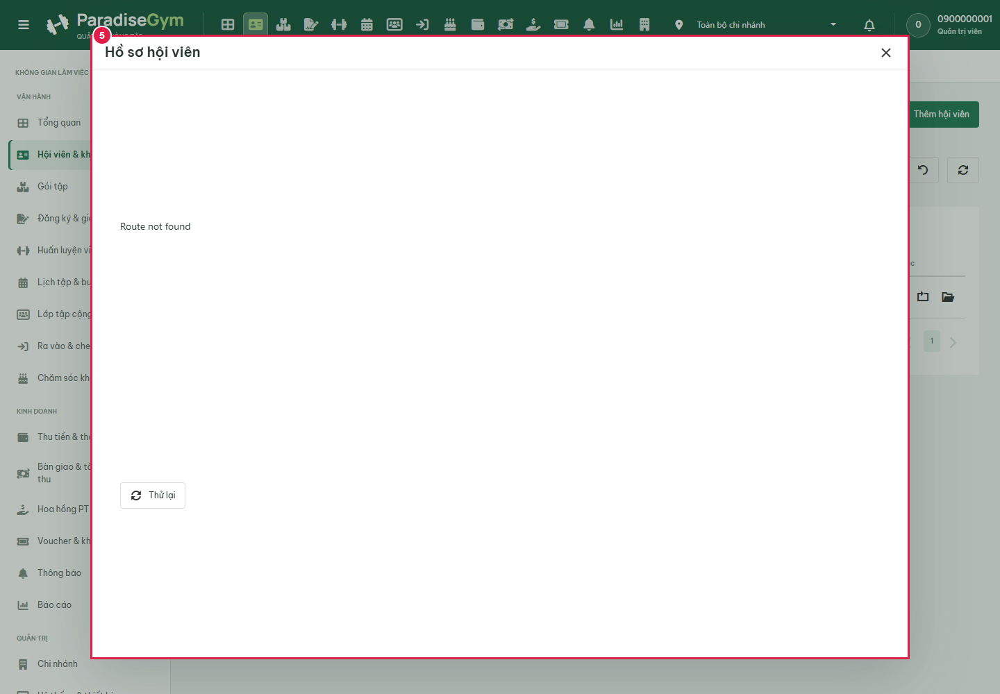
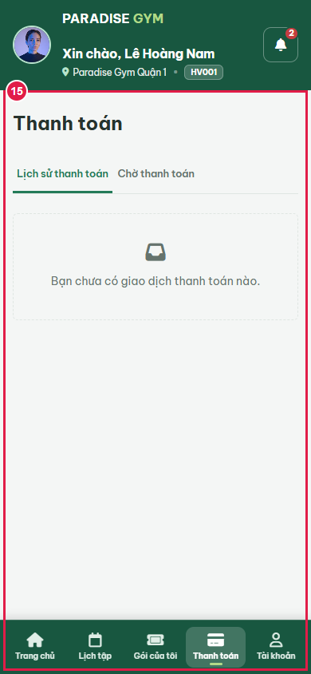

# W02 Popup Verification Progress

Status: awaiting backend/UI freeze, not final acceptance.

Frontend 3001 and backend 5000 are reachable; QTV, HV001 and LT authenticated. Preliminary 02 completed 18 steps with 15 passing DOM assertions and 3 failures. Those counts describe diagnostics only.

## Confirmed Blockers

- Historical runtime blocker: QTV initial-row and HV001 popup GET overview-data returned 404 Route not found on the old backend process. Main reloaded backend at 19:08:26Z (new PID 9260), reports health UP and current endpoint mounted, with 30 isolated backend assertions passing. This was old-process readiness, not an endpoint source defect. Integration recheck awaits UI freeze.
- Same HV001 Mobile payment history is empty although real payments API returns 11 rows with confirmed_at. These legacy rows lack status; Mobile history filters status === COMPLETED. Preserve this cross-role failure; no data/source repair within verification scope.
- Legacy LT profile requests group-invitations and receives 403. This is preexisting retained behavior; do not imply the new QTV endpoint grants LT access.

## Evidence

A/B/ALL list checks and real network-abort/retry passed DOM assertions. Full per-step report: [preliminary 02](../../../tests/e2e/qtv/QTV-W02-US04/popup-refactor-20260922/preliminary-02/QTV-W02-US04-test.md).

No business mutation requests or shared seed/reset were issued. Standard auth session heartbeat is an existing backend side effect documented by backend owner; this is not a claim of zero writes anywhere in middleware.

Initial preliminary run contained stale-selector and header-text harness failures while UI source changed. They are not product defects. Runner corrected to new selectors, full-page member identity and confirmed_at ledger evidence. Final run awaits freeze and visual audit.
