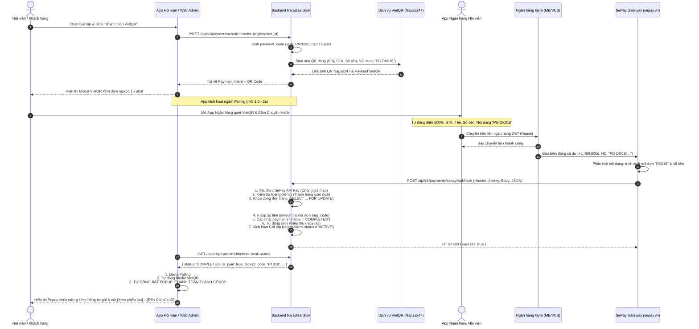

# Kế Hoạch Triển Khai Module Chuyển Khoản Tự Động VietQR & SePay: Tự Động Bật Popup "THANH TOÁN THÀNH CÔNG"

- **Ngày lập:** 23/09/2026
- **Phân hệ phụ trách:** Toàn hệ thống Paradise Gym (Web Admin, Mobile Member, Core Backend & Database)
- **Tác giả:** Web Admin Lead (`anti-1-QTV-LT`) phối hợp Backend & DB Lead (`anti-4-Core-BE-DB`)

---

## 1. Mục Tiêu & Trải Nghiệm Người Dùng (UX Zero-Click)

Hiện tại hệ thống Paradise Gym yêu cầu người dùng phải bấm nút kiểm tra thủ công ("Tôi đã chuyển khoản" trên Mobile hoặc "Kiểm tra thanh toán" trên Web Admin).

**Mục tiêu nâng cấp:**
Tự động hóa **100% quy trình xác nhận chuyển khoản** bằng cách kết hợp:
1. **VietQR (Napas247):** Sinh mã QR động chuẩn EMVCo chứa chính xác: STK thụ hưởng, Mã ngân hàng (BIN), Số tiền đơn hàng đến từng đồng, và Nội dung chuyển khoản chuẩn hóa. Với VietinBank cá nhân, nội dung bắt đầu bằng từ khóa bắt buộc `SEVQR`, ví dụ: `SEVQR PG DK016 HV001`.
2. **SePay (sepay.vn):** Dịch vụ kết nối ngân hàng Việt Nam (MB, Vietcombank, ACB, TPBank, Techcombank, VPBank, BIDV,...). Khi tài khoản gym nhận được tiền, SePay lập tức bắt biến động số dư và bắn **Webhook POST** về server Paradise Gym trong vòng 1-3 giây để hệ thống tự động:
   - Khớp đơn hàng.
   - Ghi nhận thanh toán vào bảng `payments` (`status = 'COMPLETED'`).
   - Tự động sinh Phiếu thu trong bảng `receipts`.
   - Kích hoạt gói tập trong bảng `registrations` (`status = 'ACTIVE'`).
   - Phát thông báo in-app cho Hội viên.
3. **Cơ Chế Zero-Click Auto-Popup (Tự Động Bật Popup "THANH TOÁN THÀNH CÔNG"):**
   - Khi hội viên hoặc khách hàng đang mở modal VietQR, hệ thống kích hoạt ngầm vòng lặp Polling (chu kỳ 1.5 - 2s).
   - Ngay khoảnh khắc tiền vào tài khoản Gym và Webhook xử lý xong:
     * Vòng lặp Polling lập tức phát hiện giao dịch thành công.
     * **Tự động đóng mã QR** mà người dùng **KHÔNG CẦN CHẠM TAY VÀO MÀN HÌNH** hay bấm bất kỳ nút nào.
     * **TỰ ĐỘNG BẬT POPUP MODAL "THANH TOÁN THÀNH CÔNG!"** với hiệu ứng biểu tượng xanh lá nổi bật, tóm tắt thông tin giao dịch, số tiền, mã phiếu thu, và 2 nút tiện ích: `[Xem phiếu thu]` và `[Đến Gói của tôi]`.

---

## 2. Những Thứ BẠN (Người Dùng) Buộc Phải Làm Thủ Công

Do các công việc này liên quan trực tiếp đến tài khoản cá nhân, tài khoản ngân hàng thực tế và tài chính bên ngoài của bạn, AI/Agent **không thể thay bạn thao tác trực tiếp**. Bạn bắt buộc phải tự thực hiện 6 bước sau:

| STT | Việc bạn buộc phải làm thủ công | Hướng dẫn chi tiết từng bước | Ghi chú & Khuyến nghị |
| :---: | :--- | :--- | :--- |
| **1** | **Đăng ký tài khoản SePay** | Truy cập [https://my.sepay.vn](https://my.sepay.vn) $\rightarrow$ Bấm **Đăng ký** $\rightarrow$ Điền thông tin cá nhân hoặc doanh nghiệp phòng gym. | SePay có gói **Miễn phí** (Free tier) hỗ trợ kết nối 1 tài khoản ngân hàng, hoàn toàn đủ để test và chạy thử nghiệm. |
| **2** | **Liên kết Ngân hàng nhận tiền vào SePay** | Tại trang quản trị SePay, vào mục **Ngân hàng** $\rightarrow$ Bấm **Thêm tài khoản ngân hàng** $\rightarrow$ Chọn ngân hàng bạn dùng nhận tiền (MB Bank, Vietcombank, ACB...) $\rightarrow$ Đăng nhập Internet Banking hoặc cài app SePay đọc SMS biến động số dư theo hướng dẫn của SePay. | Đảm bảo đây chính là số tài khoản mà hội viên quét QR sẽ chuyển tiền vào. |
| **3** | **Lấy Webhook API Key trên SePay** | Vào mục **Tích hợp Webhook** (hoặc API Keys) trên menu bên trái SePay $\rightarrow$ Tạo Webhook mới $\rightarrow$ Copy và lưu lại chuỗi **API Key / Secret Token**. | Khóa này dùng để backend Paradise Gym đối soát header `Authorization: Apikey <token>` nhằm chặn đứng request giả mạo từ hacker. |
| **4** | **Tạo URL Công Khai (Tunnel) cho môi trường Dev Local** | Do backend hiện tại đang chạy ở máy local của bạn (`http://localhost:5000`), SePay là dịch vụ đám mây trên Internet nên **không thể gọi trực tiếp về IP 127.0.0.1**. Bạn cần cài **Ngrok** (hoặc Cloudflare Tunnel): 1. Tải ngrok từ [ngrok.com](https://ngrok.com) 2. Mở terminal gõ lệnh: `ngrok http 5000` 3. Copy URL dạng: `https://xxxx-xx-xx.ngrok-free.app`. | Khi triển khai server thật (VPS/Cloud) có domain chính thức thì không cần dùng ngrok nữa. |
| **5** | **Dán Webhook URL vào SePay Dashboard** | Trên giao diện cấu hình Webhook của SePay: - Điền URL: `https://<domain_ngrok_cua_ban>/api/v1/payments/sepay/webhook` - Phương thức: `POST` - Kiểu dữ liệu: `JSON` - Điều kiện bắn: Giao dịch tiền vào (`transferType = in`). | Lưu cấu hình lại và bấm nút "Kiểm tra kết nối" nếu có. |
| **6** | **Chuyển khoản thử nghiệm (Test giao dịch thật)** | Sau khi tôi code xong, bạn mở app ngân hàng chuyển thử **1.000đ - 2.000đ** vào tài khoản gym đúng nội dung trên QR, HOẶC dùng nút **"Bắn giao dịch mẫu" (Test Webhook)** có sẵn trên dashboard SePay để kiểm chứng gói tập tự động kích hoạt. | Xác nhận gói tập tự động nhảy sang `ACTIVE` và tiền được ghi nhận vào sổ cái `payments`. |

---

## 3. Những Thông Tin Bạn Cần Cung Cấp Cho Tôi

Để tôi điền vào file cấu hình môi trường `.env` và hoàn thiện logic sinh mã VietQR cũng như bộ lọc của SePay, bạn cần cung cấp:

1. **Thông tin tài khoản ngân hàng nhận tiền:**
   - **Tên ngân hàng & Mã BIN:** (Ví dụ: `MB Bank` - BIN `970422`, `Vietcombank` - BIN `970436`, `Techcombank` - BIN `970407`...).
   - **Số tài khoản ngân hàng:** (Ví dụ: `0987654321` hoặc `123456789`).
   - **Tên chủ tài khoản:** (Viết hoa không dấu chuẩn ngân hàng, ví dụ: `CONG TY TNHH PARADISE GYM` hoặc `NGUYEN VAN A`).
2. **SePay API Key / Secret Token:**
   - Chuỗi token SePay cấp cho bạn (dùng để backend xác thực request chống giả mạo).
3. **Tiền tố nhận diện chuyển khoản (Prefix):**
   - Đề xuất: `PG` (viết tắt của Paradise Gym). Cú pháp trên QR sẽ là: `PG <MÃ_ĐĂNG_KÝ>` (ví dụ: `PG DK016`). Khi đó SePay tự bóc tách mã đơn chuẩn xác 100%.
4. **URL Tunnel Ngrok** (nếu bạn muốn kết nối test thực tế ngay với ngân hàng).

---

## 4. Giải Thích Luồng Hoạt Động Chi Tiết Của Module

### 4.1. Sơ đồ trình tự (Sequence Diagram)

### 4.2. Chi tiết 5 giai đoạn vận hành:

1. **Giai đoạn 1 — Khởi tạo thanh toán & sinh mã VietQR động:**
   - Hội viên chọn gói tập trên Mobile App hoặc Lễ tân tạo đơn đăng ký trên Web Admin.
   - Client gọi API `POST /api/v1/payments/create-invoice`.
   - Backend tính toán số tiền chính xác sau khi trừ giảm giá/voucher, khóa hạn mức thanh toán trong 15 phút.
   - Thư viện VietQR tạo ra link mã QR Napas247 chuẩn:
     `https://img.vietqr.io/image/<BANK_BIN>-<STK>-compact2.png?amount=<SỐ_TIỀN>&addInfo=PG%20<MÃ_ĐĂNG_KÝ>&accountName=<TÊN_CHỦ_THẺ>`
   - Modal hiển thị mã QR, đồng hồ đếm ngược 15 phút và tự động kích hoạt vòng lặp polling mỗi 1.5 - 2 giây.

2. **Giai đoạn 2 — Hội viên thanh toán qua Mobile Banking:**
   - Hội viên mở app ngân hàng bất kỳ (Vietcombank, MB, Techcombank, VPBank, ACB, BIDV, MoMo...).
   - Bấm quét mã QR. Ứng dụng ngân hàng tự động điền toàn bộ: Tên ngân hàng nhận, Số tài khoản nhận, Tên công ty, Số tiền và Nội dung chuyển khoản `PG DK016`.
   - Hội viên chỉ cần xác thực vân tay/FaceID/OTP để chuyển tiền. Không bao giờ xảy ra lỗi chuyển sai số tiền hoặc sai số tài khoản.

3. **Giai đoạn 3 — SePay phát hiện giao dịch và bắn Webhook:**
   - Trong vòng 1 - 3 giây sau khi ngân hàng báo có tiền vào, SePay phát hiện biến động số dư.
   - SePay lọc giao dịch tiền vào (`transferType = 'in'`), bóc tách nội dung chuyển khoản để lấy mã đơn hàng `DK016` và số tiền thực nhận `transferAmount`.
   - SePay gửi request HTTP `POST` đến `https://<domain>/api/v1/payments/sepay/webhook`.

4. **Giai đoạn 4 — Backend đối soát an toàn tài chính (Transaction nguyên tử):**
   - **Xác thực danh tính:** Kiểm tra header `Authorization: Apikey <SEPAY_API_KEY>`. Nếu sai hoặc thiếu, từ chối ngay lập tức với HTTP 401.
   - **Cơ chế chống thanh toán trùng (Idempotency Guard):** Kiểm tra mã tham chiếu ngân hàng `referenceCode` (hoặc SePay transaction ID) trong database. Nếu giao dịch này đã được ghi nhận trước đó, bỏ qua để chống cộng tiền 2 lần.
   - **Khóa bản ghi (Row-level Locking):** Thực hiện `SELECT ... FOR UPDATE` trên bản ghi `registrations`.
   - **Khớp số tiền:** Đảm bảo số tiền khách chuyển $\ge$ số tiền cần thanh toán của gói tập.
   - **Quyết toán đồng thời (Atomic Settlement):**
     * Thêm bản ghi thanh toán thành công vào bảng `payments` (`status = 'COMPLETED'`, `confirmed_at = NOW()`, `payment_method = 'BANK_TRANSFER'`).
     * Sinh bản ghi Phiếu thu tương ứng vào bảng `receipts` (`receipt_code = 'PT...'`).
     * Cập nhật trạng thái gói tập trong bảng `registrations` sang `ACTIVE`.
     * Tự động phát thông báo in-app `REGISTRATION_ACTIVATED` cho tài khoản hội viên.
   - Trả về HTTP 200 `{ "success": true }` cho SePay để xác nhận đã nhận webhook thành công.

5. **Giai đoạn 5 — Tự động bung Popup "THANH TOÁN THÀNH CÔNG" (Zero-Click):**
   - Vòng lặp polling trên màn hình App/Web gọi `GET /api/v1/payments/:id/check-bank-status` nhận kết quả `{ is_paid: true, status: 'COMPLETED', receipt_code: 'PT...' }`.
   - Dừng ngay polling.
   - Tự động đóng Modal VietQR.
   - Tự động mở Modal Popup chúc mừng:
     * Icon Checkmark xanh to animated
     * Tiêu đề: **THANH TOÁN THÀNH CÔNG!**
     * Thông tin chi tiết: Tên gói, số tiền đã trả, mã phiếu thu, mã đơn, thời gian
     * Nút: `[Xem phiếu thu]` và `[Đến Gói của tôi]`

---

## 5. Kế Hoạch Chỉnh Sửa Mã Nguồn (Proposed Source Code Changes)

### 5.1. Backend (`backend/`)

| File | Hành động | Nội dung thay đổi |
| :--- | :---: | :--- |
| [`backend/src/config/env.js`](file:///e:/Desktop/para/backend/src/config/env.js) | **[MODIFY]** | Bổ sung các biến môi trường: `SEPAY_API_KEY`, `TRANSFER_PREFIX = 'PG'`. |
| [`backend/src/modules/core/sepay.js`](file:///e:/Desktop/para/backend/src/modules/core/sepay.js) | **[NEW]** | Triển khai module xử lý Webhook SePay: `POST /api/v1/payments/sepay/webhook`, xác thực chữ ký API Key, đối soát mã đơn, xử lý transaction nguyên tử kích hoạt gói, sinh phiếu thu và audit log. |
| [`backend/src/server.js`](file:///e:/Desktop/para/backend/src/server.js) | **[MODIFY]** | Mount router SePay **trước** JWT authenticate: `app.use('/api/v1/payments/sepay', require('./modules/core/sepay').router)`. |
| [`backend/src/modules/core/commerce.js`](file:///e:/Desktop/para/backend/src/modules/core/commerce.js) | **[MODIFY]** | Cập nhật hàm `check-bank-status` để trả về trạng thái thanh toán thực tế của đơn hàng (thay vì báo lỗi `503 BANK_UNAVAILABLE`). Chuẩn hóa nội dung sinh trên QR thành `PG ${r.reg_code}`. |
| [`backend/scripts/simulate_sepay_webhook.js`](file:///e:/Desktop/para/backend/scripts/simulate_sepay_webhook.js) | **[NEW]** | Công cụ CLI bắn payload mô phỏng SePay Webhook trên local để kiểm thử tự động nảy popup. |

### 5.2. Frontend Mobile Member & Web Admin

| File | Hành động | Nội dung thay đổi |
| :--- | :---: | :--- |
| [`frontend/mobile/member/js/packages-notifications.js`](file:///e:/Desktop/para/frontend/mobile/member/js/packages-notifications.js) | **[MODIFY]** | Trong modal quét VietQR (`openPayment`): Bổ sung vòng lặp polling (chu kỳ 1.5 - 2s). Khi phát hiện đơn thanh toán thành công, tự động đóng QR và mở Modal Popup "THANH TOÁN THÀNH CÔNG!" với đầy đủ animation và nút hành động. |
| [`frontend/web/js/modules/sales.js`](file:///e:/Desktop/para/frontend/web/js/modules/sales.js) | **[MODIFY]** | Tương tự trên Web Admin: Khi Lễ tân mở popup QR cho khách quét tại quầy, modal tự động nhảy sang trạng thái "Đã thanh toán thành công" và mở phiếu thu ngay khi webhook SePay xử lý xong. |

---

## 6. Kế Hoạch Kiểm Thử & Nghiệm Thu (Verification Plan)

### 6.1. Bộ kiểm thử tự động Webhook (Automated Test Suite)
Tạo script [`backend/tests/sepay_webhook.integration.test.cjs`](file:///e:/Desktop/para/backend/tests/sepay_webhook.integration.test.cjs) để kiểm thử 5 tình huống:
1. **Request không có API Key hoặc sai API Key:** Server trả về HTTP 401 `UNAUTHORIZED`.
2. **Giao dịch tiền vào hợp lệ (Đúng mã đơn, đúng số tiền):** Server trả về HTTP 200, gói tập chuyển sang `ACTIVE`, có bản ghi `payments` và `receipts`.
3. **Giao dịch trùng lặp (Idempotency):** Bắn lại cùng mã giao dịch ngân hàng $\rightarrow$ Server trả về HTTP 200 nhưng không xử lý lại, không sinh thêm phiếu thu.
4. **Khách chuyển thiếu tiền:** Server trả về cảnh báo, không kích hoạt gói tập để bảo toàn doanh thu.
5. **Nội dung chuyển khoản không tìm thấy đơn:** Server ghi log đối soát để Lễ tân tra cứu thủ công.

### 6.2. Kiểm thử E2E giao diện người dùng thật (Puppeteer)
1. Mở App Hội viên $\rightarrow$ Bấm thanh toán gói tập $\rightarrow$ Xuất hiện mã QR VietQR.
2. Script chạy ngầm bắn payload Webhook SePay mô phỏng tiền đã vào tài khoản.
3. Kiểm chứng giao diện App Hội viên tự động đóng mã QR $\rightarrow$ **TỰ ĐỘNG BẬT POPUP MODAL "THANH TOÁN THÀNH CÔNG!"** mà không cần chạm vào màn hình.
4. Chụp screenshot kiểm chứng kết quả.
