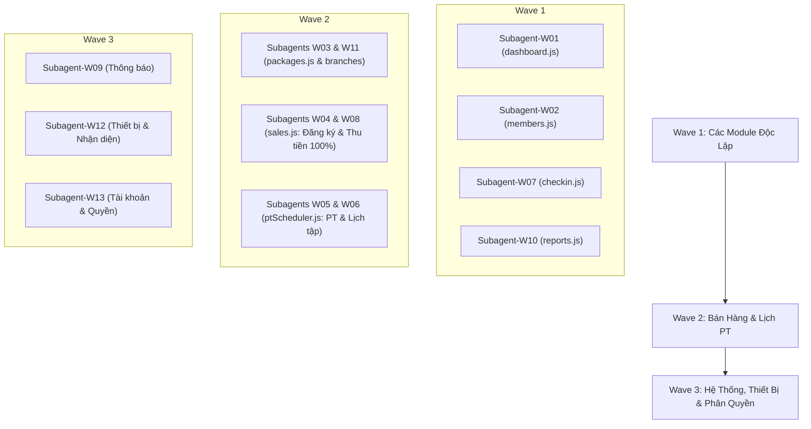

# Kế Hoạch Triển Khai: Rà Soát & Thực Thi 100% Khớp Nối 43 User Stories Thuộc 13 Epics QTV

## 1. Mục Tiêu & Nguyên Tắc Tối Thượng

1. Tuyệt đối **KHÔNG ĐƯỢC CHỈNH SỬA** bất kỳ ký tự nào trong `docs/user-stories/qtv/` hay `docs/epic/qtv/` (Main Flow & Activity Diagram là chuẩn mực chân lý tối cao của dự án).
2. Toàn bộ mã nguồn Web Admin (`frontend/web/`) và Backend REST APIs phải được hoàn thiện để **thực thi đúng 100% theo từng bước của Main Flow và Activity Diagram** trong tài liệu.
3. Tuyệt đối không sử dụng mock data hay hardcoded data; toàn bộ luồng nghiệp vụ tương tác trực tiếp với PostgreSQL 22 bảng qua `apiClient`.

---

## 2. Phân Chia 13 Subagent Chuyên Trách Theo 13 Epics QTV

Hệ thống điều phối **13 Subagent chuyên trách** tương ứng với 13 Menu (Epic) và 43 User Stories của Quản trị viên (QTV):

| Subagent ID | Menu / Epic Chuyên Trách | Danh Sách User Stories (43 US) | File Frontend Phụ Trách |
| :--- | :--- | :--- | :--- |
| **Subagent-W01** | **QTV-W01 · Tổng quan vận hành** | `QTV-W01-US01` (Xem tổng quan) | `frontend/web/js/modules/dashboard.js` |
| **Subagent-W02** | **QTV-W02 · Hội viên & khách hàng** | `QTV-W02-US01` $\rightarrow$ `US04` (Thêm, Sửa, Đổi trạng thái, Xem DS) | `frontend/web/js/modules/members.js` |
| **Subagent-W03** | **QTV-W03 · Gói tập** | `QTV-W03-US01` $\rightarrow$ `US04` (Xem DS, Thêm, Sửa, Ngừng bán) | `frontend/web/js/modules/packages.js` |
| **Subagent-W04** | **QTV-W04 · Đăng ký & gia hạn** | `QTV-W04-US01` $\rightarrow$ `US05` (Tạo mới, Gia hạn, Xem DS, Xem chi tiết, Gán PT) | `frontend/web/js/modules/sales.js` |
| **Subagent-W05** | **QTV-W05 · Huấn luyện viên** | `QTV-W05-US01` $\rightarrow$ `US04` (Thêm, Sửa, Cập nhật trạng thái, Xem DS) | `frontend/web/js/modules/ptScheduler.js` |
| **Subagent-W06** | **QTV-W06 · Lịch tập & buổi PT** | `QTV-W06-US01` $\rightarrow$ `US04` (Xem lịch, Đặt lịch, Xác nhận kết quả, Hủy lịch) | `frontend/web/js/modules/ptScheduler.js` |
| **Subagent-W07** | **QTV-W07 · Ra vào & check-in** | `QTV-W07-US01` $\rightarrow$ `US03` (Kiosk tự động, Vào/Ra thủ công, Nhật ký & Cảnh báo) | `frontend/web/js/modules/checkin.js` |
| **Subagent-W08** | **QTV-W08 · Thu tiền & thanh toán** | `QTV-W08-US01` $\rightarrow$ `US03` (DS payment, Tạo payment 100%, Thống kê) | `frontend/web/js/modules/sales.js` |
| **Subagent-W09** | **QTV-W09 · Thông báo** | `QTV-W09-US01` $\rightarrow$ `US04` (Cấu hình tự động, Mẫu in-app, Lịch sử gửi, Chi tiết) | `frontend/web/js/modules/system.js` |
| **Subagent-W10** | **QTV-W10 · Báo cáo** | `QTV-W10-US01` (Xem báo cáo tổng hợp) | `frontend/web/js/modules/reports.js` |
| **Subagent-W11** | **QTV-W11 · Chi nhánh** | `QTV-W11-US01` $\rightarrow$ `US04` (Xem DS, Thêm, Chỉnh sửa, Xem số liệu) | `frontend/web/js/modules/packages.js` |
| **Subagent-W12** | **QTV-W12 · Hệ thống & thiết bị** | `QTV-W12-US01` $\rightarrow$ `US04` (Thiết bị cổng, Đăng ký nhận diện, Rút consent, Sự cố) | `frontend/web/js/modules/system.js` |
| **Subagent-W13** | **QTV-W13 · Tài khoản & phân quyền** | `QTV-W13-US01` $\rightarrow$ `US02` (DS tài khoản & KPI, Sửa tài khoản) | `frontend/web/js/modules/system.js` |

---

## 3. Chiến Lược Thực Thi Chống Xung Đột Code (3 Waves Phân Tầng)

Do một số file JavaScript được chia sẻ giữa 2-3 Menu (ví dụ: `sales.js` dùng cho cả W04 và W08; `ptScheduler.js` dùng cho cả W05 và W06; `system.js` dùng cho W09, W12, W13), quá trình thực thi được tổ chức thành **3 Đợt (Waves)** tuần tự:

### Quy trình 4 bước của từng Subagent:
1. **Bước 1 — Đọc & Phân Tích (Read-only):** Đọc kỹ tài liệu Epic tương ứng (`docs/epic/qtv/`) và toàn bộ các file User Story trong thư mục (`docs/user-stories/qtv/QTV-WXX...`). Ghi nhận chính xác: Trigger, Preconditions, Main Flow (từng bước 1, 2, 3...), Alternate Flows, Exception Flows, và sơ đồ Mermaid Swimlane.
2. **Bước 2 — Đối Chiếu Code Hiện Tại (Audit):** Mở file JavaScript và HTML tương ứng, kiểm tra xem giao diện (DevExtreme DataGrid, Form, Popup, SelectBox) và các hàm xử lý API đã thực hiện đúng từng bước nghiệp vụ và luồng quyết định (decision diamond) trong sơ đồ Swimlane hay chưa.
3. **Bước 3 — Sửa Code Khớp 100% (Remediation):** Bổ sung/điều chỉnh code UI, validate form, gọi API tương ứng, hiển thị thông báo lỗi/thành công, popup xác nhận theo đúng chuẩn của từng User Story.
4. **Bước 4 — Nghiệm Thu & Báo Cáo:** Chạy kiểm tra thực tế trên trình duyệt và xác nhận từng User Story đã PASS 100%.

---

## 4. Kế Hoạch Kiểm Thử & Nghiệm Thu (Verification Plan)

- **Kiểm thử tự động Backend (`npm test`):** Đảm bảo toàn bộ 75/75 test cases backend không bị ảnh hưởng và hoạt động trơn tru.
- **Kiểm thử giao diện Web Admin (`http://localhost:3000/web/`):**
  - Mở từng menu từ W01 đến W13 trên Web QTV.
  - Thao tác thử nghiệm từng nút bấm, form nhập liệu, popup xác nhận theo đúng kịch bản của từng User Story.
- **Báo cáo kết quả:** Lập bảng ma trận nghiệm thu (Traceability Matrix) đánh dấu trạng thái của 43 User Stories.
