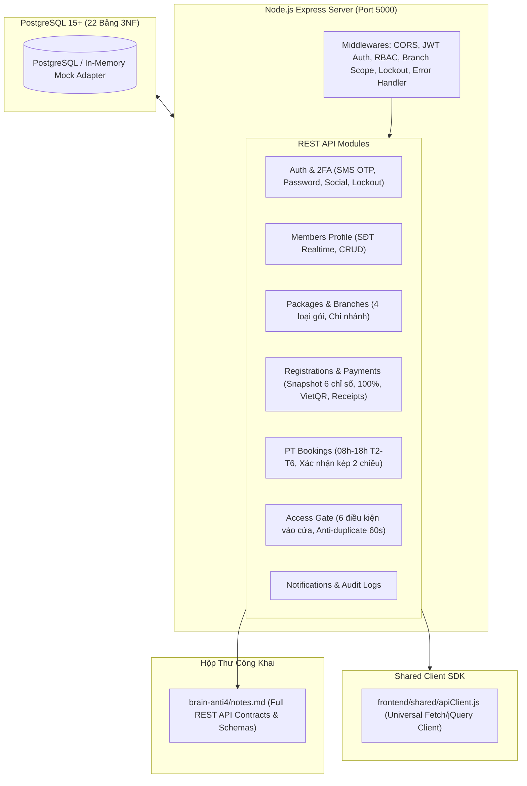

# Kế Hoạch Triển Khai Backend & Database Lead (Tab 4) — Paradise Gym

- **Vai trò định danh:** `anti-4-Core-BE-DB` (Backend & Database Lead)
- **Phạm vi mã nguồn chuyên trách:** Thư mục `backend/` và `frontend/shared/apiClient.js`
- **Tài liệu tham chiếu:** [`docs/database/erd.md`](file:///e:/Desktop/Paradise%20Gym-v2/docs/database/erd.md), [`docs/implementation-plan.md`](file:///e:/Desktop/Paradise%20Gym-v2/docs/implementation-plan.md), [`AGENTS.md`](file:///e:/Desktop/Paradise%20Gym-v2/AGENTS.md)

---

## 1. Tóm Tắt Mục Tiêu Kỹ Thuật

Triển khai toàn diện hạ tầng Backend REST API và CSDL cho hệ thống Paradise Gym, bảo đảm 100% tuân thủ mô hình 22 bảng 3NF, snapshot giá bất biến và các quy tắc nghiệp vụ khắt khe đã được chuẩn hóa.



---

## 2. Thiết Kế Kiến Trúc Chi Tiết

### 2.1. Cấu Trúc Thư Mục Backend (`backend/`)
```
backend/
├── package.json
├── .env.example
├── src/
│   ├── config/
│   │   ├── env.js                     # Đọc biến môi trường, cổng, secret JWT
│   │   └── db.js                      # Kết nối PostgreSQL pg.Pool + Fallback In-Memory Store
│   ├── db/
│   │   ├── migrations/
│   │   │   └── 001_create_tables.sql  # DDL 22 bảng chuẩn 3NF, đầy đủ constraints, FK & Indexes
│   │   ├── seeds/
│   │   │   └── 001_seed_data.sql      # Dữ liệu ban đầu: Roles, 2 Chi nhánh, 4 Gói tập, Tài khoản QTV/LT/PT/HV
│   │   └── initDb.js                  # Script tự động chạy migration & seeding
│   ├── middlewares/
│   │   ├── auth.js                    # Xác thực JWT Access Token
│   │   ├── rbac.js                    # Kiểm tra Role (QTV, RECEPTIONIST, PT, MEMBER)
│   │   ├── branchScope.js             # Kiểm tra phạm vi chi nhánh của nhân viên
│   │   ├── rateLimiter.js             # Chống brute-force & Lockout 15p
│   │   └── errorHandler.js            # Bắt lỗi chuẩn hóa JSON response
│   ├── modules/
│   │   ├── auth/                      # Controllers, Services & Routes cho Auth & 2FA
│   │   ├── members/                   # Hồ sơ hội viên, tìm kiếm SĐT
│   │   ├── packages/                  # Quản lý 4 loại gói & chi nhánh
│   │   ├── registrations/             # Đăng ký gói (Snapshot 6 trường), gia hạn
│   │   ├── payments/                  # Thu tiền 100%, VietQR động, Phiếu thu receipts
│   │   ├── pt-bookings/               # Lịch PT (08:00 - 18:00), Xác nhận kép 2 chiều
│   │   ├── access-gate/               # Kiểm tra 6 điều kiện ra vào, chống quét lặp 60s
│   │   ├── notifications/             # Thông báo in-app
│   │   └── audit-logs/                # Ghi nhật ký kiểm toán bất biến
│   ├── utils/
│   │   ├── otp.js                     # Sinh mã OTP 6 số ngẫu nhiên, TTL 60 giây
│   │   ├── vietqr.js                  # Sinh payload & URL chuẩn mã VietQR chuyển khoản
│   │   └── token.js                   # Ký và xác minh JWT Access / Refresh Token
│   └── server.js                      # Điểm khởi động Express Server
```

### 2.2. Chi Tiết Các Module Nghiệp Vụ Trọng Tâm

#### 1. Module Auth & Xác Thực 2 Lớp (2FA):
- **Đăng nhập mật khẩu (`POST /api/v1/auth/login-password`):** SĐT + Mật khẩu $\rightarrow$ nếu tài khoản bật 2FA trả về `requires_2fa: true, temp_token` và tự động gửi mã OTP SMS 6 số (TTL 60s).
- **Đăng nhập OTP không mật khẩu (`POST /api/v1/auth/request-otp` & `POST /api/v1/auth/login-otp`):** Nhập SĐT $\rightarrow$ gửi OTP SMS 6 số $\rightarrow$ nhập OTP để nhận JWT Token.
- **Xác thực 2FA (`POST /api/v1/auth/verify-2fa`):** Gửi `temp_token` + `otp_code` (6 số trong 60s) $\rightarrow$ nếu hợp lệ cấp `access_token` và `refresh_token`.
- **Account Lockout (Khóa 15 phút):** Đếm số lần nhập sai mật khẩu/OTP liên tiếp (`failed_login_attempts >= 5`) $\rightarrow$ Khóa tài khoản trong 15 phút (`locked_until`), trả về HTTP 423 Locked.
- **Social Login (`POST /api/v1/auth/social-login`):** Endpoint xử lý OAuth2 Google / Microsoft dành cho QTV và Lễ tân.

#### 2. Module Members (Hồ Sơ Hội Viên):
- `GET /api/v1/members/search-phone?phone=...`: Tra cứu SĐT thời gian thực (realtime check chống trùng và điền nhanh).
- `POST /api/v1/members`: Tạo hồ sơ hội viên mới kèm chi nhánh gốc (`home_branch_id`), tự sinh mã `member_code` (`HV001`...).
- `GET /api/v1/members/:id`: Xem hồ sơ, danh sách gói tập đã mua, lịch sử vào ra và lịch sử tập PT.

#### 3. Module Packages & Branches:
- Quản lý danh mục 4 loại gói: `GYM_TIME`, `GYM_SESSION`, `PT_SESSION`, `COMBO`.
- Ánh xạ chi nhánh áp dụng qua bảng `package_branches`.
- Đảm bảo khi sửa giá gói chỉ tác động các đơn mua mới, không sửa đè gói đã bán.

#### 4. Module Registrations & Payments (Snapshot & Thu Tiền 100%):
- **Cơ chế Snapshot:** Khi gọi `POST /api/v1/registrations`, hệ thống lưu nguyên trạng 6 chỉ số: `package_name_snapshot`, `package_type_snapshot`, `price_snapshot`, `duration_days_snapshot`, `total_gym_sessions_snapshot`, `total_pt_sessions_snapshot` cùng các chi nhánh được phép (`registration_allowed_branches`).
- `POST /api/v1/payments/create-invoice`: Khởi tạo thanh toán 100% giá trị hợp đồng.
- **Phương thức Tiền mặt (`CASH`):** Lễ tân xác nhận đã thu đủ $\rightarrow$ chuyển trạng thái gói thành `ACTIVE` (hoặc `SCHEDULED` nếu start_date tương lai) $\rightarrow$ tự động sinh phiếu thu `receipts` bất biến.
- **Phương thức VietQR (`BANK_TRANSFER_VIETQR`):** Sinh chuỗi VietQR chuẩn NAPAS 247 kèm số tài khoản, mã thanh toán `PAY-...` và số tiền chính xác để hiển thị mã QR động trên Web/Mobile; webhook/xác nhận đối soát cập nhật sang `COMPLETED`.

#### 5. Module PT Bookings (Lịch Dạy & Xác Nhận Kép):
- Quy tắc khung giờ cố định của PT: `08:00 - 18:00`, Thứ 2 đến Thứ 6 (mỗi slot 1-2 tiếng).
- `GET /api/v1/pt-bookings/available-slots`: Kiểm tra slot trống không bị trùng với booking đang có.
- **Chính sách hủy:** Nếu hủy trước 12h: Giải phóng slot, không trừ buổi (`is_deducted = FALSE`). Nếu hủy muộn dưới 12h hoặc vắng mặt: Khấu trừ 1 buổi (`is_deducted = TRUE`).
- **Cơ chế Xác nhận kép 2 chiều:**
  - PT bấm xác nhận hoàn thành: Gọi `POST /api/v1/pt-bookings/:id/pt-confirm` $\rightarrow$ ghi nhận `pt_confirmed_at = NOW()`, status chuyển `PENDING_COMPLETION`.
  - Hội viên bấm xác nhận đối ứng: Gọi `POST /api/v1/pt-bookings/:id/member-confirm` $\rightarrow$ ghi nhận `member_confirmed_at = NOW()`.
  - Khi cả hai đã xác nhận: Trạng thái chuyển thành `COMPLETED`, `is_deducted = TRUE`, đồng thời trừ 1 buổi `remaining_pt_sessions` trong bản ghi `registrations`.

#### 6. Module Access Gate (Kiểm Soát Vào Cửa):
- `POST /api/v1/access-gate/check-in`: Nhận tín hiệu từ FaceID / RFID thẻ / Quét QR tại cửa.
- **Kiểm tra 6 điều kiện:**
  1. Trạng thái hội viên `member_profiles.status == 'ACTIVE'`.
  2. Gói tập có hiệu lực (`start_date <= TODAY <= end_date` và status in `['ACTIVE']`).
  3. Đã hoàn tất thanh toán 100% (`payments.status == 'COMPLETED'`).
  4. Chi nhánh vào cửa thuộc danh sách cho phép (`registration_allowed_branches`).
  5. Còn số buổi tập (với gói `GYM_SESSION` hoặc `COMBO`, `remaining_gym_sessions > 0`).
  6. Trong giờ mở cửa của chi nhánh (`open_time <= NOW() <= close_time`).
- **Chống quét lặp (Anti-duplicate 60s):** Nếu quét cùng chiều trong 60 giây $\rightarrow$ cảnh báo quét lặp `is_duplicate_warning = TRUE`, không trừ thêm lượt.
- **Khấu trừ buổi Gym:** Chỉ trừ tối đa 1 buổi/ngày (`is_gym_session_deducted = TRUE`).
- `POST /api/v1/access-gate/manual-checkin`: Lễ tân ghi nhận ra vào thủ công khi thiết bị lỗi.

### 2.3. Thư Viện Dùng Chung (`frontend/shared/apiClient.js`)
- Cung cấp class `ApiClient` hỗ trợ cả trình duyệt thường và jQuery UI (kết nối trực tiếp với DevExtreme `dxDataGrid` CustomStore).
- Tự động đính kèm `Authorization: Bearer <token>`, tự động refresh token khi nhận HTTP 401.
- Các hàm tiện ích đóng gói sẵn theo từng module: `api.auth.*`, `api.members.*`, `api.packages.*`, `api.registrations.*`, `api.payments.*`, `api.pt.*`, `api.gate.*`.

---

## 3. Kế Hoạch Triển Khai Chi Tiết & Phân Bổ Subagents

Theo chỉ đạo của Lead Backend & DB:

### Giai Đoạn 1: Cơ Sở Dữ Liệu & Khung Nền (Subagent BE-1)
- Tạo `backend/package.json` với các thư viện: `express`, `pg`, `cors`, `helmet`, `dotenv`, `jsonwebtoken`, `bcryptjs`.
- Tạo file DDL `backend/src/db/migrations/001_create_tables.sql` bao gồm 22 bảng chuẩn 3NF, khóa ngoại, unique constraints và 5 nhóm indexes tối ưu.
- Tạo file Seed `backend/src/db/seeds/001_seed_data.sql` nạp sẵn 4 roles (`QTV`, `RECEPTIONIST`, `PT`, `MEMBER`), 2 chi nhánh mẫu (`CN-Q01`, `CN-BT01`), 4 gói tập mẫu (`GYM-1M`, `GYM-10S`, `PT-10S`, `COMBO-VIP`), tài khoản Quản trị viên gốc và hồ sơ nhân sự mẫu.
- Cấu hình database adapter với hỗ trợ cả kết nối PostgreSQL thực tế và In-Memory Database Fallback (giúp toàn bộ API chạy thông suốt ngay cả khi máy local chưa bật service PostgreSQL).

### Giai Đoạn 2: Auth Engine, Social & 2FA (Subagent BE-2)
- Viết module Auth: Đăng nhập mật khẩu, Đăng nhập OTP SMS 60s, Xác thực 2 bước 2FA, Khóa bảo vệ 15 phút khi sai 5 lần, Google/Microsoft OAuth2 mock endpoint, Middleware JWT & RBAC & Branch Scope.

### Giai Đoạn 3: Business APIs — Members, Packages, Sales & Payments (Subagent BE-3)
- Viết controller, service, routes cho Members (tìm SĐT realtime, CRUD hồ sơ).
- Viết module Packages & Branches.
- Viết module Registrations: Lưu snapshot 6 trường bất biến, gia hạn gói.
- Viết module Payments: Thu tiền mặt 100%, sinh mã VietQR động, sinh chứng từ `receipts`.

### Giai Đoạn 4: Operations APIs — PT Bookings & Access Gate (Subagent BE-4)
- Viết module PT Bookings: Tra cứu slot 08h-18h T2-T6, đặt lịch, hủy lịch theo quy tắc 12h, xác nhận kép 2 chiều PT & Member để trừ buổi.
- Viết module Access Gate: Thuật toán kiểm tra 6 điều kiện ra vào, chống quét lặp 60s, ghi nhận thủ công.
- Viết Notifications & Audit Logs.

### Giai Đoạn 5: SDK Dùng Chung & Xuất Bản Hộp Thư `brain-anti4/`
- Tạo `frontend/shared/apiClient.js`.
- Tạo tài liệu kết nối API chi tiết vào `brain-anti4/notes.md` và `brain-anti4/f3e35fdf-b62d-490a-b966-5bfef9037ca3/api_contracts.md` để các Tab Frontend (Tab 1 Web Admin, Tab 2 Mobile HV, Tab 3 Mobile PT) dễ dàng tích hợp.

---

## 4. Kế Hoạch Xác Minh (Verification Plan)

### Kiểm Tra Tự Động & Tích Hợp:
- Chạy script kiểm tra khởi tạo CSDL và seed data: Đảm bảo 22 bảng được nạp đầy đủ.
- Chạy test script kiểm thử toàn diện luồng REST API qua HTTP requests:
  1. *Test Auth:* Đăng nhập mật khẩu $\rightarrow$ Kích hoạt 2FA $\rightarrow$ Gửi OTP $\rightarrow$ Xác thực 2FA thành công nhận JWT. Thử nhập sai 5 lần $\rightarrow$ Kiểm tra HTTP 423 Account Lockout.
  2. *Test Members:* Tìm kiếm SĐT realtime $\rightarrow$ Tạo hội viên mới.
  3. *Test Sales & Payments:* Tạo đăng ký gói $\rightarrow$ Kiểm tra snapshot 6 trường $\rightarrow$ Thanh toán 100% $\rightarrow$ Tạo phiếu thu `receipts`.
  4. *Test PT Bookings:* Đặt lịch PT $\rightarrow$ PT xác nhận $\rightarrow$ Hội viên xác nhận $\rightarrow$ Kiểm tra chuyển status `COMPLETED` và trừ 1 buổi PT.
  5. *Test Access Gate:* Kiểm tra quẹt thẻ thành công (6 điều kiện) $\rightarrow$ Quét lại trong 60s kiểm tra cảnh báo `is_duplicate_warning` $\rightarrow$ Thử vào với gói hết hạn/chưa thanh toán để xác nhận bị từ chối (`DENIED`).
