# HV01-US01 - Xem tổng quan và thao tác nhanh

## Preconditions
- Hội viên đã đăng nhập Mobile bằng tài khoản hợp lệ.
- Hệ thống xác định đúng hồ sơ hội viên hiện hành.

## Trigger

- Hội viên mở tab `HV01 · Trang chủ`.

## Main Flow

1. Hội viên mở trang chủ.
2. Hệ thống tải snapshot gói, yêu cầu PT và session sắp tới của chính Hội viên.
3. Hệ thống hiển thị lời chào và trạng thái cần xử lý.
4. Hệ thống hiển thị lịch sắp tới nếu có.
5. Hội viên chọn `Xem lịch của tôi`, `Mua gói`, `Gói của tôi` hoặc `Xem yêu cầu PT` để chuyển sang tab tương ứng.
6. **Quy tắc nghiệp vụ:** Trang chủ chỉ đọc và điều hướng; không chỉnh sửa trực tiếp gói, thanh toán hoặc booking. Thông báo nghiệp vụ có thể được mở từ biểu tượng thông báo trên header, nhưng không tạo thêm menu footer.

## Alternate Flows

### AF-01

- Nếu không có việc cần xử lý, hệ thống hiển thị trạng thái rỗng và gợi ý mua gói hoặc đặt lịch.

### AF-02

- Nếu có yêu cầu PT đang chờ, thẻ cảnh báo hiển thị PT được yêu cầu và nút mở `HV03 · Gói của tôi`.

### AF-03

- Nếu chưa có session sắp tới, hệ thống hiển thị `Chưa có lịch sắp tới`.

## Exception Flows

- Không tải được dữ liệu: hiển thị trạng thái lỗi và không hiển thị dữ liệu cũ như dữ liệu mới.
- Dữ liệu không thuộc Hội viên hiện hành không được đưa vào dashboard.

## Activity Diagram — Swimlane

```mermaid
flowchart TB
  subgraph B["Boundary — Mobile App Hội viên / HV01 · Trang chủ"]
    subgraph L0["Swimlane — Hội viên"]
      I01(("Initial"))
      A01["Mở tab HV01 · Trang chủ"]
      A02["Xem dashboard đã tổng hợp"]
      D03{"Hội viên chọn thao tác nào?"}
      N01["Điều hướng HV02 · Lịch tập"]
      N02["Điều hướng HV03 · Gói của tôi"]
      N03["Mở HV03 · Yêu cầu PT"]
      N04["Tiếp tục ở HV01"]
      M03(("Merge — đã chọn hoặc giữ nguyên màn hình"))

      I01 --> A01
      A10 --> A02
      A02 --> D03
      D03 -->|Xem lịch của tôi| N01
      D03 -->|Mua gói hoặc Gói của tôi| N02
      D03 -->|Xem yêu cầu PT| N03
      D03 -->|Không thao tác| N04
      N01 --> M03
      N02 --> M03
      N03 --> M03
      N04 --> M03
    end

    subgraph L1["Swimlane — SYS"]
      S01["Xác định session và hồ sơ Hội viên hiện hành"]
      D01{"Tải snapshot thành công?"}
      E01["Hiển thị trạng thái lỗi; không dùng dữ liệu cũ như dữ liệu mới"]
      S02["Tải snapshot gói"]
      S03["Tải yêu cầu PT"]
      S04["Tải session sắp tới"]
      J01{{"Join — đủ 3 snapshot"}}
      S05["Hiển thị lời chào và trạng thái cần xử lý"]
      D02{"Có việc cần xử lý?"}
      S06["Hiển thị thẻ cảnh báo và việc cần làm"]
      S07["Hiển thị trạng thái rỗng; gợi ý mua gói hoặc đặt lịch"]
      M01(("Merge — trạng thái xử lý đã hiển thị"))
      D04{"Có session sắp tới?"}
      S08["Hiển thị lịch sắp tới"]
      S09["Hiển thị Chưa có lịch sắp tới"]
      M02(("Merge — lịch sắp tới đã hiển thị"))
      A10["Hiển thị dashboard cho Hội viên"]
      F01((("Final")))

      A01 --> S01
      S01 --> D01
      D01 -->|Không| E01
      E01 --> F01
      D01 -->|Có| S02
      D01 -->|Có| S03
      D01 -->|Có| S04
      S02 --> J01
      S03 --> J01
      S04 --> J01
      J01 --> S05
      S05 --> D02
      D02 -->|Có| S06
      D02 -->|Không| S07
      S06 --> M01
      S07 --> M01
      M01 --> D04
      D04 -->|Có| S08
      D04 -->|Không| S09
      S08 --> M02
      S09 --> M02
      M02 --> A10
      M03 --> F01
    end
  end
```

