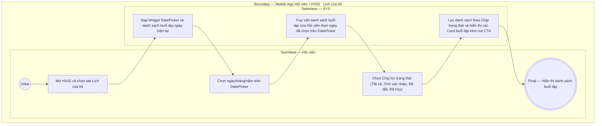

# HV02-US01 - Xem lịch tập và lọc trạng thái buổi PT

## Preconditions
- Hội viên đã đăng nhập Mobile bằng tài khoản hợp lệ.
- Hội viên truy cập tab **Lịch của tôi** trên menu **HV02 · Lịch tập**.

## Trigger
- Hội viên mở tab `HV02 · Lịch tập` và chọn sub-tab `Lịch của tôi`.
- Màn hình liên quan: Mobile App — Tab `HV02 · Lịch tập`, sub-tab `Lịch của tôi`.

## Main Flow

1. Hội viên mở sub-tab **Lịch của tôi**.
2. SYS nạp và hiển thị **Widget DatePicker / Lịch tháng** (ví dụ `< Tháng 9 Năm 2026 >`) và danh sách buổi tập của Hội viên theo ngày mặc định (ngày hiện tại).
3. Hội viên chọn ngày/tháng/năm cần xem trên DatePicker.
4. SYS nạp và hiển thị danh sách các buổi tập PT của Hội viên trong ngày đã chọn.
5. Hội viên chọn bộ lọc trạng thái qua các Chip: `Tất cả (n)`, `Chờ xác nhận (n)`, `Đã đặt (n)`, `Đã hủy (n)`.
6. SYS cập nhật danh sách hiển thị các thẻ (Card) buổi tập tương ứng bao gồm:
   - **Khung giờ & Chi nhánh**: Giờ bắt đầu (ví dụ `09:00`), Chi nhánh phục vụ (ví dụ `Quận 1`).
   - **Thông tin nhân sự & Gói**: Họ tên Hội viên, Họ tên PT phụ trách (`Nguyễn Thành Long`), Tên gói tập (`PT 20 buổi`).
   - **Trạng thái & Thao tác**: Badge trạng thái (`Chờ xác nhận hoàn thành`, `Đã đặt`, `Đã hủy`) và nút CTA thao tác nhanh (`[ Xác nhận hoàn thành ]` hoặc `[ Hủy lịch ]`).

- **Business rules / logic:**
  - Màn hình mặc định tải danh sách buổi tập trong ngày được chọn trên DatePicker.
  - Các trạng thái booking bao gồm: `AWAITING_CONFIRMATION` (Chờ xác nhận hoàn thành hoặc chờ PT nhận lịch), `UPCOMING` (Đã đặt), `DONE` (Hoàn thành), `CANCELLED` (Đã hủy).
  - Xem lịch không làm thay đổi số buổi khả dụng hoặc trạng thái của gói tập.

## Alternate Flows

### AF-01 — Không có buổi tập trong ngày/trạng thái đã chọn
1. Hội viên chọn một ngày hoặc bộ lọc trạng thái không có buổi tập nào.
2. SYS hiển thị thông báo rỗng: `Chưa có buổi tập nào trong ngày này` hoặc `Chưa có buổi tập ở trạng thái này`.

## Exception Flows

- Không cho phép Hội viên truy cập lịch tập của tài khoản khác.
- Lỗi kết nối mạng: SYS hiển thị thông báo lỗi nạp dữ liệu và nút bấm thử lại.

## Activity Diagram — Swimlane
**Trigger:** Hội viên chọn tab Lịch của tôi trong HV02.

