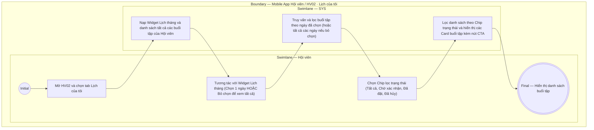

# HV02-US01 - Xem lịch tập và lọc trạng thái buổi PT

## Preconditions
- Hội viên đã đăng nhập Mobile bằng tài khoản hợp lệ.
- Hội viên truy cập tab **Lịch của tôi** trên menu **HV02 · Lịch tập**.

## Trigger
- Hội viên mở tab `HV02 · Lịch tập` và chọn sub-tab `Lịch của tôi`.
- Màn hình liên quan: Mobile App — Tab `HV02 · Lịch tập`, sub-tab `Lịch của tôi`.

## Main Flow

1. Hội viên mở sub-tab **Lịch của tôi**.
2. SYS nạp và hiển thị **Widget Lịch tháng (Month Calendar)** dạng bảng lưới (hiển thị tiêu đề `< Tháng X Năm YYYY >`, các thứ từ `T2` đến `CN`) và danh sách tất cả các buổi tập của Hội viên.
3. Hội viên có thể tương tác với Widget Lịch tháng để lọc danh sách:
   - **Chọn một ngày cụ thể** (ví dụ click vào ngày `11`): Ngày được chọn được highlight vòng tròn xanh; SYS tự động lọc danh sách buổi tập bên dưới chỉ hiển thị các buổi tập của ngày đó.
   - **Bỏ chọn ngày (Deselect / Toggle)**: Click lại vào chính ngày đang được chọn; trạng thái chọn được xóa bỏ, SYS tự động hiển thị lại **Tất cả các buổi tập** của Hội viên.
4. Hội viên chọn bộ lọc trạng thái qua các Chip: `Tất cả (n)`, `Chờ xác nhận (n)`, `Đã đặt (n)`, `Đã hủy (n)`.
5. SYS cập nhật danh sách hiển thị các thẻ (Card) buổi tập tương ứng bao gồm:
   - **Khung giờ & Chi nhánh**: Giờ bắt đầu (ví dụ `09:00`), Chi nhánh phục vụ (ví dụ `Quận 1`).
   - **Thông tin nhân sự & Gói**: Họ tên Hội viên, Họ tên PT phụ trách (`Nguyễn Thành Long`), Tên gói tập (`PT 20 buổi`).
   - **Trạng thái & Thao tác**: Badge trạng thái (`Chờ xác nhận hoàn thành`, `Đã đặt`, `Đã hủy`) và nút CTA thao tác nhanh (`[ Xác nhận hoàn thành ]` hoặc `[ Hủy lịch ]`).

- **Business rules / logic:**
  - Widget Lịch tháng hoạt động như một bộ lọc dạng chuyển đổi (Toggle Filter / Trigger): Chọn một ngày sẽ lọc theo ngày đó; click lại để bỏ chọn ngày sẽ chuyển sang hiển thị toàn bộ lịch tập.
  - Các trạng thái booking bao gồm: `AWAITING_CONFIRMATION` (Chờ xác nhận hoàn thành hoặc chờ PT nhận lịch), `UPCOMING` (Đã đặt), `DONE` (Hoàn thành), `CANCELLED` (Đã hủy).
  - Xem lịch không làm thay đổi số buổi khả dụng hoặc trạng thái của gói tập.

### Field-level specification — Sub-tab Lịch của tôi (HV02-US01)

**Phạm vi thao tác:** Điều kiện nút Hủy/Xác nhận bên dưới chỉ áp dụng khi `booking.member_id` khớp `member_profile_id` của người đăng nhập (chủ lịch cá nhân hoặc trưởng nhóm của lịch nhóm). Thành viên nhóm khác chỉ xem; ẩn cả hai nút trên danh sách và thẻ lịch theo giờ, không mở dialog khi chạm thẻ. Quyền lấy từ API, không suy đoán theo tên hoặc thứ tự người tham gia.
| Field / control | Loại UI Control | State | Required | Conditional / dynamic | Source / validation |
| :--- | :--- | :--- | :--- | :--- | :--- |
| **Lịch tháng (Calendar Picker)** | `Calendar / Grid` | `USER-INPUT` | optional | `TRIGGER`: Chọn 1 ngày cụ thể sẽ kích hoạt lọc *Danh sách buổi tập* theo đúng ngày đó; click lại vào ngày đang chọn để bỏ chọn (deselect) sẽ kích hoạt hiển thị tất cả buổi tập | Widget lưới lịch tháng dạng bảng 7 cột (`T2`–`CN`), tiêu đề `< Tháng X Năm YYYY >` kèm 2 nút chuyển tháng `< >`. Ngày được chọn highlight vòng tròn màu xanh |
| **Bộ lọc Chip trạng thái** | `Chip group / Segmented control` | `USER-INPUT` | required | `DYNAMIC`: Số lượng `(n)` trong ngoặc tự tính theo phạm vi ngày đang chọn (hoặc tất cả ngày nếu không chọn ngày) | Cho phép chọn 1 trong các chip: `Tất cả`, `Chờ xác nhận`, `Đã đặt`, `Đã hoàn thành`, `Đã hủy` |
| **Thẻ buổi tập (Session Card)** | `Card list item` | `READONLY` | required | `DYNAMIC`: Danh sách các thẻ thay đổi theo phạm vi ngày được chọn ở trường TRIGGER *Lịch tháng* (hoặc tất cả các ngày nếu không chọn ngày) và theo *Bộ lọc Chip trạng thái*. Màu sắc thẻ chuẩn semantic: `Đã đặt` (Xanh dương), `Chờ xác nhận` (Vàng), `Đã hoàn thành` (Xanh lá), `Đã hủy` (Đỏ) | Record booking của Hội viên, hiển thị đầy đủ: Khung giờ bắt đầu - kết thúc, Tên chi nhánh, Họ tên PT phụ trách, Tên gói tập và Badge trạng thái |
| **Nút `[ Xác nhận hoàn thành ]` trên Card** | `Button / CTA` | `USER-INPUT` | conditional | `CONDITIONAL`: **Hiện khi** booking ở trạng thái `Đã đặt` hoặc `Chờ xác nhận`; **Ẩn khi** booking ở trạng thái `Đã hoàn thành` hoặc `Đã hủy`. **Trạng thái hiển thị theo thời gian:** (1) Trước giờ kết thúc buổi tập: Nút màu xám (disabled, không bấm được); (2) Sau giờ kết thúc buổi tập: Nút sáng màu xanh lá (enabled, bấm để xác nhận kết quả). **Chuyển đổi trạng thái sau khi bấm:** Nếu PT chưa xác nhận -> Card chuyển thành `Chờ xác nhận` (Card vàng); Nếu PT đã xác nhận -> Card chuyển thành `Đã hoàn thành` (Card xanh lá) | Nút CTA xanh viền/nền (hoặc xám khi chưa hết giờ); bấm kích hoạt luồng xác nhận hoàn thành buổi tập (`HV02-US04`) |
| **Nút `[ Hủy lịch ]` trên Card** | `Button / Secondary` | `USER-INPUT` | conditional | `CONDITIONAL`: **Hiện khi** booking ở trạng thái `Đã đặt` và chưa đến giờ bắt đầu buổi tập (`now < start_time`); **Ẩn khi** đã đến/qua giờ bắt đầu hoặc ở trạng thái `Chờ xác nhận`, `Đang diễn ra`, `Đã hoàn thành`, `Đã hủy` | Nút phụ màu đỏ nhạt viền đỏ; bấm mở Modal xác nhận hủy lịch (`HV02-US03`) |

## Alternate Flows

### AF-01 — Không có buổi tập trong ngày/trạng thái đã chọn
1. Hội viên chọn một ngày hoặc bộ lọc trạng thái không có buổi tập nào.
2. SYS hiển thị thông báo rỗng: `Chưa có buổi tập nào trong ngày này` hoặc `Chưa có buổi tập ở trạng thái này`.

## Exception Flows

- Không cho phép Hội viên truy cập lịch tập của tài khoản khác.
- Lỗi kết nối mạng: SYS hiển thị thông báo lỗi nạp dữ liệu và nút bấm thử lại.

## Activity Diagram — Swimlane
**Trigger:** Hội viên chọn tab Lịch của tôi trong HV02.

