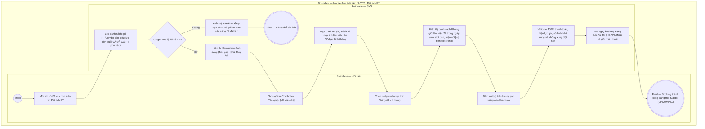

# HV02-US02 - Đặt lịch PT từ slot trống

## Preconditions
- Hội viên đã đăng nhập Mobile bằng tài khoản hợp lệ.
- Hội viên sở hữu ít nhất một đăng ký gói PT hoặc Combo (PT + Gym) còn hiệu lực, còn số buổi sử dụng và **đã có PT phụ trách** (assignment đã được PT chấp nhận).

## Trigger
- Hội viên chọn sub-tab `Đặt lịch PT` trong tab `HV02 · Lịch tập`.
- Màn hình liên quan: Mobile App — Tab `HV02 · Lịch tập`, sub-tab `Đặt lịch PT`.

## Main Flow

1. Hội viên chọn sub-tab **Đặt lịch PT**.
2. SYS lọc và nạp vào Combobox **"Chọn gói muốn sử dụng"** danh sách các gói PT hoặc Combo (PT + Gym) của Hội viên thỏa mãn đồng thời các điều kiện:
   - Đã thanh toán 100%.
   - Gói còn trong hạn sử dụng và còn số buổi tập chưa sử dụng.
   - **Đã có PT phụ trách** (đã hoàn tất phân công PT).
   - *Lưu ý: Các gói PT/Combo chưa được phân công PT sẽ không hiển thị trong Combobox này.*
3. Định dạng hiển thị mỗi lựa chọn trong Combobox: `[Tên gói] · [Mã đăng ký]` (ví dụ: `Gói PT 20 buổi · DK002`).
4. Hội viên chọn một gói trong Combobox.
5. SYS hiển thị **Card thông tin PT phụ trách** (Avatar viết tắt, Họ tên PT, Chi nhánh phục vụ, thời lượng buổi tập) và nạp lịch làm việc của PT đó lên **Widget Lịch tháng**.
6. Hội viên chọn ngày muốn đăng ký tập trên Lịch tháng (mặc định highlight ngày được chọn với vòng tròn xanh dương).
7. SYS nạp và hiển thị danh sách các **Khung giờ làm việc (Slots 2 tiếng)** trong ngày đã chọn của PT dưới tiêu đề nhóm `KHUNG GIỜ · DD/MM/YYYY`. Tại từng khung giờ:
   - **Khung giờ trống:** Hiển thị thẻ `Khung giờ trống · Chọn để đặt` kèm nút CTA icon `[ + ]` màu xanh lá để Hội viên bấm đặt lịch.
   - **Khung giờ đã có lịch của người khác / PT bận:** Hiển thị thẻ làm mờ (disabled) có nhãn `Đã bận` / `Khung giờ đã kín` (ẩn toàn bộ thông tin hội viên khác để bảo đảm quyền riêng tư), khóa tương tác và không có nút `[ + ]`.
   - **Khung giờ là buổi tập của chính Hội viên:** Hiển thị thẻ buổi tập cá nhân theo trạng thái:
     - Trạng thái `Đã đặt`: Thẻ viền xanh dương kèm nút đỏ `[ Hủy lịch ]` (`HV02-US03`).
     - Trạng thái `Chờ xác nhận hoàn thành`: Thẻ viền vàng cam kèm nút xanh `[ Xác nhận hoàn thành ]` (`HV02-US04`).
     - Trạng thái `Hoàn thành`: Thẻ viền xanh lá (chỉ đọc, không có nút thao tác).
8. Hội viên bấm nút icon `[ + ]` tại một khung giờ trống.
9. SYS kiểm tra thanh toán 100%, hiệu lực gói, số buổi khả dụng và xác nhận không có xung đột khung giờ.
10. SYS tạo ngay lập tức booking ở trạng thái **`Đã đặt` (`UPCOMING`)** và giữ chỗ 1 buổi tập trong gói mà không cần chờ PT duyệt.

- **Business rules / logic:**
  - **Không cần chờ duyệt**: Đặt lịch thành công là thành công ngay, hệ thống khởi tạo booking với trạng thái **`Đã đặt` (`UPCOMING`)** và giữ khung giờ đó cho Hội viên.
  - Combobox `Chọn gói muốn sử dụng` lọc loại trừ hoàn toàn các gói chưa được phân công PT. Nếu Hội viên có gói PT chưa chọn PT, ứng dụng hiển thị nút gợi ý điều hướng sang menu `HV03 · Gói của tôi` để chọn PT trước.
  - Mỗi buổi tập PT có thời lượng chuẩn **2 tiếng** nằm trong 5 khung giờ làm việc cố định của PT.
  - Booking xuất hiện ngay ở sub-tab `Lịch của tôi` dưới danh mục `Đã đặt`.

### Field-level specification — Sub-tab Đặt lịch PT (HV02-US02)
| Field / control | Loại UI Control | State | Required | Conditional / dynamic | Source / validation |
| :--- | :--- | :--- | :--- | :--- | :--- |
| **Chọn gói muốn sử dụng** | `Select Dropdown (Combobox)` | `USER-INPUT` | required | `TRIGGER` | Đóng vai trò TRIGGER điều khiển toàn bộ màn hình: lọc danh sách các gói PT hoặc Combo (PT + Gym) của Hội viên thỏa mãn đồng thời: (1) Đã thanh toán 100%, (2) Gói còn trong hạn sử dụng, (3) Còn số buổi tập chưa sử dụng, (4) Đã có PT phụ trách (loại trừ các gói chưa phân công PT). Định dạng hiển thị: `[Tên gói] · [Mã đăng ký]` (ví dụ: `Gói PT 20 buổi · DK002`) |
| **Card thông tin PT phụ trách** | `Card Component` | `AUTO-FILL + READONLY` | required | `DYNAMIC`: Tự động hiển thị theo gói được chọn ở trường TRIGGER *Chọn gói muốn sử dụng* | Hiển thị Avatar viết tắt (ví dụ: `VT`), Họ tên PT phụ trách (ví dụ: `Nguyễn Văn Thể`), Tên chi nhánh và thời lượng buổi tập (ví dụ: `Quận 1 · Mỗi buổi 2 giờ`) |
| **Ngày xem lịch / Lịch tháng** | `Calendar Picker (Month Grid)` | `USER-INPUT` | required | `TRIGGER`: Chọn 1 ngày cụ thể trên lịch sẽ kích hoạt nạp các khung giờ làm việc của ngày đó bên dưới | Widget lưới lịch tháng dạng bảng 7 cột (`T2`–`CN`), tiêu đề `< Tháng X Năm YYYY >` kèm 2 nút chuyển tháng `< >`. Nạp lịch làm việc của PT phụ trách; ngày được chọn highlight vòng tròn màu xanh |
| **Lưới 5 khung giờ làm việc** | `Grid Container` | `READONLY` | conditional | `CONDITIONAL`: **Hiện khi** đã chọn gói hợp lệ trên combobox; **Ẩn khi** chưa chọn gói (Empty State) | Khung bố cục cố định 5 slot 2 tiếng (08:00–10:00, 10:00–12:00, 12:00–14:00, 14:00–16:00, 16:00–18:00) theo ngày được chọn trên Widget Lịch tháng |
| **Thẻ khung giờ trống** | `Slot Card Component (Available)` | `USER-INPUT` | conditional | `CONDITIONAL`: **Hiện khi** trong ngày có khung giờ chưa có lịch đặt; **Ẩn khi** tất cả các khung giờ trong ngày đều đã kín lịch hoặc PT bận | Thẻ card viền nét liền bo tròn màu xanh ngọc nhạt hiển thị giờ bắt đầu/kết thúc, nhãn `Khung giờ trống · Chọn để đặt` kèm nút CTA icon màu xanh lá **`[ + ]`** (nhấn để xác nhận tạo booking đặt lịch ngay lập tức) |
| **Thẻ khung giờ đã bận (Lịch của người khác / PT bận)** | `Slot Card Component (Disabled / Occupied)` | `READONLY` | conditional | `CONDITIONAL`: **Hiện khi** trong ngày có khung giờ đã bị học viên khác đặt hoặc PT bận; **Ẩn khi** tất cả các khung giờ trong ngày đều còn trống hoặc là lịch của chính hội viên | Thẻ card hiển thị khung giờ bị làm mờ (opacity thấp) và khóa tương tác (disabled), hiển thị nhãn `Đã bận` / `Khung giờ đã kín` (ẩn thông tin cá nhân của người khác để bảo đảm quyền riêng tư), không hiển thị nút `[ + ]` |
| **Thẻ buổi tập của chính Hội viên — Trạng thái `Đã đặt`** | `Booking Card Component (Booked Variant)` | `USER-INPUT / READONLY` | conditional | `CONDITIONAL`: **Hiện khi** trong ngày có khung giờ là buổi tập của chính Hội viên ở trạng thái `Đã đặt`; **Ẩn khi** trong ngày đó Hội viên không có buổi tập nào `Đã đặt` | Thẻ card viền bo cong bên trái màu xanh dương; hiển thị Khung giờ, Tên gói PT (xanh dương, ví dụ: "PT 20 buổi"), Trạng thái `Đã đặt` (xanh dương) kèm nút đỏ **`[ Hủy lịch ]`** (`HV02-US03`) |
| **Thẻ buổi tập của chính Hội viên — Trạng thái `Chờ xác nhận hoàn thành`** | `Booking Card Component (Awaiting Variant)` | `USER-INPUT / READONLY` | conditional | `CONDITIONAL`: **Hiện khi** trong ngày có khung giờ là buổi tập của chính Hội viên ở trạng thái `Chờ xác nhận hoàn thành`; **Ẩn khi** trong ngày đó Hội viên không có buổi tập nào `Chờ xác nhận hoàn thành` | Thẻ card viền bo cong bên trái màu vàng cam; hiển thị Khung giờ, Tên gói PT (vàng cam, ví dụ: "PT 20 buổi"), Trạng thái `Chờ xác nhận hoàn thành` (vàng cam) kèm nút xanh **`[ Xác nhận hoàn thành ]`** (`HV02-US04`) |
| **Thẻ buổi tập của chính Hội viên — Trạng thái `Hoàn thành`** | `Booking Card Component (Completed Variant)` | `READONLY` | conditional | `CONDITIONAL`: **Hiện khi** trong ngày có khung giờ là buổi tập của chính Hội viên ở trạng thái `Hoàn thành`; **Ẩn khi** trong ngày đó Hội viên không có buổi tập nào `Hoàn thành` | Thẻ card viền bo cong bên trái màu xanh lá; hiển thị Khung giờ, Tên gói PT (xanh lá, ví dụ: "PT 20 buổi"), Trạng thái `Hoàn thành` (xanh lá); không có nút thao tác |

## Alternate Flows

### AF-01 — Chưa có gói nào đã chọn PT
1. Hội viên mở sub-tab `Đặt lịch PT` nhưng không có gói PT/Combo nào đã có PT phụ trách.
2. SYS hiển thị thông báo rỗng: `Bạn chưa có gói PT nào sẵn sàng để đặt lịch`.

### AF-02 — Khung giờ vừa bị người khác đặt trước khi xác nhận
1. Khung giờ được chọn bị tài khoản khác đặt trước trong lúc Hội viên thao tác.
2. SYS từ chối tạo booking và hiển thị thông báo: `Khung giờ này vừa có người đặt, vui lòng chọn khung giờ khác`.

## Exception Flows

- Gói tập đã hết buổi hoặc hết hạn sử dụng: tự động ẩn khỏi Combobox.
- Lỗi kết nối mạng: SYS báo lỗi không thể tạo booking và hoàn tác giao dịch.

## Activity Diagram — Swimlane
**Trigger:** Hội viên chọn sub-tab Đặt lịch PT trong HV02.

