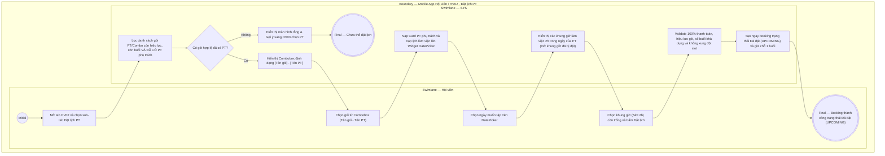

# HV02-US02 - Đặt lịch PT từ slot trống

## Preconditions
- Hội viên đã đăng nhập Mobile bằng tài khoản hợp lệ.
- Hội viên sở hữu ít nhất một đăng ký gói PT hoặc Combo (PT + Gym) còn hiệu lực, còn số buổi sử dụng và **đã có PT phụ trách** (assignment đã được PT chấp nhận).

## Trigger
- Hội viên chọn sub-tab `Đặt lịch PT` trong tab `HV02 · Lịch tập`.
- Màn hình liên quan: Mobile App — Tab `HV02 · Lịch tập`, sub-tab `Đặt lịch PT`.

## Main Flow

1. Hội viên chọn sub-tab **Đặt lịch PT**.
2. SYS lọc và nạp vào Combobox **"Chọn gói muốn sử dụng"** danh sách các gói PT hoặc Combo (PT + Gym) của Hội viên thỏa mãn đồng thời các điều kiện:
   - Đã thanh toán 100%.
   - Gói còn trong hạn sử dụng và còn số buổi tập chưa sử dụng.
   - **Đã có PT phụ trách** (đã hoàn tất phân công PT).
   - *Lưu ý: Các gói PT/Combo chưa được phân công PT sẽ không hiển thị trong Combobox này.*
3. Định dạng hiển thị mỗi lựa chọn trong Combobox: `[Tên gói] - [Họ tên PT phụ trách]` (ví dụ: `Gói PT 10 buổi / 90 ngày - Nguyễn Văn A`).
4. Hội viên chọn một gói trong Combobox.
5. SYS hiển thị **Card thông tin PT phụ trách** và nạp lịch làm việc của PT đó lên **Widget DatePicker / Lịch tháng**.
6. Hội viên chọn ngày/tháng/năm muốn đăng ký tập trên DatePicker.
7. SYS nạp và hiển thị danh sách các **Khung giờ làm việc (Slots 2 tiếng)** trong ngày đã chọn của PT; các khung giờ đã có booking hoặc trùng lịch bị mờ/khóa.
8. Hội viên chọn một khung giờ trống và bấm nút `[ Đặt lịch ]`.
9. SYS kiểm tra thanh toán 100%, hiệu lực gói, số buổi khả dụng và xác nhận không có xung đột khung giờ.
10. SYS tạo ngay lập tức booking ở trạng thái **`Đã đặt` (`UPCOMING`)** và giữ chỗ 1 buổi tập trong gói mà không cần chờ PT duyệt.

- **Business rules / logic:**
  - **Không cần chờ duyệt**: Đặt lịch thành công là thành công ngay, hệ thống khởi tạo booking với trạng thái **`Đã đặt` (`UPCOMING`)** và giữ khung giờ đó cho Hội viên.
  - Combobox `Chọn gói muốn sử dụng` lọc loại trừ hoàn toàn các gói chưa được phân công PT. Nếu Hội viên có gói PT chưa chọn PT, ứng dụng hiển thị nút gợi ý điều hướng sang menu `HV03 · Gói của tôi` để chọn PT trước.
  - Mỗi buổi tập PT có thời lượng chuẩn **2 tiếng** nằm trong 5 khung giờ làm việc cố định của PT.
  - Booking xuất hiện ngay ở sub-tab `Lịch của tôi` dưới danh mục `Đã đặt`.

## Alternate Flows

### AF-01 — Chưa có gói nào đã chọn PT
1. Hội viên mở sub-tab `Đặt lịch PT` nhưng không có gói PT/Combo nào đã có PT phụ trách.
2. SYS hiển thị thông báo rỗng: `Bạn chưa có gói PT nào sẵn sàng để đặt lịch` kèm nút bấm `[ Đến Gói của tôi để chọn PT ]`.

### AF-02 — Khung giờ vừa bị người khác đặt trước khi xác nhận
1. Khung giờ được chọn bị tài khoản khác đặt trước trong lúc Hội viên thao tác.
2. SYS từ chối tạo booking và hiển thị thông báo: `Khung giờ này vừa có người đặt, vui lòng chọn khung giờ khác`.

## Exception Flows

- Gói tập đã hết buổi hoặc hết hạn sử dụng: tự động ẩn khỏi Combobox.
- Lỗi kết nối mạng: SYS báo lỗi không thể tạo booking và hoàn tác giao dịch.

## Activity Diagram — Swimlane
**Trigger:** Hội viên chọn sub-tab Đặt lịch PT trong HV02.

