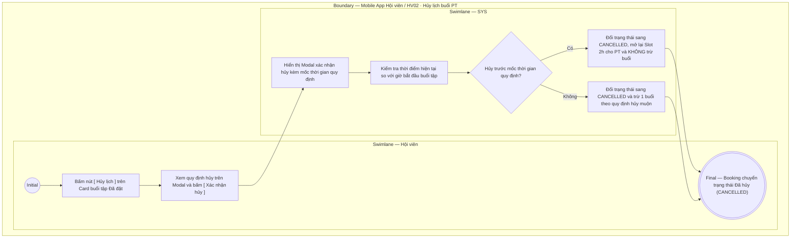

# HV02-US03 - Hủy lịch buổi PT

## Preconditions
- Hội viên đã đăng nhập Mobile bằng tài khoản hợp lệ.
- Hội viên có buổi tập PT ở trạng thái `Đã đặt` (`UPCOMING`).

## Trigger
- Hội viên bấm nút `[ Hủy lịch ]` trên Card buổi tập tại sub-tab `Lịch của tôi`.
- Màn hình liên quan: Mobile App — Tab `HV02 · Lịch tập`, sub-tab `Lịch của tôi`, Modal xác nhận hủy lịch.

## Main Flow

1. Tại sub-tab **Lịch của tôi**, Hội viên chọn buổi tập ở trạng thái `Đã đặt` (`UPCOMING`) và bấm nút `[ Hủy lịch ]`.
2. SYS hiển thị **Modal xác nhận hủy lịch** kèm quy định về mốc thời gian hủy.
3. Hội viên chọn lý do hủy (nếu có) và bấm `[ Xác nhận hủy ]`.
4. SYS kiểm tra thời điểm hiện tại so với giờ bắt đầu buổi tập:
   - **Hủy hợp lệ (trước mốc quy định)**: SYS chuyển trạng thái booking sang `CANCELLED` (Đã hủy), mở lại khung giờ (Slot 2h) cho PT, và **không khấu trừ** buổi tập trong gói.
   - **Hủy muộn (sau mốc quy định)**: SYS hiển thị cảnh báo quy định hủy muộn. Nếu Hội viên vẫn xác nhận hủy $\rightarrow$ SYS chuyển booking sang `CANCELLED` và **khấu trừ 1 buổi** theo quy định.
5. SYS cập nhật lại danh sách buổi tập trên màn hình `Lịch của tôi`.

### Field-level specification — Form / Modal Hủy lịch buổi PT
| Field / control | State | Required | Conditional / dynamic | Source / validation |
|---|---|---|---|---|
| Thẻ Card buổi tập mục tiêu | `READONLY` | required | `DYNAMIC`: hiển thị giờ tập, chi nhánh, tên PT và gói tập | Record booking của Hội viên |
| Nút `[ Hủy lịch ]` trên Card | `USER-INPUT` | required | `CONDITIONAL`: chỉ hiển thị với các booking ở trạng thái `Đã đặt` | Nút bấm thao tác trên Mobile |
| Modal xác nhận hủy | `AUTO-FILL` | READONLY | `DYNAMIC`: mở ra khi bấm nút `[ Hủy lịch ]` | Modal giao diện Mobile |
| Lý do hủy lịch | `USER-INPUT` | optional | `DYNAMIC`: người dùng chọn hoặc nhập lý do hủy | Danh mục lý do hủy |
| Nút `[ Xác nhận hủy ]` | `USER-INPUT` | required | `CONDITIONAL`: bấm để gửi lệnh hủy lên hệ thống | Nút xác nhận trên Modal |

- **Business rules / logic:**
  - Hủy lịch không xóa vĩnh viễn bản ghi booking mà chuyển trạng thái sang `CANCELLED` để lưu vết audit log.
  - Hủy hợp lệ trước mốc thời gian quy định sẽ mở lại khung giờ (Slot 2h) cho PT và bảo lưu số buổi tập khả dụng cho Hội viên.
  - Hủy muộn sau mốc thời gian quy định sẽ thực hiện khấu trừ 1 buổi tập theo chính sách phòng Gym.

## Alternate Flows

### AF-01 — Hội viên hủy thao tác trên Modal
1. Tại Modal xác nhận hủy lịch, Hội viên chọn `[ Bỏ qua / Đóng ]`.
2. SYS đóng modal và giữ nguyên trạng thái booking `Đã đặt` (`UPCOMING`).

## Exception Flows

- Booking đã `DONE` hoặc `CANCELLED`: ẩn nút `[ Hủy lịch ]`.
- Lỗi kết nối mạng: SYS hiển thị thông báo lỗi hủy không thành công và hoàn tác trạng thái.

## Activity Diagram — Swimlane
**Trigger:** Hội viên bấm Hủy lịch trên Card buổi tập tại tab Lịch của tôi.

