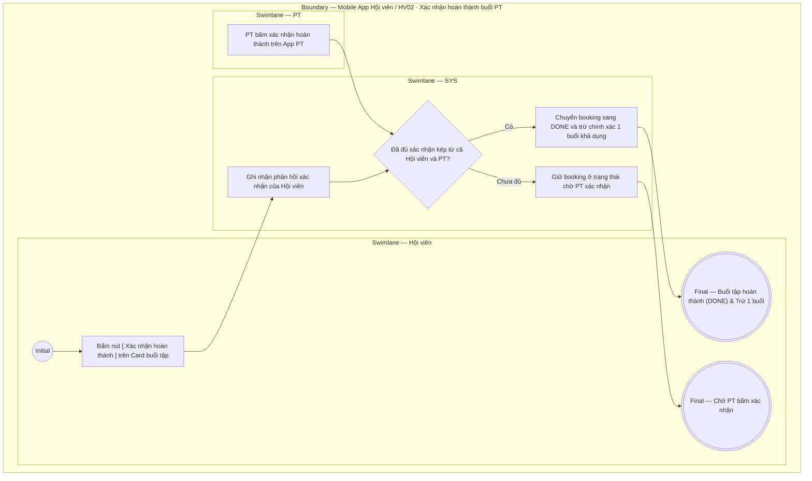

# HV02-US04 - Xác nhận hoàn thành buổi PT

## Preconditions
- Hội viên đã đăng nhập Mobile bằng tài khoản hợp lệ.
- Buổi tập PT đã diễn ra hoặc đang ở trạng thái `Chờ xác nhận hoàn thành` (`AWAITING_CONFIRMATION`).

## Trigger
- Hội viên bấm nút CTA `[ Xác nhận hoàn thành ]` trực tiếp trên Card buổi tập tại sub-tab `Lịch của tôi`.
- Màn hình liên quan: Mobile App — Tab `HV02 · Lịch tập`, sub-tab `Lịch của tôi`.

## Main Flow

1. Tại sub-tab **Lịch của tôi**, Hội viên thấy Card buổi tập có badge `Chờ xác nhận hoàn thành` và nút CTA màu xanh `[ Xác nhận hoàn thành ]`.
2. Hội viên bấm nút `[ Xác nhận hoàn thành ]`.
3. SYS ghi nhận phản hồi xác nhận của Hội viên.
4. SYS kiểm tra trạng thái xác nhận từ phía PT phụ trách (trên App PT).
5. Khi đã đủ xác nhận kép 2 chiều (từ cả Hội viên và PT), SYS chuyển trạng thái booking sang **`DONE` (Hoàn thành)** và trừ chính xác 1 buổi khả dụng trong gói PT/Combo.
6. SYS cập nhật lại trạng thái hiển thị trên màn hình Lịch của tôi và tiến độ sử dụng gói.

- **Business rules / logic:**
  - **Xác nhận 2 chiều**: Buổi PT chỉ chuyển sang trạng thái `DONE` và trừ 1 buổi trong gói sau khi CẢ HỘI VIÊN VÀ PT đều đã bấm xác nhận hoàn thành.
  - **Check-in phòng Gym độc lập**: Việc Hội viên check-in vào cửa phòng Gym tại menu W07 không tự động chuyển buổi tập PT sang trạng thái hoàn thành.
  - Nếu Hội viên bấm xác nhận trước khi PT bấm, booking tiếp tục ở trạng thái chờ PT xác nhận (chưa trừ buổi cho tới khi PT bấm xác nhận).

### Field-level specification — Dialog Xác nhận Hoàn thành buổi PT
| Field / control | Loại UI Control | State | Required | Conditional / dynamic | Source / validation |
| :--- | :--- | :--- | :--- | :--- | :--- |
| **Thông tin buổi tập** | `Card / Summary info` | `PREFILL` + `READONLY` | required | Không | Hiển thị thông tin buổi tập cần xác nhận: `Buổi tập với PT [Tên PT] lúc [Khung giờ - Ngày]` |
| **Trạng thái xác nhận của PT** | `Badge / Status indicator` | `READONLY` | required | `DYNAMIC`: Lấy từ trạng thái xác nhận phía PT | Hiển thị badge/nhãn trạng thái: `PT đã xác nhận hoàn thành` (xanh lá) HOẶC `Đang chờ PT xác nhận` (vàng cam) |
| **Thông báo khấu trừ** | `Typography / Helper text` | `READONLY` | required | Không | Đoạn text lưu ý: *"Hệ thống sẽ trừ chính xác 1 buổi trong gói tập của bạn sau khi cả bạn và PT cùng hoàn tất xác nhận."* |

## Alternate Flows

### AF-01 — PT chưa bấm xác nhận hoàn thành
1. Hội viên bấm `[ Xác nhận hoàn thành ]`.
2. PT chưa bấm xác nhận từ phía App PT.
3. SYS ghi nhận phản hồi của Hội viên và giữ booking ở trạng thái chờ PT xác nhận.

## Exception Flows

- Booking đã `DONE` hoặc `CANCELLED`: ẩn nút `[ Xác nhận hoàn thành ]`.
- Lỗi kết nối mạng: SYS hiển thị thông báo lỗi và hoàn tác trạng thái.

## Activity Diagram — Swimlane
**Trigger:** Hội viên bấm nút Xác nhận hoàn thành trên Card buổi tập tại tab Lịch của tôi.

