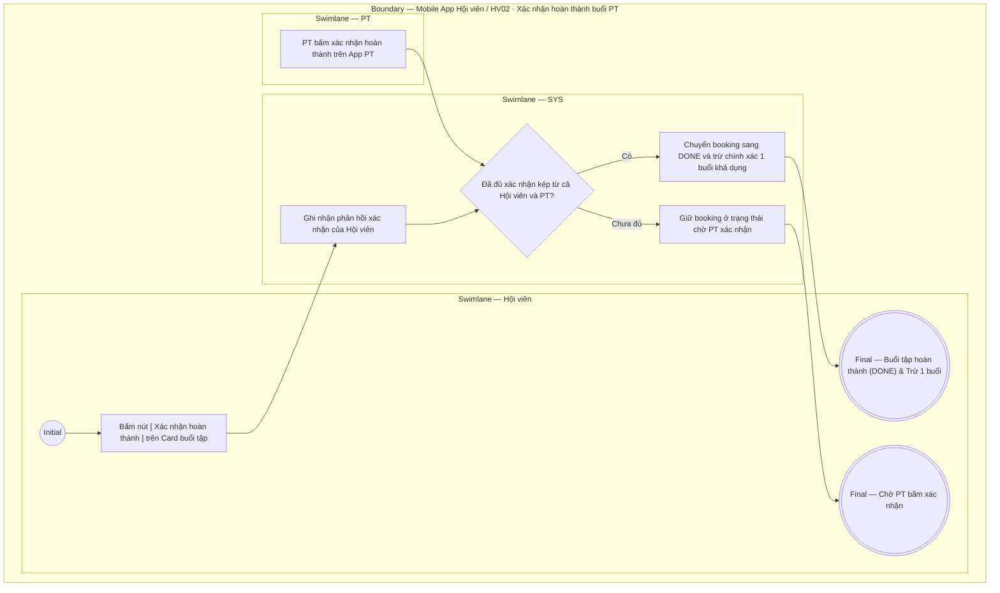

# HV02-US04 - Xác nhận hoàn thành buổi PT

## Preconditions
- Hội viên là chủ booking (`booking.member_id` khớp `member_profile_id`); với lịch nhóm, trưởng nhóm đại diện xác nhận. Thành viên nhóm khác chỉ xem, không có nút Xác nhận/Hủy và không mở được dialog xác nhận từ thẻ lịch.
- Hội viên đã đăng nhập Mobile bằng tài khoản hợp lệ.
- Buổi tập PT đã diễn ra hoặc đang ở trạng thái `Chờ xác nhận hoàn thành` (`AWAITING_CONFIRMATION`).

## Trigger
- Hội viên bấm nút CTA `[ Xác nhận hoàn thành ]` trực tiếp trên Card buổi tập tại sub-tab `Lịch của tôi`.
- Màn hình liên quan: Mobile App — Tab `HV02 · Lịch tập`, sub-tab `Lịch của tôi`.

## Main Flow

1. Tại sub-tab **Lịch của tôi**, Card buổi tập đã đặt (`Đã đặt`) hiển thị 2 nút: `[ Hủy lịch ]` và `[ Xác nhận hoàn thành ]`.
2. Trước khi qua giờ kết thúc buổi tập (`now < end_time`), nút `[ Xác nhận hoàn thành ]` ở trạng thái màu xám (disabled, không bấm được). Sau khi đã qua giờ kết thúc buổi tập (`now >= end_time`), nút tự động sáng màu xanh lá (enabled, sẵn sàng thao tác).
3. Hội viên bấm nút `[ Xác nhận hoàn thành ]`. SYS mở Hộp thoại xác nhận hiển thị thông tin ca tập và trạng thái xác nhận từ phía PT phụ trách.
4. Hội viên bấm `[ Xác nhận hoàn thành ]` trong hộp thoại. SYS gọi API `POST /pt-bookings/:id/member-confirm` ghi nhận xác nhận của Hội viên.
5. SYS kiểm tra trạng thái xác nhận từ phía PT phụ trách:
   - **Nếu PT chưa bấm xác nhận:** SYS chuyển booking sang trạng thái **`Chờ xác nhận` (`PENDING_COMPLETION`)**, hiển thị **Card màu vàng (Amber)** kèm ghi chú `Bạn đã xác nhận · Đang chờ PT xác nhận` (chưa trừ buổi trong gói).
   - **Nếu PT đã bấm xác nhận trước đó:** SYS hoàn tất xác nhận kép 2 chiều, chuyển booking sang **`Đã hoàn thành` (`COMPLETED`)**, hiển thị **Card màu xanh lá cây** và trừ chính xác 1 buổi khả dụng trong gói PT/Combo.
6. SYS cập nhật lại danh sách buổi tập trên sub-tab Lịch của tôi và tiến độ sử dụng gói tập.

- **Business rules / logic:**
  - **Quy tắc hiển thị 2 nút:** Thẻ buổi tập đã đặt luôn có 2 nút `[ Hủy lịch ]` (chỉ bấm được trước giờ bắt đầu) và `[ Xác nhận hoàn thành ]` (chỉ bấm được sau giờ kết thúc).
  - **Xác nhận 2 chiều (Xác nhận kép):** Buổi PT chỉ chuyển sang trạng thái `COMPLETED` (Card xanh lá cây) và trừ 1 buổi trong gói sau khi CẢ HỘI VIÊN VÀ PT đều đã hoàn tất bấm xác nhận kết quả.
  - **Màu sắc trạng thái chuẩn Semantic:**
    * Buổi tập đã đặt (`BOOKED`): Card màu xanh dương, nút Xác nhận màu xám khi chưa hết giờ, màu xanh lá khi đã hết giờ.
    * Buổi tập chờ xác nhận (`PENDING_COMPLETION`): Card màu vàng (Amber).
    * Buổi tập hoàn thành (`COMPLETED`): Card màu xanh lá cây (Forest Green).
    * Buổi tập đã hủy (`CANCELLED`): Card màu đỏ (Red).
  - **Check-in phòng Gym độc lập**: Việc Hội viên check-in vào cửa phòng Gym tại menu W07 không tự động chuyển buổi tập PT sang trạng thái hoàn thành.

### Field-level specification — Dialog Xác nhận Hoàn thành buổi PT
| Field / control | Loại UI Control | State | Required | Conditional / dynamic | Source / validation |
| :--- | :--- | :--- | :--- | :--- | :--- |
| **Thông tin buổi tập** | `Card / Summary info` | `PREFILL` + `READONLY` | required | Không | Hiển thị thông tin buổi tập cần xác nhận: `Buổi tập với PT [Tên PT] lúc [Khung giờ - Ngày]` |
| **Trạng thái xác nhận của PT** | `Badge / Status indicator` | `READONLY` | required | `DYNAMIC`: Lấy từ trạng thái xác nhận phía PT | Hiển thị badge/nhãn trạng thái: `PT đã xác nhận hoàn thành` (xanh lá) HOẶC `Đang chờ PT xác nhận` (vàng cam) |
| **Thông báo khấu trừ** | `Typography / Helper text` | `READONLY` | required | Không | Đoạn text lưu ý: *"Hệ thống sẽ trừ chính xác 1 buổi trong gói tập của bạn sau khi cả bạn và PT cùng hoàn tất xác nhận."* |

## Alternate Flows

### AF-01 — PT chưa bấm xác nhận hoàn thành
1. Hội viên bấm `[ Xác nhận hoàn thành ]`.
2. PT chưa bấm xác nhận từ phía App PT.
3. SYS ghi nhận phản hồi của Hội viên và giữ booking ở trạng thái chờ PT xác nhận.

## Exception Flows

- Booking đã `DONE` hoặc `CANCELLED`: ẩn nút `[ Xác nhận hoàn thành ]`.
- Lỗi kết nối mạng: SYS hiển thị thông báo lỗi và hoàn tác trạng thái.

## Activity Diagram — Swimlane
**Trigger:** Hội viên bấm nút Xác nhận hoàn thành trên Card buổi tập tại tab Lịch của tôi.

