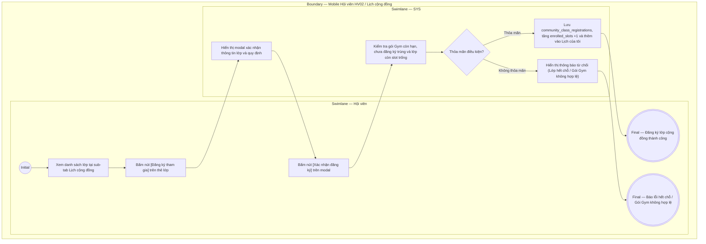

# HV02-US05 - Đăng ký tham gia lớp tập cộng đồng

## Preconditions
- Hội viên đã đăng nhập thành công vào ứng dụng Mobile Hội viên.
- Hội viên sở hữu ít nhất một gói Gym đang có hiệu lực sử dụng và không ở trạng thái bị đóng băng (`is_frozen = false`).
- Chi nhánh có các buổi lớp tập cộng đồng (`community_classes`) đang mở đăng ký (`status = 'OPEN'`).

## Trigger
- Hội viên truy cập menu **HV02 · Lịch tập**, chọn sub-tab **Lịch cộng đồng**, duyệt danh sách lớp theo ngày và bấm nút **[Đăng ký tham gia]** trên thẻ lớp học mong muốn.
- Màn hình liên quan: Mobile Hội viên — HV02 Sub-tab Lịch cộng đồng, modal xác nhận **Đăng ký tham gia lớp**.

## Main Flow

1. Hội viên mở màn hình HV02 Lịch tập và chuyển sang sub-tab **Lịch cộng đồng**.
2. SYS nạp danh sách các lớp tập nhóm theo ngày được chọn (tiêu chuẩn: Ngày diễn ra $\ge$ Ngày hiện tại):
   - Hiển thị Tên lớp, Hình ảnh/Icon loại lớp (Cardio, Yoga, Aerobic...), Tên giáo viên hướng dẫn, Khung giờ tập (ví dụ: `18:00 - 19:00`), Địa điểm phòng tập.
   - Hiển thị thanh tiến độ đăng ký và số chỗ: ví dụ `25/40 chỗ` (còn 15 chỗ trống).
3. Hội viên bấm nút **[Đăng ký tham gia]** trên thẻ lớp tập mong muốn.
4. SYS hiển thị modal xác nhận đăng ký: Tên lớp, Khung giờ, Giáo viên và lưu ý chuẩn bị (trang phục thể thao, mang thảm cá nhân).
5. Hội viên bấm **[Xác nhận đăng ký]**.
6. SYS kiểm tra các điều kiện:
   - Gói Gym của hội viên còn hiệu lực vào ngày lớp diễn ra.
   - Hội viên chưa từng đăng ký lớp này trước đó.
   - Lớp học còn chỗ trống (`enrolled_slots < max_slots`).
7. SYS lưu bản ghi vào bảng `community_class_registrations` với trạng thái `CONFIRMED`, tăng `enrolled_slots` của lớp lên 1.
8. SYS hiển thị thông báo thành công, tự động đồng bộ lịch tập này vào sub-tab **Lịch của tôi** để hội viên dễ theo dõi và đặt nhắc hẹn.

### Field-level specification — Sub-tab Lịch cộng đồng & Modal Đăng ký
| Field / control | Loại UI Control | State | Required | Conditional / dynamic | Source / validation |
| :--- | :--- | :--- | :--- | :--- | :--- |
| Bộ chọn ngày | `Horizontal Date Strip` | `USER-INPUT (PREFILL)` | required | `TRIGGER` | Thanh cuộn ngang các ngày trong tuần; chọn ngày kích hoạt lọc lớp của ngày đó |
| Thẻ lớp tập cộng đồng | `Card View` | `READONLY` | required | `DYNAMIC` | Danh sách các lớp diễn ra trong ngày được chọn |
| Tên lớp & Giáo viên | `Readonly Text` | `READONLY` | required | `Không` | Lấy từ `COMMUNITY_CLASSES.title` và `instructor_name` |
| Khung giờ tập | `Readonly Text / Badge` | `READONLY` | required | `Không` | Giờ bắt đầu - Giờ kết thúc (ví dụ: `18:00 - 19:00`) |
| Tiến độ slot chỗ | `ProgressBar + Text` | `READONLY` | required | `Không` | Hiển thị dạng `X/Y chỗ` (`enrolled_slots / max_slots`) |
| Nút [Đăng ký tham gia] | `Button (Primary)` | `USER-INPUT` | optional | `CONDITIONAL`: Hiện khi lớp còn chỗ và HV chưa đăng ký, đổi thành badge "Đã đăng ký" khi HV đã đăng ký, đổi thành "Đã hết chỗ" khi lớp đầy | Kích hoạt mở modal xác nhận |
| Nút [Hủy đăng ký] | `Button (Danger Text)` | `USER-INPUT` | optional | `CONDITIONAL`: Hiện khi HV đã đăng ký và thời điểm hiện tại cách giờ bắt đầu > 2 tiếng | Kích hoạt hủy chỗ |

- **Business rules / logic:**
  - Hội viên chỉ được đăng ký lớp cộng đồng nếu gói Gym còn hiệu lực sử dụng.
  - Mỗi hội viên chỉ đăng ký 1 slot duy nhất cho một lớp tập cụ thể.
  - Khi lớp đã đủ 100% số chỗ (`enrolled_slots = max_slots`), nút đăng ký tự động chuyển sang trạng thái "Đã hết chỗ" (Disabled).
  - Cho phép hủy đăng ký trước giờ học tối thiểu 2 tiếng để nhường slot cho hội viên khác.

## Alternate Flows

### AF-01 - Hủy Đăng Ký Lớp Tập
1. Hội viên bấm **[Hủy đăng ký]** trên thẻ lớp đã đăng ký.
2. SYS hiển thị dialog xác nhận: *"Bạn có chắc chắn muốn hủy đăng ký lớp học này?"*.
3. Hội viên bấm **[Đồng ý hủy]**.
4. SYS chuyển trạng thái đăng ký sang `CANCELLED`, giảm `enrolled_slots` đi 1 và xóa lịch khỏi sub-tab "Lịch của tôi".

## Exception Flows
- **Gói Gym hết hạn hoặc bị đóng băng:** SYS từ chối đăng ký và hiển thị thông báo: *"Gói Gym của bạn đã hết hạn hoặc đang đóng băng. Vui lòng gia hạn gói Gym để tham gia lớp cộng đồng"*.
- **Lớp vừa hết chỗ:** Trong lúc thao tác, học viên khác đã đăng ký slot cuối cùng. SYS thông báo: *"Rất tiếc, lớp học đã vừa đủ số lượng học viên tối đa"*.

## Activity Diagram — Swimlane
**Trigger:** Hội viên bấm [Đăng ký tham gia] tại sub-tab Lịch cộng đồng.

