# HV03-US01 - Xem gói, quyền lợi và tiến độ sử dụng

## Preconditions
- Hội viên đã đăng nhập Mobile bằng tài khoản hợp lệ.
- Hệ thống đã có dữ liệu các đơn đăng ký gói tập của Hội viên.

## Trigger
- Hội viên bấm mở tab `Gói của tôi` (HV03) trên menu footer và chọn sub-tab `Gói của tôi`.
- Màn hình liên quan: Mobile App — Tab `HV03 · Gói của tôi`, sub-tab `Gói của tôi`.

## Quy tắc sắp hết hạn
- Gói đã thanh toán, đang có hiệu lực và chưa hết hạn: theo thời gian còn <= 4 ngày, theo buổi còn <= 3 buổi; Combo dùng OR giữa các quyền lợi áp dụng. Nguồn hiển thị là is_expiring và display_status do SYS/API tính; status nội bộ ACTIVE vẫn dùng cho kiểm tra quyền tập. Không tạo enum/field DB mới và không tự tính ngưỡng riêng trên UI.

## Main Flow

1. Hội viên mở tab **Gói của tôi** trên menu footer và chọn sub-tab **Gói của tôi**.
2. SYS nạp danh sách toàn bộ các đơn đăng ký gói tập (Registrations) thuộc sở hữu của Hội viên.
3. SYS hiển thị 3 sub-tab chuyển đổi chính: `Gói của tôi` (đang chọn), `Mua gói`, `Yêu cầu PT`.
4. SYS hiển thị các Chip lọc trạng thái gói: `Tất cả (n)`, `Đang sử dụng (n)`, `Đang đóng băng (n)`, `Chờ xử lý (n)`, `Đã hết hạn (n)`, `Đã hủy (n)`.
5. Hội viên chọn Chip lọc trạng thái cần xem (mặc định chọn `Đang sử dụng`).
6. SYS nạp và hiển thị danh sách các thẻ Card gói tập tương ứng bao gồm:
   - **Tên gói tập**: Ví dụ `Gói PT 20 buổi`, `Gói Gym 1 tháng`, `Combo Gym 3 tháng + PT 10 buổi`.
   - **Tiến độ sử dụng & Thanh Progress bar**:
     - Gói PT theo số buổi: `Đã dùng 17/20 buổi` kèm thanh tiến độ (Progress bar).
     - Gói Gym theo ngày: `Đã dùng 18/30 ngày` kèm thanh tiến độ (Progress bar).
     - Gói Combo Gym + PT: `Gym: đã dùng 1/3 tháng · PT: còn 8/10 buổi` kèm thanh tiến độ (Progress bar).
    - **Badge trạng thái gói**: `Đang hoạt động` (badge xanh lá), `❄️ Đang đóng băng` (badge xanh băng tuyết `#e0f2fe`), `Sắp hết hạn` (badge vàng), `Chờ xử lý`, `Đã hết hạn`, `Đã hủy`.
    - **Thông tin PT phụ trách & Thành viên nhóm**:
      - Nếu gói PT/Combo đã chọn PT phụ trách: Hiển thị `PT: Nguyễn Văn Thể`.
      - Nếu gói PT/Combo chưa chọn PT phụ trách: Hiển thị `PT: Chưa chọn (Liên hệ Lễ tân)` và nút CTA màu đen **`[ Chọn PT phụ trách ]`** (bấm vào mở Popup liên hệ Lễ tân chi nhánh theo [HV03-US04](./HV03-US04-Chọn%20PT%20và%20gửi%20yêu%20cầu%20phân%20công.md)).
      - Nếu là gói PT theo nhóm (Group PT 1-N): Hiển thị thêm dòng `Số lượng thành viên: [số lượng hiện tại]/[tối đa]` (Ví dụ: `Số lượng thành viên: 3/4`) kèm badge vai trò (`Trưởng nhóm` hoặc `Thành viên nhóm`).
    - **Nút thao tác trên thẻ**:
      - Nút **`[ Chi tiết gói ]`**: Hiển thị trên mọi thẻ gói để mở modal xem toàn bộ thông tin chi tiết gói, tiến độ, thành viên và nút gia hạn / đóng băng / mở đóng băng.
      - Nút **`[ Xem lộ trình ]`**: Hiển thị trên các thẻ gói có trạng thái `Đang sử dụng` (`ACTIVE`), `Đang đóng băng` (`FROZEN`), `Đã hết hạn` (`EXPIRED`) hoặc `Sắp hết hạn` (`EXPIRING`) để mở modal **Lộ trình tập luyện**, xem thanh tiến độ (số buổi đã tập/còn lại/tỷ lệ %) và lịch sử timeline chi tiết từng buổi tập đã hoàn thành kèm giáo án bài tập và đánh giá thể lực từ HLV.
      - Nút **`[ Mời bạn vào nhóm ]`**: Hiển thị cho Trưởng nhóm gói PT nhóm còn hiệu lực để mở modal mời bạn bè qua SĐT.
      - Nút **`[ Đóng băng ]`**: Hiển thị trên thẻ gói hiện đang hiệu lực ACTIVE/Sắp hết hạn và đã thanh toán đủ 100% để Hội viên chủ động đóng băng gói.
      - Nút **`[ Mở đóng băng ]`**: Hiển thị trên thẻ gói đang ở trạng thái đóng băng để Hội viên chủ động mở kích hoạt lại gói tập.
7. Khi Hội viên bấm nút **`[ Chi tiết gói ]`**, SYS mở modal **Chi tiết gói tập** bao gồm:
   - Thông tin gói: Tên gói, mã hợp đồng, hình thức gói, thời hạn hiệu lực, chi nhánh đăng ký, HLV phụ trách (kèm nút Liên hệ Lễ tân nếu chưa gán).
   - Tiến độ sử dụng chi tiết (Gym và PT kèm thanh tiến độ).
   - Danh sách các thành viên trong nhóm (nếu là gói PT nhóm): Trưởng nhóm, thành viên đã tham gia, lời mời chờ xác nhận.
   - Nếu gói đang ở trạng thái `❄️ Đang đóng băng`: Hiển thị thông báo bảo lưu `Gói tập đang trong thời gian đóng băng bảo lưu. Không thể gia hạn gói khi đang đóng băng.`, hiển thị nút **`[ Mở đóng băng gói ]`**, và **KHÔNG hiển thị nút `[ Gia hạn gói ]`**.
   - Nếu gói không đóng băng: Hiển thị nút **`[ Đóng băng gói ]`** (chỉ khi đã thanh toán đủ, hiện đang hiệu lực ACTIVE/Sắp hết hạn và đủ điều kiện bảo lưu) và nút **`[ Gia hạn gói ]`** cho phép thanh toán gia hạn nhanh gói tập.

- **Business rules / logic:**
  - Danh sách chỉ hiển thị các gói tập thuộc sở hữu của chính Hội viên đang đăng nhập hoặc các gói PT nhóm mà hội viên tham gia với vai trò thành viên đã chấp thuận.
  - Tiến độ sử dụng phản ánh trung thực số buổi đã tập (được trừ sau khi buổi tập PT `DONE`) hoặc số ngày đã trôi qua kể từ ngày kích hoạt gói Gym.
  - Thẻ gói PT/Combo chưa chọn PT phải hiển thị nút CTA `[ Chọn PT phụ trách ]` để học viên mở popup liên hệ Lễ tân chi nhánh hỗ trợ xếp HLV trước khi đặt lịch ở menu HV02.
  - Đối với gói PT nhóm, hiển thị sĩ số thành viên thực tế `[hiện tại]/[tối đa]` để học viên nắm được số chỗ trống còn lại.
  - **Quy tắc đóng băng & mở đóng băng chủ động:**
    - Chỉ bảo lưu gói đã trả đủ, hiện đang hiệu lực ACTIVE/Sắp hết hạn; không áp dụng cho PENDING_PAYMENT, SCHEDULED chưa bắt đầu, đã hủy/hết hạn hoặc có đợt bảo lưu đang chờ. Quy tắc này áp dụng cả QTV/Lễ tân.
    - Hội viên có thể chủ động đóng băng gói tập của mình với số ngày tùy chọn (gợi ý nhanh: 7, 14, 30, 60 ngày) và nhập lý do. Hạn gói tập sẽ tự động lùi tương ứng số ngày đóng băng.
    - Hội viên có thể chủ động mở đóng băng bất kỳ lúc nào để kích hoạt lại gói tập tiếp tục luyện tập.
    - Thành viên nhóm được mời không có quyền đóng băng gói của Trưởng nhóm.
  - **Quy tắc chặn gia hạn khi đang đóng băng:**
    - Khi gói tập đang ở trạng thái `❄️ Đang đóng băng` (`is_frozen = true`), hệ thống **tuyệt đối không cho phép gia hạn gói** (ẩn nút Gia hạn trên UI và Backend chặn HTTP 409 `FROZEN_CANNOT_RENEW`). Hội viên phải mở đóng băng gói trước khi thực hiện gia hạn.

### Field-level specification — Sub-tab Gói của tôi
| Field / control | Loại UI Control | State | Required | Conditional / dynamic | Source / validation |
| :--- | :--- | :--- | :--- | :--- | :--- |
| **Tiêu đề khối Gói của tôi** | `Typography / Heading` | `READONLY` | required | `DYNAMIC`: Lấy từ tổng số gói đăng ký của hội viên | Hiển thị nhãn cố định kèm số lượng: `GÓI CỦA TÔI (n)` |
| **Nhóm Chip lọc trạng thái gói** | `Chip group / Segmented control` | `USER-INPUT` | required | `TRIGGER`: Điều khiển danh sách thẻ gói hiển thị bên dưới | Các chip chuyển đổi trạng thái: `Tất cả (n)`, `Đang sử dụng (n)`, `Đang đóng băng (n)`, `Chờ xử lý (n)`, `Đã hết hạn (n)`, `Đã hủy (n)`. Mặc định chọn `Đang sử dụng (n)` |
| **Thẻ gói tập cá nhân (Package Card)** | `Card list item` | `READONLY` | required | `DYNAMIC`: Danh sách thẻ hiển thị theo chip trạng thái đang chọn | Mỗi thẻ bao gồm: Tên gói, Badge trạng thái (`Đang hoạt động`, `❄️ Đang đóng băng`, `Sắp hết hạn`, `Chờ xử lý`, `Đã hết hạn`, `Đã hủy`), Dòng tiến độ sử dụng, Thanh tiến độ (Progress bar) |
| **Dòng số lượng thành viên nhóm** | `Text label` | `READONLY` | conditional | `CONDITIONAL`: • **Hiện khi**: Gói là PT nhóm 1-Nhiều (`package_mode = 'GROUP_1_N'`). Hiển thị `Số lượng thành viên: X/Y` • **Ẩn khi**: Gói Gym tiêu chuẩn hoặc gói PT 1-1 cá nhân | Số lượng thành viên hiện tại (`total_group_members`) trên số lượng tối đa (`max_group_members`) |
| **Thông tin PT phụ trách trên thẻ** | `Badge / Text label` | `READONLY` | conditional | `CONDITIONAL`: Phụ thuộc vào loại gói tập | - **Hiện khi:** Gói tập là gói `PT` hoặc `Combo (Gym + PT)`. Nếu đã có HLV hiển thị `PT: [Tên HLV]` (màu xanh lục); nếu chưa có HLV hiển thị `PT: Chưa chọn (Liên hệ Lễ tân)` (màu xám). - **Ẩn khi:** Gói tập là gói `Gym` thuần (không sử dụng PT). |
| **Nút [ Chi tiết gói ]** | `Action Button` | `USER-INPUT` | required | Không | Nút hiển thị trên mọi thẻ gói, bấm mở modal Chi tiết gói tập |
| **Nút [ Xem lộ trình ] trên thẻ** | `Action Button` | `USER-INPUT` | conditional | `CONDITIONAL`: • **Hiện khi**: Gói ở trạng thái `ACTIVE`, `FROZEN`, `EXPIRED`, `EXPIRING` • **Ẩn khi**: Gói ở trạng thái `PENDING_PAYMENT` hoặc `CANCELLED` | Nút phụ (secondary) hiển thị cạnh nút Chi tiết gói, bấm mở modal Lộ trình tập luyện |
| **Nút CTA [ Chọn PT phụ trách ]** | `Button / CTA` | `USER-INPUT` | conditional | `CONDITIONAL`: Phụ thuộc vào loại gói và trạng thái gán PT | - **Hiện khi:** Gói tập là `PT` hoặc `Combo`, trạng thái đang sử dụng và chưa có HLV. Nút màu đen chữ trắng, bấm để mở Popup Liên hệ Lễ tân chi nhánh ([HV03-US04](./HV03-US04-Chọn%20PT%20và%20gửi%20yêu%20cầu%20phân%20công.md)). - **Ẩn khi:** Gói tập đã có PT phụ trách, gói Gym thuần, hoặc gói ở trạng thái Chờ xử lý / Đã hết hạn. |
| **Nút [ Mời bạn vào nhóm ]** | `Action Button` | `USER-INPUT` | conditional | `CONDITIONAL`: • **Hiện khi**: Gói PT nhóm 1-Nhiều đang hiệu lực và đã thanh toán đủ 100% • **Ẩn khi**: Gói cá nhân, gói Gym thuần, hoặc gói chưa thanh toán | Bấm mở modal nhập SĐT mời bạn bè vào nhóm |
| **Nút [ Đóng băng ] trên thẻ** | `Action Button` | `USER-INPUT` | conditional | `CONDITIONAL`: • **Hiện khi**: Gói hiện đang hiệu lực ACTIVE/Sắp hết hạn, đã thanh toán đủ 100%, chưa bị đóng băng và thuộc sở hữu của hội viên • **Ẩn khi**: Gói chưa thanh toán, chưa đến ngày hiệu lực SCHEDULED, đang đóng băng, đã hủy/hết hạn, hoặc hội viên là thành viên nhóm được mời | Bấm mở modal Đóng băng gói tập |
| **Nút [ Mở đóng băng ] trên thẻ** | `Action Button` | `USER-INPUT` | conditional | `CONDITIONAL`: • **Hiện khi**: Gói đang ở trạng thái đóng băng (`is_frozen = true`) và thuộc sở hữu của hội viên • **Ẩn khi**: Gói không ở trạng thái đóng băng hoặc hội viên là thành viên nhóm được mời | Bấm mở modal Mở đóng băng gói tập |
| **Modal Chi tiết gói tập** | `Modal / Dialog` | `READONLY` | conditional | `CONDITIONAL`: • **Hiện khi**: Bấm nút `[ Chi tiết gói ]` • **Ẩn khi**: Bấm nút Đóng | Hiển thị: Thông tin gói, tiến độ, thành viên trong nhóm, thông báo bảo lưu (nếu đóng băng), nút Xem lộ trình và các nút thao tác tương ứng |
| **Modal Lộ trình tập luyện** | `Modal / Dialog` | `READONLY` | conditional | `CONDITIONAL`: • **Hiện khi**: Bấm nút `[ Xem lộ trình ]` • **Ẩn khi**: Bấm nút Đóng | Hiển thị: Thông tin hợp đồng, HLV phụ trách, tiến độ số buổi (hoàn thành/còn lại/tỷ lệ %), và timeline các buổi tập đã hoàn thành kèm Đánh giá của PT (hoặc thông báo rỗng nếu chưa có buổi hoàn thành) |
| **Nút [ Gia hạn gói ]** | `Action Button` | `USER-INPUT` | conditional | `CONDITIONAL`: • **Hiện khi**: Gói không ở trạng thái đóng băng (`is_frozen = false`) • **Ẩn khi**: Gói đang ở trạng thái đóng băng (`is_frozen = true`) | Nằm trong modal Chi tiết gói, bấm để mở thanh toán gia hạn nhanh cho gói tập |
| **Nút [ Đóng băng gói ] trong modal** | `Action Button` | `USER-INPUT` | conditional | `CONDITIONAL`: • **Hiện khi**: Gói hiện đang hiệu lực ACTIVE/Sắp hết hạn, đã thanh toán đủ 100%, chưa đóng băng và thuộc sở hữu hội viên • **Ẩn khi**: Gói chưa thanh toán, chưa đến ngày hiệu lực SCHEDULED, đang đóng băng, đã hết hạn/hủy, hoặc là thành viên nhóm được mời | Bấm mở modal Đóng băng gói tập |
| **Nút [ Mở đóng băng gói ] trong modal** | `Action Button` | `USER-INPUT` | conditional | `CONDITIONAL`: • **Hiện khi**: Gói đang ở trạng thái đóng băng (`is_frozen = true`) và thuộc sở hữu hội viên • **Ẩn khi**: Gói không ở trạng thái đóng băng hoặc là thành viên nhóm được mời | Bấm mở modal Mở đóng băng gói tập |
| **Modal Đóng băng gói tập** | `Modal / Dialog` | `USER-INPUT` | conditional | `CONDITIONAL`: • **Hiện khi**: Bấm nút `[ Đóng băng ]` • **Ẩn khi**: Bấm Hủy hoặc Xác nhận | Cho phép chọn số ngày (preset 7, 14, 30, 60 hoặc tùy chỉnh), nhập lý do đóng băng |
| **Modal Mở đóng băng gói tập** | `Modal / Dialog` | `USER-INPUT` | conditional | `CONDITIONAL`: • **Hiện khi**: Bấm nút `[ Mở đóng băng ]` • **Ẩn khi**: Bấm Hủy hoặc Xác nhận | Hộp thoại xác nhận kích hoạt lại gói tập |
| **Tiêu đề khối Lịch sử thanh toán** | `Typography / Heading` | `READONLY` | required | Không | Header cố định bên dưới danh sách gói: `Lịch sử thanh toán` kèm phụ đề `Các giao dịch mua và thanh toán gói của bạn.` và icon phiếu thu |
| **Thẻ giao dịch thanh toán (Payment Card)** | `Card list item` | `READONLY` | optional | `DYNAMIC`: Lấy từ lịch sử phiếu thu 100% của hội viên | Hiển thị danh sách phiếu thu: Mã phiếu thu (`PT00125`), Số tiền 100% (`3.200.000 đ`), Tên gói & ngày thanh toán, Phương thức thực tế từ payment (`Tiền mặt` hoặc `Chuyển khoản`) |

| Nút Tiếp tục thanh toán | Action Button | USER-INPUT | conditional | CONDITIONAL: hiện khi đăng ký chờ thuộc sở hữu; ẩn khi đã thanh toán/đã hủy hoặc thành viên nhóm | Mở HV03-US03 đúng đăng ký; hết hạn QR không làm mất nút. |
| Nút Hủy đăng ký | Action Button | USER-INPUT | conditional | CONDITIONAL: hiện khi đăng ký chờ thuộc sở hữu; ẩn khi đã thanh toán/đã hủy hoặc thành viên nhóm | Xác nhận theo AF-06, bất kỳ lúc nào còn chờ. |

### Field-level specification — Modal Đóng băng
| Field / control | Loại UI Control | State | Required | Conditional / dynamic | Source / validation |
| --- | --- | --- | --- | --- | --- |
| Gói tập / mã đăng ký | Text | READONLY | required | Không | Đăng ký thuộc sở hữu đã trả đủ và hiện đang có hiệu lực. |
| Số ngày đóng băng | Number / Preset selector | USER-INPUT | required | TRIGGER | 7, 14, 30, 60 hoặc số nguyên dương tùy chỉnh; SYS kiểm tra giới hạn bảo lưu của gói, không vượt số ngày còn lại. |
| Lý do | Textarea | USER-INPUT | required | Không | Hội viên nhập lý do bảo lưu; tối đa 255 ký tự. |
| Hạn mới dự kiến | Date text | READONLY / AUTO-FILL | required | Không | SYS tính từ hạn hiện tại và số ngày bảo lưu hợp lệ. |

## Alternate Flows

### AF-01 — Không có gói ở bộ lọc đã chọn
1. Hội viên chọn một Chip lọc trạng thái không có gói nào.
2. SYS hiển thị màn hình rỗng (Empty state) kèm thông báo: `Bạn chưa có gói tập nào ở trạng thái này`.

### AF-02 — Bấm chọn PT phụ trách từ Card gói
1. Hội viên thấy gói Combo/PT có nút `[ Chọn PT phụ trách ]` và bấm chọn.
2. SYS chuyển hướng sang màn hình Chọn PT (`HV03-US04`) với thông tin gói đã được prefill.

### AF-03 — Xem chi tiết gói tập & Gia hạn gói
1. Hội viên bấm nút **`[ Chi tiết gói ]`** trên thẻ gói.
2. SYS mở modal Chi tiết gói tập hiển thị thông tin hợp đồng, tiến độ, danh sách thành viên nhóm (nếu có).
3. Hội viên bấm **`[ Gia hạn gói ]`** (chỉ khả dụng khi gói không ở trạng thái đóng băng).
4. SYS nạp thông tin gói tương ứng và mở hộp thoại thanh toán VietQR gia hạn (hoặc chuyển sang sub-tab Mua gói).

### AF-04 — Đóng băng gói tập chủ động
1. Hội viên bấm nút **`[ Đóng băng ]`** trên thẻ gói hoặc trong modal chi tiết của gói đang hoạt động.
2. SYS kiểm tra lại quyền sở hữu, trả đủ và đang có hiệu lực trước khi mở modal Đóng băng gói tập.
3. Hội viên chọn số ngày đóng băng (7, 14, 30, 60 hoặc nhập tùy chỉnh) và lý do.
4. Hội viên bấm **`[ Xác nhận đóng băng ]`**.
5. SYS kiểm tra lại các điều kiện bảo lưu và dữ liệu trước khi thực hiện `POST /registrations/:id/freeze`, cập nhật trạng thái gói thành `❄️ Đang đóng băng`, lùi ngày kết thúc tương ứng số ngày đóng băng và ghi nhận lịch sử vào `package_freezes`.

### AF-05 — Mở đóng băng gói tập trước hạn
1. Hội viên bấm nút **`[ Mở đóng băng ]`** trên thẻ gói hoặc trong modal chi tiết của gói đang đóng băng.
2. SYS hiển thị hộp thoại xác nhận mở đóng băng gói tập.
3. Hội viên bấm **`[ Xác nhận mở ]`**.
4. SYS gửi yêu cầu `POST /registrations/:id/unfreeze`, chuyển trạng thái gói về `Đang hoạt động` và đánh dấu đợt đóng băng là `ENDED`.

### AF-06 - Tiếp tục thanh toán hoặc hủy đăng ký chờ
1. Hội viên chọn gói chờ thuộc sở hữu và bấm Tiếp tục thanh toán để mở HV03-US03; dùng lại QR còn hạn hoặc tạo QR mới trên cùng đăng ký.
2. Hoặc bấm Hủy đăng ký, xem mã/tên gói/số tiền READONLY từ đăng ký, rồi xác nhận. SYS kiểm tra lại đăng ký còn chờ, hủy và vô hiệu intent, ghi audit; không tạo payment. Đóng xác nhận không hủy.
3. Hủy được bất kỳ lúc nào còn chờ, không phụ thuộc 15 phút QR; không tự hủy sau 3 ngày. Đã thanh toán thì không được hủy qua luồng đơn chờ.

### AF-07 — Xem lộ trình tập luyện của gói
1. Hội viên bấm nút **`[ Xem lộ trình ]`** trên thẻ gói có trạng thái `ACTIVE`, `FROZEN`, `EXPIRED` hoặc `EXPIRING` (hoặc bấm nút `[ Xem lộ trình ]` bên trong modal Chi tiết gói).
2. SYS mở modal **Lộ trình tập luyện**, gọi API `GET /api/v1/pt-bookings?registration_id=:id` để nạp danh sách các buổi tập đã hoàn thành thuộc hợp đồng gói tập.
3. SYS hiển thị:
   - Thông tin hợp đồng: Tên gói, mã đăng ký, HLV phụ trách, chi nhánh và thời hạn hiệu lực.
   - Thanh tiến độ lộ trình (Progress bar): Số buổi đã tập / tổng số buổi, số buổi khả dụng còn lại và tỷ lệ hoàn thành (%).
   - Danh sách timeline từng buổi tập đã hoàn thành: Thứ tự buổi tập (`Buổi 1`, `Buổi 2`...), ngày tập, khung giờ, badge `Hoàn thành`, cùng Đánh giá của PT.
   - Nếu gói chưa có buổi hoàn thành nào: SYS hiển thị thông báo rỗng thân thiện (tiến độ 0 buổi, hướng dẫn hoàn tất buổi tập để ghi nhận giáo án).
4. Hội viên xem thông tin tiến độ và bấm nút **`[ Đóng ]`** (hoặc nút [X]) để đóng modal, quay lại danh sách gói.

## Exception Flows
- Gói chưa thanh toán hoặc SCHEDULED: không có quyền đóng băng; ẩn nút và SYS từ chối thao tác trực tiếp.
- Thanh toán/hủy đồng thời: kiểm tra lại trạng thái, chỉ một kết quả có hiệu lực, không thu hoặc tạo phiếu trùng.

- **EF-01 — Gói tập không thuộc quyền sở hữu:** Không hiển thị gói tập thuộc tài khoản khác. Thành viên nhóm được mời không có quyền thực hiện đóng băng hoặc gia hạn gói của Trưởng nhóm.
- **EF-02 — Cố gắng gia hạn gói khi đang đóng băng:** SYS ẩn nút Gia hạn gói trên giao diện chi tiết và Backend từ chối với mã HTTP 409 `FROZEN_CANNOT_RENEW`.
- **EF-03 — Lỗi kết nối mạng:** SYS hiển thị thông báo không thể nạp danh sách gói và cho phép bấm tải lại.

## Activity Diagram — Swimlane
**Trigger:** Hội viên mở tab Gói của tôi (HV03) và chọn sub-tab Gói của tôi.

```mermaid
flowchart TB
  subgraph B["Boundary — Mobile App Hội viên / HV03 · Gói của tôi"]
    subgraph L0["Swimlane — Hội viên"]
      I01(("Initial"))
      A01["Mở tab HV03 và chọn sub-tab Gói của tôi"]
      A02["Chọn Chip lọc trạng thái (Đang sử dụng, Đang đóng băng, Chờ xử lý...)"]
      D01{"Hội viên chọn thao tác nào trên Card?"}
      A03["Bấm nút [ Chọn PT phụ trách ] trên Card"]
      A04["Bấm nút [ Đóng băng ] trên Card"]
      A07["Bấm nút [ Mở đóng băng ] trên Card"]
      A08["Bấm nút [ Chi tiết gói ] trên Card"]
      A16["Bấm nút [ Xem lộ trình ] trên Card"]
      D02{"Trạng thái gói trong modal?"}
      A09["Xem thông báo bảo lưu & ẩn nút Gia hạn"]
      D03{"Thao tác trong modal đóng băng?"}
      A10["Bấm [ Mở đóng băng gói ]"]
      A11["Bấm [ Đóng ] modal"]
      D04{"Thao tác trong modal chi tiết?"}
      A05["Bấm [ Gia hạn gói ]"]
      A12["Bấm [ Đóng băng gói ]"]
      A13["Bấm [ Đóng ] modal"]
      M01{"Merge"}
      A14["Nhập số ngày, lý do và bấm [ Xác nhận đóng băng ]"]
      M02{"Merge"}
      A15["Bấm [ Xác nhận mở ] trong modal"]
      M03{"Merge"}
      A17["Xem tiến độ, timeline buổi tập và bấm [ Đóng ]"]
      F01((("Final — Chuyển sang HV03-US04 Chọn PT")))
      F02((("Final — Mở luồng thanh toán gia hạn gói")))
      F03((("Final — Đóng modal & kết thúc xem")))
      F04((("Final — Gói chuyển sang Đang đóng băng")))
      F05((("Final — Gói kích hoạt lại hoạt động")))
      F06((("Final — Đóng modal lộ trình tập luyện")))
    end

    subgraph L1["Swimlane — SYS"]
      S01["Nạp danh sách các đơn đăng ký gói tập (Registrations) của Hội viên"]
      S02["Hiển thị Chip lọc trạng thái và nạp danh sách các Card gói tập"]
      S03["Hiển thị Tên gói, Tiến độ, Badge status, Sĩ số nhóm, nút Chi tiết và nút thao tác"]
      S04["Hiển thị modal Chi tiết gói: Thông tin, Tiến độ, Danh sách thành viên nhóm"]
      S05["Đóng modal chi tiết"]
      S06["Khởi tạo đơn gia hạn và mở màn hình thanh toán VietQR"]
      S09["Nạp pt-bookings theo registration_id và hiển thị modal Lộ trình tập luyện"]
      CF["Kiểm tra quyền sở hữu, đã trả đủ, hiện ACTIVE/Sắp hết hạn và dữ liệu bảo lưu"]
      DF{"Đủ điều kiện bảo lưu?"}
      EF["Báo không đủ điều kiện, không thay đổi"]
      FEF((("Final - Từ chối bảo lưu")))
      S07["Ghi nhận lịch sử đóng băng, lùi ngày kết thúc và cập nhật trạng thái FROZEN"]
      PP["Mở HV03-US03 với cùng đăng ký chờ: tiếp tục hoặc xác nhận hủy"]
      FPP((("Final - Đến luồng xử lý đăng ký chờ")))
      S08["Cập nhật trạng thái ACTIVE và kết thúc đợt đóng băng"]
    end

    I01 --> A01
    A01 --> S01
    S01 --> S02
    S02 --> A02
    A02 --> S03
    S03 --> D01
    D01 -->|Tiếp tục thanh toán hoặc hủy đăng ký chờ| PP
    PP --> FPP
    D01 -->|Chọn PT phụ trách| A03
    A03 --> F01
    D01 -->|Xem lộ trình tập luyện| A16
    A16 --> S09
    S09 --> A17
    A17 --> F06
    D01 -->|Đóng băng gói đã trả và hiện đang hiệu lực| A04
    A04 --> M01
    D01 -->|Mở đóng băng gói| A07
    A07 --> M02
    D01 -->|Xem chi tiết gói| A08
    A08 --> S04
    S04 --> D02
    D02 -->|Gói đang đóng băng| A09
    A09 --> D03
    D03 -->|Mở đóng băng| A10
    A10 --> M02
    D03 -->|Đóng modal| A11
    A11 --> M03
    D02 -->|Gói không đóng băng| D04
    D04 -->|Gia hạn gói| A05
    A05 --> S06
    S06 --> F02
    D04 -->|Đóng băng gói đã trả và hiện đang hiệu lực| A12
    A12 --> M01
    D04 -->|Đóng modal| A13
    A13 --> M03
    M01 --> A14
    A14 --> CF
    CF --> DF
    DF -->|Có| S07
    DF -->|Không, gồm chưa trả hoặc SCHEDULED| EF
    EF --> FEF
    S07 --> F04
    M02 --> A15
    A15 --> S08
    S08 --> F05
    M03 --> S05
    S05 --> F03
  end
```

