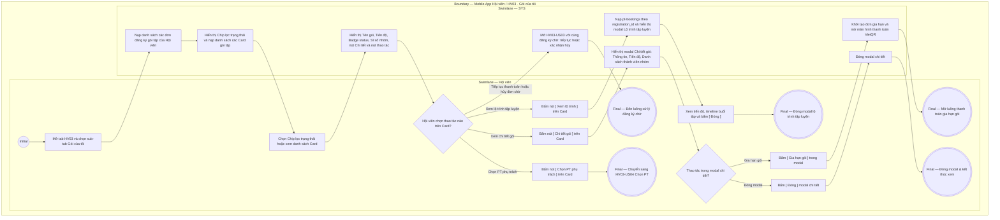

# HV03-US01 - Xem gói, quyền lợi và tiến độ sử dụng

## Preconditions
- Hội viên đã đăng nhập Mobile bằng tài khoản hợp lệ.
- Hệ thống đã có dữ liệu các đơn đăng ký gói tập của Hội viên.

## Trigger
- Hội viên bấm mở tab `Gói của tôi` (HV03) trên menu footer và chọn sub-tab `Gói của tôi`.
- Màn hình liên quan: Mobile App — Tab `HV03 · Gói của tôi`, sub-tab `Gói của tôi`.

## Quy tắc sắp hết hạn
- Gói đã thanh toán, đang có hiệu lực và chưa hết hạn: theo thời gian còn <= 4 ngày, theo buổi còn <= 3 buổi; Combo dùng OR giữa các quyền lợi áp dụng. Nguồn hiển thị là is_expiring và display_status do SYS/API tính; status nội bộ ACTIVE vẫn dùng cho kiểm tra quyền tập. Không tạo enum/field DB mới và không tự tính ngưỡng riêng trên UI.

## Quy tắc kiểm soát chuyển nhượng & đóng băng (Staff-only tại Quầy)
- Bắt buộc xác nhận trực tiếp tại quầy Lễ tân với sự có mặt và đồng thuận của các bên:
  * **Chuyển nhượng gói:** Xác nhận 3 bên (Người chuyển nhượng, Người nhận nhượng, Lễ tân/Chủ phòng). Không cho phép Hội viên tự do chuyển nhượng trên App để triệt tiêu giao dịch ngầm, mua bán chui và kiểm soát danh tính hội viên.
  * **Đóng băng bảo lưu gói:** Do Lễ tân / QTV tiếp nhận và thực hiện tại quầy theo chính sách bảo lưu; Hội viên không tự ý thao tác đóng băng trên App.
- Khi Lễ tân chuyển nhượng gói tại quầy: Quyền sở hữu chuyển giao tức thì sang hội viên nhận, hệ thống chỉ gửi thông báo in-app đến 2 hội viên mà không phát sinh yêu cầu duyệt trên App.

## Main Flow

1. Hội viên mở tab **Gói của tôi** trên menu footer và chọn sub-tab **Gói của tôi**.
2. SYS nạp danh sách toàn bộ các đơn đăng ký gói tập (Registrations) thuộc sở hữu của Hội viên.
3. SYS hiển thị 3 sub-tab chuyển đổi chính: `Gói của tôi` (đang chọn), `Mua gói`, `Lời mời vào Gói`.
4. SYS hiển thị các Chip lọc trạng thái gói: `Tất cả (n)`, `Đang sử dụng (n)`, `Đang đóng băng (n)`, `Chờ xử lý (n)`, `Đã hết hạn (n)`, `Đã hủy (n)`.
5. Hội viên chọn Chip lọc trạng thái cần xem (mặc định chọn `Đang sử dụng`).
6. SYS nạp và hiển thị danh sách các thẻ Card gói tập tương ứng bao gồm:
   - **Tên gói tập**: Ví dụ `Gói PT 20 buổi`, `Gói Gym 1 tháng`, `Combo Gym 3 tháng + PT 10 buổi`.
   - **Tiến độ sử dụng & Thanh Progress bar**:
     - Gói PT theo số buổi: `Đã dùng 17/20 buổi` kèm thanh tiến độ (Progress bar).
     - Gói Gym theo ngày: `Đã dùng 18/30 ngày` kèm thanh tiến độ (Progress bar).
     - Gói Combo Gym + PT: `Gym: đã dùng 1/3 tháng · PT: còn 8/10 buổi` kèm thanh tiến độ (Progress bar).
   - **Badge trạng thái gói**: `Đang hoạt động` (badge xanh lá), `❄️ Đang đóng băng` (badge xanh băng tuyết `#e0f2fe`), `Sắp hết hạn` (badge vàng), `Chờ xử lý`, `Đã hết hạn`, `Đã hủy`.
   - **Thông tin PT phụ trách & Thành viên nhóm**:
     - Nếu gói PT/Combo đã chọn PT phụ trách: Hiển thị `PT: Nguyễn Văn Thể`.
     - Nếu gói PT/Combo chưa chọn PT phụ trách: Hiển thị `PT: Chưa chọn (Liên hệ Lễ tân)` và nút CTA màu đen **`[ Chọn PT phụ trách ]`** (bấm vào mở Popup liên hệ Lễ tân chi nhánh theo [HV03-US04](./HV03-US04-Chọn%20PT%20và%20gửi%20yêu%20cầu%20phân%20công.md)).
     - Nếu là gói PT theo nhóm (Group PT 1-N): Hiển thị thêm dòng `Số lượng thành viên: [số lượng hiện tại]/[tối đa]` (Ví dụ: `Số lượng thành viên: 3/4`) kèm badge vai trò (`Trưởng nhóm` hoặc `Thành viên nhóm`).
   - **Nút thao tác trên thẻ**:
     - Nút **`[ Chi tiết gói ]`**: Hiển thị trên mọi thẻ gói để mở modal xem thông tin chi tiết gói, tiến độ, thành viên và nút gia hạn.
     - Nút **`[ Xem lộ trình ]`**: Hiển thị trên các thẻ gói có trạng thái `Đang sử dụng` (`ACTIVE`), `Đang đóng băng` (`FROZEN`), `Đã hết hạn` (`EXPIRED`) hoặc `Sắp hết hạn` (`EXPIRING`) để mở modal **Lộ trình tập luyện**, xem thanh tiến độ (số buổi đã tập/còn lại/tỷ lệ %) và lịch sử timeline chi tiết từng buổi tập đã hoàn thành kèm giáo án bài tập và đánh giá thể lực từ HLV.
     - Nút **`[ Mời bạn vào nhóm ]`**: Hiển thị cho Trưởng nhóm gói PT nhóm còn hiệu lực để mở modal mời bạn bè qua SĐT.
     - Nút **`[ Tiếp tục thanh toán ]`**: Hiển thị trên thẻ gói ở trạng thái `PENDING_PAYMENT` để tiếp tục thanh toán đơn hàng.
7. Khi Hội viên bấm nút **`[ Chi tiết gói ]`**, SYS mở modal **Chi tiết gói tập** bao gồm:
   - Thông tin gói: Tên gói, mã hợp đồng, hình thức gói, thời hạn hiệu lực, chi nhánh đăng ký, HLV phụ trách (kèm nút Liên hệ Lễ tân nếu chưa gán).
   - Tiến độ sử dụng chi tiết (Gym và PT kèm thanh tiến độ).
   - Danh sách các thành viên trong nhóm (nếu là gói PT nhóm): Trưởng nhóm, thành viên đã tham gia, lời mời chờ xác nhận.
   - Nút **`[ Xem lộ trình ]`** (nếu gói đủ điều kiện xem lộ trình).
   - Nút **`[ Gia hạn gói ]`** (chỉ hiển thị khi gói không ở trạng thái đóng băng; khi gói đóng băng, hệ thống hiển thị thông báo bảo lưu và ẩn nút gia hạn).

### Field-level specification — Sub-tab Gói của tôi
| Field / control | Loại UI Control | State | Required | Conditional / dynamic | Source / validation |
| :--- | :--- | :--- | :--- | :--- | :--- |
| **Tiêu đề khối Gói của tôi** | `Typography / Heading` | `READONLY` | required | `DYNAMIC`: Lấy từ tổng số gói đăng ký của hội viên | Hiển thị nhãn cố định kèm số lượng: `GÓI CỦA TÔI (n)` |
| **Nhóm Chip lọc trạng thái gói** | `Chip group / Segmented control` | `USER-INPUT` | required | `TRIGGER`: Điều khiển danh sách thẻ gói hiển thị bên dưới | Các chip chuyển đổi trạng thái: `Tất cả (n)`, `Đang sử dụng (n)`, `Đang đóng băng (n)`, `Chờ xử lý (n)`, `Đã hết hạn (n)`, `Đã hủy (n)`. Mặc định chọn `Đang sử dụng (n)` |
| **Thẻ gói tập cá nhân (Package Card)** | `Card list item` | `READONLY` | required | `DYNAMIC`: Danh sách thẻ hiển thị theo chip trạng thái đang chọn | Mỗi thẻ bao gồm: Tên gói, Badge trạng thái (`Đang hoạt động`, `❄️ Đang đóng băng`, `Sắp hết hạn`, `Chờ xử lý`, `Đã hết hạn`, `Đã hủy`), Dòng tiến độ sử dụng, Thanh tiến độ (Progress bar) |
| **Dòng số lượng thành viên nhóm** | `Text label` | `READONLY` | conditional | `CONDITIONAL`: • **Hiện khi**: Gói là PT nhóm 1-Nhiều (`package_mode = 'GROUP_1_N'`). Hiển thị `Số lượng thành viên: X/Y` • **Ẩn khi**: Gói Gym tiêu chuẩn hoặc gói PT 1-1 cá nhân | Số lượng thành viên hiện tại (`total_group_members`) trên số lượng tối đa (`max_group_members`) |
| **Thông tin PT phụ trách trên thẻ** | `Badge / Text label` | `READONLY` | conditional | `CONDITIONAL`: Phụ thuộc vào loại gói tập | - **Hiện khi:** Gói tập là gói `PT` hoặc `Combo (Gym + PT)`. Nếu đã có HLV hiển thị `PT: [Tên HLV]` (màu xanh lục); nếu chưa có HLV hiển thị `PT: Chưa chọn (Liên hệ Lễ tân)` (màu xám). - **Ẩn khi:** Gói tập là gói `Gym` thuần (không sử dụng PT). |
| **Nút [ Chi tiết gói ]** | `Action Button` | `USER-INPUT` | required | Không | Nút hiển thị trên mọi thẻ gói, bấm mở modal Chi tiết gói tập |
| **Nút [ Xem lộ trình ] trên thẻ** | `Action Button` | `USER-INPUT` | conditional | `CONDITIONAL`: • **Hiện khi**: Gói ở trạng thái `ACTIVE`, `FROZEN`, `EXPIRED`, `EXPIRING` • **Ẩn khi**: Gói ở trạng thái `PENDING_PAYMENT` hoặc `CANCELLED` | Nút phụ (secondary) hiển thị cạnh nút Chi tiết gói, bấm mở modal Lộ trình tập luyện |
| **Nút CTA [ Chọn PT phụ trách ]** | `Button / CTA` | `USER-INPUT` | conditional | `CONDITIONAL`: Phụ thuộc vào loại gói và trạng thái gán PT | - **Hiện khi:** Gói tập là `PT` hoặc `Combo`, trạng thái đang sử dụng và chưa có HLV. Nút màu đen chữ trắng, bấm để mở Popup Liên hệ Lễ tân chi nhánh ([HV03-US04](./HV03-US04-Chọn%20PT%20và%20gửi%20yêu%20cầu%20phân%20công.md)). - **Ẩn khi:** Gói tập đã có PT phụ trách, gói Gym thuần, hoặc gói ở trạng thái Chờ xử lý / Đã hết hạn. |
| **Nút [ Mời bạn vào nhóm ]** | `Action Button` | `USER-INPUT` | conditional | `CONDITIONAL`: • **Hiện khi**: Gói PT nhóm 1-Nhiều đang hiệu lực và đã thanh toán đủ 100% • **Ẩn khi**: Gói cá nhân, gói Gym thuần, hoặc gói chưa thanh toán | Bấm mở modal nhập SĐT mời bạn bè vào nhóm |
| **Nút [ Tiếp tục thanh toán ]** | `Action Button` | `USER-INPUT` | conditional | `CONDITIONAL`: • **Hiện khi**: Gói ở trạng thái `PENDING_PAYMENT` • **Ẩn khi**: Gói đã thanh toán 100% | Bấm mở lại cổng thanh toán VietQR cho đơn hàng |
| **Modal Chi tiết gói tập** | `Modal / Dialog` | `READONLY` | conditional | `CONDITIONAL`: • **Hiện khi**: Bấm nút `[ Chi tiết gói ]` • **Ẩn khi**: Bấm nút Đóng | Hiển thị: Thông tin gói, tiến độ, thành viên trong nhóm, thông báo bảo lưu (nếu đóng băng), nút Xem lộ trình và nút Gia hạn gói |
| **Modal Lộ trình tập luyện** | `Modal / Dialog` | `READONLY` | conditional | `CONDITIONAL`: • **Hiện khi**: Bấm nút `[ Xem lộ trình ]` • **Ẩn khi**: Bấm nút Đóng | Hiển thị: Thông tin hợp đồng, HLV phụ trách, tiến độ số buổi (hoàn thành/còn lại/tỷ lệ %), và timeline các buổi tập đã hoàn thành kèm Đánh giá của PT (hoặc thông báo rỗng nếu chưa có buổi hoàn thành) |
| **Nút [ Gia hạn gói ]** | `Action Button` | `USER-INPUT` | conditional | `CONDITIONAL`: • **Hiện khi**: Gói không ở trạng thái đóng băng (`is_frozen = false`) • **Ẩn khi**: Gói đang ở trạng thái đóng băng (`is_frozen = true`) | Nằm trong modal Chi tiết gói, bấm để mở thanh toán gia hạn nhanh cho gói tập |
| **Tiêu đề khối Lịch sử thanh toán** | `Typography / Heading` | `READONLY` | required | Không | Header cố định bên dưới danh sách gói: `Lịch sử thanh toán` kèm phụ đề `Các giao dịch mua và thanh toán gói của bạn.` và icon phiếu thu |
| **Thẻ giao dịch thanh toán (Payment Card)** | `Card list item` | `READONLY` | optional | `DYNAMIC`: Lấy từ lịch sử phiếu thu 100% của hội viên | Hiển thị danh sách phiếu thu: Mã phiếu thu (`PT00125`), Số tiền 100% (`3.200.000 đ`), Tên gói & ngày thanh toán, Phương thức thực tế từ payment (`Tiền mặt` hoặc `Chuyển khoản`) |

## Alternate Flows

### AF-01 — Xem Lộ Trình Tập Luyện
1. Tại thẻ gói tập đủ điều kiện (hoặc trong modal Chi tiết gói), Hội viên bấm nút **`[ Xem lộ trình ]`**.
2. SYS nạp lịch sử các buổi tập PT đã hoàn thành (`pt-bookings` có `status = COMPLETED` hoặc `DONE`) từ REST API.
3. SYS mở modal **Lộ trình tập luyện**, hiển thị thanh tiến độ hoàn thành gói, tỉ lệ % và danh sách timeline các buổi tập kèm đánh giá thể lực từ HLV.
4. Hội viên bấm **`[ Đóng ]`** để quay lại màn hình danh sách gói.

## Exception Flows
- **Lỗi kết nối API:** SYS hiển thị thông báo lỗi và nút Thử lại.

## Activity Diagram — Swimlane
**Trigger:** Hội viên mở tab HV03 và chọn sub-tab Gói của tôi.

