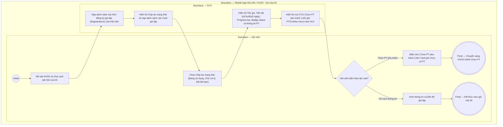

# HV03-US01 - Xem gói, quyền lợi và tiến độ sử dụng

## Preconditions
- Hội viên đã đăng nhập Mobile bằng tài khoản hợp lệ.
- Hệ thống đã có dữ liệu các đơn đăng ký gói tập của Hội viên.

## Trigger
- Hội viên bấm mở tab `Gói của tôi` (HV03) trên menu footer và chọn sub-tab `Gói của tôi`.
- Màn hình liên quan: Mobile App — Tab `HV03 · Gói của tôi`, sub-tab `Gói của tôi`.

## Main Flow

1. Hội viên mở tab **Gói của tôi** trên menu footer và chọn sub-tab **Gói của tôi**.
2. SYS nạp danh sách toàn bộ các đơn đăng ký gói tập (Registrations) thuộc sở hữu của Hội viên.
3. SYS hiển thị 3 sub-tab chuyển đổi chính: `Gói của tôi` (đang chọn), `Mua gói`, `Yêu cầu PT`.
4. SYS hiển thị các Chip lọc trạng thái gói: `Đang sử dụng (n)`, `Chờ xử lý (n)`, `Đã hết hạn (n)`.
5. Hội viên chọn Chip lọc trạng thái cần xem (mặc định chọn `Đang sử dụng`).
6. SYS nạp và hiển thị danh sách các thẻ Card gói tập tương ứng bao gồm:
   - **Tên gói tập**: Ví dụ `Gói PT 20 buổi`, `Gói Gym 1 tháng`, `Combo Gym 3 tháng + PT 10 buổi`.
   - **Tiến độ sử dụng & Thanh Progress bar**:
     - Gói PT theo số buổi: `Đã dùng 17/20 buổi` kèm thanh tiến độ (Progress bar).
     - Gói Gym theo ngày: `Đã dùng 18/30 ngày` kèm thanh tiến độ (Progress bar).
     - Gói Combo Gym + PT: `Gym: đã dùng 1/3 tháng · PT: còn 8/10 buổi` kèm thanh tiến độ (Progress bar).
   - **Badge trạng thái gói**: `Đang hoạt động` (badge xanh lá), `Sắp hết hạn` (badge vàng), `Chờ xử lý` / `Chờ kích hoạt`, `Đã hết hạn`.
   - **Thông tin PT phụ trách & Nút thao tác**:
     - Nếu gói PT/Combo đã chọn PT phụ trách: Hiển thị `PT: Nguyễn Thành Long`.
     - Nếu gói PT/Combo chưa chọn PT phụ trách: Hiển thị `PT: Chưa chọn` và nút CTA màu đen **`[ Chọn PT phụ trách ]`**.
7. Khi Hội viên bấm nút **`[ Chọn PT phụ trách ]`**, SYS điều hướng sang màn hình Chọn PT cho gói đó (thuộc `HV03-US04`).

- **Business rules / logic:**
  - Danh sách chỉ hiển thị các gói tập thuộc sở hữu của chính Hội viên đang đăng nhập.
  - Tiến độ sử dụng phản ánh trung thực số buổi đã tập (được trừ sau khi buổi tập PT `DONE`) hoặc số ngày đã trôi qua kể từ ngày kích hoạt gói Gym.
  - Thẻ gói PT/Combo chưa chọn PT phải hiển thị nút CTA `[ Chọn PT phụ trách ]` để nhắc nhở Hội viên gán HLV trước khi đặt lịch ở menu HV02.

## Alternate Flows

### AF-01 — Không có gói ở bộ lọc đã chọn
1. Hội viên chọn một Chip lọc trạng thái không có gói nào.
2. SYS hiển thị màn hình rỗng (Empty state) kèm thông báo: `Bạn chưa có gói tập nào ở trạng thái này`.

### AF-02 — Bấm chọn PT phụ trách từ Card gói
1. Hội viên thấy gói Combo/PT có nút `[ Chọn PT phụ trách ]` và bấm chọn.
2. SYS chuyển hướng sang màn hình Chọn PT (`HV03-US04`) với thông tin gói đã được prefill.

## Exception Flows

- Không hiển thị gói tập thuộc tài khoản khác.
- Lỗi kết nối mạng: SYS hiển thị thông báo không thể nạp danh sách gói và cho phép bấm tải lại.

## Activity Diagram — Swimlane
**Trigger:** Hội viên mở tab Gói của tôi (HV03) và chọn sub-tab Gói của tôi.

