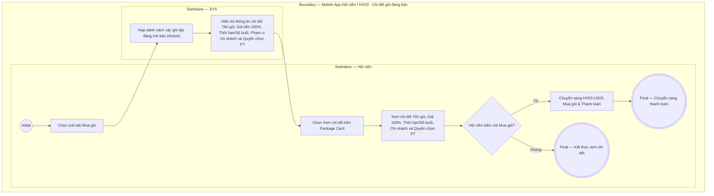

# HV03-US02 - Xem chi tiết và quyền lợi gói đang bán

## Preconditions
- Hội viên đã đăng nhập Mobile bằng tài khoản hợp lệ.
- Hệ thống đã có danh mục các gói tập đang mở bán (`Active`).

## Trigger
- Hội viên chọn sub-tab `Mua gói` trên menu `HV03 · Gói của tôi` và bấm `Xem chi tiết` trên một Package Card.
- Màn hình liên quan: Mobile App — Tab `HV03 · Gói của tôi`, sub-tab `Mua gói`, màn hình Chi tiết gói.

## Main Flow

1. Hội viên chọn sub-tab **Mua gói** trên menu **HV03 · Gói của tôi**.
2. SYS tự động nạp và hiển thị danh sách các gói tập đang mở bán (Active).
3. Hội viên chọn một gói tập và bấm **`Xem chi tiết`** trên Package Card.
4. SYS nạp và hiển thị màn hình Chi tiết gói tập bao gồm:
   - **Tên gói tập**: Ví dụ `Gói Gym 3 tháng`, `Gói PT 20 buổi`, `Combo Gym 6 tháng + PT 20 buổi`.
   - **Giá niêm yết (100%)**: Giá tiền chính xác cần thanh toán.
   - **Thời hạn / Số buổi**: Thời gian hiệu lực (ví dụ 90 ngày) hoặc số buổi tập PT khả dụng.
   - **Phạm vi chi nhánh**: Danh sách chi nhánh được phép tập luyện (Toàn hệ thống hoặc Chi nhánh cụ thể).
   - **Quyền lợi chọn PT**: Nếu là gói PT hoặc Combo, hiển thị rõ quyền chọn HLV cá nhân sau khi mua.
5. Hội viên bấm nút CTA **`[ Mua gói ]`** để chuyển sang màn hình Khởi tạo thanh toán (`HV03-US03`).

- **Business rules / logic:**
  - Tab `Mua gói` mặc định chỉ hiển thị các gói tập đang ở trạng thái mở bán (`Active`), hệ thống không hiển thị các gói đã ngưng bán hoặc bị ẩn.
  - Giá tiền và quyền lợi hiển thị là giá cố định (100%), không có bớt giá hay giảm giá.

## Alternate Flows

### AF-01 — Không mua gói sau khi xem
1. Hội viên xem chi tiết gói nhưng không bấm nút `[ Mua gói ]`.
2. Hội viên bấm nút Quay lại (Back) để quay về sub-tab `Mua gói`.

## Exception Flows

- Lỗi kết nối mạng: SYS hiển thị thông báo không nạp được chi tiết gói và cho phép bấm thử lại.

## Activity Diagram — Swimlane
**Trigger:** Hội viên chọn sub-tab Mua gói và bấm Xem chi tiết trên một Package Card.

