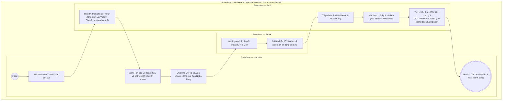

# HV03-US03 - Mua gói và khởi tạo thanh toán Mobile

## Preconditions
- Hội viên đã đăng nhập Mobile bằng tài khoản hợp lệ.
- Hội viên đã chọn gói tập hợp lệ từ danh mục gói đang bán.

## Trigger
- Hội viên bấm `[ Mua gói ]` từ màn hình Chi tiết gói tập (HV03-US02).
- Màn hình liên quan: Mobile App — Tab `HV03 · Gói của tôi`, màn hình Thanh toán gói tập (VietQR).

## Main Flow

1. Hội viên bấm `[ Mua gói ]` từ màn hình Chi tiết gói.
2. SYS nạp và hiển thị màn hình **Thanh toán gói tập**:
   - **Tên gói tập**: Hiển thị tên gói đã chọn (`READONLY`).
   - **Số tiền thanh toán (100%)**: Hiển thị giá niêm yết chính xác của gói (`READONLY`).
   - **Phương thức thanh toán**: Cố định mặc định **`Chuyển khoản Ngân hàng (VietQR)`** (`READONLY`).
3. SYS tự động sinh và hiển thị **Mã VietQR Chuyển khoản** cùng thông tin thanh toán chi tiết bao gồm:
   - **Tên Ngân hàng & Số tài khoản thụ hưởng**.
   - **Chủ tài khoản**: Công ty / Phòng Gym.
   - **Số tiền**: Chính xác 100% giá trị gói.
   - **Nội dung chuyển khoản**: Mã đơn đăng ký duy nhất.
4. Hội viên lưu mã QR hoặc mở App Ngân hàng để thực hiện chuyển khoản 100%.
5. Ngân hàng (BANK) xử lý và tự động gửi thông báo kết quả giao dịch qua IPN/Webhook tới hệ thống SYS.
6. SYS xác thực chữ ký và dữ liệu giao dịch IPN/Webhook $\rightarrow$ Tạo phiếu thu thanh toán 100%, kích hoạt gói tập (`ACTIVE` hoặc `SCHEDULED`) và gửi thông báo In-app xác nhận thành công cho Hội viên.

### Field-level specification — Màn hình Thanh toán gói tập (VietQR)
| Field / control | State | Required | Conditional / dynamic | Source / validation |
|---|---|---|---|---|
| Tên gói tập | `READONLY` | required | `DYNAMIC`: nạp tên gói tập đã chọn từ HV03-US02 | Thông tin gói tập |
| Số tiền thanh toán (100%) | `READONLY` | required | `DYNAMIC`: nạp giá trị 100% của gói tập | Giá niêm yết gói tập |
| Phương thức thanh toán | `READONLY` | required | `DYNAMIC`: cố định duy nhất `Chuyển khoản Ngân hàng (VietQR)` | Hình thức thanh toán Mobile |
| Mã VietQR & Chi tiết chuyển khoản | `AUTO-FILL` + `READONLY` | required | `DYNAMIC`: tự động hiển thị mã QR, Tên TK, STK, Ngân hàng và Nội dung chuyển khoản duy nhất | Cổng thanh toán VietQR / Hệ thống |
| Nút `[ Tải mã QR ]` / `[ Sao chép STK ]` | `USER-INPUT` | optional | `DYNAMIC`: hỗ trợ lưu ảnh QR hoặc copy STK/Nội dung | Tiện ích trên Mobile |

- **Business rules / logic:**
  - Kênh thanh toán trên Mobile App chỉ có **duy nhất 1 hình thức là Chuyển khoản Ngân hàng (VietQR)**.
  - Thanh toán **100% giá trị gói trong 1 lần chuyển khoản duy nhất**.
  - Đơn đăng ký gói được tự động kích hoạt (`ACTIVE` / `SCHEDULED`) ngay sau khi hệ thống xác thực thành công chữ ký giao dịch IPN/Webhook từ Ngân hàng.

## Alternate Flows

### AF-01 — Giao dịch IPN trùng lặp
1. Ngân hàng gửi lại tín hiệu Webhook/IPN cho một giao dịch đã được xác nhận trước đó.
2. SYS kiểm tra giao dịch đã ghi nhận và không tạo phiếu thu trùng.

## Exception Flows

- Lỗi kết nối Cổng thanh toán/Ngân hàng: SYS hiển thị thông báo giao dịch đang chờ xử lý và cho phép Hội viên kiểm tra lại sau.

## Activity Diagram — Swimlane
**Trigger:** Hội viên bấm Mua gói từ màn hình Chi tiết gói tập.

