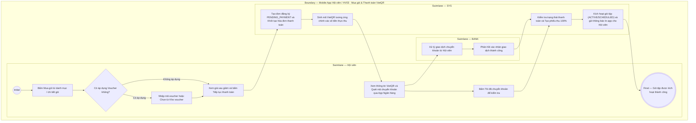

# HV03-US03 - Mua gói, áp dụng voucher và khởi tạo thanh toán Mobile

## Preconditions
- Hội viên đã đăng nhập Mobile bằng tài khoản hợp lệ.
- Hội viên đã chọn gói tập hợp lệ từ danh mục gói đang bán.

## Trigger
- Hội viên bấm `[ Mua gói ]` từ màn hình Danh mục gói đang bán hoặc Chi tiết gói tập (HV03-US02).
- Màn hình liên quan: Mobile App — Tab `HV03 · Gói của tôi`, Modal Mua gói và Modal Thanh toán VietQR.

## Main Flow

1. Hội viên bấm `[ Mua gói ]` từ danh mục hoặc chi tiết gói tập.
2. SYS hiển thị modal **Mua gói**:
   - Tên gói tập (`READONLY`).
   - Giá niêm yết của gói (`READONLY`).
   - Phương thức thanh toán: Cố định mặc định **`Chuyển khoản Ngân hàng (VietQR)`** (`READONLY`).
   - Khối áp dụng Voucher / Mã giảm giá: Ô nhập mã voucher, nút `[ Áp dụng ]` và nút `[ Chọn voucher ]`.
3. Hội viên có thể nhập mã voucher trực tiếp hoặc bấm `[ Chọn voucher ]` để mở danh sách **Kho Voucher & Ưu Đãi** khả dụng và chọn mã.
4. Hội viên bấm `[ Áp dụng ]`: SYS kiểm tra tính hợp lệ của mã (`POST /discounts/validate`). Nếu hợp lệ:
   - Hiển thị giá gốc gạch ngang (`del`).
   - Hiển thị badge số tiền giảm trừ.
   - Cập nhật số tiền thanh toán thực tế (`final_amount`).
   - Hiển thị nút `[ Bỏ mã ]` cho phép hủy áp dụng nếu muốn.
5. Hội viên bấm `[ Tiếp tục thanh toán ]`: SYS tạo đơn đăng ký gói (`POST /registrations`) ở trạng thái `PENDING_PAYMENT`.
6. SYS khởi tạo hóa đơn thanh toán (`POST /payments/create-invoice`) kèm mã voucher đã chọn (nếu có) và hiển thị modal **Thanh toán VietQR**:
   - Hiển thị Tên gói, Giá gốc (nếu có giảm), Giá thanh toán thực tế và Badge giảm giá.
   - Khối Voucher trên màn hình VietQR: Hiển thị mã đã áp dụng kèm nút `[ Bỏ mã ]`, hoặc ô nhập mã voucher + nút `[ Áp dụng ]` / `[ Chọn voucher ]` cho phép Hội viên áp dụng mã giảm giá trực tiếp trên màn hình thanh toán.
   - Mã VietQR động được sinh chính xác theo số tiền thực thu sau giảm giá.
   - Thông tin số tài khoản, tên chủ tài khoản, tên ngân hàng và cú pháp nội dung chuyển khoản kèm nút `[ Sao chép ]`.
7. Hội viên lưu mã QR hoặc mở ứng dụng Ngân hàng quét VietQR và thực hiện chuyển khoản 100%.
8. Hội viên bấm `[ Tôi đã chuyển khoản ]`: SYS kiểm tra trạng thái thanh toán (`GET /payments/:id`). Khi thanh toán thành công (qua xác nhận quầy hoặc webhook ngân hàng), hệ thống kích hoạt gói tập (`ACTIVE` hoặc `SCHEDULED`) và gửi thông báo In-app cho Hội viên.

- **Business rules / logic:**
  - Kênh thanh toán trên Mobile App chỉ có **duy nhất 1 hình thức là Chuyển khoản Ngân hàng (VietQR)**.
  - Thanh toán **100% giá trị sau giảm giá trong 1 lần chuyển khoản duy nhất**.
  - Mã VietQR và nội dung chuyển khoản tự động đồng bộ theo số tiền thực thu; trigger cơ sở dữ liệu `validate_full_payment` đảm bảo `amount + discount_amount = price_snapshot`.
  - Hội viên có thể áp dụng, đổi mã hoặc hủy mã giảm giá linh hoạt ở cả bước Mua gói lẫn màn hình Thanh toán VietQR.

### Field-level specification — Modal Mua gói & Thanh toán VietQR
| Field / control | Loại UI Control | State | Required | Conditional / dynamic | Source / validation |
| :--- | :--- | :--- | :--- | :--- | :--- |
| **Tên gói tập** | `Typography / Heading` | `PREFILL` + `READONLY` | required | Không | Tên gói tập đã chọn mua (ví dụ: `Gói PT 20 buổi`, `Combo VIP Paradise`) |
| **Giá niêm yết gói** | `Badge / Price tag` | `PREFILL` + `READONLY` | required | Không | Giá gốc niêm yết của gói (ví dụ: `6.000.000 đ`) |
| **Ô nhập mã voucher** | `Input text` | `USER-INPUT` | optional | `CONDITIONAL`: Hiện khi chưa áp dụng voucher; Ẩn khi đã áp dụng voucher thành công | Mã giảm giá chữ hoa viết liền không dấu (ví dụ: `SUMMER2026`) |
| **Nút [ Áp dụng ]** | `Button / Primary small` | `USER-INPUT` | optional | `CONDITIONAL`: Hiện khi chưa áp dụng voucher; Ẩn khi đã áp dụng voucher thành công | Kích hoạt kiểm tra tính hợp lệ và áp dụng mức giảm trừ vào đơn thanh toán |
| **Nút [ Chọn voucher ]** | `Button / Text small` | `USER-INPUT` | optional | Không | Mở hộp thoại `Kho Voucher & Ưu Đãi` để duyệt và chọn mã giảm giá khả dụng |
| **Nút [ Bỏ mã ]** | `Button / Text small (đỏ)` | `USER-INPUT` | optional | `CONDITIONAL`: Hiện khi đã áp dụng voucher thành công; Ẩn khi chưa áp dụng voucher | Hủy mã giảm giá đã chọn và khôi phục giá trị thanh toán gốc |
| **Số tiền cần thanh toán** | `Badge / Price tag` | `AUTO-FILL` + `READONLY` | required | `DYNAMIC`: Cập nhật theo số tiền sau khi trừ giảm giá của voucher | Số tiền thanh toán thực tế (100% giá trị sau khuyến mãi) |
| **Phương thức thanh toán** | `Badge / Text label` | `READONLY` | required | Không | Cố định: `Chuyển khoản Ngân hàng (VietQR)` |
| **Mã QR chuyển khoản (VietQR Image)** | `QR Code Image / Graphic` | `READONLY` | required | `DYNAMIC`: Sinh theo số tiền thực thu và cú pháp đơn đăng ký | Ảnh mã VietQR động chứa STK, Số tiền chính xác và Nội dung chuyển khoản duy nhất |
| **Tên ngân hàng thụ hưởng** | `Typography / Text` | `READONLY` | required | Không | Ngân hàng tiếp nhận (ví dụ: `MBBANK`) |
| **Số tài khoản thụ hưởng** | `Typography / Text + Copy Action` | `READONLY` | required | Không | Số tài khoản nhận tiền chính thức kèm nút `[ Sao chép ]` |
| **Chủ tài khoản** | `Typography / Text` | `READONLY` | required | Không | Pháp nhân: `CONG TY TNHH PARADISE GYM` |
| **Nội dung chuyển khoản** | `Typography / Code + Copy Action` | `READONLY` | required | `DYNAMIC`: Sinh theo mã đơn đăng ký và mã hội viên | Cú pháp chuyển khoản duy nhất (ví dụ: `DK00030 HV000004 PARADISE`) kèm nút `[ Sao chép ]` |
| **Nút [ Lưu mã QR ]** | `Button / Secondary` | `USER-INPUT` | optional | Không | Cho phép lưu ảnh mã QR về thư viện máy |
| **Nút [ Tôi đã chuyển khoản ]** | `Button / Primary CTA` | `USER-INPUT` | required | Không | Kiểm tra trạng thái xác nhận thanh toán từ hệ thống |

## Alternate Flows

### AF-01 — Áp dụng hoặc thay đổi mã giảm giá trực tiếp trên màn hình VietQR
1. Hội viên mở màn hình Thanh toán VietQR nhưng trước đó chưa chọn voucher, hoặc muốn thay đổi sang voucher khác.
2. Hội viên nhập mã mới hoặc bấm `[ Chọn voucher ]` $\rightarrow$ bấm `[ Áp dụng ]`.
3. SYS cập nhật đơn thanh toán (`POST /payments/create-invoice`), điều chỉnh lại số tiền thực thu và tạo mới mã VietQR tương ứng.
4. Màn hình VietQR tự động cập nhật lại ảnh mã QR, số tiền và nội dung chuyển khoản mà không cần tạo lại đơn đăng ký.

## Exception Flows

- **EF-01 — Voucher không hợp lệ hoặc hết lượt:** SYS hiển thị thông báo lỗi cụ thể (ví dụ: "Mã giảm giá không tồn tại", "Đơn hàng chưa đạt giá trị tối thiểu") và giữ nguyên giá trị thanh toán ban đầu.
- **EF-02 — Lỗi tải mã QR:** SYS hiển thị thông báo "Không tải được mã QR. Vui lòng thử lại" và cho phép Hội viên tải lại giao diện.

## Activity Diagram — Swimlane
**Trigger:** Hội viên bấm Mua gói từ danh mục hoặc chi tiết gói tập.

