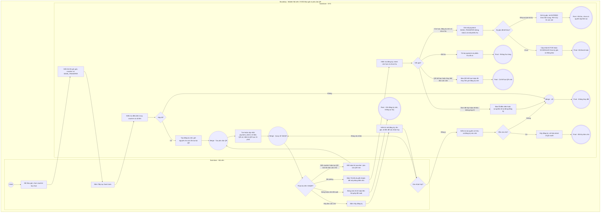

# HV03-US03 - Mua gói, áp dụng voucher và khởi tạo thanh toán Mobile

## Preconditions
- Hội viên đã đăng nhập Mobile bằng tài khoản hợp lệ.
- Hội viên đã chọn gói tập hợp lệ từ danh mục gói đang bán.

## Trigger
- Hội viên bấm `[ Mua gói ]` từ màn hình Danh mục gói đang bán hoặc Chi tiết gói tập (HV03-US02).
- Màn hình liên quan: Mobile App — Tab `HV03 · Gói của tôi`, Modal Mua gói và Modal Thanh toán VietQR.

## Main Flow

1. Hội viên bấm `[ Mua gói ]` từ danh mục hoặc chi tiết gói tập.
2. SYS hiển thị modal **Mua gói**:
   - Tên gói tập (`READONLY`).
   - Giá niêm yết của gói (`READONLY`).
   - Phương thức thanh toán: Cố định mặc định **`Chuyển khoản Ngân hàng (VietQR)`** (`READONLY`).
   - Khối áp dụng Voucher / Mã giảm giá: Ô nhập mã voucher, nút `[ Áp dụng ]` và nút `[ Chọn voucher ]`.
3. Hội viên có thể nhập mã voucher trực tiếp hoặc bấm `[ Chọn voucher ]` để mở danh sách **Kho Voucher & Ưu Đãi** khả dụng và chọn mã.
4. Hội viên bấm `[ Áp dụng ]`: SYS kiểm tra tính hợp lệ của mã (`POST /discounts/validate`). Nếu hợp lệ:
   - Hiển thị giá gốc gạch ngang (`del`).
   - Hiển thị badge số tiền giảm trừ.
   - Cập nhật số tiền thanh toán thực tế (`final_amount`).
   - Hiển thị nút `[ Bỏ mã ]` cho phép hủy áp dụng nếu muốn.
5. Hội viên bấm `[ Tiếp tục thanh toán ]`: SYS tạo đơn đăng ký gói (`POST /registrations`) ở trạng thái `PENDING_PAYMENT`.
6. SYS tạo yêu cầu QR riêng trong payment_intents cho cùng đăng ký, kèm voucher hợp lệ (nếu có), và hiển thị modal **Thanh toán VietQR**. Chưa tạo payment hoặc phiếu thu:
   - Hiển thị Tên gói, Giá gốc (nếu có giảm), Giá thanh toán thực tế và Badge giảm giá.
   - Khối Voucher trên màn hình VietQR: Hiển thị mã đã áp dụng kèm nút `[ Bỏ mã ]`, hoặc ô nhập mã voucher + nút `[ Áp dụng ]` / `[ Chọn voucher ]` cho phép Hội viên áp dụng mã giảm giá trực tiếp trên màn hình thanh toán.
   - Mã VietQR động được sinh chính xác theo số tiền thực thu sau giảm giá.
   - Thông tin số tài khoản, tên chủ tài khoản, tên ngân hàng và cú pháp nội dung chuyển khoản (có thao tác Sao chép).
7. Hội viên lưu mã QR hoặc mở ứng dụng Ngân hàng quét VietQR và thực hiện chuyển khoản 100%.
8. Trong giai đoạn kiểm thử hiện tại, Hội viên bấm `[ Tôi đã chuyển khoản ]` để chủ động mô phỏng chuyển khoản cho yêu cầu QR còn hạn. SYS kiểm tra lại đăng ký còn chờ, số tiền và intent; tạo đúng một payment BANK_TRANSFER thành công không có status cùng một phiếu thu, cập nhật đăng ký theo kỳ gốc: ACTIVE/SCHEDULED khi kỳ chưa kết thúc; kỳ đã qua giữ EXPIRED theo hiện trạng (PAY-OQ-01 còn mở) và gửi thông báo in-app. Đây là mô phỏng được duyệt, không khẳng định ngân hàng/IPN đã xác nhận tiền thật.
9. Với tiền chuyển khoản thực tế chưa được ghi nhận, Hội viên liên hệ QTV/Lễ tân đối soát đúng đăng ký theo W08-US02; nhân viên giữ BANK_TRANSFER và nhập mã giao dịch ngân hàng.

- **Business rules / logic:**
  - Kênh thanh toán trên Mobile App chỉ có **duy nhất 1 hình thức là Chuyển khoản Ngân hàng (VietQR)**.
  - Thanh toán **100% giá trị sau giảm giá trong 1 lần chuyển khoản duy nhất**.
  - Mã VietQR và nội dung chuyển khoản đồng bộ theo số tiền phải trả; số tiền thanh toán cộng giảm giá phải bằng giá snapshot đăng ký.
  - Hội viên có thể áp dụng, đổi mã hoặc hủy mã giảm giá linh hoạt ở cả bước Mua gói lẫn màn hình Thanh toán VietQR.

### Field-level specification — Modal Mua gói & Thanh toán VietQR
| Field / control | Loại UI Control | State | Required | Conditional / dynamic | Source / validation |
| :--- | :--- | :--- | :--- | :--- | :--- |
| **Tên gói tập** | `Typography / Heading` | `PREFILL` + `READONLY` | required | Không | Tên gói tập đã chọn mua (ví dụ: `Gói PT 20 buổi`, `Combo VIP Paradise`) |
| **Giá niêm yết gói** | `Badge / Price tag` | `PREFILL` + `READONLY` | required | Không | Giá gốc niêm yết của gói (ví dụ: `6.000.000 đ`) |
| **Ô nhập mã voucher** | `Input text` | `USER-INPUT` | conditional | `CONDITIONAL`: Hiện khi chưa áp dụng voucher; Ẩn khi đã áp dụng voucher thành công | Mã giảm giá chữ hoa viết liền không dấu (ví dụ: `SUMMER2026`) |
| **Số tiền cần thanh toán** | `Badge / Price tag` | `AUTO-FILL` + `READONLY` | required | `DYNAMIC`: Cập nhật theo số tiền sau khi trừ giảm giá của voucher | Số tiền thanh toán thực tế (100% giá trị sau khuyến mãi) |
| **Phương thức thanh toán** | `Badge / Text label` | `READONLY` | required | Không | Cố định: `Chuyển khoản Ngân hàng (VietQR)` |
| **Mã QR chuyển khoản (VietQR Image)** | `QR Code Image / Graphic` | `READONLY` | conditional | `CONDITIONAL`: Hiện khi yêu cầu QR còn hạn; Ẩn khi chưa có yêu cầu hoặc hết hạn | Ảnh mã VietQR động chứa STK, Số tiền chính xác và Nội dung chuyển khoản duy nhất |
| **Tên ngân hàng thụ hưởng** | `Typography / Text` | `READONLY` | required | Không | Ngân hàng tiếp nhận (ví dụ: `MBBANK`) |
| **Số tài khoản thụ hưởng** | `Typography / Text` | `READONLY` | required | Không | Số tài khoản nhận tiền chính thức (có thao tác Sao chép) |
| **Chủ tài khoản** | `Typography / Text` | `READONLY` | required | Không | Pháp nhân: `CONG TY TNHH PARADISE GYM` |
| **Nội dung chuyển khoản** | `Typography / Code` | `READONLY` | required | `DYNAMIC`: Sinh theo mã đơn đăng ký và mã hội viên | Cú pháp chuyển khoản duy nhất (ví dụ: `DK00030 HV000004 PARADISE`) (có thao tác Sao chép) |

| Hạn QR / đếm ngược | Text / Countdown | READONLY | conditional | CONDITIONAL: hiện khi có payment_intent; ẩn khi chưa tạo yêu cầu | 15 phút từ thời điểm tạo yêu cầu do SYS trả; hết hạn QR không hủy đăng ký. |

Thao tác modal: Áp dụng/Chọn/Bỏ voucher, Tiếp tục thanh toán, Sao chép, Lưu QR, Tôi đã chuyển khoản (mô phỏng kiểm thử), Tạo QR mới, Hủy đăng ký và Đóng. Hủy đăng ký chỉ hiện khi đăng ký còn chờ; sau thanh toán/đã hủy thì ẩn. Đóng modal chỉ đóng giao diện, không hủy đăng ký.

## Alternate Flows

### AF-01 — Áp dụng hoặc thay đổi mã giảm giá trực tiếp trên màn hình VietQR
1. Hội viên mở màn hình Thanh toán VietQR nhưng trước đó chưa chọn voucher, hoặc muốn thay đổi sang voucher khác.
2. Hội viên nhập mã mới hoặc bấm `[ Chọn voucher ]` $\rightarrow$ bấm `[ Áp dụng ]`.
3. SYS cập nhật/tạo yêu cầu payment_intents cho cùng đăng ký, vô hiệu yêu cầu cũ, điều chỉnh số tiền phải trả và tạo QR tương ứng. Không sửa payment đã thành công.
4. Màn hình VietQR tự động cập nhật lại ảnh mã QR, số tiền và nội dung chuyển khoản mà không cần tạo lại đơn đăng ký.

### AF-02 - QR hết hạn hoặc quay lại thanh toán
1. Sau 15 phút QR hết hiệu lực, SYS hiển thị hết hạn và ngừng cho dùng QR cũ để mô phỏng thanh toán.
2. Đăng ký vẫn chờ thanh toán; Hội viên mở lại từ Gói của tôi và tạo QR mới trên cùng đăng ký. Không tự hủy sau 3 ngày.

### AF-03 - Hủy đăng ký đang chờ bất kỳ lúc nào
1. Hội viên chọn Hủy đăng ký từ VietQR hoặc Gói của tôi; SYS hiển thị mã đăng ký, tên gói và số tiền phải trả ở dạng READONLY, required, nguồn đăng ký được chọn. Không có trường nhập liệu.
2. Hội viên xác nhận; SYS kiểm tra lại đăng ký còn chờ, chuyển sang đã hủy, vô hiệu yêu cầu QR và ghi audit. Không tạo payment/phiếu thu.
3. Đóng hộp xác nhận không thay đổi đăng ký. Sau khi thanh toán, thao tác hủy đơn chờ không còn áp dụng.

### AF-04 - Đóng màn hình hoặc chờ đối soát tại quầy
- Giữ đăng ký chờ khi đóng màn hình/chưa nhận được kết quả. Quầy đối soát theo W08-US02 với BANK_TRANSFER và mã giao dịch thực tế, kể cả QR đã hết hạn nhưng đăng ký còn chờ. Không cần IPN trong giai đoạn hiện tại.

## Exception Flows
- Trường hợp thanh toán khi toàn bộ kỳ gốc đã qua: PAY-OQ-01 còn mở; hiện giữ ngày gốc và trả EXPIRED, không tự dời ngày và không cam kết quyền tập ACTIVE/SCHEDULED.

- **EF-01 — Voucher không hợp lệ hoặc hết lượt:** SYS hiển thị thông báo lỗi cụ thể (ví dụ: "Mã giảm giá không tồn tại", "Đơn hàng chưa đạt giá trị tối thiểu") và giữ nguyên giá trị thanh toán ban đầu.
- **EF-02 — Lỗi tải mã QR:** SYS hiển thị thông báo "Không tải được mã QR. Vui lòng thử lại" và cho phép Hội viên tải lại giao diện.

- **EF-03 — Đăng ký đã hủy, intent hết hạn/đã thay thế hoặc số tiền sai:** Từ chối mô phỏng/xác nhận, không kích hoạt; yêu cầu tải lại.
- **EF-04 — Gửi lại hoặc thanh toán/hủy đồng thời:** Kiểm tra lại trạng thái; chỉ một kết quả có hiệu lực. Payment đã có được trả lại, không tạo thêm phiếu thu/doanh thu. Nếu thanh toán đã hoàn tất thì từ chối hủy đơn chờ.

## Activity Diagram — Swimlane
**Trigger:** Hội viên bấm Mua gói từ danh mục hoặc chi tiết gói tập.

