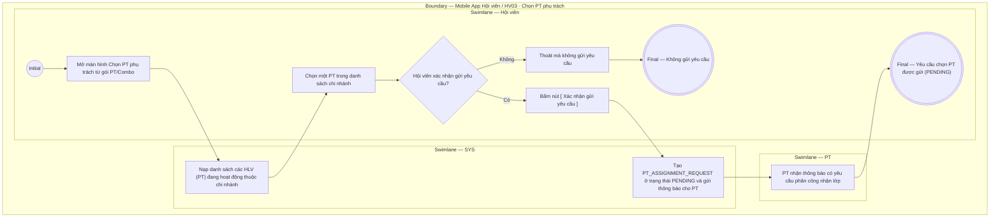

# HV03-US04 - Chọn PT và gửi yêu cầu phân công

## Preconditions
- Hội viên đã đăng nhập Mobile bằng tài khoản hợp lệ.
- Hội viên có gói PT/Combo đã thanh toán 100%, còn hiệu lực và chưa có PT phụ trách.

## Trigger
- Hội viên bấm nút **`[ Chọn PT phụ trách ]`** trên Card gói PT/Combo chưa gán HLV tại menu HV03.
- Màn hình liên quan: Mobile App — Tab `HV03 · Gói của tôi`, màn hình Chọn PT phụ trách.

## Main Flow

1. Hội viên mở màn hình **Chọn PT phụ trách** từ gói PT/Combo hợp lệ (gói đã thanh toán 100%).
2. SYS nạp và hiển thị danh sách các HLV (PT) đang hoạt động thuộc chi nhánh phục vụ của gói.
3. Hội viên chọn một HLV (PT) mong muốn.
4. Hội viên bấm nút **`[ Xác nhận gửi yêu cầu ]`**.
5. SYS khởi tạo yêu cầu phân công `PT_ASSIGNMENT_REQUEST` ở trạng thái `PENDING` (Chờ duyệt) và tự động gửi thông báo cho PT được chọn.
6. Màn hình cập nhật trạng thái yêu cầu đang chờ phản hồi.

### Field-level specification — Màn hình Chọn PT phụ trách
| Field / control | State | Required | Conditional / dynamic | Source / validation |
|---|---|---|---|---|
| Thông tin gói tập mục tiêu | `READONLY` | required | `DYNAMIC`: nạp tên gói và thông tin gói tập được mở từ HV03-US01 | Registration gói của Hội viên |
| Danh sách PT hoạt động | `USER-INPUT` | required | `DYNAMIC`: hiển thị danh sách HLV (PT) đang hoạt động thuộc chi nhánh | Danh mục PT active theo chi nhánh |
| Nút CTA `[ Xác nhận gửi yêu cầu ]` | `USER-INPUT` | required | `CONDITIONAL`: chỉ cho phép bấm sau khi Hội viên chọn 1 PT trong danh sách | Thao tác nút bấm trên Mobile |

- **Business rules / logic:**
  - Màn hình này chỉ mở cho các gói PT/Combo đã thanh toán 100%, còn hiệu lực và chưa có PT phụ trách.
  - Mỗi gói tập chỉ có duy nhất 1 yêu cầu phân công PT ở trạng thái `PENDING` tại một thời điểm.
  - Quyền đặt lịch tập ở menu HV02 chỉ được mở sau khi PT bấm **Chấp nhận (`ACCEPTED`)** yêu cầu phân công này.

## Alternate Flows

### AF-01 — PT từ chối yêu cầu
1. PT được chọn bấm Từ chối (`REJECTED`) trên ứng dụng PT.
2. SYS cập nhật trạng thái yêu cầu sang `REJECTED`, gửi thông báo cho Hội viên và hiển thị lại nút `[ Chọn PT phụ trách ]` để Hội viên chọn HLV khác.

### AF-02 — PT chấp nhận yêu cầu
1. PT được chọn bấm Chấp nhận (`ACCEPTED`) trên ứng dụng PT.
2. SYS gắn HLV đó thành PT phụ trách chính thức của gói và mở quyền đặt lịch cho Hội viên ở menu HV02.

## Exception Flows

- Lỗi kết nối mạng: SYS hiển thị thông báo gửi yêu cầu không thành công và hoàn tác trạng thái.

## Activity Diagram — Swimlane
**Trigger:** Hội viên bấm nút Chọn PT phụ trách trên Card gói tập.

