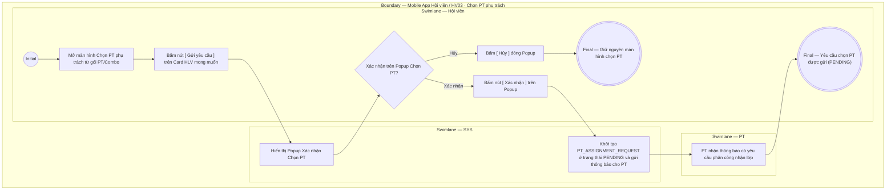

# HV03-US04 - Chọn PT và gửi yêu cầu phân công

## Preconditions
- Hội viên đã đăng nhập Mobile bằng tài khoản hợp lệ.
- Hội viên có gói PT/Combo đã thanh toán 100%, còn hiệu lực và chưa có PT phụ trách.

## Trigger
- Hội viên bấm nút **`[ Chọn PT phụ trách ]`** trên Card gói PT/Combo chưa gán HLV tại menu HV03.
- Màn hình liên quan: Mobile App — Tab `HV03 · Gói của tôi`, màn hình Chọn PT phụ trách.

## Main Flow

1. Hội viên mở màn hình **Chọn PT phụ trách** từ gói PT/Combo hợp lệ (gói đã thanh toán 100%).
2. SYS nạp và hiển thị danh sách các HLV (PT) đang hoạt động thuộc chi nhánh phục vụ của gói.
3. Trên Card của HLV mong muốn, Hội viên bấm nút **`[ Gửi yêu cầu ]`**.
4. SYS hiển thị **Popup Xác nhận Chọn PT**.
5. Hội viên chọn **`Xác nhận`** trên Popup.
6. SYS khởi tạo yêu cầu phân công `PT_ASSIGNMENT_REQUEST` ở trạng thái `PENDING` (Chờ duyệt), tự động gửi thông báo cho PT được chọn và hoàn tất gửi yêu cầu.

- **Business rules / logic:**
  - Màn hình này chỉ mở cho các gói PT/Combo đã thanh toán 100%, còn hiệu lực và chưa có PT phụ trách.
  - Mỗi gói tập chỉ có duy nhất 1 yêu cầu phân công PT ở trạng thái `PENDING` tại một thời điểm.
  - Quyền đặt lịch tập ở menu HV02 chỉ được mở sau khi PT bấm **Chấp nhận (`ACCEPTED`)** yêu cầu phân công này.
  - Thao tác gửi yêu cầu luôn qua bước Popup xác nhận để tránh bấm nhầm HLV.

### Field-level specification — Màn hình Chọn PT phụ trách
| Field / Control | Interaction State | Required | Conditional / Dynamic | Data Source / Validation |
| :--- | :--- | :--- | :--- | :--- |
| **Thông tin gói tập cần gán PT** | `PREFILL` + `READONLY` | required | Không | Hiển thị tóm tắt gói tập: `[Tên gói] · [Số buổi PT] · Chi nhánh: [Tên chi nhánh]` |
| **Thẻ HLV (PT Card)** | `READONLY` | required | `DYNAMIC`: Lấy từ danh sách PT đang hoạt động thuộc chi nhánh của gói | Mỗi thẻ HLV bao gồm: Avatar/Chữ cái đại diện (`TL`, `VM`...), Họ và tên PT (in đậm), Chuyên môn & Chi nhánh (`Cardio, HIIT · Quận 1`) |
| **Nút [ Gửi yêu cầu ] trên từng Card** | `USER-INPUT` | required | Không | Nút chữ màu xanh lá ở góc phải trên mỗi thẻ HLV; bấm để mở Popup Xác nhận Chọn PT |

### Field-level specification — Popup Xác nhận Chọn PT
| Field / Control | Interaction State | Required | Conditional / Dynamic | Data Source / Validation |
| :--- | :--- | :--- | :--- | :--- |
| **Thông tin HLV được chọn** | `PREFILL` + `READONLY` | required | Không | Hiển thị họ tên và chuyên môn của PT: `HLV [Tên PT] ([Chuyên môn])` |
| **Thông tin gói tập áp dụng** | `PREFILL` + `READONLY` | required | Không | Hiển thị tên gói tập đang thực hiện gán PT |
| **Thông báo xác nhận** | `READONLY` | required | Không | Đoạn text: *"Bạn có chắc chắn muốn gửi yêu cầu phân công HLV này không? Yêu cầu sẽ được gửi tới HLV để xác nhận."* |

## Alternate Flows

### AF-01 — Hủy thao tác trên Popup xác nhận
1. SYS hiển thị Popup Xác nhận Chọn PT.
2. Hội viên bấm Hủy hoặc đóng Popup.
3. SYS đóng Popup và giữ nguyên màn hình Chọn PT phụ trách.

### AF-02 — PT từ chối yêu cầu
1. PT được chọn bấm Từ chối (`REJECTED`) trên ứng dụng PT.
2. SYS cập nhật trạng thái yêu cầu sang `REJECTED`, gửi thông báo cho Hội viên và hiển thị lại nút `[ Chọn PT phụ trách ]` để Hội viên chọn HLV khác.

### AF-03 — PT chấp nhận yêu cầu
1. PT được chọn bấm Chấp nhận (`ACCEPTED`) trên ứng dụng PT.
2. SYS gắn HLV đó thành PT phụ trách chính thức của gói và mở quyền đặt lịch cho Hội viên ở menu HV02.

## Exception Flows

- Lỗi kết nối mạng: SYS hiển thị thông báo gửi yêu cầu không thành công và hoàn tác trạng thái.

## Activity Diagram — Swimlane
**Trigger:** Hội viên bấm nút Chọn PT phụ trách trên Card gói tập.

