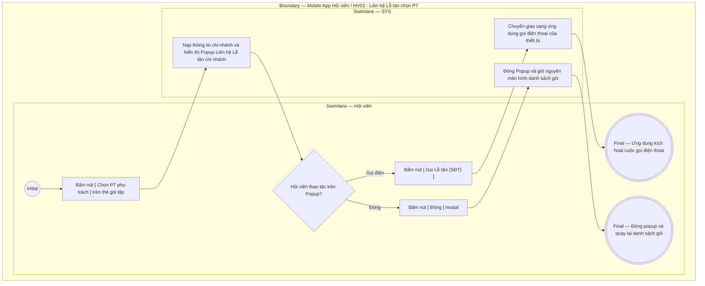

# HV03-US04 - Liên hệ Lễ tân chọn PT phụ trách qua Popup

## Preconditions
- Hội viên đã đăng nhập thành công vào ứng dụng Mobile Hội viên.
- Hội viên có gói tập hình thức PT hoặc Combo đã thanh toán 100%, đang ở trạng thái hiệu lực (`ACTIVE` hoặc `SCHEDULED`) nhưng chưa có Huấn luyện viên phụ trách (`assigned_pt_id` là null).

## Trigger
- Hội viên bấm nút **`[ Chọn PT phụ trách ]`** trên thẻ gói tập hoặc nút **`[ Liên hệ Lễ tân ]`** trong Modal Chi tiết gói tại menu **HV03 · Gói của tôi**.
- Màn hình liên quan: Mobile Hội viên — Tab `HV03 · Gói của tôi`, Popup **Liên hệ Lễ tân Chi nhánh**.

## Main Flow

1. Hội viên mở sub-tab **Gói của tôi** và bấm nút **`[ Chọn PT phụ trách ]`** trên thẻ gói PT/Combo chưa có HLV (hoặc bấm nút **`[ Liên hệ Lễ tân ]`** trong modal Chi tiết gói).
2. SYS nạp thông tin chi nhánh phục vụ của gói tập (`branches`).
3. SYS mở popup modal **Liên Hệ Lễ Tân Chi Nhánh**:
   - Hiển thị thông điệp tư vấn nghiệp vụ: *"Để đảm bảo chất lượng huấn luyện và sắp xếp lịch tập phù hợp nhất với thể trạng & mục tiêu của bạn, việc phân công Huấn luyện viên phụ trách sẽ do Lễ tân chi nhánh trực tiếp hỗ trợ."*
   - Hiển thị thông tin tóm tắt hợp đồng: Tên gói tập, Mã hợp đồng, Cơ sở tập luyện, Địa chỉ chi nhánh và Số điện thoại Lễ tân chi nhánh.
   - Hiển thị ghi chú hướng dẫn: Quý hội viên vui lòng liên hệ trực tiếp quầy Lễ tân chi nhánh hoặc gọi vào số điện thoại bên dưới để tiến hành chọn PT phụ trách.
   - Hiển thị nút hành động: **`[ Gọi Lễ tân (<SĐT>) ]`** (liên kết cuộc gọi `tel:...`) và nút **`[ Đóng ]`**.
4. Hội viên chọn bấm nút **`[ Gọi Lễ tân ]`** để quay số gọi trực tiếp đến quầy lễ tân chi nhánh, hoặc đến quầy để Lễ tân tiến hành xếp HLV trên hệ thống Web.

- **Business rules / logic:**
  - Hội viên không còn được tự chọn PT phụ trách trực tiếp trên ứng dụng Mobile nhằm đảm bảo tính khả thi về chuyên môn, phân bổ đồng đều lớp học và tránh việc học viên chọn PT đã kín lịch.
  - Toàn bộ việc gán và đổi HLV phụ trách do Lễ tân hoặc Quản trị viên chi nhánh thao tác trên Web Admin/Lễ tân (menu W04).
  - Nút bấm trên app đóng vai trò là cổng hướng dẫn và kết nối trực tiếp học viên với Lễ tân cơ sở.

### Field-level specification — Popup Liên Hệ Lễ Tân Chi Nhánh
| Field / control | Loại UI Control | State | Required | Conditional / dynamic | Source / validation |
| :--- | :--- | :--- | :--- | :--- | :--- |
| **Thông điệp tư vấn phân công PT** | `Banner / Heading` | `READONLY` | required | Không | Thông điệp thông báo việc phân công HLV do Lễ tân chi nhánh trực tiếp hỗ trợ |
| **Tên gói tập** | `Typography` | `PREFILL` + `READONLY` | required | Không | Tên gói PT/Combo đang cần phân công HLV (`package_name_snapshot`) |
| **Mã hợp đồng** | `Typography` | `PREFILL` + `READONLY` | required | Không | Mã hợp đồng gói tập (`reg_code`) |
| **Cơ sở tập luyện** | `Typography` | `PREFILL` + `READONLY` | required | Không | Tên chi nhánh phục vụ của hợp đồng (`branch_name`) |
| **Địa chỉ chi nhánh** | `Typography` | `PREFILL` + `READONLY` | conditional | `CONDITIONAL`: Hiện khi chi nhánh có dữ liệu địa chỉ; Ẩn khi dữ liệu địa chỉ trống | Địa chỉ cơ sở phòng tập của chi nhánh |
| **Số điện thoại Lễ tân** | `Typography / Text` | `PREFILL` + `READONLY` | required | Không | Số điện thoại liên hệ hotline / quầy lễ tân chi nhánh |
| **Ghi chú hướng dẫn** | `Alert Box / Note` | `READONLY` | required | Không | Đoạn ghi chú nhắc nhở hội viên liên hệ quầy hoặc gọi hotline để xếp PT |

## Alternate Flows

### AF-01 — Đóng popup liên hệ Lễ tân
1. Tại Popup Liên hệ Lễ tân, Hội viên bấm nút **`[ Đóng ]`** hoặc chạm ngoài vùng modal.
2. SYS đóng popup và giữ nguyên màn hình sub-tab `Gói của tôi`.

## Exception Flows

- **Lỗi kết nối mạng:** Không nạp được thông tin chi nhánh. SYS hiển thị thông báo lỗi và cho phép bấm thử lại.

## Activity Diagram — Swimlane
**Trigger:** Hội viên bấm nút [ Chọn PT phụ trách ] trên thẻ gói tập.

