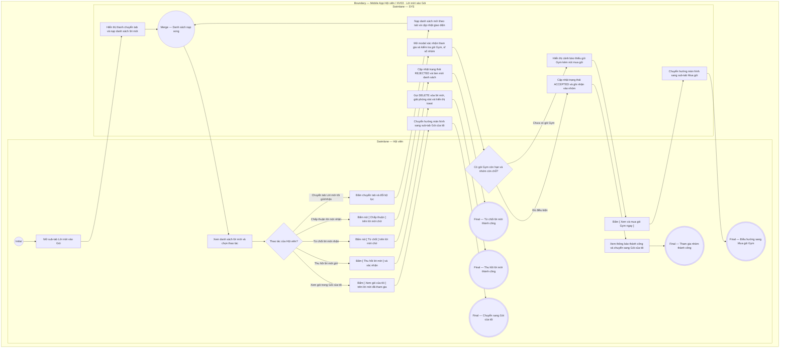

# HV03-US05 - Quản lý lời mời tham gia gói PT 1-Nhiều (Lời mời tôi nhận & Lời mời tôi gửi)

## Preconditions
- Hội viên đã đăng nhập thành công vào ứng dụng Mobile Hội viên.

## Trigger
- Hội viên chọn sub-tab **`Lời mời vào Gói`** trong menu **`HV03 · Gói của tôi`** (hoặc bấm nút xem từ thông báo Trang chủ).
- Màn hình liên quan: Mobile Hội viên — Tab `HV03 · Gói của tôi`, Sub-tab `Lời mời vào Gói`.

## Main Flow

1. Hội viên mở menu **HV03 · Gói của tôi** và chọn sub-tab **`Lời mời vào Gói`**.
2. SYS hiển thị thanh chuyển đổi 2 tab (Segment Navigation):
   - **`Lời mời tôi nhận`** (mặc định)
   - **`Lời mời tôi gửi`**
3. SYS nạp danh sách lời mời tương ứng theo tab đang chọn:
   - Nếu ở tab **Lời mời tôi nhận**: SYS gọi `GET /group-invitations?type=received`.
   - Nếu ở tab **Lời mời tôi gửi**: SYS gọi `GET /group-invitations?type=sent`.
4. SYS hiển thị tiêu đề kèm số lượng và bộ lọc Filter Chips:
   - Tab **Lời mời tôi nhận**: `Tất cả (X)`, `Chờ chấp thuận (Y)`, `Đã tham gia (Z)`, `Đã từ chối (W)`.
   - Tab **Lời mời tôi gửi**: `Tất cả (X)`, `Chờ phản hồi (Y)`, `Đã tham gia (Z)`, `Đã từ chối (W)`.
5. Hội viên chọn filter chip mong muốn; SYS lọc và hiển thị danh sách các thẻ lời mời.
6. **Thao tác trên thẻ ở tab "Lời mời tôi nhận":**
   - Trên mỗi thẻ, SYS hiển thị: Tên gói PT 1-Nhiều, Mã hợp đồng, Badge trạng thái (`Chờ chấp thuận` - cam, `Đã tham gia` - xanh lá, `Đã từ chối` - đỏ), Người mời (Trưởng nhóm: Họ tên & SĐT), Số buổi PT của gói, Chi nhánh phòng tập, HLV phụ trách (nếu có), Ngày và giờ gửi lời mời.
   - Đối với lời mời **Chờ chấp thuận (`PENDING`)**, SYS cung cấp 2 nút hành động: Nút **`[ Chấp thuận ]`** (màu xanh lá) và Nút **`[ Từ chối ]`** (màu đen viền).
   - Khi Hội viên bấm **`[ Chấp thuận ]`**: SYS mở popup xác nhận tham gia nhóm (nhắc nhở quy định cần có gói Gym còn hạn sử dụng và quyền đặt lịch tập thuộc về Trưởng nhóm). Hội viên bấm **`[ Xác nhận tham gia ]`**. SYS kiểm tra điều kiện gói Gym: Nếu hợp lệ và nhóm còn chỗ, SYS gọi `POST /group-invitations/:id/respond` với `action: "ACCEPT"`, cập nhật trạng thái `ACCEPTED`, ghi nhận hội viên chính thức vào nhóm, đồng bộ gói vào danh sách "Gói của tôi" và hiển thị thông báo thành công.
   - Đối với lời mời **Đã tham gia (`ACCEPTED`)**: SYS hiển thị nút **`[ Xem gói của tôi ]`** để điều hướng trực tiếp sang sub-tab `Gói của tôi`.
7. **Thao tác trên thẻ ở tab "Lời mời tôi gửi":**
   - Trên mỗi thẻ, SYS hiển thị: Tên gói PT 1-Nhiều, Mã hợp đồng, Badge trạng thái (`Chờ phản hồi` - cam, `Đã tham gia` - xanh lá, `Đã từ chối` - đỏ), Người nhận (Học viên được mời: Họ tên, SĐT, Mã HV), Số buổi PT của gói, Chi nhánh phòng tập, Thời gian gửi lời mời, Thời gian tham gia (nếu đã tham gia).
   - Đối với lời mời **Chờ phản hồi (`PENDING`)**: SYS cung cấp nút **`[ Thu hồi lời mời ]`**. Khi Hội viên bấm nút, SYS hiển thị dialog xác nhận thu hồi. Hội viên bấm **`[ Xác nhận thu hồi ]`** $\rightarrow$ SYS gọi `DELETE /group-invitations/:id`, xóa lời mời, giải phóng vị trí trong nhóm PT, hiển thị toast thông báo thành công và tự động làm mới danh sách.
   - Đối với lời mời **Đã tham gia (`ACCEPTED`)**: SYS cung cấp nút **`[ Xem gói trong Gói của tôi ]`** để điều hướng sang sub-tab `Gói của tôi`.

- **Business rules / logic:**
  - Hội viên chỉ có thể chấp thuận lời mời vào nhóm PT khi **đang sở hữu ít nhất một gói Gym còn hiệu lực** (thời hạn chưa hết và không bị đóng băng).
  - Sĩ số tối đa của nhóm PT do cấu hình gói tập quy định (`max_group_members_snapshot`, mặc định 3 người). Khi nhóm đã đủ sĩ số, lời mời không thể chấp thuận.
  - Sau khi chấp thuận thành công, hợp đồng gói PT nhóm sẽ tự động hiển thị trong sub-tab `Gói của tôi` của học viên này với nhãn `Thành viên nhóm`.
  - Trưởng nhóm chỉ có quyền thu hồi lời mời khi lời mời đang ở trạng thái `PENDING` ("Chờ phản hồi"). Khi thành viên đã `ACCEPTED`, Trưởng nhóm quản lý trực tiếp trong Chi tiết gói (hoặc liên hệ Lễ tân/QTV).

### Field-level specification — Sub-tab Lời mời vào Gói
| Field / control | Loại UI Control | State | Required | Conditional / dynamic | Source / validation |
| :--- | :--- | :--- | :--- | :--- | :--- |
| **Bộ chuyển đổi Tab Lời mời** | `Segment Control` | `USER-INPUT` | required | `TRIGGER` | 2 tùy chọn: `Lời mời tôi nhận` (mặc định), `Lời mời tôi gửi`. Kích hoạt thay đổi nguồn dữ liệu nạp, tiêu đề, bộ lọc chip và các nút thao tác trên thẻ |
| **Tiêu đề danh sách** | `Typography / Heading` | `READONLY` | required | `DYNAMIC` | • Tab nhận: `Lời mời nhận được (X)` • Tab gửi: `Lời mời đã gửi (X)` với X là tổng số lượng lời mời |
| **Bộ lọc Filter Chips** | `Filter Chips / Segment` | `USER-INPUT` | required | `DYNAMIC` | • Tab nhận: 4 chip `Tất cả (X)`, `Chờ chấp thuận (Y)`, `Đã tham gia (Z)`, `Đã từ chối (W)` • Tab gửi: 4 chip `Tất cả (X)`, `Chờ phản hồi (Y)`, `Đã tham gia (Z)`, `Đã từ chối (W)` |
| **Hộp trạng thái rỗng** | `Empty state container` | `READONLY` | conditional | `CONDITIONAL`: Hiện khi không có lời mời ở bộ lọc hiện tại, Ẩn khi có ít nhất 1 lời mời | • Tab nhận: `Bạn không có lời mời vào gói tập nào ở trạng thái này.` • Tab gửi: `Bạn chưa gửi lời mời vào nhóm tập nào ở trạng thái này.` |
| **Thẻ lời mời nhận được (Card)** | `Card list item` | `READONLY` | conditional | `CONDITIONAL`: Hiện khi ở tab `Lời mời tôi nhận` và có dữ liệu tương ứng | Tên gói, Mã hợp đồng, Badge trạng thái, Người mời (Họ tên, SĐT), Số buổi, Chi nhánh, HLV, Ngày gửi lời mời |
| **Thẻ lời mời đã gửi (Card)** | `Card list item` | `READONLY` | conditional | `CONDITIONAL`: Hiện khi ở tab `Lời mời tôi gửi` và có dữ liệu tương ứng | Tên gói, Mã hợp đồng, Badge trạng thái, Người nhận (Họ tên, SĐT, Mã HV), Số buổi, Chi nhánh, Thời gian gửi, Thời gian tham gia |
| **Nút [ Chấp thuận ]** | `Button (Primary)` | `USER-INPUT` | conditional | `CONDITIONAL`: Hiện khi ở tab `Lời mời tôi nhận` và thẻ có trạng thái `PENDING`, Ẩn khi ở tab gửi hoặc trạng thái `ACCEPTED`/`REJECTED` | Mở modal xác nhận tham gia nhóm PT |
| **Nút [ Từ chối ]** | `Button (Dark/Outline)` | `USER-INPUT` | conditional | `CONDITIONAL`: Hiện khi ở tab `Lời mời tôi nhận` và thẻ có trạng thái `PENDING`, Ẩn khi ở tab gửi hoặc trạng thái `ACCEPTED`/`REJECTED` | Mở modal xác nhận từ chối lời mời |
| **Nút [ Xem gói của tôi ]** | `Button (Primary)` | `USER-INPUT` | conditional | `CONDITIONAL`: Hiện khi ở tab `Lời mời tôi nhận` và thẻ có trạng thái `ACCEPTED`, Ẩn khi `PENDING` hoặc `REJECTED` | Điều hướng sang sub-tab `Gói của tôi` |
| **Nút [ Thu hồi lời mời ]** | `Button (Dark)` | `USER-INPUT` | conditional | `CONDITIONAL`: Hiện khi ở tab `Lời mời tôi gửi` và thẻ có trạng thái `PENDING`, Ẩn khi ở tab nhận hoặc trạng thái `ACCEPTED`/`REJECTED` | Mở modal xác nhận thu hồi lời mời gửi tới bạn bè |
| **Nút [ Xem gói trong Gói của tôi ]** | `Button (Primary)` | `USER-INPUT` | conditional | `CONDITIONAL`: Hiện khi ở tab `Lời mời tôi gửi` và thẻ có trạng thái `ACCEPTED`, Ẩn khi `PENDING` hoặc `REJECTED` | Điều hướng sang sub-tab `Gói của tôi` |

## Alternate Flows

### AF-01 — Chuyển đổi giữa hai tab Lời mời
1. Hội viên bấm vào tab **`Lời mời tôi gửi`** (hoặc quay lại **`Lời mời tôi nhận`**).
2. SYS cập nhật trạng thái tab (`S.inviteTab`), reset bộ lọc về `Tất cả` (`S.inviteFilter = 'ALL'`).
3. SYS gọi API nạp dữ liệu tương ứng (`?type=sent` hoặc `?type=received`), cập nhật lại tiêu đề, filter chips và danh sách thẻ lời mời.

### AF-02 — Thu hồi lời mời đã gửi đang chờ phản hồi
1. Hội viên mở tab **`Lời mời tôi gửi`**, bấm nút **`[ Thu hồi lời mời ]`** trên thẻ lời mời `Chờ phản hồi`.
2. SYS hiển thị modal xác nhận thu hồi lời mời gửi tới bạn bè.
3. Hội viên bấm **`[ Xác nhận thu hồi ]`**.
4. SYS gọi API `DELETE /group-invitations/:id`, xóa bản ghi lời mời và giải phóng chỗ trống trong nhóm PT.
5. SYS đóng modal, hiển thị toast *"Đã thu hồi lời mời thành công"* và tải lại danh sách lời mời đã gửi.

### AF-03 — Từ chối lời mời vào nhóm PT
1. Hội viên ở tab **`Lời mời tôi nhận`**, bấm nút **`[ Từ chối ]`** trên thẻ lời mời `Chờ chấp thuận`.
2. SYS hiển thị modal xác nhận từ chối lời mời.
3. Hội viên bấm **`[ Xác nhận từ chối ]`**.
4. SYS gọi `POST /group-invitations/:id/respond` với `action: "REJECT"`, cập nhật trạng thái bản ghi sang `REJECTED` và làm mới danh sách.

### AF-04 — Chưa có gói Gym khi bấm Chấp thuận
1. Hội viên bấm [ Xác nhận tham gia ] nhưng chưa có gói Gym còn hiệu lực.
2. SYS hiển thị thông báo lỗi kèm nút CTA **`[ Xem và mua gói Gym ngay ]`**.
3. Hội viên bấm nút; SYS điều hướng sang sub-tab **Mua gói** (`#packages/sale`).

## Exception Flows

- **Nhóm đã đầy sĩ số tối đa:** Nhóm đã đủ số lượng thành viên tối đa cho phép. SYS báo lỗi: *"Nhóm tập đã đủ số lượng học viên tối đa, không thể tham gia"*.
- **Lời mời đã được xử lý trước đó:** Lời mời không còn ở trạng thái `PENDING` (đã được chấp thuận, từ chối hoặc thu hồi từ phía người gửi). SYS báo lỗi: *"Lời mời đã được xử lý trước đó"*.
- **Lỗi kết nối mạng:** Không nạp được danh sách lời mời. SYS hiển thị thông báo lỗi và cho phép bấm tải lại.

## Activity Diagram — Swimlane
**Trigger:** Hội viên chọn sub-tab Lời mời vào Gói trong tab HV03.

