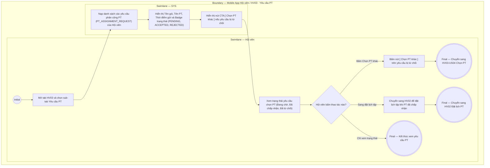

# HV03-US05 - Theo dõi yêu cầu phân công PT

## Preconditions
- Hội viên đã đăng nhập Mobile bằng tài khoản hợp lệ.
- Hội viên đã gửi ít nhất một yêu cầu phân công PT (`PT_ASSIGNMENT_REQUEST`).

## Trigger
- Hội viên chọn sub-tab `Yêu cầu PT` trong tab `HV03 · Gói của tôi`.
- Màn hình liên quan: Mobile App — Tab `HV03 · Gói của tôi`, sub-tab `Yêu cầu PT`.

## Main Flow

1. Hội viên chọn sub-tab **Yêu cầu PT** trên menu **HV03 · Gói của tôi**.
2. SYS nạp và hiển thị danh sách toàn bộ các yêu cầu phân công PT của Hội viên.
3. Với mỗi bản ghi yêu cầu, SYS hiển thị đầy đủ thông tin:
   - **Tên gói tập**: Ví dụ `Gói PT 20 buổi`, `Combo Gym 3 tháng + PT 10 buổi`.
   - **Tên HLV (PT) được chọn**: Ví dụ `Nguyễn Thành Long`.
   - **Thời điểm gửi**: Ngày và giờ gửi yêu cầu.
   - **Badge trạng thái yêu cầu**:
     - `Đang chờ phản hồi` (`PENDING` - badge màu cam/vàng): Yêu cầu đang chờ PT xem xét.
     - `Đã chấp nhận` (`ACCEPTED` - badge xanh lá): PT đã nhận lớp, gói đã sẵn sàng để đặt lịch ở menu HV02.
     - `Đã từ chối` (`REJECTED` - badge màu đỏ): PT không nhận lớp, hiển thị kèm nút CTA **`[ Chọn PT khác ]`**.
4. Nếu yêu cầu bị từ chối (`REJECTED`), Hội viên bấm nút **`[ Chọn PT khác ]`** để điều hướng sang màn hình Chọn PT (`HV03-US04`) cho gói đó.

### Field-level specification — Sub-tab Yêu cầu PT
| Field / control | State | Required | Conditional / dynamic | Source / validation |
|---|---|---|---|---|
| Sub-tab Yêu cầu PT | `USER-INPUT` | required | `DYNAMIC`: chọn sub-tab `Yêu cầu PT` | Segment control trên Mobile |
| Card Yêu cầu PT (Tên gói, Tên PT, Ngày gửi) | `AUTO-FILL` | READONLY | `DYNAMIC`: nạp tự động thông tin yêu cầu chọn PT | Dữ liệu assignment request |
| Badge trạng thái (`Đang chờ`, `Đã chấp nhận`, `Đã từ chối`) | `READONLY` | required | `DYNAMIC`: nạp tự động trạng thái xử lý của PT | Trạng thái request trên hệ thống |
| Nút CTA `[ Chọn PT khác ]` | `USER-INPUT` | optional | `CONDITIONAL`: chỉ hiển thị khi yêu cầu ở trạng thái `Đã từ chối` (`REJECTED`) | Nút điều hướng sang HV03-US04 |

- **Business rules / logic:**
  - Yêu cầu ở trạng thái `PENDING` (Đang chờ) khóa không cho gửi thêm yêu cầu khác trên cùng một gói tập.
  - Khi PT bấm Chấp nhận (`ACCEPTED`), HLV đó được gắn làm PT phụ trách chính thức và mở quyền đặt lịch cho Hội viên ở menu HV02.
  - Khi PT bấm Từ chối (`REJECTED`), hệ thống cho phép Hội viên chọn HLV mới.

## Alternate Flows

### AF-01 — Không có yêu cầu PT nào
1. Hội viên mở sub-tab `Yêu cầu PT` khi chưa gửi yêu cầu nào.
2. SYS hiển thị màn hình rỗng (Empty state): `Bạn chưa có yêu cầu phân công PT nào`.

## Exception Flows

- Lỗi kết nối mạng: SYS hiển thị thông báo không nạp được danh sách yêu cầu và cho phép bấm tải lại.

## Activity Diagram — Swimlane
**Trigger:** Hội viên chọn sub-tab Yêu cầu PT trong tab HV03.

