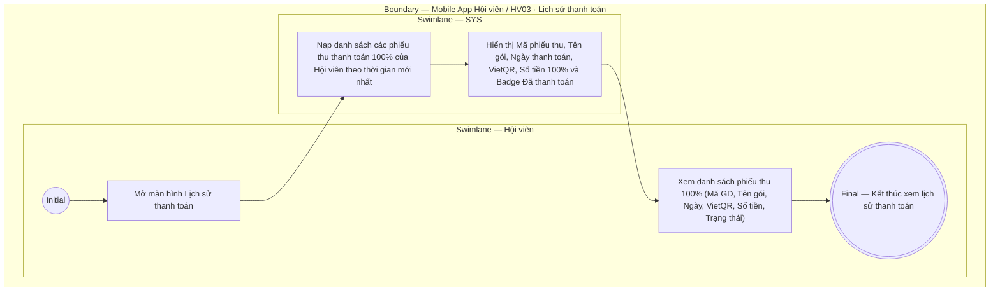

# HV03-US06 - Xem lịch sử thanh toán

## Preconditions
- Hội viên đã đăng nhập Mobile bằng tài khoản hợp lệ.
- Hệ thống đã có dữ liệu lịch sử các giao dịch thanh toán gói tập của Hội viên.

## Trigger
- Hội viên bấm mở mục `Lịch sử thanh toán` từ menu HV03 hoặc từ mục Quản lý tài khoản.
- Màn hình liên quan: Mobile App — Màn hình Lịch sử thanh toán.

## Main Flow

1. Hội viên mở màn hình **Lịch sử thanh toán**.
2. SYS nạp danh sách toàn bộ các giao dịch thanh toán (Payments/Phiếu thu 100%) của Hội viên theo thứ tự thời gian giảm dần (mới nhất lên đầu).
3. Với mỗi bản ghi thanh toán, SYS hiển thị các thông tin chi tiết:
   - **Mã giao dịch / Mã phiếu thu**: Ví dụ `PAY-202609-001`.
   - **Tên gói tập đã mua**: Ví dụ `Gói PT 20 buổi`, `Gói Gym 3 tháng`.
   - **Thời gian thanh toán**: Giờ và ngày/tháng/năm xác nhận thanh toán.
   - **Phương thức thanh toán**: `Chuyển khoản Ngân hàng (VietQR)`.
   - **Số tiền thanh toán**: Chính xác 100% giá trị gói tập (ví dụ `5.000.000 đ`).
   - **Badge trạng thái**: `Đã thanh toán` (`CONFIRMED` - badge màu xanh lá).
4. Hội viên xem chi tiết thông tin hóa đơn/phiếu thu giao dịch.

- **Business rules / logic:**
  - Chỉ hiển thị lịch sử giao dịch thuộc chính tài khoản Hội viên đang đăng nhập.
  - Mọi giao dịch trên Mobile đều thanh toán 100% qua VietQR.
  - Thông tin lịch sử thanh toán là dữ liệu cố định (Read-only), không chỉnh sửa hoặc xóa từ giao diện Mobile.

## Alternate Flows

### AF-01 — Chưa có lịch sử thanh toán nào
1. Hội viên mở màn hình Lịch sử thanh toán khi chưa từng mua gói nào trên App.
2. SYS hiển thị màn hình rỗng (Empty state): `Bạn chưa có giao dịch thanh toán nào`.

## Exception Flows

- Lỗi kết nối mạng: SYS hiển thị thông báo lỗi nạp dữ liệu và nút bấm tải lại.

## Activity Diagram — Swimlane
**Trigger:** Hội viên mở màn hình Lịch sử thanh toán.

