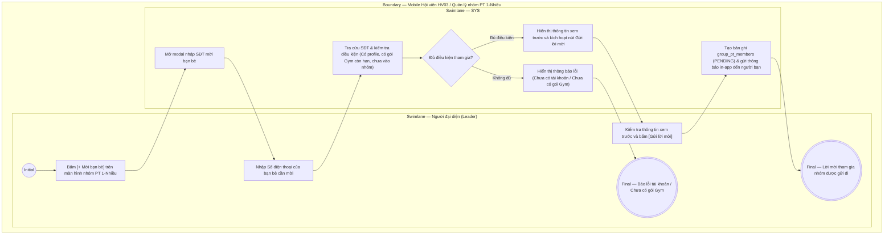

# HV03-US07 - Mời thành viên tham gia gói PT 1-Nhiều

## Preconditions
- Hội viên đã đăng nhập thành công vào ứng dụng Mobile Hội viên.
- Hội viên là Người đại diện (Group Leader) của một hợp đồng gói PT 1-Nhiều (`package_mode = 'GROUP_PT'`).
- Gói tập đã được thanh toán 100% và đang trong thời hạn hiệu lực, chưa đủ số lượng thành viên tối đa của gói.

## Trigger
- Người đại diện bấm nút **[Quản lý nhóm / Mời thành viên]** trên thẻ gói PT 1-Nhiều trong menu **HV03 · Gói của tôi**.
- Màn hình liên quan: Mobile Hội viên — Màn hình Quản lý nhóm PT 1-Nhiều, modal **Mời bạn bè tham gia nhóm**.

## Main Flow

1. Người đại diện mở menu HV03 Gói của tôi và bấm nút **[Quản lý nhóm / Mời thành viên]** trên thẻ gói PT 1-Nhiều.
2. SYS hiển thị màn hình danh sách thành viên nhóm:
   - Thông tin gói: Tên gói, PT phụ trách, Số lượng thành viên hiện tại (ví dụ: `2/4 thành viên`).
   - Danh sách thành viên hiện có: Họ tên, Số điện thoại, Vai trò (`Trưởng nhóm` / `Thành viên`), Trạng thái (`Đã tham gia` / `Đang chờ phản hồi`).
3. Người đại diện bấm nút **[+ Mời bạn bè]**.
4. SYS mở modal **Mời bạn bè tham gia nhóm**.
5. Người đại diện nhập **Số điện thoại** của bạn bè muốn mời vào nhóm.
6. SYS kiểm tra điều kiện tài khoản người được mời:
   - Đã có hồ sơ hội viên trên hệ thống (`MEMBER_PROFILES`).
   - Sở hữu gói Gym còn hiệu lực sử dụng (chưa hết hạn và không bị đóng băng).
   - Chưa tham gia nhóm tập PT này.
7. SYS hiển thị thông tin xem trước của người được mời: Họ tên, Avatar, Trạng thái gói Gym hợp lệ.
8. Người đại diện bấm **[Gửi lời mời]**.
9. SYS tạo bản ghi trong `group_pt_members` với trạng thái `PENDING`, phát thông báo in-app tới tài khoản người bạn.
10. Khi người bạn mở ứng dụng và bấm **[Chấp nhận lời mời]**, SYS cập nhật trạng thái thành `ACCEPTED`, ghi nhận người bạn chính thức vào nhóm gói PT. Lịch tập của nhóm sẽ tự động đồng bộ trên ứng dụng của thành viên mới.

### Field-level specification — Màn hình Quản lý nhóm & Modal Mời bạn bè
| Field / control | Loại UI Control | State | Required | Conditional / dynamic | Source / validation |
| :--- | :--- | :--- | :--- | :--- | :--- |
| Thông tin gói & HLV | `Card View` | `READONLY` | required | `Không` | Tên gói PT 1-Nhiều, HLV phụ trách, số lượng thành viên (`X/Y`) |
| Danh sách thành viên | `List View` | `READONLY` | required | `DYNAMIC` | Danh sách thành viên đã tham gia và đang chờ duyệt |
| Nút [+ Mời bạn bè] | `Button (Primary)` | `USER-INPUT` | optional | `CONDITIONAL`: Hiện khi số thành viên < số lượng tối đa của gói, Ẩn khi nhóm đã đủ thành viên | Mở modal nhập SĐT |
| Số điện thoại bạn bè | `Phone Input` | `USER-INPUT` | required | `TRIGGER` | Người đại diện nhập SĐT 10 chữ số; kích hoạt tra cứu thông tin người được mời |
| Thông tin người được mời [AUTO] | `Card Preview` | `READONLY (AUTO-FILL)` | required | `DYNAMIC` | SYS hiển thị Họ tên, Avatar và kết quả kiểm tra gói Gym |
| Nút [Gửi lời mời] | `Button (Success)` | `USER-INPUT` | required | `CONDITIONAL`: Hiện và kích hoạt khi người được mời có gói Gym hợp lệ, Disabled khi chưa có gói Gym | Gửi lời mời gia nhập nhóm |

- **Business rules / logic:**
  - Chỉ Người đại diện (người đứng tên hợp đồng) mới có quyền gửi lời mời hoặc xóa thành viên khỏi nhóm.
  - Thành viên được mời **bắt buộc phải có gói Gym còn hiệu lực** mới được tham gia tập PT trong nhóm. Nếu chưa có gói Gym, hệ thống thông báo yêu cầu người bạn đăng ký gói Gym trước.
  - Chỉ Người đại diện mới có quyền đặt lịch hoặc đổi/hủy lịch với PT trên ứng dụng. Lịch tập được tự động đồng bộ đến toàn bộ thành viên trong nhóm.

## Alternate Flows

### AF-01 - Hủy Lời Mời Chưa Chấp Nhận
1. Người đại diện bấm nút **[Thu hồi lời mời]** bên cạnh người đang ở trạng thái `Đang chờ phản hồi`.
2. SYS cập nhật trạng thái lời mời sang `CANCELLED` và giải phóng chỗ trống trong nhóm.

## Exception Flows
- **Người được mời chưa có tài khoản:** Số điện thoại chưa đăng ký hội viên tại Paradise Gym. SYS báo lỗi: *"Số điện thoại này chưa được đăng ký tài khoản hội viên tại phòng tập"*.
- **Người được mời chưa có gói Gym:** Người được mời có tài khoản nhưng chưa mua gói Gym hoặc gói Gym đã hết hạn. SYS cảnh báo: *"Thành viên này chưa có gói Gym còn hiệu lực. Bạn vui lòng nhắc bạn bè đăng ký gói Gym trước khi tham gia gói PT"*.
- **Nhóm đã đủ số lượng:** Nhóm đã đạt số thành viên tối đa theo cấu hình gói. SYS khóa tính năng mời bạn bè.

## Activity Diagram — Swimlane
**Trigger:** Người đại diện bấm [+ Mời bạn bè] trên màn hình Quản lý nhóm PT 1-Nhiều.

