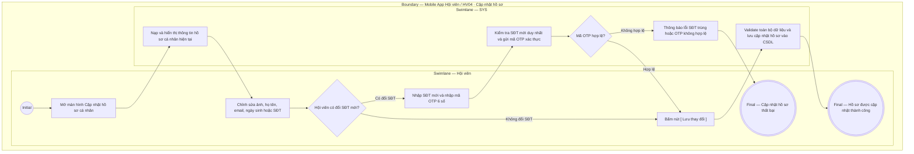

# HV04-US01 - Cập nhật hồ sơ cá nhân

## Preconditions
- Hội viên đã đăng nhập Mobile bằng tài khoản hợp lệ.
- Hội viên truy cập tab `HV04 · Tài khoản` và chọn mục `Hồ sơ cá nhân`.

## Trigger
- Hội viên bấm chọn `Chỉnh sửa hồ sơ` tại màn hình Tài khoản.
- Màn hình liên quan: Mobile App — Tab `HV04 · Tài khoản`, màn hình Cập nhật hồ sơ cá nhân.

## Main Flow

1. Hệ thống hiển thị thông tin hồ sơ cá nhân hiện tại của Hội viên (Ảnh đại diện, Họ tên, SĐT, Email, Ngày sinh).
2. Hội viên chỉnh sửa các trường thông tin mong muốn.
3. Nếu Hội viên thay đổi SĐT đăng ký:
   - SYS kiểm tra định dạng và tính duy nhất của SĐT mới trên hệ thống.
   - SYS gửi mã xác thực OTP 6 số tới SĐT mới.
   - Hội viên nhập mã OTP xác nhận số điện thoại chính chủ.
4. Hội viên bấm nút **`[ Lưu thay đổi ]`**.
5. SYS kiểm tra tính hợp lệ của toàn bộ dữ liệu, cập nhật hồ sơ và hiển thị thông báo thành công.

- **Business rules / logic:**
  - Hội viên chỉ được xem và chỉnh sửa thông tin hồ sơ của chính mình.
  - Số điện thoại là định danh tài khoản duy nhất, do đó việc thay đổi SĐT bắt buộc phải qua xác thực OTP và không được trùng với bất kỳ tài khoản nào khác trong hệ thống.
  - Không cho phép tự sửa đổi các trường liên quan đến phân quyền, trạng thái gói tập hay lịch sử giao dịch tại màn hình này.

### Field-level specification — Màn hình Cập nhật hồ sơ cá nhân
| Field / control | Loại UI Control | State | Required | Conditional / dynamic | Source / validation |
| :--- | :--- | :--- | :--- | :--- | :--- |
| **Ảnh đại diện (Avatar)** | `Avatar image picker / Upload` | `USER-INPUT` + `PREFILL` | optional | Không | Cho phép tải ảnh đại diện mới từ thư viện thiết bị hoặc chụp từ camera (PNG, JPG, WebP $\le$ 5MB) |
| **Họ và tên** | `Text input` | `USER-INPUT` + `PREFILL` | required | Không | Prefill họ tên hiện tại; cho phép chỉnh sửa họ và tên cá nhân |
| **Số điện thoại** | `Text input` | `USER-INPUT` + `PREFILL` | required | `TRIGGER`: Sửa đổi SĐT kích hoạt gửi và hiển thị ô nhập mã OTP | Prefill SĐT tài khoản hiện tại; kiểm tra không trùng lặp khi đổi số mới |
| **Mã xác thực OTP đổi SĐT** | `Text input / OTP input` | `USER-INPUT` | conditional | `CONDITIONAL`: Phụ thuộc vào việc thay đổi SĐT | - **Hiện khi:** Hội viên thay đổi SĐT khác với SĐT tài khoản hiện tại (nhập 6 chữ số OTP gửi về SĐT mới). - **Ẩn khi:** Giữ nguyên SĐT tài khoản hiện tại. |
| **Email** | `Text input / Email` | `USER-INPUT` + `PREFILL` | optional | Không | Prefill email hiện tại; kiểm tra định dạng email hợp lệ |
| **Ngày sinh** | `Date picker` | `USER-INPUT` + `PREFILL` | optional | Không | Bộ chọn ngày (Date Picker); prefill ngày sinh đã đăng ký |
| **Giới tính** | `Select / Radio group` | `USER-INPUT` + `PREFILL` | optional | Không | Nạp từ `member_profiles.gender` qua API hồ sơ của hội viên hiện tại; lựa chọn theo enum hợp lệ của API hoặc để trống; không mặc định giới tính khi dữ liệu chưa có. Lưu cùng hồ sơ qua API, theo phạm vi HV04 Epic |
| **Nút CTA [ Lưu thay đổi ]** | `Button / Primary CTA` | `USER-INPUT` | required | `DYNAMIC`: Enable khi có ít nhất một trường thay đổi hợp lệ | Nút màu xanh lá bo góc; bấm để lưu cập nhật thông tin hồ sơ |

## Alternate Flows

### AF-01 — Đổi sang SĐT đã tồn tại trên hệ thống
1. Hội viên nhập SĐT mới trùng với số của một tài khoản khác đã đăng ký.
2. SYS hiển thị thông báo lỗi: `Số điện thoại này đã được sử dụng bởi một tài khoản khác` và không cho phép lưu.

### AF-02 — Nhập sai mã OTP xác thực đổi SĐT
1. Hội viên nhập sai mã OTP hoặc mã OTP đã hết hạn 60s.
2. SYS báo lỗi và cho phép bấm `[ Gửi lại mã OTP ]`.

## Exception Flows

- Lỗi kết nối mạng: SYS hiển thị thông báo không thể lưu thay đổi và giữ nguyên dữ liệu trong form nhập.

## Activity Diagram — Swimlane
**Trigger:** Hội viên chọn Chỉnh sửa hồ sơ tại màn hình Tài khoản.

