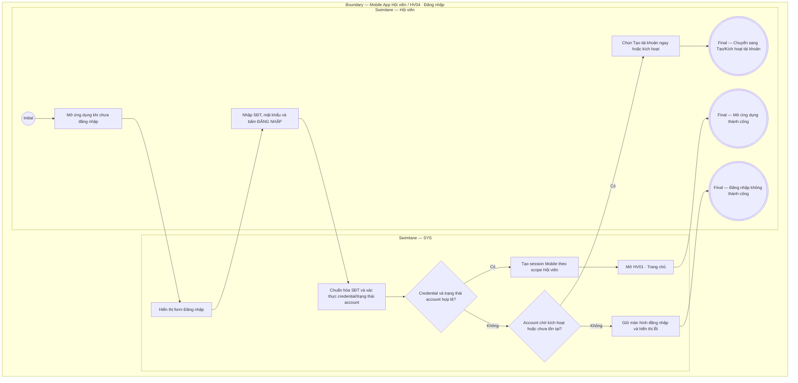

# HV04-US01 - Đăng nhập tài khoản Hội viên

## Preconditions
- Hội viên đã cài đặt ứng dụng Mobile Paradise Gym.
- Hội viên đã có tài khoản với số điện thoại đã xác minh (không bị khóa hay vô hiệu hóa).

## Trigger
- Hội viên mở ứng dụng khi chưa đăng nhập và nhập số điện thoại/mật khẩu.
- Màn hình liên quan: Mobile App — Màn hình Đăng nhập.

## Main Flow

1. Hệ thống hiển thị form Đăng nhập.
2. Hội viên nhập số điện thoại và mật khẩu.
3. Hội viên bấm nút `[ ĐĂNG NHẬP ]`.
4. SYS xác thực thông tin đăng nhập (credential) và trạng thái tài khoản.
5. SYS khởi tạo phiên truy cập (Session Mobile) và mở màn hình `HV01 · Trang chủ`.

### Field-level specification — Form Đăng nhập
| Field / control | State | Required | Conditional / dynamic | Source / validation |
|---|---|---|---|---|
| Số điện thoại | `USER-INPUT` | required | `DYNAMIC`: nhập SĐT đăng ký | SĐT tài khoản Hội viên |
| Mật khẩu | `USER-INPUT` | required | `DYNAMIC`: nhập mật khẩu cá nhân | Mật khẩu tài khoản |
| Nút `[ ĐĂNG NHẬP ]` | `USER-INPUT` | required | `CONDITIONAL`: bấm để gửi xác thực | Thao tác trên Mobile |
| Nút `[ Tạo tài khoản ngay ]` | `USER-INPUT` | optional | `DYNAMIC`: bấm để chuyển sang luồng tạo/kích hoạt tài khoản | Điều hướng sang HV04-US02 |

- **Business rules / logic:**
  - Số điện thoại đăng nhập là duy nhất cho một tài khoản Hội viên.
  - Không lưu trữ mật khẩu hoặc mã OTP trong nhật ký audit hệ thống.

## Alternate Flows

### AF-01 — Nhập sai mật khẩu hoặc SĐT
1. Hội viên nhập sai thông tin tài khoản hoặc mật khẩu.
2. SYS giữ nguyên màn hình đăng nhập và hiển thị thông báo lỗi: `Số điện thoại hoặc mật khẩu không chính xác`.

### AF-02 — Tài khoản chưa tồn tại hoặc chưa kích hoạt
1. SĐT nhập vào thuộc trường hợp chưa có tài khoản hoặc có hồ sơ tại quầy chưa kích hoạt.
2. SYS thông báo và hướng dẫn chọn `[ Tạo tài khoản ngay ]` để sang luồng `HV04-US02`.

## Exception Flows

- Lỗi kết nối mạng: SYS hiển thị thông báo lỗi mạng và không khởi tạo phiên đăng nhập.

## Activity Diagram — Swimlane
**Trigger:** Hội viên mở ứng dụng và thực hiện đăng nhập.

