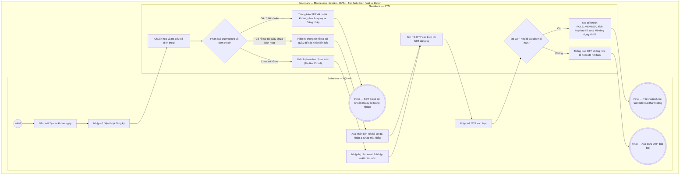

# HV04-US02 - Tạo hoặc kích hoạt tài khoản bằng OTP

## Preconditions
- Người dùng đang ở màn hình Tạo/Kích hoạt tài khoản trên ứng dụng Mobile.
- Số điện thoại thuộc một trong ba trường hợp: đã có tài khoản, có hồ sơ tại quầy chưa kích hoạt tài khoản, hoặc chưa có hồ sơ.

## Trigger
- Người dùng bấm `Chưa có tài khoản? Tạo tài khoản ngay` và nhập số điện thoại.
- Màn hình liên quan: Mobile App — Màn hình Tạo/Kích hoạt tài khoản bằng OTP.

## Main Flow

1. Người dùng nhập số điện thoại đăng ký.
2. SYS chuẩn hóa và tra cứu số điện thoại trên hệ thống:
   - **Trường hợp 1 (SĐT đã có tài khoản)**: SYS thông báo SĐT đã được đăng ký và yêu cầu quay lại màn hình Đăng nhập.
   - **Trường hợp 2 (Đã có hồ sơ tại quầy nhưng chưa có tài khoản)**: SYS hiển thị thông tin hồ sơ khớp để người dùng xác nhận liên kết và tạo mật khẩu mới.
   - **Trường hợp 3 (Chưa có hồ sơ)**: SYS hiển thị form yêu cầu nhập Họ và tên, Email và tạo mật khẩu mới.
3. Người dùng nhập đầy đủ thông tin theo trường hợp của mình và bấm `[ Gửi mã OTP ]`.
4. SYS tự động gửi mã xác thực OTP 6 chữ số tới SĐT đăng ký.
5. Người dùng nhập mã OTP hợp lệ.
6. SYS xác thực OTP, khởi tạo tài khoản `ROLE_MEMBER`, liên kết hồ sơ tương ứng và mở màn hình `HV01 · Trang chủ`.

### Field-level specification — Form Tạo/Kích hoạt tài khoản
| Field / control | State | Required | Conditional / dynamic | Source / validation |
|---|---|---|---|---|
| Số điện thoại đăng ký | `USER-INPUT` | required | `DYNAMIC`: nhập SĐT để tra cứu phân loại | SĐT người dùng |
| Họ và tên | `USER-INPUT` | required | `CONDITIONAL`: chỉ hiển thị với trường hợp chưa có hồ sơ | Người dùng nhập |
| Email | `USER-INPUT` | optional | `CONDITIONAL`: chỉ hiển thị với trường hợp chưa có hồ sơ | Định dạng Email |
| Thông tin hồ sơ khớp | `READONLY` | required | `CONDITIONAL`: chỉ hiển thị khi SĐT khớp hồ sơ tại quầy | Hồ sơ hội viên tại quầy |
| Mật khẩu & Xác nhận mật khẩu | `USER-INPUT` | required | `DYNAMIC`: tạo mật khẩu mới cho tài khoản | Mật khẩu tài khoản |
| Mã xác thực OTP | `USER-INPUT` | required | `CONDITIONAL`: hiển thị sau khi hệ thống gửi OTP | OTP từ tin nhắn SMS/SMS Gateway |

- **Business rules / logic:**
  - SĐT là khóa đăng nhập duy nhất; trường hợp đã có hồ sơ tại quầy phải thực hiện liên kết đúng hồ sơ, không tạo hồ sơ mới trùng lặp.
  - Không lưu mã OTP hoặc mật khẩu dạng rõ trong nhật ký audit hệ thống.

## Alternate Flows

### AF-01 — OTP hết hạn hoặc nhập sai
1. Người dùng nhập sai mã OTP hoặc mã OTP hết thời gian hiệu lực.
2. SYS hiển thị thông báo lỗi và cho phép bấm `[ Gửi lại mã OTP ]` (giới hạn tối đa 3 lần).

## Exception Flows

- Lỗi kết nối mạng: SYS hiển thị thông báo không thể khởi tạo tài khoản và hoàn tác các thao tác dang dở.

## Activity Diagram — Swimlane
**Trigger:** Người dùng bấm Tạo tài khoản ngay và nhập SĐT.

