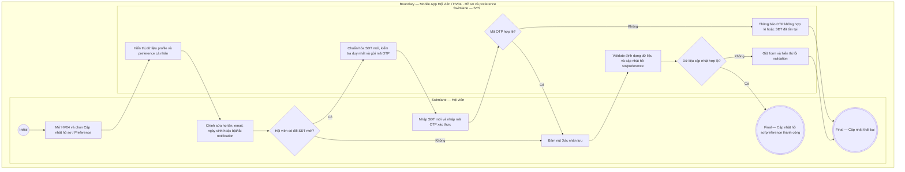

# HV04-US03 - Cập nhật hồ sơ và tùy chọn thông báo

## Preconditions
- Hội viên đã đăng nhập Mobile bằng tài khoản hợp lệ.
- Hội viên truy cập trang quản lý tài khoản cá nhân.

## Trigger
- Hội viên mở `HV04 · Tài khoản` và chọn `Cập nhật hồ sơ` hoặc thay đổi preference.
- Màn hình liên quan: Mobile App — Tab `HV04 · Tài khoản`, màn hình Hồ sơ & Cài đặt thông báo.

## Main Flow

1. Hệ thống hiển thị thông tin hồ sơ được phép xem/sửa và các tùy chọn thông báo.
2. Hội viên cập nhật các trường cá nhân được phép (Họ tên, Email, Ngày sinh, Ảnh đại diện) hoặc bật/tắt nhận thông báo in-app/nhắc lịch PT.
3. Nếu Hội viên thay đổi SĐT đăng ký, SYS kiểm tra SĐT mới chưa tồn tại và gửi mã OTP xác nhận.
4. Hội viên bấm `[ Xác nhận lưu ]`.
5. SYS validate dữ liệu và ghi nhận cập nhật hồ sơ/preference thành công.

### Field-level specification — Form Cập nhật hồ sơ & tùy chọn thông báo
| Field / control | State | Required | Conditional / dynamic | Source / validation |
|---|---|---|---|---|
| Ảnh đại diện | `USER-INPUT` | optional | `DYNAMIC`: cho phép chọn ảnh mới từ thiết bị | Ảnh đại diện Hội viên |
| Họ và tên | `USER-INPUT` + `PREFILL` | required | `DYNAMIC`: prefill từ hồ sơ hiện tại | Profile Hội viên |
| Số điện thoại | `USER-INPUT` + `PREFILL` | optional | `CONDITIONAL`: chỉ yêu cầu OTP khi nhập SĐT mới | SĐT duy nhất |
| Email | `USER-INPUT` + `PREFILL` | optional | `DYNAMIC`: kiểm tra đúng định dạng email | Email |
| Ngày sinh | `USER-INPUT` + `PREFILL` | optional | `DYNAMIC`: chọn ngày sinh | Ngày sinh |
| Nhận thông báo in-app | `USER-INPUT` + `PREFILL` | optional | `DYNAMIC`: Bật/Tắt | Preference thông báo |
| Nhắc lịch PT tự động | `USER-INPUT` + `PREFILL` | optional | `DYNAMIC`: Bật/Tắt | Preference nhắc lịch |
| Nút `[ Xác nhận lưu ]` | `USER-INPUT` | required | `CONDITIONAL`: bấm để lưu thay đổi | Thao tác trên Mobile |

- **Business rules / logic:**
  - Hội viên chỉ được chỉnh sửa thông tin hồ sơ cá nhân của chính mình.
  - Đổi SĐT bắt buộc phải xác minh qua mã OTP và kiểm tra không trùng lặp SĐT trên hệ thống.

## Alternate Flows

### AF-01 — Chỉ thay đổi tùy chọn thông báo (Preference)
1. Hội viên chỉ bật/tắt nhận thông báo mà không sửa thông tin cá nhân.
2. SYS cập nhật cài đặt preference và báo lưu thành công.

## Exception Flows

- SĐT mới đã tồn tại trên hệ thống: SYS báo lỗi và từ chối cập nhật.
- Lỗi kết nối mạng: SYS giữ nguyên dữ liệu chưa lưu và thông báo lỗi.

## Activity Diagram — Swimlane
**Trigger:** Hội viên chọn cập nhật hồ sơ hoặc preference trong HV04.

