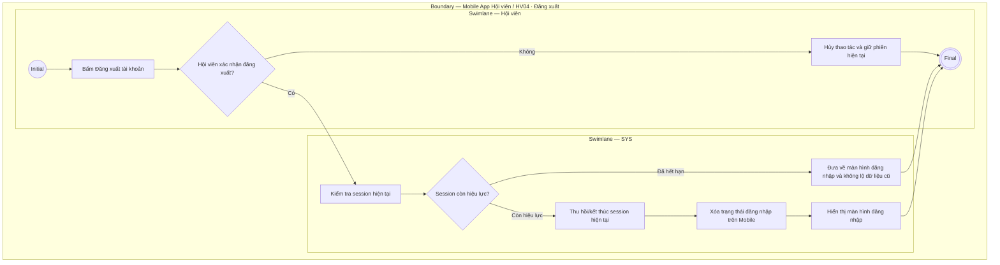

# HV04-US04 - Đăng xuất tài khoản Mobile

## Preconditions
- Hội viên đang đăng nhập và có phiên truy cập (session) Mobile hợp lệ.

## Trigger

- Hội viên bấm `Đăng xuất tài khoản` trong `HV04 · Tài khoản`.

## Main Flow

1. Hội viên chọn đăng xuất.
2. Hệ thống kết thúc session hiện tại.
3. Hệ thống xóa trạng thái đăng nhập trên Mobile.
4. Hệ thống hiển thị lại màn hình đăng nhập.
5. **Quy tắc nghiệp vụ:** Đăng xuất chỉ kết thúc phiên, không vô hiệu hóa account; lần đăng nhập sau phải xác thực lại theo credential/OTP phù hợp.

## Alternate Flows

### AF-01

- Hội viên hủy thao tác trước khi xác nhận nếu UI hiển thị bước xác nhận.

### AF-02

- Nếu session đã hết hạn, hệ thống đưa về màn hình đăng nhập mà không lộ dữ liệu cũ.

## Exception Flows

- Không xóa hồ sơ, gói, payment hoặc booking khi đăng xuất.
- Không giữ dữ liệu riêng tư trên màn hình sau khi session kết thúc.

## Activity Diagram — Swimlane

