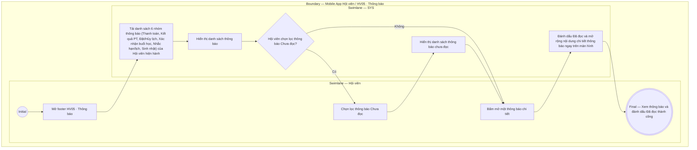

# HV05-US01 - Xem và xử lý thông báo Hội viên

## Preconditions
- Hội viên đã đăng nhập ứng dụng Mobile Hội viên bằng tài khoản hợp lệ.
- Hội viên có các thông báo in-app được hệ thống (SYS) phát tự động từ các sự kiện nghiệp vụ liên quan (Thanh toán gói, Yêu cầu phân công PT, Đặt/Đổi/Hủy lịch PT, Buổi PT hoàn thành, Nhắc hạn gói, Sinh nhật).

## Trigger
- Hội viên bấm chọn menu footer `HV05 · Thông báo` (hoặc biểu tượng chuông thông báo trên Header) trên ứng dụng Mobile Hội viên.
- Màn hình liên quan: Mobile App Hội viên — Tab `HV05 · Thông báo`.

## Main Flow

1. Hội viên mở menu footer **HV05 · Thông báo**.
2. Hệ thống nạp danh sách các thông báo dành riêng cho Hội viên hiện hành, bao gồm 6 nhóm thông báo chính:
   - **Thông báo Thanh toán & Kích hoạt gói:** Phát khi thanh toán gói tập thành công (`HV03-US03`, `LT-W08-US01`, `QTV-W08-US01`). Nội dung: *"Thanh toán thành công: Gói tập [Tên gói] đã được kích hoạt. Thời hạn đến [DD/MM/YYYY]"*.
   - **Thông báo Kết quả xử lý Yêu cầu PT:** Phát khi PT chấp nhận hoặc từ chối yêu cầu phân công (`PT02-US03`). Nội dung: *"HLV [Tên PT] đã chấp nhận yêu cầu hướng dẫn gói [Tên gói]. Bạn có thể đặt lịch tập ngay!"* hoặc *"HLV [Tên PT] đã từ chối yêu cầu phân công"*.
   - **Thông báo Đặt lịch / Hủy lịch buổi PT:** Phát khi Lễ tân hoặc PT hỗ trợ đặt, đổi hoặc hủy lịch tập (`QTV-W06-US01/US02`, `PT01-US01`). Nội dung: *"Lịch tập ngày [DD/MM/YYYY] khung giờ [Khung giờ] với HLV [Tên PT] đã được cập nhật/hủy"*.
   - **Thông báo PT Xác nhận hoàn thành buổi tập:** Phát khi PT bấm xác nhận hoàn thành buổi tập (`PT01-US02`). Nội dung: *"HLV [Tên PT] đã xác nhận hoàn thành buổi tập [Khung giờ] ngày [DD/MM/YYYY]. Vui lòng xác nhận kết quả"*.
   - **Thông báo Nhắc lịch tập & Nhắc hạn gói:** Phát tự động trước ca tập 1–2 giờ hoặc nhắc gói sắp hết hạn trước 7 ngày, 3 ngày và ngày hết hạn. Nội dung: *"Nhắc lịch tập: Bạn có buổi tập với HLV [Tên PT] vào lúc [Khung giờ] hôm nay"* hoặc *"Gói tập [Tên gói] của bạn sẽ hết hạn vào [DD/MM/YYYY]. Hãy gia hạn ngay!"*.
   - **Thông báo Chúc mừng sinh nhật:** Phát tự động vào đầu ngày sinh nhật của Hội viên.
3. Hội viên có thể lọc danh sách thông báo theo trạng thái (`Tất cả` / `Chưa đọc`).
4. Hội viên bấm chọn một thẻ thông báo cụ thể trong danh sách.
5. Hệ thống cập nhật trạng thái thông báo thành "Đã đọc" và mở rộng hiển thị đầy đủ nội dung chi tiết thông báo ngay trên màn hình (không tự động điều hướng sang màn hình khác).

### Field-level specification — Màn hình Thông báo Hội viên
| Field / control | State | Required | Conditional / dynamic | Source / validation |
|---|---|---|---|---|
| Tab lọc trạng thái | `USER-INPUT` | optional | `DYNAMIC`: chọn xem `Tất cả` hoặc `Chưa đọc` | Cấu hình lọc |
| Danh sách thông báo | `READONLY` | required | `DYNAMIC`: danh sách 6 nhóm thông báo thuộc Hội viên hiện hành | Database notification |
| Thẻ thông báo (Tiêu đề, Nội dung, Thời gian) | `READONLY` | required | `DYNAMIC`: nạp tiêu đề, tóm tắt nội dung sự kiện và thời gian phát thông báo | Notification record |
| Thao tác chọn thông báo | `USER-INPUT` | required | `DYNAMIC`: bấm dòng thông báo để mở rộng chi tiết nội dung và đánh dấu Đã đọc | Thao tác mở xem thông báo |

- **Business rules / logic:**
  - Hệ thống chỉ hiển thị thông báo của chính Hội viên đang đăng nhập, bảo đảm tuyệt đối tính riêng tư và an toàn dữ liệu.
  - Thao tác xem thông báo chỉ cập nhật trạng thái "Đã đọc" và mở rộng nội dung, không tự động điều hướng màn hình hay thay đổi trạng thái nghiệp vụ liên quan.

## Alternate Flows

### AF-01 — Lọc xem thông báo chưa đọc
1. Hội viên chọn tab `Chưa đọc`.
2. SYS hiển thị danh sách các thông báo chưa được Hội viên mở xem.

## Exception Flows

- Lỗi kết nối mạng: SYS hiển thị thông báo "Không thể nạp danh sách thông báo, vui lòng kiểm tra kết nối mạng".

## Activity Diagram — Swimlane
**Trigger:** Hội viên chọn menu footer HV05 · Thông báo trên ứng dụng Mobile.

