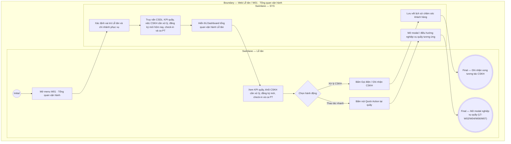

# LT-W01-US01 - Xem tổng quan vận hành chi nhánh

## Preconditions
- Lễ tân có tài khoản hoạt động, phân quyền vận hành quầy và scope cố định tại chi nhánh phục vụ hiện tại.
- Hệ thống áp dụng chính sách thanh toán 100% 1 lần duy nhất (không nợ tồn).

## Trigger
- Lễ tân truy cập menu sidebar **W01 · Tổng quan vận hành** trên Web Portal.
- Màn hình liên quan: Web Lễ tân — Dashboard W01.

## Quy tắc sắp hết hạn
- Gói đã thanh toán, đang có hiệu lực và chưa hết hạn: theo thời gian còn <= 4 ngày, theo buổi còn <= 3 buổi; Combo dùng OR giữa các quyền lợi áp dụng. Nguồn hiển thị là is_expiring và display_status do SYS/API tính; status nội bộ ACTIVE vẫn dùng cho kiểm tra quyền tập. Không tạo enum/field DB mới và không tự tính ngưỡng riêng trên UI.

## Main Flow

1. Lễ tân mở menu **W01 · Tổng quan vận hành**.
2. Hệ thống (SYS) xác định vai trò Lễ tân và nạp dữ liệu chi nhánh phục vụ hiện tại.
3. SYS truy vấn và hiển thị Dashboard vận hành tại quầy chi nhánh gồm:
   - **Khối 1 — Hàng 4 Thẻ KPI Vận hành tại quầy (Interactive Metric Cards):**
     + `Lượt check-in hôm nay`: Số lượt hội viên đã vào tập tại chi nhánh; click mở Cổng kiểm soát ra vào (LT-W07).
     + `Booking PT hôm nay`: Số ca tập PT xếp lịch trong ngày tại chi nhánh; click mở Lịch PT (LT-W06).
     + `Đăng ký chờ thanh toán`: Số đơn chưa kích hoạt quyền tập; click mở Đăng ký gói (LT-W04).
     + `Việc cần xử lý tại quầy`: Tổng số yêu cầu nghiệp vụ quầy trong ngày; click mở Chăm sóc khách hàng (LT-W14).
   - **Khối 2 — Hôm nay cần xử lý (Hàng 4 Thẻ KPI Chăm sóc khách hàng & Vận hành):** Thiết kế đồng bộ chuẩn thẻ KPI như Khối 1:
     + `Sinh nhật hôm nay`: Số khách có sinh nhật hôm nay; click chuyển sang tab Sinh nhật (LT-W14).
     + `Gói sắp hết hạn (<= 4 ngày hoặc <= 3 buổi)`: Số lượng gói sắp hết hạn cần gọi điện mời gia hạn; click chuyển sang tab Nhắc sắp hết hạn (LT-W14).
     + `Chờ nhắc gia hạn (14 ngày qua)`: Số gói hết hạn trong 14 ngày qua chưa gia hạn; click mở tab Chờ gia hạn (LT-W14).
     + `Đăng ký mới hôm nay`: Số hợp đồng đăng ký mới tạo trong ngày tại quầy; click mở tab Đăng ký trong ngày (LT-W14).
   - **Khối 3 — Việc cần xử lý tại quầy (Hàng 5 Thẻ KPI Tác vụ quầy):**
     + `Đăng ký chưa thanh toán`: Đơn chờ thu tiền kích hoạt; click mở LT-W04 lọc đơn chờ thanh toán.
     + `Booking PT sắp tới`: Buổi tập PT sắp diễn ra; click mở LT-W06 lọc ca đã đặt.
     + `Booking chờ xác nhận`: Buổi tập PT hoàn thành chờ xác nhận kép; click mở LT-W06.
     + `Cần hỗ trợ đặt lịch`: Học viên có gói PT chưa lên lịch; click mở popup đặt lịch PT.
     + `Thiết bị check-in`: Trạng thái kết nối thiết bị cổng (Ổn định / Lỗi); click mở LT-W07.
   - **Khối 4 — Quick Actions:** Nút `[+ Thêm hội viên]`, `[+ Tạo đăng ký]`, `[+ Đặt lịch PT]`, `[Lớp cộng đồng]`, `[Ghi nhận ra/vào]`.
   - **Khối 5 — Ra/vào gần đây:** Nhật ký 8 lượt quẹt thẻ/nhận diện 3 phương thức (`Khuôn mặt`, `Mã QR`, `Thủ công`) gần nhất.
   - **Khối 6 — Lịch PT hôm nay:** Danh sách các ca dạy PT tại chi nhánh trong ngày.
4. Lễ tân bấm trực tiếp vào bất kỳ thẻ KPI nào để điều hướng nhanh đến phân hệ xử lý nghiệp vụ quầy tương ứng.

### Field-level specification — Màn hình Tổng quan vận hành Lễ tân (W01)
| Field / control | Loại UI Control | State | Required | Conditional / dynamic | Source / validation |
| :--- | :--- | :--- | :--- | :--- | :--- |
| Thẻ KPI Lượt Check-in hôm nay | `Metric Card` | `READONLY` | required | `DYNAMIC` | Tổng số lượt check-in ghi nhận trong ngày tại chi nhánh; click mở LT-W07 |
| Thẻ KPI Booking PT hôm nay | `Metric Card` | `READONLY` | required | `DYNAMIC` | Tổng số ca PT trong ngày tại chi nhánh; click mở LT-W06 |
| Thẻ KPI Đăng ký chờ thanh toán | `Metric Card` | `READONLY` | required | `DYNAMIC` | Số đơn chưa kích hoạt quyền tập; click mở LT-W04 |
| Thẻ KPI Việc cần xử lý tại quầy | `Metric Card` | `READONLY` | required | `DYNAMIC` | Tổng công việc quầy trong ngày; click mở LT-W14 |
| Nút Mở CSKH | `Action Button` | `USER-INPUT` | optional | `Không` | Bấm mở màn hình Chăm sóc & thông báo LT-W14 |
| Thẻ KPI CSKH — Sinh nhật hôm nay | `Metric Card` | `READONLY` | required | `DYNAMIC` | Số khách sinh nhật hôm nay; click mở tab birthdays LT-W14 |
| Thẻ KPI CSKH — Gói sắp hết hạn (<= 4 ngày hoặc <= 3 buổi) | `Metric Card` | `READONLY` | required | `DYNAMIC` | Số gói hết hạn trong <= 4 ngày hoặc <= 3 buổi; click mở tab expiring LT-W14 |
| Thẻ KPI CSKH — Chờ nhắc gia hạn | `Metric Card` | `READONLY` | required | `DYNAMIC` | Số gói hết hạn 14 ngày qua chưa gia hạn; click mở tab pending-renewals LT-W14 |
| Thẻ KPI CSKH — Đăng ký mới hôm nay | `Metric Card` | `READONLY` | required | `DYNAMIC` | Số hợp đồng tạo trong ngày; click mở tab today-regs LT-W14 |
| Thẻ KPI Quầy — Đăng ký chưa thanh toán | `Metric Card` | `READONLY` | required | `DYNAMIC` | Hợp đồng chờ thanh toán; click mở LT-W04 |
| Thẻ KPI Quầy — Booking PT sắp tới | `Metric Card` | `READONLY` | required | `DYNAMIC` | Lịch PT sắp diễn ra; click mở LT-W06 |
| Thẻ KPI Quầy — Booking chờ xác nhận | `Metric Card` | `READONLY` | required | `DYNAMIC` | Buổi tập cần xác nhận kép; click mở LT-W06 |
| Thẻ KPI Quầy — Cần hỗ trợ đặt lịch | `Metric Card` | `READONLY` | required | `DYNAMIC` | Học viên chưa lên lịch; click mở popup tạo lịch |
| Thẻ KPI Quầy — Thiết bị check-in | `Metric Card` | `READONLY` | required | `DYNAMIC` | Trạng thái cổng (tone đỏ nếu có lỗi); click mở LT-W07 |
| Nút [+ Thêm hội viên] | `Action Button` | `USER-INPUT` | optional | `Không` | Mở modal Thêm hội viên mới (`LT-W02-US01`) |
| Nút [+ Tạo đăng ký] | `Action Button` | `USER-INPUT` | optional | `Không` | Mở modal Tạo đăng ký gói mới (`LT-W04-US01`) |
| Nút [+ Đặt lịch PT] | `Action Button` | `USER-INPUT` | optional | `Không` | Mở modal Đặt lịch PT (`LT-W06-US02`) |
| Nút [Lớp cộng đồng] | `Action Button` | `USER-INPUT` | optional | `Không` | Mở màn hình Lớp tập cộng đồng (`LT-W16`) |
| Nút [Ghi nhận Ra/Vào] | `Action Button` | `USER-INPUT` | optional | `Không` | Mở màn hình Check-in thủ công (`LT-W07-US02`) |
| Danh sách Ra/vào gần nhất | `List Item` | `READONLY` | required | `DYNAMIC` | Hiển thị 8 lượt quẹt gần nhất kèm trạng thái |
| Danh sách Lịch PT hôm nay | `List Item / Button` | `READONLY` | required | `DYNAMIC` | Danh sách ca dạy PT tại chi nhánh; click xem chi tiết |

## Alternate Flows

### AF-01 — Lễ tân thực hiện tác nghiệp Chăm sóc khách hàng
1. Lễ tân bấm nút **`Gọi`** tại danh sách sinh nhật hôm nay hoặc sắp hết hạn gói.
2. Lễ tân tư vấn và bấm **`Ghi nhận liên hệ`** để lưu nhật ký.

### AF-02 — Lễ tân sử dụng Quick Action xử lý trực tiếp tại quầy
1. Lễ tân nhận yêu cầu từ hội viên tại quầy.
2. Lễ tân bấm nút Quick Action tương ứng (VD: `[+ Tạo đăng ký]` hoặc `[Ghi nhận Ra/Vào]`).
3. SYS mở trực tiếp modal / màn hình nghiệp vụ liên quan để Lễ tân thao tác nhanh.

## Exception Flows
- **Thiết bị cổng ra vào bị offline/lỗi:** SYS hiển thị card cảnh báo đỏ kèm nút mở màn hình `LT-W07` để Lễ tân chuyển sang chế độ Ghi nhận Ra/Vào thủ công.

## Activity Diagram — Swimlane
**Trigger:** Lễ tân mở màn hình W01 · Tổng quan vận hành trên Web Portal.

