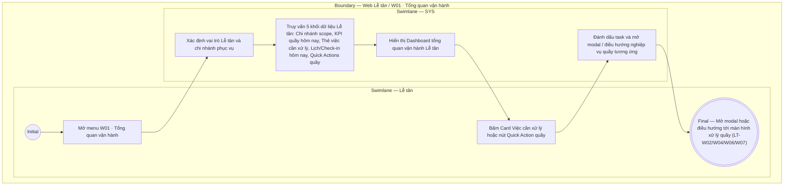

# LT-W01-US01 - Xem tổng quan vận hành chi nhánh

## Preconditions
- **Role / Platform / Epic:** Lễ tân / Quản lý quầy trên Web; Epic W01 · Tổng quan vận hành.
- **Canonical story / operation / actors:** `LT-W01-US01`; `[R|Workflow]`; actors/swimlanes gồm Lễ tân, SYS.
- Lễ tân có tài khoản hoạt động, phân quyền vận hành quầy và scope cố định tại chi nhánh phục vụ hiện tại.
- Hệ thống áp dụng chính sách thanh toán 100% 1 lần duy nhất (bỏ hoàn toàn công nợ, nợ tồn, thanh toán một phần).
- **Traceability:** shared-menu [E01-W01 — Tổng quan vận hành](../../shared-menu/E01-W01-Tong quan van hanh/E01-US01-Xem tổng quan vận hành.md); legacy source `docs/user-stories-legacy/E01-Dashboard & Operational Overview/E01-US01.md`.

## Trigger
- Lễ tân truy cập menu sidebar `W01 · Tổng quan vận hành` trên Web Portal.
- Màn hình liên quan: Web Lễ tân — Dashboard W01 (`screenshot/le-tan/light-web-W01-tong-quan-le-tan.png`).

## Main Flow

1. Lễ tân mở menu **W01 · Tổng quan vận hành**.
2. Hệ thống (SYS) xác định vai trò Lễ tân và chi nhánh phục vụ hiện tại.
3. SYS truy vấn và hiển thị 5 khối thành phần Dashboard vận hành tại quầy chi nhánh:
   - **Khối 1 — Thông tin ngữ cảnh Chi nhánh:**
     - Tên chi nhánh phục vụ cố định (Read-only, không hiển thị Combobox toàn hệ thống/so sánh chi nhánh).
   - **Khối 2 — KPI Vận hành hôm nay tại quầy (4 chỉ số chính):**
     - `Lượt Check-in hôm nay`.
     - `Booking PT hôm nay`.
     - `Registration chờ thanh toán`.
     - `Yêu cầu cần xử lý`.
     - *(Tuyệt đối KHÔNG hiển thị tổng doanh thu toàn chuỗi, báo cáo tài chính quản trị hay so sánh chi nhánh trừ khi được cấp permission riêng)*.
   - **Khối 3 — Việc cần xử lý tại quầy (Các thẻ Card click được để điều hướng):**
     - Card `Registration chưa thanh toán` $\rightarrow$ Click chuyển tới Đăng ký & Thu tiền (`LT-W04`/`LT-W08`).
     - Card `Booking PT sắp tới` / `Booking chờ xác nhận` $\rightarrow$ Click chuyển tới Lịch tập PT (`LT-W06`).
     - Card `Hội viên cần hỗ trợ đặt lịch` $\rightarrow$ Click chuyển tới Đặt lịch PT (`LT-W06`).
     - Card `Thiết bị check-in có lỗi` $\rightarrow$ Click chuyển tới Nhật ký Ra/Vào & Thiết bị (`LT-W07`).
   - **Khối 4 — Hoạt động hôm nay tại quầy:**
     - Danh sách lịch tập PT trong ngày tại chi nhánh (Khung giờ, HLV, Hội viên, Trạng thái).
     - Bảng tóm tắt các lượt check-in ra vào gần nhất tại cửa phòng Gym.
   - **Khối 5 — Quick Actions (Nút thao tác nhanh của Lễ tân):**
     - Nút `[+ Thêm hội viên]` $\rightarrow$ Mở modal Thêm mới hội viên (`LT-W02-US01`).
     - Nút `[+ Tạo đăng ký]` $\rightarrow$ Mở modal Tạo đăng ký gói mới (`LT-W04-US01`).
     - Nút `[+ Đặt lịch PT]` $\rightarrow$ Mở modal Đặt lịch PT cho hội viên (`LT-W06-US02`).
     - Nút `[Ghi nhận Ra/Vào]` $\rightarrow$ Chuyển nhanh tới màn hình Ghi nhận Ra/Vào thủ công (`LT-W07-US02`).
4. Lễ tân bấm vào một thẻ Card trong khối Việc cần xử lý hoặc nút Quick Action để mở modal/điều hướng xử lý nghiệp vụ ngay cho hội viên tại quầy.

- **Business rules / logic:**
  - Dashboard Lễ tân tập trung tối đa cho công tác phục vụ khách tại quầy và giải quyết công việc trong ngày.
  - Lễ tân không thể xem báo cáo doanh thu quản trị, báo cáo tài chính toàn chuỗi hoặc so sánh giữa các chi nhánh.

## Alternate Flows

### AF-01 — Lễ tân sử dụng Quick Action xử lý trực tiếp tại quầy
1. Lễ tân nhận yêu cầu từ hội viên tại quầy.
2. Lễ tân bấm nút Quick Action tương ứng (VD: `[+ Tạo đăng ký]` hoặc `[Ghi nhận Ra/Vào]`).
3. SYS mở trực tiếp modal / màn hình nghiệp vụ liên quan để Lễ tân thao tác mà không cần tìm kiếm qua menu sidebar.

## Exception Flows

- Thiết bị cổng ra vào bị offline/lỗi: SYS hiển thị card cảnh báo đỏ trong khối Việc cần xử lý kèm nút mở màn hình `LT-W07` để Lễ tân chuyển sang chế độ Ghi nhận Ra/Vào thủ công.

## Result
- Lễ tân dễ dàng nắm bắt các công việc cần xử lý ngay tại quầy trong ca làm việc và thao tác nhanh các nghiệp vụ phục vụ hội viên.
- **Permission / branch scope:** Lễ tân thao tác trên Web theo vai trò và chi nhánh phục vụ.
- **Related screens:** Web Lễ tân `screenshot/le-tan/light-web-W01-tong-quan-le-tan.png`.
- **Mục tiêu nghiệp vụ:** Tối ưu tốc độ phục vụ quầy lễ tân và đảm bảo không bỏ sót công việc trong ca.

## Activity Diagram — Swimlane
**Trigger:** Lễ tân mở màn hình W01 · Tổng quan vận hành trên Web Portal.

