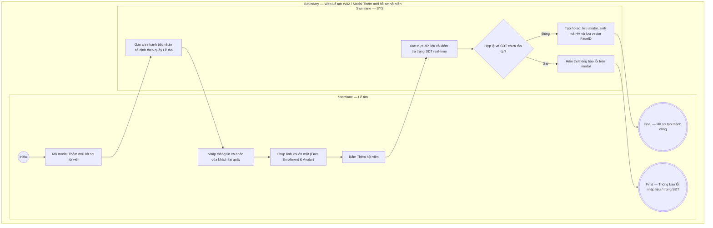

# LT-W02-US01 - Thêm hội viên tại quầy

## Preconditions
- Lễ tân đã đăng nhập vào Web Portal và được phân quyền tạo hồ sơ hội viên tại chi nhánh đang trực quầy.
- Khách hàng có mặt trực tiếp tại quầy tiếp đón.

## Trigger
- Lễ tân bấm nút **+ Thêm hội viên** tại menu W02 hoặc nút Quick Action tại Dashboard W01.
- Màn hình liên quan: Web Lễ tân — W02 Hội viên & khách hàng, modal **Thêm mới hồ sơ hội viên**.

## Main Flow

1. Lễ tân mở modal **Thêm mới hồ sơ hội viên**.
2. Hệ thống tự động điền cố định trường **Chi nhánh tiếp nhận** theo chi nhánh quầy đang làm việc.
3. Lễ tân nhập Họ tên, Số điện thoại, Email (nếu có), Ngày sinh (nếu có).
4. Lễ tân hướng dẫn khách nhìn vào camera quầy và thực hiện bước **Đăng ký nhận diện khuôn mặt (Face Enrollment) & Avatar**: Chụp ảnh chân dung của khách; ảnh đạt chuẩn lập tức hiển thị preview và được lưu vào hồ sơ làm avatar kiêm dữ liệu nhận diện cho cửa Kiosk check-in.
5. Lễ tân bấm **Thêm hội viên**.
6. SYS kiểm tra tính hợp lệ của dữ liệu và đối soát trùng lặp SĐT trên toàn hệ thống.
7. Nếu hợp lệ, SYS lưu hồ sơ mới (`ACTIVE`), tạo mã hội viên, nạp dữ liệu FaceID và lưu vết audit log.
8. SYS đóng modal, hiển thị thông báo thành công và đưa vào danh sách hội viên chi nhánh.

### Field-level specification — modal Thêm mới hồ sơ hội viên tại quầy
| Field / control | Loại UI Control | State | Required | Conditional / dynamic | Source / validation |
| :--- | :--- | :--- | :--- | :--- | :--- |
| Họ và tên | `Textbox` | `USER-INPUT` | required | `Không` | Lễ tân nhập theo CCCD/thông tin khách cung cấp |
| Số điện thoại | `Textbox (Phone Input)` | `USER-INPUT` | required | `Không` | SĐT định danh duy nhất của hội viên; kiểm tra trùng lặp thời gian thực |
| Email | `Textbox (Email Input)` | `USER-INPUT` | optional | `Không` | Lễ tân nhập nếu khách có email |
| Chi nhánh tiếp nhận | `Readonly Text` | `PREFILL` + `READONLY` | required | `Không` | Tự động điền theo chi nhánh quầy hiện tại |
| Ngày sinh | `Date Picker / Textbox` | `USER-INPUT` | optional | `Không` | Ngày sinh của khách (`DD/MM/YYYY`) để phục vụ chúc mừng sinh nhật tại module CSKH |
| Avatar & Đăng ký khuôn mặt | `Camera Capture / File Upload` | `USER-INPUT` | optional | `Không` | Chụp ảnh khuôn mặt khách tại quầy để làm avatar và nạp vector nhận diện Kiosk check-in |

## Alternate Flows

### AF-01 - Số điện thoại đã tồn tại
1. SYS cảnh báo số điện thoại đã tồn tại trong hệ thống.
2. Lễ tân tra cứu lại hồ sơ cũ của khách để gia hạn hoặc tạo đăng ký mới mà không cần tạo hồ sơ trùng lặp.

### AF-02 - Khách chưa muốn chụp ảnh khuôn mặt
1. Khách hàng từ chối chụp ảnh nhận diện.
2. Lễ tân bỏ qua bước chụp ảnh; SYS vẫn tạo hồ sơ hợp lệ. Khách hàng có thể check-in bằng mã QR trên app hoặc thẻ thủ công.

## Exception Flows
- **Thiếu thông tin bắt buộc:** Báo lỗi trường Họ tên hoặc Số điện thoại.
- **SĐT trùng lặp:** Chặn lưu và báo lỗi rõ ràng.

## Activity Diagram — Swimlane
**Trigger:** Lễ tân bấm Thêm hội viên tại menu W02 hoặc Quick Action.

