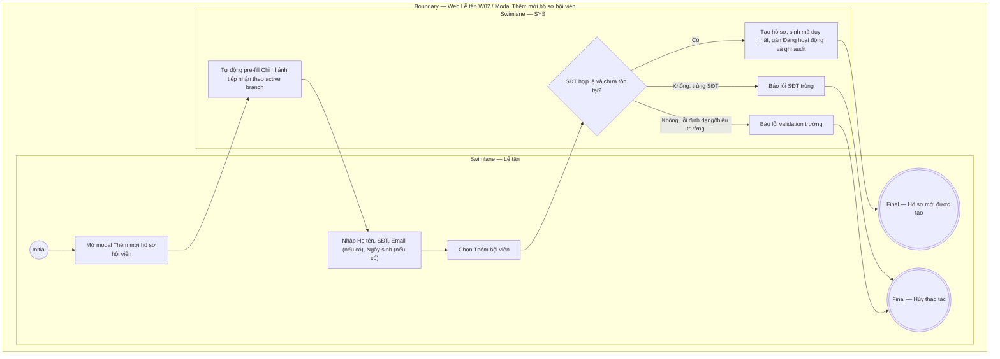

# LT-W02-US01 - Thêm hội viên

## Preconditions
- Lễ tân đã đăng nhập, có quyền tạo hồ sơ hội viên tại chi nhánh đang thao tác.
- Lễ tân thao tác trong phạm vi chi nhánh được phục vụ (branch scope).

## Trigger
- Lễ tân chọn **Thêm hội viên** trong menu W02.
- Màn hình liên quan: Web Lễ tân — W02 Hội viên & khách hàng, modal **Thêm mới hồ sơ hội viên**.

## Main Flow

1. Lễ tân mở modal **Thêm mới hồ sơ hội viên**.
2. Hệ thống tự động pre-fill cố định trường **Chi nhánh tiếp nhận** theo chi nhánh của tài khoản Lễ tân đang thao tác.
3. Lễ tân nhập Họ tên, SĐT, Email (nếu có), Ngày sinh (nếu có).
4. Lễ tân chọn **Thêm hội viên**.
5. SYS kiểm tra trường bắt buộc, định dạng email (nếu có nhập) và kiểm tra SĐT hợp lệ, chưa tồn tại trong `MEMBER_PROFILE`.
6. Nếu SĐT hợp lệ và chưa tồn tại, SYS tạo hồ sơ, sinh mã duy nhất, gán trạng thái ban đầu `Đang hoạt động` và ghi audit.
7. SYS hiển thị hồ sơ vừa tạo.

### Field-level specification — modal Thêm mới hồ sơ hội viên
| Field / control | State | Required | Conditional / dynamic | Source / validation |
| --- | --- | --- | --- | --- |
| Họ và tên | `USER-INPUT` | required | Không | Lễ tân nhập (ví dụ: "Nguyễn Hoài Nam"); hỗ trợ dấu tiếng Việt, bỏ khoảng trắng thừa trước khi lưu |
| Số điện thoại | `USER-INPUT` | required | `DYNAMIC`: chuẩn hóa và kiểm tra trùng lặp realtime | Lễ tân nhập (ví dụ: "0908 111 222"); khóa nghiệp vụ duy nhất của hội viên, giữ nguyên số 0 đầu, `UNIQUE` toàn hệ thống |
| Email | `USER-INPUT` | optional | Không | Lễ tân nhập nếu có (ví dụ: "name@example.vn"); chỉ kiểm tra định dạng khi có nhập |
| Chi nhánh tiếp nhận | `PREFILL` + `READONLY` | required | Không | Trường cố định: tự động điền theo chi nhánh làm việc hiện tại của tài khoản Lễ tân |
| Ngày sinh | `USER-INPUT` | optional | Không | Lễ tân nhập từ khách cung cấp (định dạng `DD/MM/YYYY`); dùng cho nhắc sinh nhật nếu hội viên đồng ý |

- **Business rules / logic:**
  - Hồ sơ mới bắt buộc có họ tên, số điện thoại và chi nhánh tiếp nhận.
  - Chi nhánh tiếp nhận được khóa cố định theo chi nhánh của tài khoản Lễ tân đang thao tác.
  - Mỗi `MEMBER_PROFILE` có đúng một số điện thoại; số điện thoại sau chuẩn hóa phải `UNIQUE` trên toàn hệ thống.
  - Mã hội viên, thời điểm tạo, người tạo và trạng thái ban đầu do SYS ghi nhận.

## Alternate Flows

### AF-01 - Số điện thoại đã tồn tại
1. SYS phát hiện số điện thoại nhập vào trùng với hồ sơ hiện có.
2. SYS báo lỗi SĐT trùng.
3. Lễ tân sửa lại số điện thoại hoặc đóng modal hủy thao tác.

### AF-02 - Bỏ trống thông tin tùy chọn
1. Lễ tân không nhập email hoặc ngày sinh.
2. SYS vẫn cho phép tạo hồ sơ khi các trường bắt buộc hợp lệ.

## Exception Flows
- Thiếu họ tên hoặc số điện thoại: SYS báo lỗi validation trường bắt buộc.
- Email sai định dạng hoặc Ngày sinh không đúng định dạng: SYS báo lỗi validation.
- Số điện thoại đã tồn tại: SYS báo lỗi SĐT trùng.
- Lễ tân chọn **Hủy** hoặc nút **X**: đóng modal không lưu dữ liệu.

## Activity Diagram — Swimlane
**Trigger:** Lễ tân chọn Thêm hội viên trong menu W02.

