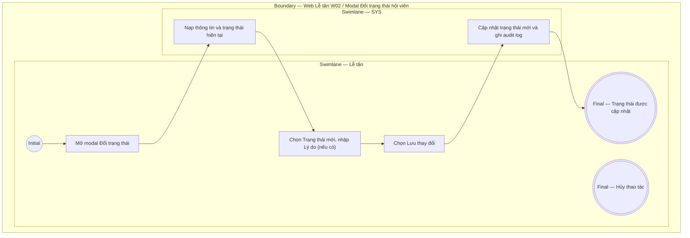

# LT-W02-US03 - Đổi trạng thái hội viên

## Preconditions
- Lễ tân đã đăng nhập, hồ sơ hội viên đã tồn tại thuộc chi nhánh mà Lễ tân đang phục vụ (branch scope).
- Đổi trạng thái không xóa hồ sơ, gói tập, lịch sử thanh toán hoặc dữ liệu ra/vào.

## Trigger
- Lễ tân mở hồ sơ hội viên và chọn **Đổi trạng thái hồ sơ**.
- Màn hình liên quan: Web Lễ tân — W02 Hội viên & khách hàng, modal Đổi trạng thái hồ sơ hội viên.

## Main Flow

1. Lễ tân mở modal **Đổi trạng thái hội viên**.
2. SYS hiển thị trạng thái hiện tại của hội viên.
3. Lễ tân chọn Trạng thái mới và nhập Lý do (nếu muốn).
4. Lễ tân chọn **Lưu thay đổi**.
5. SYS cập nhật trạng thái mới, ghi audit log (bao gồm lý do nếu có) và hiển thị kết quả.

### Field-level specification — form Đổi trạng thái hội viên
| Field / control | State | Required | Conditional / dynamic | Source / validation |
| --- | --- | --- | --- | --- |
| Mã/tên hội viên | `READONLY` | required | Không | SYS lấy từ hồ sơ được chọn |
| Trạng thái hiện tại | `READONLY` | required | `DYNAMIC`: lấy từ record hiện tại | SYS lấy từ `MEMBER_PROFILE` |
| Trạng thái mới | `USER-INPUT` | required | Không | Lễ tân chọn trạng thái mới (ví dụ: `Ngừng hoạt động`, `Đã lưu trữ`, `Đang hoạt động`) |
| Lý do đổi trạng thái | `USER-INPUT` | optional | Không | Lễ tân nhập tự do (nếu muốn) để ghi nhận vào audit log |

- **Business rules / logic:**
  - Trạng thái hồ sơ độc lập với trạng thái của từng gói.
  - Đổi trạng thái không xóa hồ sơ, gói, thanh toán hoặc lịch sử ra/vào.
  - Lý do đổi trạng thái là không bắt buộc, chỉ dùng để ghi vết audit nếu Lễ tân nhập.

## Alternate Flows

### AF-01 - Hủy Thao Tác
1. Lễ tân chọn **Hủy** hoặc đóng modal.
2. SYS giữ nguyên trạng thái hiện tại của hội viên.

## Exception Flows
- Hồ sơ không tồn tại hoặc ngoài branch scope: không cho thao tác.
- Lỗi kết nối/lưu dữ liệu: giữ trạng thái cũ và báo thất bại.

## Activity Diagram — Swimlane
**Trigger:** Lễ tân mở hồ sơ và chọn Đổi trạng thái.

