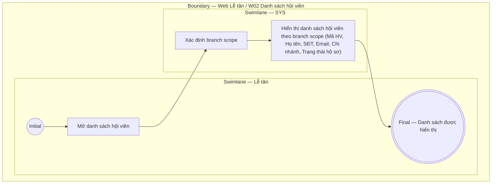

# LT-W02-US04 - Xem danh sách hội viên

## Preconditions
- Lễ tân đã đăng nhập, branch scope của Lễ tân đã được xác định.

## Trigger
- Lễ tân mở menu W02 hoặc chọn **Danh sách hội viên**.
- Màn hình liên quan: Web Lễ tân — W02 Hội viên & khách hàng.

## Main Flow

1. Lễ tân mở danh sách hội viên.
2. SYS xác định branch scope của Lễ tân.
3. SYS hiển thị danh sách hội viên theo branch scope (Mã HV, Họ tên, SĐT, Email, Chi nhánh, Trạng thái hồ sơ).

- **Business rules / logic:**
  - Chỉ trả dữ liệu thuộc role và branch scope của Lễ tân.
  - Danh sách là read-only; thao tác thay đổi dùng các User Story thêm/sửa/đổi trạng thái tương ứng.

## Exception Flows
- Lỗi tải dữ liệu: hiển thị thông báo lỗi.

## Activity Diagram — Swimlane
**Trigger:** Lễ tân mở Danh sách hội viên trong menu W02.

